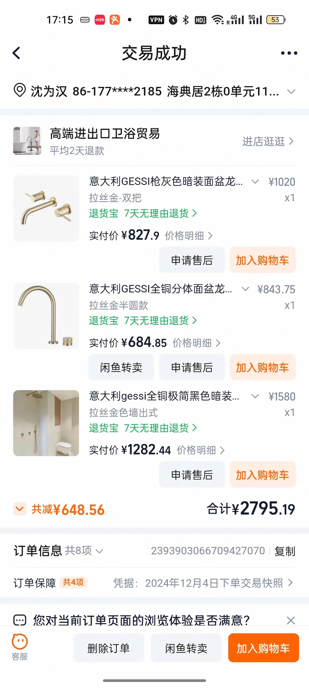
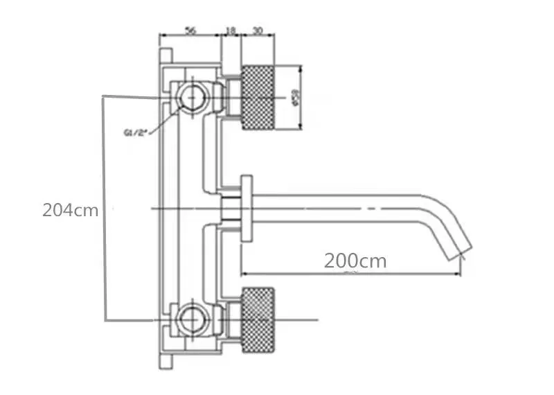
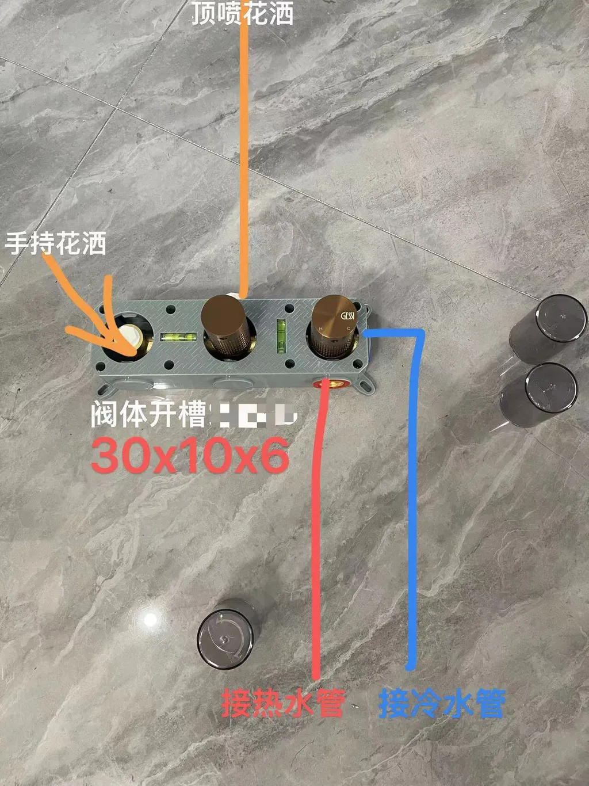

# 已购卫浴龙头｜采购事实与深化边界

## 1. 资料来源

业主于 `2026-08-20` 提供 Notion 页面“已购卫浴龙头”，明确以下三款产品均已购买，不是候选或待选产品。页面内嵌订单截图显示“交易成功”，订单日期为 `2024-12-04`，三款各 `1` 件，合计实付 `¥2795.19`。

[业主 Notion 原页｜已购卫浴龙头](https://app.notion.com/p/weihanshen/3c2fda08ab6c8083b498fa7e04de4b3c?source=copy_link)

本记录以页面中的订单截图为采购状态和所选款式的首要依据：店铺在订单中把三款商品都标为 `GESSI／gessi`，实际选择均为拉丝金方向。商品标题中的“枪灰”“黑色”是标题检索词，不再用来否定订单截图里的所选款式。页面还提供了 `MF287` 尺寸图和 `CZ028` 安装关系图；两图已归档，但图面单位、准确厂家料号和完整接口仍不齐，因此只能关闭图上明确可读的关系，不能直接据图冻结墙内预埋。

## 2. 已确认购买的产品

| 序号 | 业主页面中的商品 | 已确认状态 | 当前证据边界 |
| --- | --- | --- | --- |
| 1 | 淘宝分享文案标识 `MF287`：“意大利全铜枪灰色暗装面盆龙头入墙式嵌入式冷热预埋玫瑰金水龙头” | **已购买，数量 1。**订单截图显示商品名含 `GESSI`，所选款式为“拉丝金／双把”，墙出水／暗装面盆龙头方向明确。页面另附一张尺寸图。 | `MF287` 只按分享文案标识记录，不能当作厂家料号。尺寸图可见 `G1/2` 和控制件／出水嘴关系，但 `204cm`、`200cm` 的图面单位明显需要卖家书面确认；图中也没有完整阀体包络和允许埋深。 |
| 2 | 淘宝分享文案标识 `CZ356`：“意大利玫瑰金分体面盆龙头铜双孔台盆洗手盆 7 字坐式洗脸盆水龙头” | **已购买，数量 1。**订单截图显示商品名含 `GESSI`，所选款式为“拉丝金半圆款”，台面安装／双孔分体面盆龙头方向明确。 | `CZ356` 只按分享文案标识记录，不能当作厂家料号。两孔孔径／中心距、台面厚度范围、软管和阀门接口仍缺安装图。 |
| 3 | 淘宝分享文案标识 `CZ028`：“意大利玫瑰金全铜极简黑色暗装入墙式淋浴花洒吊顶埋墙拉丝金花洒” | **已购买，数量 1。**订单截图显示商品名含 `gessi`，所选款式为“拉丝金色墙出式”，暗装淋浴花洒方向明确。页面另附一张安装关系图。 | `CZ028` 只按分享文案标识记录，不能当作厂家料号。图中可见冷热进水、阀体、顶喷和手持花洒的系统关系，以及“阀体开槽 `30×10×6`”字样；图中没有单位、完成面基准、接口规格或公差。 |

商品链接：

1. [MF287 淘宝分享链接](https://e.tb.cn/h.8RHd68yjXi6ibyV?tk=WhC4TcEtFfi)
2. [CZ356 淘宝分享链接](https://e.tb.cn/h.8jDmDGqX0UEJ2MV?tk=D3jjTcEu8Ca)
3. [CZ028 淘宝分享链接](https://e.tb.cn/h.8RHeaLndEgxzYlN?tk=kp5pTcEvctr)

## 3. Notion 页面内的三张证据图

### 3.1 订单截图

这张图证明三款商品均显示“交易成功”、订单日期为 `2024-12-04`、各 `1` 件、合计实付 `¥2795.19`，并证明订单中显示的所选款式。它不证明准确厂家料号、原厂身份、安装接口或项目房间分配。

### 3.2 MF287 尺寸图

图上可见 `G1/2` 接口标识以及控制件与出水嘴的相对关系；叠加文字显示 `204cm` 和 `200cm`。这两个数值按厘米理解与龙头尺度不符，但项目不能擅自把 `cm` 改成 `mm`。卖家必须在原图上书面确认单位，并补阀体包络、允许埋深、完成面基准和公差后，项目才能据此画墙内节点。

### 3.3 CZ028 安装关系图

图上可见冷热进水进入暗装阀体后分别连接顶喷和手持花洒，并标有“阀体开槽 `30×10×6`”。由于图中没有单位、完成面基准、接口规格和公差，该图只证明系统组成关系，不能直接作为开槽、预埋或放样尺寸。

当前公开 Notion 页面没有单独的 `CZ356` 安装图；该款的两孔孔径、中心距、允许台面厚度、台下紧固和软管空间仍需补图。

## 4. 项目设计映射

以下是基于现有台盆构造形成的项目深化建议，不冒充业主已经确认的房间分配，也不替代实物安装图：

- `MF287` 暗装面盆龙头优先与客卫干区 Falper Sorgente 落地盆协调。该盆没有稳定的台面安装区，墙出水在构造上更合理；项目须先取得暗装阀体图，再在 I-502／P-202 中决定完成面出水中心和阀体检修方式。
- `CZ356` 双孔台面面盆龙头优先与主卫 antoniolupi Street 定制台盆协调。只有定制台盆加工图证明存在足够安装台面，并与购买产品的两孔孔径、中心距和夹持厚度完全一致时，才允许开孔。Street 官方资料中的单个 `Ø38 mm` 龙头孔候选不能套用到这款双孔龙头。
- `CZ028` 暗装淋浴花洒当前只确认购买 `1` 套；项目有两个淋浴区，因此本套最终房间归属以及另一淋浴区的产品仍未关闭。不得自行复制成两套，也不得凭名称推定两个淋浴区采用同一产品。

上述推荐映射可以进入 I-502／P-202 候选深化，但在订单 SKU、实物或带尺寸安装图到位前，不得冻结墙内预埋、开孔或接口中心坐标，不得修改正式 IFC。

## 5. 墙内施工前仍须取得的资料

### 两款面盆龙头

- 可导出的订单商品明细、随货标签或说明书：准确厂家料号／SKU 和发货配置；现有截图已经关闭数量和所选外观，不重复索取；
- `MF287` 现有尺寸图的单位书面确认，以及暗装阀体完整包络；`CZ356` 的完整带尺寸安装图；
- 冷热进水接口规格、冷热方向、建议水压和阀门要求；
- 出水嘴中心、操作件中心及相互尺寸关系；
- `MF287` 的允许墙体完成厚度、阀体埋深范围、找正基准、防水收口和后续检修方式；
- `CZ356` 的两孔孔径、孔中心距、允许台面厚度、台下紧固及软管抽换空间。

### 暗装淋浴花洒

- 页面内嵌的卖家示意图可见冷热进水分别接入阀体，并分出顶喷花洒和手持花洒；图中标注“阀体开槽 `30×10×6`”，但没有单位、完成面基准、接口规格或公差，因此只作为系统关系参考，不能直接作为开槽尺寸；
- 可导出的订单商品明细、随货标签或说明书：准确厂家料号／SKU 和完整出水组件；现有截图已经关闭数量和所选外观，不重复索取；
- 暗装阀体尺寸、允许埋深、完成面基准、冷热接口及各出水口规格；
- 顶喷、手持花洒、下出水及切换阀的实际配置；
- 顶喷吊顶固定、墙内管线、阀体防水收口及检修方式；
- 工作压力、设计流量和热水器／给水系统的兼容条件。

供货方若只能提供商品展示图，不能替代带尺寸安装图。施工方收到项目 P-202／I-502 后，只复核“能否按图安装”并圈出冲突，不得自行改变龙头中心、阀体位置、台盆开孔或淋浴出水关系。

## 6. 当前结论

| 事项 | 状态 |
| --- | --- |
| 三款产品已购买，各 1 件 | `confirmed owner purchase`；订单截图显示“交易成功” |
| 产品功能类型：暗装面盆龙头／双孔台面面盆龙头／暗装淋浴花洒 | `confirmed from owner page` |
| 所选外观 | `confirmed from order screenshot`：拉丝金／双把、拉丝金半圆款、拉丝金色墙出式 |
| 订单商品标题中的品牌 | `confirmed visible listing label`：`GESSI／gessi`；尚未取得原厂料号或原厂证明 |
| 分享文案中的 `MF287`／`CZ356`／`CZ028` | `reference label only`，不是已验证厂家型号 |
| `MF287` 安装资料 | `partial seller evidence`；已有尺寸图，可见 `G1/2` 和部件关系，但 `204cm／200cm` 单位、阀体包络、允许埋深、完成面基准和公差待确认 |
| `CZ028` 安装资料 | `partial seller evidence`；已有系统关系图，但 `30×10×6` 无单位和基准，接口、埋深及公差待确认 |
| `CZ356` 安装资料 | `unknown`；当前公开 Notion 页面没有单独安装图 |
| 准确厂家料号、原产地证明和完整安装接口 | `unknown pending order／delivery evidence` |
| 两款面盆龙头的项目房间映射 | `project recommendation`，待结合订单安装图完成设计 |
| 暗装淋浴花洒的房间映射及第二淋浴区产品 | `unknown` |
| 墙内阀体、接口、孔径、中心坐标和最终路线 | `unknown`；没有安装图不得推测 |
