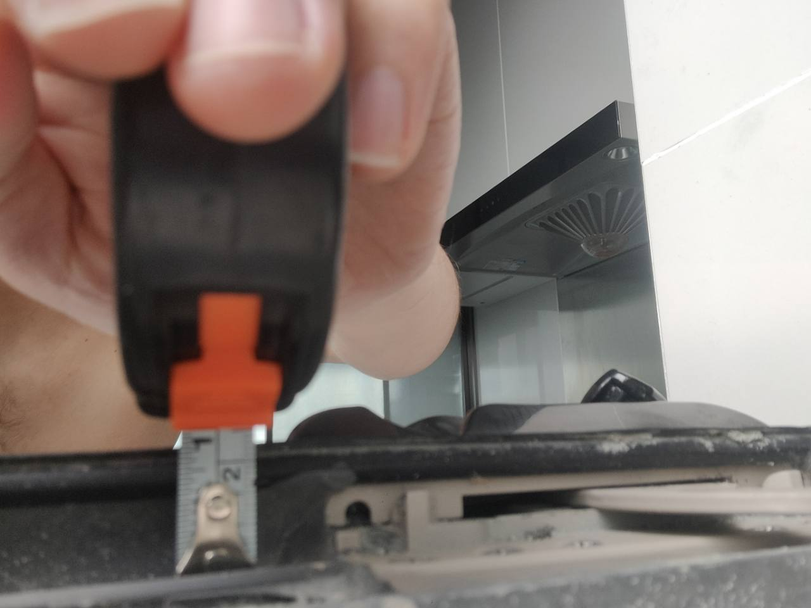
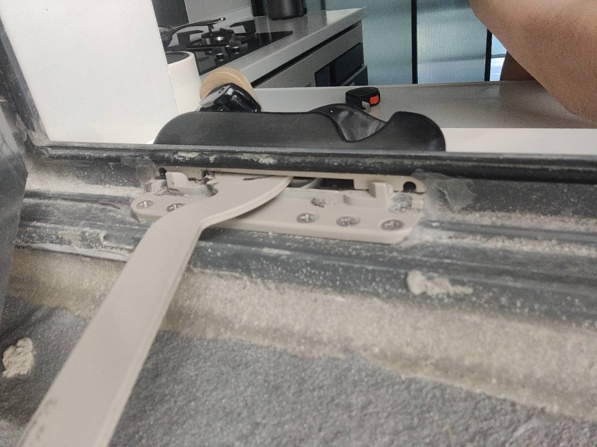

# 手摇开窗器旧窗改造与本项目现场实证

## 当前结论

本项目厨房已安装手摇开窗器。底座水平安装在窗框下轨上，多颗螺钉竖向向下打入轨道型材固定；不是把螺钉打在约 20 mm 高的薄铝边框上，厨房台面也不参与承重。业主已测量其余窗户采用相同下轨结构，因此其他窗户后装手摇器的结构路径已经由本项目现场实例证明。

其他窗户下方没有紧贴台面，不影响轨道固定；剩余差异主要是摇柄和底座悬空后的外观收口、操作高度以及不同窗扇负载。

## 本项目现场证据

- 提供方：业主
- 拍摄及登记日期：2026-08-20
- 位置：厨房现有外开窗
- 现状：厨房已安装手摇开窗器，其余窗户尚未安装
- 业主复测：所有窗户采用相同下轨结构
- 闭合处测量：约 20 mm 铝边框＋约 2 mm 橡胶密封圈，总高约 22 mm
- 测量边界：约 22 mm 是窗扇闭合处的构造高差，不是手摇器的螺钉锚固深度或主要受力固定面

### 照片 1：下轨与闭合处约 22 mm 高差

### 照片 2：厨房手摇器底座竖向螺钉固定于下轨

照片可见手摇器底座位于水平下轨，多颗螺钉由上向下固定。下方厨房台面只改善视觉衔接，不是安装底座或受力支承。

## 外部改造案例

- 提供方：业主转录
- 平台：小红书
- 标题：旧窗改造之摇窗神器
- 作者：武汉门窗老石

[小红书原始视频](https://www.xiaohongshu.com/discovery/item/66a1e5b8000000000600d9ae?source=webshare&xhsshare=pc_web&xsec_token=ABcj_E2Ww8MruTC30pFuAHMVpceTSIe9ZyU0InUlNPk9c=&xsec_source=pc_share)

### 可见证据

视频给出了旧窗安装手摇开窗器的过程。该案例证明：窗户已经由开发商安装完成，并不必然排除手摇款；既有窗可通过在窗框、窗扇上配置手摇器主体、传动件及连接支架进行后装改造。

该外部案例现在作为补充佐证；本项目厨房现有装置和现场照片是优先级更高的项目直接证据。

## 业主方案倾向

业主当前倾向采用手摇机械款，理由如下：

- 价格较低；
- 机械结构可靠性较好；
- 相比外露电机、走线和控制模块，手摇款对室内外观的影响较小；
- 自动关窗不是刚性需求，家中有管家可在大风暴雨前人工关窗。

因此，本项目以手摇机械款作为基准深化方向，不为窗户新增电源、控制线、风雨传感器或智能联动点位。该决策依赖有人在场执行关窗；若以后出现长期无人值守需求，应重新评估自动关窗方案，而不是默认沿用本次取舍。

## 已确认与待确认边界

已经确认：

- 厨房现有窗可通过竖向螺钉把手摇器底座牢固固定在窗框下轨；
- 约 20 mm 铝边框和约 2 mm 密封圈不是底座主要受力固定面；
- 厨房台面不参与固定，其余窗户无台面不构成结构安装障碍；
- 业主实测其余窗户具有相同下轨结构，因此可以沿用同类后装路径；
- 本项目窗户当前无纱窗，可减少与纱窗框、轨道或突出把手的空间冲突。

批量实施前仍需确认：

- 原有把手、多点锁和密封压紧功能可由手摇器替代或兼容；
- 各窗扇尺寸、重量、开启行程以及珠海沿海风压满足候选手摇器能力；
- 具体螺钉位置和长度不会侵入轨道排水腔、破坏防水或影响原门窗保修；
- 无下方台面的点位如何处理底座、摇柄悬空后的外观和操作高度；
- 未来增加纱窗后仍保留足够的传动、摇柄和检修空间。

## 下游核对与关闭条件

1. 补录厨房现有手摇器的品牌、型号、底座尺寸、孔距、螺钉规格和传动臂长度，将其作为复制基准。
2. 对拟改造窗逐樘拍摄室内侧整窗、下轨、窗框与窗扇闭合边、把手、锁点和铰链，并记录窗扇尺寸及操作高度。
3. 明确原锁闭五金的处理方式，验证关闭后的密封压紧与防误开能力。
4. 由门窗或开窗器供应方在下轨上标出底座、传动件、竖向螺钉孔、最大开启行程和摇柄操作区；由工头、物业及原门窗相关方确认对排水路径、防水和保修的影响。
5. 先选择一樘下方无台面的非厨房窗制作安装样板，核对悬空位置的外观、操作和碰撞范围。
6. 按窗扇尺寸、重量及现场风环境完成手摇器选型；样板通过开关、锁闭、淋水/排水及大风条件下的安全检查后，方可批量实施。
