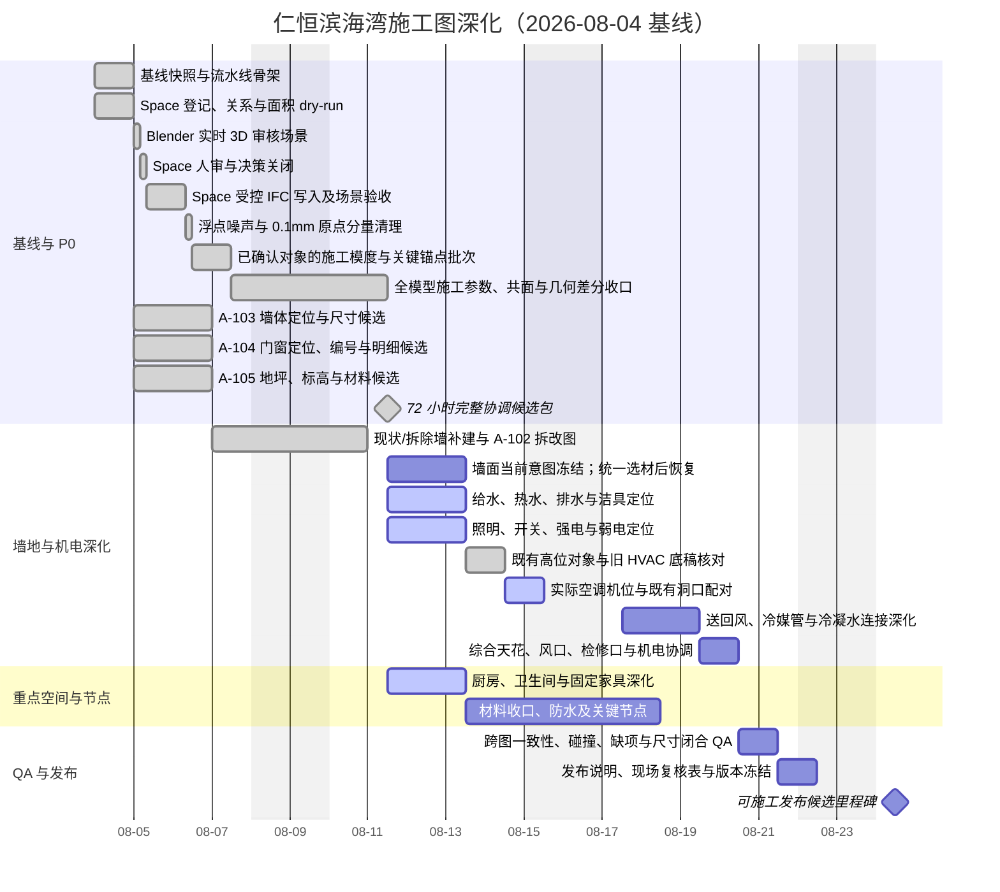

# 仁恒滨海湾装修施工图深化工作管理

> 项目：2504 GBTB Yanlord Zhuhai
> 文档创建时间：2026-08-04
> 数据快照时间：2026-08-08（仅表示下方 IFC 数量、哈希和 QA 结果的采集时间，不是每日计划起点）
> 最近更新时间：2026-08-09 01:45 +08:00
> 目标：以 IFC 为单一几何与已确认语义源，按“自动生成候选—人眼审核—现场/业主确认—机械 QA—受控发布”推进完整装修施工图。
> 本文档只管理工作，不直接授权任何 IFC 写入。

## 1. 当前结论与状态

### 1.1 状态图例

| 状态 | 含义 | 进入下一状态的条件 |
| --- | --- | --- |
| ✅ 已完成 | 已有可追溯产物并通过当前阶段检查 | 仅在源模型或决策变更时重开 |
| 🟡 进行中 | 已有输入和执行人，正在生成或审核 | 产物、证据和停止条件均关闭 |
| ⚪ 未开始 | 尚未进入执行 | 上游依赖完成且输入冻结 |
| 🟠 待业主/现场确认 | 无法由 IFC、IDS 或设计规则可靠决定 | 决策记录含责任人、日期和证据 |
| 🔴 阻塞 | 继续工作会造成猜测、返工或不可验证写入 | 阻塞原因消除并重新跑基线检查 |

### 1.2 当前可验证基线

| 项目 | 当前值 | 状态/风险 |
| --- | --- | --- |
| IFC | `2504 GBTB Yanlord Zhuhai.ifc`，IFC4，SHA-256 `7521c09991f3d0c7b7d91ca2324fd55ad961d8e32e9e3e9a9777a4cc19b06e81` | ✅ S003 完成；当前 `889793` 实体、`2640` Root、22 Space、101 面墙、177 个 Opening；RCP1 两个 handoff 已完成纯原点写入且全模型世界几何保持 |
| 核心对象 | 22 Space、101 Wall（84 `EXISTING`＋4 `NEW`＋13 `DEMOLISH`）、8 Door、11 Window、19 Slab、20 GridAxis、81 Annotation | 🟡 20/20 GridAxis、22/22 Space、88/88 最终建成 Wall 及全部 16 个有宿主洞口的门窗锚点已归整；13 面拆除墙仅服务 A-102；3 樘无洞口门转 A-104 建模例外 |
| IFC 图纸定义 | Wall Plan、FFL PLAN、Wall Finish Plan、Sanitary Plan、Furniture Plan | ✅ 有基础图；尚非完整施工图发布集 |
| A-103 | `Wall Plan-A103-candidate.svg` 与单页 `output/pdf/A-103-wall-plan-candidate.pdf`；28 条候选尺寸线，20 轴双向尺寸链闭合 | ✅ 88 面最终建成墙已收口为 84 面 `EXISTING` 与 4 面 `NEW`；64 面现状非承重墙、20 面现状承重墙均有标准 IFC 属性；厨房门垛厚度已归整为 `154 mm`，已调整客卫门洞保持不动 |
| A-104 | `Wall Plan-A104-candidate.svg` 与单页 `output/pdf/A-104-door-window-plan-candidate.pdf`；19 个候选编号 | ✅ 19 个 Tag、4 个门名和 3 个门窗组已写入正式 IFC；关系、Placement 与世界几何通过 `0.1 mm` 写后门 |
| A-105 | `FFL PLAN-A105-candidate.svg`、单页 PDF、21 个地坪登记与 8 樘门槛交接登记 | ✅ 21 个 Tag、18 个坡向属性、3 个地坪材料/完成面意图和 2 个降板属性已写入正式 IFC；关系、Placement 与世界几何通过 `0.1 mm` 写后门 |
| P0 IDS | `pipeline/ids/p0-construction-information.ids`；可重复报告 `build/ids/p0-report.json/.md` | 🔴 392/593 项检查通过、2/5 规格通过；Space 与地坪规格已通过，剩余为 88 面最终建成墙 Tag/Length、3 樘门尺寸、全部门窗 `PredefinedType` |
| P0 决策 | `SPACE-REF-001` 已实施：玄关 `R01`、按平面顺时针至 `R22`；门、地坪、Slab 与洁具锚点已从 C003 精确移交对应任务 | 🟡 未关闭项继续按对应任务停止条件处理 |
| 机械 QA | 6 PASS / 1 WARN / 5 BLOCK，当前不可发布 | 🔴 允许生成候选，不允许标记为发布版 |
| 正式尺寸 | IFC 中没有正式 A-103-DIM 尺寸注释 | ⚪ 自动化先生成候选，人审后才决定是否写入 IFC |
| PM 进度（派生） | 22 项中 10 项完成（45%）；S003、A-102、A-104、A-105 与 C003 已完成；原 81 个安装锚点移交中 RCP1 的 2 个已完成，余 79 个继续由对应任务负责 | 第 5 节任务台账是权威状态源 |

已确认且不得误改：

- `1To6gRjrf2nBU5GQuuD8FV` 是客卫门，不是主卧门。
- `3xKBbA2CT9mfby2$MODnzM` 已确认为次卧门 M04；`1TW6$_GfnABRZusYvx0zZG` 已确认为主卧门 M07。正式 IFC 编号、关系或 placement 仍须先通过候选 QA。
- 已删除的 3 个旧楼梯 Space 决策已实施，不应重新引入。

### 1.3 立即下一步

S003 已完成：22 个 Space 已正式写入唯一 `Pset_SpaceCommon.Reference=R01-R22`，玄关为 `R01`、书房为 `R22`，世界几何变化 `0.0 mm`，Bonsai 已 reload/rebuild。WFIN 当前意图已冻结：画面内两件对象确认为整件大白墙，最终材料、分界和构造按用户要求留到统一选材时恢复。P-202、E-301、E-303、I-501～I-504 已形成可读 SVG/PDF 候选。RCP1/M-401 已完成 117 个高位对象、28 个空调通风相关实例和 6,786 个对象对的只读机械核对；原剩余 10 对管段/AC 相交在哈希固定的旧 `2504_lowpoly.blend` 中均以相同状态存在，已从当前硬碰撞人审队列关闭。紫色管线仅为拆改后旧方案底稿，装修后的冷媒液管、冷媒气管和冷凝水管仍须重新设计。旧文件同时保存厨房机位与 `1QBd...` 东侧额外机位；全部空调机位均已确认固定，东侧机位尚无正式 IFC GlobalId，只作为固定位置与几何证据。7 个 AC Hole 已确认为开发商原有洞口且位置已核对，装修不新增洞口。WD02/WD03 已确认是梁墙共面收口的木工板打底，不是最终天花饰面；`3Bv...` 已确认为有缺陷旧方案中的空调出风口。16 个天花/灯槽 Proxy 的边界和高低关系已整体确认正确，`16Ey9Flj9BK9VRun$ozzjH` 已确认为转角空调风口。书架跌级天花与转角风口两个 handoff 已完成纯原点写入，正式 IFC SHA-256 为 `7521c09991f3d0c7b7d91ca2324fd55ad961d8e32e9e3e9a9777a4cc19b06e81`；2/2 placement 精确，全模型世界几何超差 0，Bonsai 已 reload/rebuild。系统连接、回路、厂家尺寸和现场条件继续阻断发布。

S001 已交付：26 个 Space 登记表、关系变更预览、面积证据、人审队列和校验清单，均位于 `build/space-dry-run/`。26/26 面积可复算，合计 `113.800063 m²`；但 GrossFloorArea、NetFloorArea 和 Reference 均为 0/26，需要先确定计量口径。

## 2. 数据边界与执行规则

1. **IFC**：只保存几何和已确认语义；每轮只能有一个 IFC 写入者。
2. **IDS**：`pipeline/ids/p0-construction-information.ids` 只描述可机器验证的信息要求，不承载设计选择。
3. **决策表**：无法由 IDS 表达的选择写入清晰的 Markdown/CSV，记录依据、置信度、审核状态和责任人。
4. **派生产物**：候选 SVG/PDF、快照、报告和中间表进入 `build/`；不得覆盖 IFC 源文件。
5. **图纸登记**：图号、名称、状态、来源、版本和发布日期统一由 `pipeline/decisions/drawing-register.csv` 管理。
6. **发布物**：只有通过发布门的不可变版本进入 `releases/`；未关闭项必须写入发布说明，不得隐藏。
7. **IFC 写入回合**：写前冻结哈希和对象清单；写后必须保存、读取磁盘验证、reload/rebuild Blender、恢复验收视图、截图并重跑机械 QA。
8. **禁止猜测**：Space、门窗、地坪、设备、材料和施工语义没有可靠依据时，状态转为“待人审”或“待业主/现场确认”。

## 3. 总体甘特图

基准节奏：48–72 小时形成覆盖全部图纸类别的协调候选包；第 4–10 个高强度工作日完成深化、QA 和带现场复核项的可施工发布候选。若现场关键输入未返回，第 10 日只发布“待复核候选版”，不得冒充最终版。

### 3.1 甘特图使用规则

- 甘特图展示计划日期、依赖和里程碑，是第 5 节 PM 任务台账的排期视图。
- TODO checkbox 和任务元数据是状态的唯一权威来源；两处不一致时以第 5 节为准，并修正甘特图。
- 计划调整只修改计划日期；实际开始和实际完成时间保留在任务台账中，不得被新计划覆盖。

## 4. 自动化、人眼审核与现场决策边界

| 类别 | 应做内容 | 不得越界 |
| --- | --- | --- |
| 自动化 | IFC 快照与对象登记；IDS 校验；房间标注候选；墙体、门洞、洁具、家具和设备定位尺寸候选；门窗/材料/设备明细；图框、图号、版本、图纸索引；批量 SVG/PDF 导出；尺寸闭合、缺项、重复编号、空白区域、文字碰撞和跨图一致性检查；推断依据/置信度/人审标记 | 不得把未审推断写回 IFC；不得自动确认房间、门窗用途、材料和现场条件 |
| Blender 实时审核 | 从当前磁盘 IFC reload/rebuild；恢复可交互 3D 验收视图；用 Workbench 语义色、实体显示、选择高亮和逐项聚焦辅助审核人直接检查空间边界与上下文 | 不生成审核文档或截图包；Blender 不是决策数据库；不得以场景临时状态替代 IFC/决策记录；审核回合不得修改 IFC |
| 人眼审核 | Space 边界与语义；主卧门候选平面定位；门窗洞口关系；材料分格；洁具/家具/设备可用性；图面层级、可读性与节点合理性；专业碰撞处置 | 不要求人眼判断亚毫米对齐；尺寸、正交、接头残差和非预期变化必须机械计算。不得用“看起来合理”代替现场/业主数据 |
| 业主/现场决策 | 权威测量和现状；拆改范围；最终墙体布局；水压、过滤/增压和热水；窗扇开启、锁具和物业限制；燃气表/管线/柜体安全；最终设备型号；材料样板、基层和不可见管线 | 未确认项不得伪装为定案；可先形成带醒目标记的候选及现场复核表 |

每一条自动推断至少记录：`对象/图纸`、`推断结果`、`依据`、`置信度（高/中/低）`、`是否需人审`、`审核结果`、`关联决策 ID`。

### 4.1 Blender 作为实时 3D 审核界面

Blender 是本项目 Space、门窗候选和跨专业碰撞的人眼审核主界面。审核人直接在可交互 3D 视口中旋转、缩放、平移和切换正交视角，以判断空间体量、边界、相邻关系和遮挡；不生成或依赖审核文档、总览截图、局部截图或逐图索引。截图仅保留给 IFC 写入后的机械 QA/可追溯验收，不作为本阶段的人审界面。

#### 实时审核闭环

1. **冻结输入**：记录 Git 状态、IFC SHA-256、schema 和对象数量；若与 dry-run 基线不同，停止并重新生成候选。
2. **恢复场景**：从当前磁盘 IFC reload/rebuild Blender 场景；本步骤只读，不写 IFC。
3. **准备 3D 视图**：操作员显示全部 Space 和 Grid，应用现有语义色与半透明显示，保留墙、门、窗等必要上下文，并把家具保持为黄色或默认隐藏。
4. **逐项聚焦**：操作员一次只高亮并聚焦一个待审对象；审核人无需自己查找对象或 GlobalId。
5. **直接人审**：审核人可自由旋转、缩放、平移或切换顶/前/侧视图，然后回复“确认”“修改为……”或“暂缓/现场确认”。
6. **后台记录**：操作员将结论、依据、审核人、时间和 GlobalId 写入受版本控制的决策记录；CSV 只作为后台状态源，不是人工审核界面。
7. **进入下一项**：审核人回复“下一个”后，操作员恢复正确可见性并高亮下一对象；全部条目关闭后才允许准备 IFC 写入清单。

#### Space 实时审核状态

- 全部 22 个 IfcSpace 显示，按现有 LongName/语义使用对象色并保持可选；视口默认使用 `SOLID` + `OBJECT` color，不使用 Material View，不默认使用 wireframe 或全局 X-ray。
- 20 条 GridAxis 全部显示并可选中；Grid M、Grid 08 及当前待审对象由操作员主动高亮，但所有对象的 `show_in_front` 必须保持关闭。
- 默认使用透视等轴测总览；审核人可临时切换顶、前、侧正交视图。操作员在每一项开始时主动 `Frame Selected`，不让审核人自行寻找。
- 墙、门、窗和家具默认以实体显示，保持正常 3D 体量判断；家具统一保持黄色。只有实体遮挡导致目标无法审核时，才临时使用半透明、隐藏或 wireframe，并在切换下一项前恢复实体显示。
- 所有人眼验收必须按真实深度遮挡：全局 X-ray 与每个对象的 `show_in_front` 均保持关闭；半透明对象仍参与深度判断，不得穿透式置前显示。
- 允许临时隐藏遮挡物，但不得移动、重命名、编辑几何或保存 IFC；切换下一项前由操作员恢复标准可见性。

#### 审核人的最短操作说明

- 旋转：按住鼠标中键拖动；平移：`Shift` + 鼠标中键；缩放：滚轮或触控板。
- 聚焦当前对象：小键盘 `.`，或菜单 `View > Frame Selected`；全局视图：`Home`。
- 顶/前/右视图：小键盘 `7` / `1` / `3`；无小键盘时使用 `View > Viewpoint`。
- 只做导航和选择，不进入 Edit Mode，不移动/删除/重命名对象，不点击 IFC 保存。
- 回复格式只需：`确认`、`修改为：<正确名称/边界/关系>`、`暂缓：<需要确认的事项>`，或 `下一个`。

#### 验收与停止条件

| 验收项 | 最低要求 |
| --- | --- |
| 可交互场景 | 22 个 Space、20 条 GridAxis 以及墙/门/窗/家具上下文可见；全部模型使用 Solid View，Space 使用语义对象色，选择高亮可用 |
| 当前审核项 | 目标对象已选中并聚焦；审核人可直接旋转查看，不需要查找对象 |
| 机械基线 | IFC 哈希与 Space/Grid/Wall/Door/Window 数量和 dry-run 一致；场景已从磁盘 IFC 重建 |
| 决策记录 | 每项含确认/修改/暂缓、备注、审核人、审核时间和关联 GlobalId；不要求另写人工 review 文档 |

以下任一情况发生时停止审核：IFC 哈希或对象数量漂移；Space/Grid 不完整；语义色或透明显示无法区分；目标对象未主动高亮/聚焦；审核人被迫自行寻找对象；场景在审核过程中发生未授权 IFC 修改。

## 5. PM 任务台账（唯一状态源）

甘特图只用于查看排期和依赖；本节的 TODO checkbox 是任务完成状态的唯一来源。只有验收产物存在且停止条件未触发时，才把 `[ ]` 改为 `[x]`。

时间统一使用 `YYYY-MM-DD HH:mm +08:00`。历史任务没有准确时刻时，保留日期并标注“具体时间未记录”，不得补猜。状态变化时更新“最近更新”；任务阻塞时保持未勾选并填写阻塞原因。

### P0｜IFC 语义与基础图纸

- [x] **M000｜冻结 IFC、图纸、IDS 与决策基线**
  - 状态/优先级/负责人：✅ 已完成 / P0 / 自动化
  - 时间：添加 `2026-08-04`；计划开始 `2026-08-04`；实际开始 `2026-08-04（具体时间未记录）`；目标完成 `2026-08-04`；实际完成 `2026-08-04（具体时间未记录）`；最近更新 `2026-08-04`
  - 依赖：无
  - 验收产物：IFC 快照、图纸登记、P0 决策表、QA 报告
  - 停止条件：IFC 哈希或 Git 基线发生未知变化

- [x] **S001｜Space 登记、关系与面积 dry-run**
  - 状态/优先级/负责人：✅ 已完成 / P0 / 自动化子任务
  - 时间：添加 `2026-08-04`；计划开始 `2026-08-04`；实际开始 `2026-08-04（具体时间未记录）`；目标完成 `2026-08-04`；实际完成 `2026-08-04（具体时间未记录）`；最近更新 `2026-08-04`
  - 依赖：M000
  - 验收产物：`build/space-dry-run/` 下的 26 个 Space 登记、关系预览、面积证据、53 条人审队列和校验清单；14 项输出校验 PASS
  - 停止条件：数量/GlobalId 不一致；面积无可追溯来源；需要猜测语义

- [x] **S002A｜Blender 实时 3D 审核场景**
  - 状态/优先级/负责人：✅ 已完成 / P0 / Blender 操作员 + 自动化
  - 时间：添加 `2026-08-04 11:27 +08:00`；计划开始 `2026-08-05`；实际开始 `2026-08-04 11:40 +08:00`；目标完成 `2026-08-05`；实际完成 `2026-08-04 11:55 +08:00`；最近更新 `2026-08-04 11:55 +08:00`
  - 依赖：S001；当前磁盘 IFC 与 dry-run 哈希一致
  - 验收产物：Blender 中可交互的 Solid View；22 个 Space、20 条 GridAxis 和墙/门/窗/家具上下文可见；Space 使用语义对象色；合并后的走廊与玄关已选中高亮；对象数量和 IFC 哈希已核对
  - 停止条件：Space/Grid 不完整；语义色或透明显示不清；审核对象需要用户自行寻找；无法自由旋转查看；审核回合发生 IFC 修改

- [x] **S002｜Space 人审与决策关闭**
  - 状态/优先级/负责人：✅ 已完成 / P0 / BIM + 设计人审
  - 时间：添加 `2026-08-04`；计划开始 `2026-08-05`；实际开始 `2026-08-04 11:55 +08:00`；目标完成 `2026-08-05`；实际完成 `2026-08-08 18:09 +08:00`；最近更新 `2026-08-08 18:09 +08:00`
  - 依赖：S002A
  - 验收产物：全部 Space 原边界人审已确认；3 个飘窗、走廊和玄关均按重新标记后的同名 Grid Box 合并为 4 角矩形 Box；22/22 Space 均为 Box；`SPACE-REL-001` 已改为 FFL aggregation；22/22 `GrossFloorArea` 已按 Grid 语义边界写入且合计 `113.8 m²`；`NetFloorArea` 保持为空；房间码规则已确认为玄关 `R01`、按平面顺时针至 `R22`
  - 停止条件：当前人审决策已关闭。几何未严格 Boolean 贴合完成面登记为非阻塞后续 QA 项，不能把 GrossFloorArea 当作 NetFloorArea

- [x] **S003｜Space 受控 IFC 写入及场景验收**
  - 状态/优先级/负责人：✅ 已完成 / P0 / 唯一 IFC 写入者
  - 时间：添加 `2026-08-04`；计划开始 `2026-08-06`；实际开始 `2026-08-04 12:28 +08:00`；目标完成 `2026-08-06`；实际完成 `2026-08-08 18:34 +08:00`；最近更新 `2026-08-08 18:34 +08:00`
  - 依赖：S002；同名合并与 Grid 语义边界已有用户明确批准
  - 验收产物：22 Space 的几何合并、Grid 锚点、IFC4 Storey aggregation、`GrossFloorArea` 与标准 `Pset_SpaceCommon.Reference` 均已写入。房间码为玄关 `R01`、顺时针至书房 `R22`，22/22 唯一；Reference 数据类型按 IFC4 官方 Pset 模板为 `IfcIdentifier`。正式 IFC SHA-256 `c7295688003f3f36775a25f6adc2c9878e203c52c980f8e46faed66a3537c4a8`；相对批准候选全部 Space 世界几何最大变化 `0.0 mm`，LongName 与 Root 边界通过。Blender 已保存并 reload/rebuild，验收场景为 Solid、X-Ray/Wireframe/`show_in_front` 关闭，22 Space、20 Grid 和墙/门/窗/家具上下文可见，R01 玄关已选中
  - 停止条件：当前任务已关闭；任何 Reference 重复、LongName 覆盖、Space 几何变化或恢复错误 containment 均必须重开 S003

- [x] **C001｜浮点噪声与 0.1 mm 原点分量清理**
  - 状态/优先级/负责人：✅ 已完成 / P0 / 唯一 IFC 写入者 + 自动化
  - 时间：添加 `2026-08-04 13:17 +08:00`；计划开始 `2026-08-05`；实际开始 `2026-08-04 14:28 +08:00`；目标完成 `2026-08-05`；实际完成 `2026-08-04 17:25 +08:00`；最近更新 `2026-08-04 17:53 +08:00`
  - 依赖：S003 中的 Space 重新标记与再次合并完成
  - 验收产物：IFC 从 SHA-256 `73b515fabd996572b3a31e14220639397ad437f4286416fffac14fa8aa65cceb` 更新为 `443ff085af96c39dad59e66ad987b2c2b5e93b7753063387b5408744ff55bedc`；166,585 个小于等于 `0.01 mm` 的长度尾数已精确化且再次扫描为 0；63 个关键对象的 72 个原点分量按 `0.1 mm` 阈值归整；IFC4、2,272 个 Root GUID、22 Space、89 Wall、8 Door、11 Window、20 GridAxis 和 89 Furniture 保持；IFC 已保存并 reload/rebuild；126 个剩余关键 origin 标红，40 面墙体尺寸候选标橙
  - 停止条件：清理结果、磁盘哈希、reload 和主要数量已通过；超过 `0.1 mm` 的原点和橙色墙体转入 C002，不得在 C001 中继续自动取整

- [x] **C002｜已确认对象的施工模度与关键锚点批次**
  - 状态/优先级/负责人：✅ 已完成；3 樘无洞口门转 A-104 待解决；共享曲线墙仅在本历史批次暂缓，后续已于 C003 完成归整 / P0 / 自动化 + 唯一 IFC 写入者
  - 时间：添加 `2026-08-04 17:53 +08:00`；计划开始 `2026-08-04`；实际开始 `2026-08-04 17:53 +08:00`；目标完成 `2026-08-05`；实际完成 `2026-08-05 00:47 +08:00`；最近更新 `2026-08-05 11:31 +08:00`
  - 依赖：C001；执行标准 `pipeline/standards/ifc-geometry-normalization.md`
  - 验收产物：40 面原始橙色墙完成当批分类，39 面按当批已确认规则归整、1 面共享曲线墙暂缓；该墙 `3hKNxGFpT1NPjsqhFgHhOQ` 后续已在 C003 完成原点与坐标系归整，不再是当前例外。20/20 GridAxis 归整到 `20 mm` 模度，22/22 Space 精确贴 Grid 且原点位于整数边界角点，全部 16 个有宿主洞口的门窗原点在整数底边中点。本任务只关闭当批锚点，不代表全模型施工尺寸和共面关系完成；剩余工作进入 C003
  - 停止条件：`1TW6$_GfnABRZusYvx0zZG`、`2D5BPoo2XFSvhTdfPenCh7`、`0zjVS5FBbBewgUkk0fdfiv` 缺少宿主洞口，转 A-104 建模/语义确认；`3hKNxGFpT1NPjsqhFgHhOQ` 已在 C003 完成整数原点与正交坐标系归整，共享曲线 Profile 不原位改写。除非取得独立表示或明确重建依据，否则不重开 C002

- [x] **C003｜全模型施工参数、共面/接缝与几何差分收口**
  - 状态/优先级/负责人：✅ 已完成 / P0 / 自动化 + 唯一 IFC 写入者
  - 时间：添加 `2026-08-05`；计划开始 `2026-08-05`；实际开始 `2026-08-05（具体时间未记录）`；目标完成 `2026-08-07`；实际完成 `2026-08-07 19:30 +08:00`；最近更新 `2026-08-07 19:30 +08:00`
  - 依赖：C002；执行标准 `pipeline/standards/ifc-geometry-normalization.md`
  - 当前状态：正式 IFC SHA-256 `bd2f0290d088663b65d8e19e185a03457a93db1c04ebf7ebc0001ccd6c742c2a`，`888336` 实体、`2269` Root；最新 8 对象原子批次已完成 5 个 `WW20 CLADDING`、2 个主卧飘窗组合件和 1 个 Cabinet 组合件纯原点写入。8/8 placement 与批准候选一致，全模型非目标 placement、世界几何、IfcRelAggregates、实体数和 Root GlobalId 集合保持；PVC110 六根立管相对写前基线变化 `0.0 mm`。当前例外权威表为 `pipeline/decisions/p0-review.csv`；114 个随宿主 Opening 是委托验收，3 樘无宿主门是 A-104 待解决项，两者都不是已批准受控例外。
  - 当前例外边界：9 类已记录项——5 个拓扑敏感 Direction、14 面曲线 Profile 墙、两组 `0.05 mm` Boolean 安全余量、`9.5 mm` 板材、`2.0 mm` 地砖分缝、`14.6 mm` 地漏留口、19 件活动复杂家具、4 个插座，以及 2 个各含 3 根既定立管的 PVC110 组合对象。精确范围、原因、状态及证据见 [IFC 几何归整标准 §9.1](../pipeline/standards/ifc-geometry-normalization.md#91-当前归整例外与非例外边界) 和 `pipeline/decisions/p0-review.csv`。114 个随宿主 Opening 是委派项；两个共享裁切组的 5 个 Opening 及其 5 个耦合 Covering 宿主均已完成专用原子写入；3 樘无宿主门仍转 A-104 处理。`AC700` 已实施，不再属于待决项。
  - 历史验收记录：参数化 `0.1 mm` 机械检查脚本、ObjectPlacement/世界几何差分、墙体共面与接缝、施工参数候选及每批 Hausdorff 证据已持续生成；各阶段旧哈希和旧队列数字仅作为当批证据，当前数量统一以上一项“当前状态”和下一项“当前独立原点口径”为准。
  - 当前独立原点口径：835 个带 LocalPlacement 的 IfcProduct 中 617 个已满足 `0.1 mm`，现剩 218 个超差原点。114 个随宿主 Opening、19 件活动家具、4 个受控插座和 2 个 PVC110 组合对象由已实施规则关闭；原 81 个任务移交对象中 RCP1 的 2 个已按 `0.1 mm` 门完成，余 79 个仍按精确 GlobalId 移交：A104 3 个、A105 17 个、WFIN 3 个、PLUM 30 个、ELEC 9 个、INT1 16 个、DET1 1 个。移交不是数值例外；各任务仍须完成候选、写入和 QA。墙体当前 195/195 共面与 183/183 接头继续满足 `0.1 mm`。
  - 本轮 8 对象原子写入：93 个 `IfcCovering` 均已有明确有效语义（51 `CLADDING` / 19 `SKIRTINGBOARD` / 21 `FLOORING` / 2 `CEILING`）。5 个 `WW20 CLADDING` 已重设到既有物理边或表面的整数施工锚点；两个主卧飘窗组合件已重设到 `-6500/-4600/3000` 与 `-6500/-4600/0 mm`；Cabinet 组合件已复用确认的 SB03 底边 `2900/-1400/0 mm`。写后 8/8 placement、全部子构件、非目标 placement、全模型世界几何、关系、实体数及 Root GlobalId 集合通过 `0.1 mm`；Bonsai 已保存并 reload/rebuild。
  - 排水管中心线只读审计：剩余 13 个超差 `IfcFlowSegment` 家族对象（7 个直接 `IfcFlowSegment`、6 个 `IfcPipeSegment`）已按可传入 `0.1 mm` 连接门槛检查网格拓扑和端面中心，13/13 均没有 `IfcDistributionPort`。两个 PVC110 对象各自保留 3 根由原公寓设计确定的独立立管；流水线只读识别 6 个分支用于逐根定位、标注和机械检查，候选拆分文件只作为验证证据，禁止写入正式 IFC。DN75 的两个网格组件共享同一顶点，机械判定为一条连续管路。两个 `TEE01` 三通实例虽各有两个相距约 `1.019 mm` 的网格组件，但都有明确且相同的 `IfcPipeSegmentType`，保留为两件独立的完整产品。
  - 最新正式写入：两个共享 Opening 组、57 个 IfcCovering 与 10 个 IfcSlab 已串成一次 72 对象原子批次。写入时正式 IFC 与批准候选逐字节一致；完整比较覆盖 138 个相关对象，72 个只改变原点且世界几何保持，66 个完全不变。其后新增的 5 个近正交 Direction 尾差已单独清理，最大世界顶点变化 `0.0 mm`；墙体 183/183 共面与 165/165 接头满足 `0.1 mm`。Blender 已 reload/rebuild，并恢复 Solid、对象色、X-Ray 关闭、`show_in_front=0`、22 个 Space 语义着色及 89 件家具黄色显示。
  - 梁锚点批次：`2kLVkB_bX7GeSBXYrxJJvh`、`3DNT0yqe1EMRpVglm_yCZ4`、`3BCFVt2qzDKggYI_ZPNxK4` 已以现有 Body 顶点为锚点刚体归整到明确 `100/50 mm` 模度坐标；移动量分别为 `0.239327/0.178722/0.244989 mm`。3 个直属 Opening 随宿主移动；写后批准对象几何 `6/6` 一致、非目标产品变化为 0、墙体 `183/183` 共面与 `165/165` 接头继续满足 `0.1 mm`。其余 3 根梁的刚体候选已被机械检查否决：虽然改善 5 个梁—墙关系，却会破坏 6 个既有梁—楼板接触；因此改为纯原点重设到梁顶面的 `100 mm` Grid 交点，梁 Axis/Body 施加逆变换且 Opening 保持世界 placement。该替代方案现已随 25 对象原子批次写入，3 个锚点到实际三角面最大 `0.000127 mm`，世界几何和结构关系均保持。
  - 板锚点批次：写前整数几何锚点审计在 530 个超差原点中证明 103 个对象已有整数顶点或物理轴向边整数点，但不自动授权写入。首批 7 块 `IfcSlab` 已采用真实物理边上的 `100 mm` Grid 点作纯原点重设；12 个直属 Opening 保持原世界 placement。5 个原省略 Position 显式补为等价局部位置，新增 10 个非 Root 表示实体与预计值一致；该批现已与 3 根梁及 15 个固定天花/灯槽对象合并写入。
  - 结构纯原点写入：3 根梁与 7 块板已与固定天花/灯槽合并为当前哈希的 25 对象原子批次并正式写入；13 个直属 Opening 保持原世界 placement。结构锚点到面最大 `0.002426 mm`，新增 10 个非 Root 表示实体与预计值一致，schema 和 Root GlobalId 保持。
  - 固定天花/灯槽纯原点写入：15 个名称和几何均明确的 `IfcBuildingElementProxy` 已采用既有物理轴向边上的整数 Grid 点重设 ObjectPlacement；局部 Tessellation 与可选 Box 表示施加逆变换，世界几何不移动。与结构对象合并后的 25 对象候选及正式 IFC 逐字节一致；25/25 placement 精确，锚点到实际三角面最大 `0.002556 mm`，796/796 产品世界几何均在 `0.1 mm` 内，最大对应顶点变化 `5.5e-12 mm`。写后墙体 183/183 条共面关系及 165/165 个接头继续满足 `0.1 mm`；Blender 已 reload/rebuild 并恢复 18 块本层地砖、2 个线性地漏、19 条砖缝与 4 条地漏留口审核视图，全部关闭 `show_in_front`。`AC Diffuser Embeded` 属于机电风口，未纳入本批。
  - 踢脚线纯原点写入：2 条已明确为 `SKIRTINGBOARD` 的踢脚线采用现有底部物理轴向边上的 `100 mm` Grid 点，已并入 39 对象固定表面/设备批次；锚点到面距离均为 `0`，世界几何保持。
  - 固定表面/设备纯原点写入：5 个固定 Proxy、6 个施工表面、4 个空调设备、8 个灯具、4 段排水管和 12 个洁具已采用现有整数几何点重设 ObjectPlacement；Tessellation、SweptSolid、Clipping 与独占 IfcMappedItem.MappingTarget 均施加局部逆变换，1 个直属 Opening 保持原世界 placement。写前候选与正式 IFC 逐字节一致；39/39 placement 精确，锚点到实际几何最大 `0.009187 mm`，796/796 产品世界几何在 `0.1 mm` 内，最大世界顶点变化 `4.3e-11 mm`，实体数、schema 和 Root GlobalId 不变。写后墙体 183/183 条共面关系与 165/165 个接头继续满足 `0.1 mm`；Blender 已 reload/rebuild 并恢复 A-105 审核视图。
  - 固定家具角色与锚点写入：`pipeline/decisions/furniture-installation-role.csv` 按 exact type name 或 GlobalId 将 89 件家具分成 19 件活动家具与 70 件固定安装构件；安装角色依据、置信度和人审要求均已记录，不再逐件询问角色。已确认的产品身份独立记录在 `pipeline/decisions/furniture-product-register.csv`：SHE01 为 Baxter Rafiki 书架；Libelle 为 Baxter Libelle 模块化书架，用于存放酒和调酒器具；WD01/WD01L/WD02/WD03 为 Poliform Senzafine 模块化衣柜系统；BST01/BST02/BST03 分别为 Baxter Ninfea、Beside 和 Stone 床头柜，三者均保持活动家具角色。F1–F9 的纯原点批次之后，剩余 61 个固定构件按 8 个安装接触组归整：3 个相交敏感对象使用原几何表面内已有整数点，仅重设 ObjectPlacement；其他对象每轴刚体位移不超过 `0.5 mm`。61/61 placement 与锚点通过 `0.1 mm`；原有 150 组家具接触全部保留，只按记录依据关闭 SKI03–SB03 的 `0.393455 mm` 余量；22 组墙/板/饰面接触保持，0 个新相交、0 个非目标几何变化。墙体共面 183/183、接头 165/165 继续通过；Bonsai 已保存并 reload/rebuild，89 件家具保持黄色，Solid View、X-Ray 关闭、`show_in_front=0`。
  - RA.LP 灯具安装中心写入：79 个 `IfcLightFixture` 全部属于同一 `RA.LP / DIRECTIONSOURCE` 类型，外形统一为 `55×55×89 mm`，现有 ObjectPlacement 精确位于 XY 安装中心且 Z 已为整数。70 个超过 `0.1 mm` 的 XY 中心按每轴最大 `0.497681 mm` 刚体吸附；9 个已满足门槛的实例不动。13 组既有天花/构件接触全部保留，0 个新增或丢失相交、0 个非目标几何变化；Bonsai 保存后与候选比较 788/788 个可比较产品世界几何完全一致，墙体共面 183/183、接头 165/165 继续通过。
  - 关闭依据：既有 C003 测试与机械门通过；PVC110 六分支相对冻结基线变化 `0.0 mm`；墙体当前 195/195 共面与 183/183 接头通过 `0.1 mm`。原 81 个移交对象中 RCP1 的 2 个已在用途确认后完成纯原点写入，余 79 个继续由后续任务处理，不在 C003 猜测写入

- [x] **A103｜新建墙体定位与尺寸候选**
  - 状态/优先级/负责人：✅ 已完成 / P0 / 自动化 + 设计人审
  - 时间：添加 `2026-08-04`；计划开始 `2026-08-05`；实际开始 `已开始（历史时间未记录）`；目标完成 `2026-08-08`；实际完成 `2026-08-08 01:23 +08:00`；最近更新 `2026-08-08 01:23 +08:00`
  - 依赖：S001、最终墙体布局
  - 验收产物：当前 IFC 仍为最终建成模型且不含待拆墙实体；88 面墙已写为 84 面 `Pset_WallCommon.Status=EXISTING` 与 4 面 `Status=NEW`。用户确认的橙色 64 面 Aircrete 为现状非承重墙并写入 `LoadBearing=false`；蓝灰 20 面 Concrete 为现状承重墙并写入 `LoadBearing=true`；原紫色 WhiteWall `3pAfMJYxPBlwR30CstZ4kK` 与原绿色三面墙均为新建。厨房移门门垛 `2Ca2tGerPBj8kvUTjlUtDl` 固定 `Y=-3678 mm` 一侧，把另一侧从 `Y=-3831.886884` 调到 `-3832 mm`，完成面总厚从 `153.886884` 归整为 `154 mm`，最大有意几何变化 `0.113116 mm`；其 Opening `3uJdxzrgTCV8XAKZYD$foN` 不动。客卫已调整门洞墙 `0hKdvAZkn1TejLgJhK_vDp` 与 Opening `1YxMx6s0r3ZPPohkRKXWbl` 均保持世界几何 `0.0 mm` 变化。写后正式 IFC 与批准候选对 284 个墙/Opening/门/窗对象比较为 284/284 不变；相对写前只有厨房门垛一面墙发生上述预期变化。183/183 共面、165/165 接头继续满足 `0.1 mm`。Wall Plan 已刷新；A-103 SVG 与单页 `500×400 mm` PDF 已重建，20 条 GridAxis 含 08，双向尺寸链闭合残差 `0.000000 mm`，4 面新建墙、5 个有宿主门洞已定位，3 樘无宿主门移交 A-104，生成标注碰撞为 0。Blender 已恢复 Solid、对象色、X-Ray 关闭、`show_in_front=0`：绿色 4 面新墙、橙色 64 面现状非承重墙、蓝灰 20 面现状承重墙；8 门青色、11 窗蓝色、89 件家具黄色、20 条 Grid 绿色
  - 停止条件：A-103 墙体状态、门垛厚度与机械门已关闭。两面 `WAL170` 的板材/龙骨/填充/防水/加固层次、壁龛/垃圾桶位，以及厨房门垛内部净深和五金动作继续由 WFIN/INT1/DET1 深化，不阻塞 A-103 候选完成

- [x] **A104｜门窗定位、编号与明细候选**
  - 状态/优先级/负责人：✅ 已完成 / P0 / 自动化 + 唯一 IFC 写入者
  - 时间：添加 `2026-08-04`；计划开始 `2026-08-05`；实际开始 `2026-08-08`；目标完成 `2026-08-08`；实际完成 `2026-08-08 16:28 +08:00`；最近更新 `2026-08-08 16:28 +08:00`
  - 依赖：S001、A103
  - 验收产物：已生成 `drawings/Wall Plan-A104-candidate.svg`、`output/pdf/A-104-door-window-plan-candidate.pdf`、`pipeline/decisions/a104-door-window-review.csv` 和 `build/a104/a104-report.json`。8 门、11 窗的 19 个候选编号无重复；5 个有宿主门与 11 个有宿主窗的洞口宽高均在 `0.1 mm` 内符合 IFC 名义宽高；生成标注碰撞为 0。人审已确认 M04 `3xKBbA2CT9mfby2$MODnzM`=次卧门、M07 `1TW6$_GfnABRZusYvx0zZG`=主卧门；M05 `2D5BPoo2XFSvhTdfPenCh7` 为 Rimadesio Sail 格栅门板、M06 `0zjVS5FBbBewgUkk0fdfiv` 为同樘门轨道；W02/W03 与 W09/W10 分别作为一个窗组且不重构现有窗/洞口几何。决定记录于 `pipeline/decisions/p0-review.csv`。
  - 候选写入边界：`build/candidates/2504-GBTB-a104-a105-semantics.ifc` 已写入 19 个门窗 Tag、4 个已确认门名及 3 个 `IfcGroup`。M05/M06、W02/W03、W09/W10 各组成一个精确双成员组；不新增无宿主门的宿主关系，不重构窗或 Opening。原子候选重复生成 SHA-256 均为 `2ec94cce86eb764533bdb81b78a02b67ff2167694e851cf690ad37f74967856e`。
  - 停止条件：原子候选已写入正式 IFC；写后门、窗、Opening 的世界几何、19 个目标 ObjectPlacement、Fills/Voids 关系和门窗组通过机械门。窗户执行器、自动锁闭、密封和物业限制继续作为现场/厂家确认项，不阻塞 A104 候选阶段完成

- [x] **A105｜地坪、标高与材料候选**
  - 状态/优先级/负责人：✅ 已完成 / P0 / 自动化 + 唯一 IFC 写入者
  - 时间：添加 `2026-08-04`；计划开始 `2026-08-05`；实际开始 `已存在 FFL 基线（历史时间未记录）`；目标完成 `2026-08-08`；实际完成 `2026-08-08 16:28 +08:00`；最近更新 `2026-08-08 16:28 +08:00`
  - 依赖：S001、材料/标高规则
  - 验收产物：已生成 `drawings/FFL PLAN-A105-candidate.svg`、`output/pdf/A-105-floor-finish-candidate.pdf`、`pipeline/decisions/a105-floor-review.csv`、`pipeline/decisions/a105-threshold-review.csv`、`build/a105/a105-report.json` 和 `build/a105/floor-build-up-audit.json`。21 个地坪候选编号无重复，生成标注碰撞为 0；18/18 `TerrazzoMosaicTile` 顶面均从世界三角面拟合为 `1.047%` 坡度，最大拟合残差 `4.46e-11 mm`，SVG/PDF 与 Blender 各生成 18 个沿平面负梯度指向下坡的箭头。F11 次卧与 F21 主卧确认为地板，F20 公共区确认为银白洞石岩板；三个参考面均为 `Z=0`，且各有底面 `Z=-50 mm` 的楼板 Opening 交叠证据。客卫降板 `3ARl_CqPrCWQrA6_$W073W`/Opening `1Ro3zU6lXBjuo7VDM3mTa7` 与主卫降板 `1UixnpnQb97wuNAGrTmMJd`/Opening `2F667JcWnAm9Hchuxrf8vg` 均机械证明 Opening 底面相对楼板顶面低 `50.0 mm`。门槛规则确认为全部优先齐平；只有溢水风险被证明时才采用高差加 45° 倒角。此前 `2.0 mm` 地砖分缝、`14.6 mm` 线性地漏留口及 4 块低层参考砖删除结论继续有效。
  - 正式写入：源 SHA-256 `9723b80c9996e9cc1b734c643878ab2b00bcb564ec9bc2dbda6689d668e13511`；批准删除候选与正式 IFC 均为 SHA-256 `1dcffdd91a3010f4a9691ae4e35c85fcefab0e5286bbf747e157abb9de9fd9a3`。保留候选 SHA-256 `f7ddde29045364215c85ca85b0a9d806577044612ebf5c446ed90b5fb01e2b00`，未写入。
  - 候选写入边界：同一原子候选已写入 21 个地坪 Tag；18 块湿区砖各有 `Pset_A105SlopeReview`；F11/F20/F21 各有 `Pset_A105FinishIntent` 和标准 `IfcRelAssociatesMaterial`，同时明确 `GeometryRole=FINISH_REFERENCE_PLANE`、构造区 `50 mm`、真实层几何仍待深化；两块降板各有 `Pset_A105DepressedSlabReview`。候选不改变 Slab、Covering 或 Opening 几何。
  - 停止条件：已确认的 Tag、坡向、材料/完成面意图和降板属性已写入正式 IFC；Covering、Slab、Opening 的 placement 与世界几何通过 `0.1 mm` 写后机械门。门口溢水风险、45° 倒角和真实分层几何继续作为后续节点候选，不阻塞 A105 候选阶段完成

- [x] **M072｜完成 72 小时协调候选包**
  - 状态/优先级/负责人：✅ 已完成 / 里程碑 / 项目负责人 + 自动化
  - 时间：添加 `2026-08-04`；计划开始 `2026-08-06`；实际开始 `2026-08-08 16:44 +08:00`；目标完成 `2026-08-06`；实际完成 `2026-08-08 17:05 +08:00`；最近更新 `2026-08-08 17:05 +08:00`
  - 依赖：C003、A103、A104、A105
  - 验收产物：已建立 21 张图纸的唯一索引，生成 A-001，并与 A-102～A-105 组成 5 张候选 PDF。人读状态见 `drawings/滨海湾M072协调候选包.md`，机器问题源为 `pipeline/decisions/m072-coordination-review.csv`，机械报告为 `build/m072/m072-report.json`。A-102～A-105 的 4/4 生成报告与正式 IFC SHA-256 `08792988e80454d24d8b5c4f4cf1cb1d7b6225552b0c6785fc692c40dac99ab0` 一致，4/4 图纸机械门通过；5/5 PDF 通过单页、500×400 mm 幅面和非空白检查，最新 A-001/A-105 已完成版面目检
  - 停止条件：M072 候选包阶段已关闭。Release QA 仍为 `7 PASS / 1 WARN / 4 BLOCK`；4 个 BLOCK 已全部披露并分派，但不等于已解决，因此本包不是施工发布版

### P1｜墙地与机电深化

- [x] **A102｜现状/拆除墙补建与拆改图**
  - 状态/优先级/负责人：✅ 已完成当前候选阶段 / P1 / 设计 + BIM + 现场
  - 时间：添加 `2026-08-05 13:50 +08:00`；计划开始 `2026-08-07`；实际开始 `2026-08-08 00:50 +08:00`；目标完成 `2026-08-10`；实际完成 `2026-08-08 02:34 +08:00`；最近更新 `2026-08-08 02:34 +08:00`
  - 依赖：A103；权威现状测量；已确认拆除范围
  - 验收产物：待拆墙 IFC 对象及标准 `Pset_WallCommon.Status=DEMOLISH`、A-102 拆改图候选、拆除对象表、现状/拆除/新建图例和跨图核对表；待拆墙不得计入最终建成墙数量。D01–D13 已写入正式 IFC，墙总数 101＝84 `EXISTING`＋4 `NEW`＋13 `DEMOLISH`；用户人审结论记录为 `CONFIRMED_APPROXIMATE`，不是测量级放线依据。写后 0.1 mm 审计通过：拆除墙包围盒最大差 `4.55e-13 mm`，Git 写前基线中 284 个墙/Opening/门/窗超差数为 0，受保护墙 `0hKdvAZkn1TejLgJhK_vDp` 与 Opening `1YxMx6s0r3ZPPohkRKXWbl` 世界几何变化均为 `0.0 mm`。Bonsai 已从正式 IFC 刷新 `drawings/Wall Plan.svg`，流水线生成 `drawings/Wall Plan-A102-candidate.svg` 和 `output/pdf/A-102-demolition-plan-candidate.pdf`；13/13 拆除墙源几何与 overlay 齐全、13 个标签碰撞为 0、侧栏对象表统一带 `≈`。跨图检查确认 A-103 只保留 88 面最终建成墙并排除 13 面 `DEMOLISH`
  - 停止条件：当前候选阶段已关闭。现场发布前若没有复核实际拆除范围、图上 `≈` 尺寸被当作测量值、13 面拆除墙被计入最终建成数量，或受保护墙/门洞发生移动，必须重开 A102

- [ ] **WFIN｜墙面材料、分格与收口**
  - 状态/优先级/负责人：🟠 等待最终统一选材（当前意图候选已冻结） / P1 / 设计 + 自动化
  - 时间：添加 `2026-08-04`；计划开始 `2026-08-07`；实际开始 `2026-08-08 18:09 +08:00`；目标完成 `统一选材后重排`；实际完成 `—`；最近更新 `2026-08-08 19:52 +08:00`
  - 依赖：A103、材料表、M072
  - 验收产物：51 个有效 `CLADDING` 的当前意图候选已冻结为 52 个分段：24 个 Tadelakt、28 个大白墙。`0e0XOb$L18ZBVYJiQJrQ1p` 与 `3bMoS7bIT8wBmjqRvdPunu` 已由用户确认为整件大白墙，不再因 Space 方盒相交自动切材；`06wFwLoDD6ie5iCTnc_yad` 及主卫干区返口、低墙顶面、门垛、跨区踢脚统一延后。现有材料关系全部保留，51 个对象世界几何最大变化 `0.0 mm`，正式 IFC 哈希不变
  - 停止条件：用户恢复统一选材前，不拆分、不替换材料、不新增 `CLADDING`、不写 placement。恢复后一次性确认剩余分界、Tadelakt 与大白墙产品系统/样板/完成面总厚/基层、防水收口，以及 3 个 C003 移交对象的安装锚点

- [ ] **PLUM｜给水、热水、排水与洁具定位**
  - 状态/优先级/负责人：🟡 进行中（P-202 可读候选已完成） / P1 / 机电 + 设计
  - 时间：添加 `2026-08-04`；计划开始 `2026-08-07`；实际开始 `2026-08-08 18:09 +08:00`；目标完成 `2026-08-10`；实际完成 `—`；最近更新 `2026-08-08 19:52 +08:00`
  - 依赖：A105、洁具定位、现场条件、M072
  - 验收产物：P-201 已登记 27 个需求端点；P-202 SVG/PDF 已绘制 49 个唯一既有对象＝27 个洁具＋3 个地漏＋3 个组合件＋16 个排水对象。端点连接需求全部为 `unknown`；定位标记明确不是连接口或粗装点。PVC110 保持 2 个 IFC 产品、6 个只读分支，相对 C003 提交世界几何变化 `0.0 mm`。另发现孤立地漏 `3IVqCnhGr51hY4LrOq_5G_` 自首次提交起即位于户型外，距最近墙 `3577.355 mm`、最近 Space `3680.355 mm`，不是近期流水线移动。候选机械门通过，施工发布门保持阻断
  - 停止条件：当前 IFC 的 Port/System/连接关系均为 0；水压与过滤/增压空间、热水路径/管径/保温、厂家粗装点、厨房排水转接口位置及检修条件未确认时，不冻结管线、连接中心或柜体开孔。孤立地漏经 Blender 人审前不得删除、移动或重新分类

- [ ] **ELEC｜照明、开关、强电与弱电定位**
  - 状态/优先级/负责人：🟡 进行中（E-301/E-303 可读候选已完成） / P1 / 电气 + 设计
  - 时间：添加 `2026-08-04`；计划开始 `2026-08-07`；实际开始 `2026-08-08 18:09 +08:00`；目标完成 `2026-08-10`；实际完成 `—`；最近更新 `2026-08-08 19:52 +08:00`
  - 依赖：家具/设备布置、M072
  - 验收产物：E-301 SVG/PDF 已绘制 79 个灯具与标签，E-303 已绘制 11 个插座、8 个已类型化设备和 9 个 C003 Proxy；107 个图面标签均无碰撞或重复中心。4 个插座受控例外保持原位，42 个电气设备类型继续区分 9 个已使用和 33 个未使用。图面明确不推断灯组、回路、功率、防水、控制或接口；候选机械门通过，施工发布门保持阻断
  - 停止条件：当前没有开关实例、正式回路、端口、控制关系或网络拓扑；灯具产品/安装/灯组、设备功率/回路/防水/接口、网络点位与拓扑，以及 9 个 Proxy 的设备身份和安装锚点未确认时不得补写或冻结这些语义

- [ ] **RCP1｜综合天花与机电协调**
  - 状态/优先级/负责人：🟡 进行中（装修 HVAC 机位、洞口与旧管线机械候选完成，等待集中人审） / P1 / 设计 + 多专业
  - 时间：添加 `2026-08-04`；计划开始 `2026-08-11`；实际开始 `2026-08-08 20:00 +08:00`；目标完成 `2026-08-12`；实际完成 `—`；最近更新 `2026-08-09 16:29 +08:00`
  - 依赖：ELEC、PLUM、暖通输入
  - [x] `RCP1A`｜既有高位对象、开发商洞口与旧 HVAC 底稿核对；完成 `2026-08-09 13:27 +08:00`
  - [ ] `RCP1B`｜空调机位已确认固定；补齐东侧第 6 台设备的正式 IFC 身份，并逐台配对 7 个既有开发商洞口
  - [ ] `RCP1C`｜逐台设计送风、回风、冷媒液管、冷媒气管及冷凝水连接；记录管径、坡度、保温、吊架、检修和既有洞口封堵
  - [ ] `RCP1D`｜完成系统/端口拓扑、综合碰撞检查、移动端 Blender 人审、正式 IFC 写入与发布门验证
  - 验收产物：RCP1 已登记 117 个高位对象＝2 个 CEILING Covering＋79 个灯具＋18 个 DCL Proxy＋5 个正式 AC＋7 个 AC Hole＋5 个高位管段＋1 个排烟止回阀 Proxy；M-401 另以 28 个唯一实际实例、3 个已分配 AC 类型和 5 个缺项 BLOCK 组织审核。117/117 均有包围盒、标高、Space 重叠、依据、置信度和人审状态；两个 C003 handoff 保持不动。6,786 个对象对全部机械分类：6,474 对由 AABB 证明远离，312 对经实际世界网格检测，12 对接触、106 对相交、6,668 对分离。原 54 对逐对审核关系中，44 对预期构造/穿洞/风口嵌入或已分离关系先行关闭；其余 10 对又经旧 blend 逐对核对为 `10/10` 相交状态一致，因此当前硬碰撞逐对队列为 `0`。五条旧管线的分支数全部一致，组件包围尺寸最大差 `0.015289 mm`。旧 blend SHA-256 为 `a8e0a94ef766667ad3749b96c158afdd538a330009b135e49ed461d1634c78ed`；东侧固定 AC 与三台正式 AC 求得的旧/新平移基准最大轴差 `4.938 mm`，作为位置和几何证据且尚无正式 GlobalId。7 个开发商既有 AC Hole 保留，装修不新增洞口；正式 IFC 未移动，也没有生成假 A-106/M-401
  - 当前 HVAC 候选：5 个正式 AC＋1 个位置已确认但无 GlobalId 的旧版东侧 AC、7 个开发商既有洞口、5 个旧管道产品＝12 个独立几何分支、2 个已确认身份的风口已进入同一只读报告。所有空调机位均视为固定，不再进行 A05/A06 选址比较。机械邻近支持 `A03 次卧→H04 次卧`、`A04 西厨→H06 厨房穿墙`、`A05 书房→H07 书房出口`；`A01 主卧入口` 与 `A02 走廊` 都靠近 `H05 主卧入口`，不能自动判定一洞一机。两个已确认风口证明设备局部 `-Y` 是当前出风侧；沿该方向取样得到 `A01→主卧`、`A02→餐厅`、`A03→次卧`、`A04→西厨`、`A05→书房`，旧版 `A06→餐厅`。客厅 R20 没有直接设备或已确认风口，仍须从固定机位深化实际跨房风管。`H01/H02/H03` 更可能承担入口或路径中间穿墙，但在端口缺失时不声明连接。正式 IFC 几何未修改
  - 固定机位路径诊断：A05 到 R20 最近边界约 `2309.365 mm`，与当前局部 `-Y` 出风方向夹角 `0°`，只经过 `DEMOLISH` D11（`12lp8aIu9LTeewHdYAmHs2`），不穿永久墙；A06 到 R20 约 `1399.338 mm`，但需从当前餐厅方向转 `135.922°`，路径穿现状墙 `3Iwtjib290RgoxOZXiXjY_`，且尚须补正式 IFC 身份。这些数据只用于固定机位后的送回风设计，不构成设备位置备选或推荐
  - RCP1C 路由准备度：原“6 台设备对 7 个洞口做全局一对一最短配对”的假设已撤销，因为实际路线允许共用洞口和依次穿越多个洞口。用户已确认 A02/A06 均服务餐厅、`A02→H03`、`A03→H04→H02`、H07 为冷凝水排放接口位置、H01 为室外机接口位置。H01/H07 当前仍是 `IfcOpeningElement`，这里只确认接口位置，不把洞口重分类为设备。约束数据分别记录在 `pipeline/decisions/rcp1-hvac-route-register.csv` 与 `pipeline/decisions/rcp1-hvac-route-waypoints.csv`；生成报告允许共享锚点和有序多段路径。旧 `.blend` 的管线分支数与当前旧管线一致，组件包围尺寸最大差 `0.015289 mm`；交付 DWG SHA-256 为 `f24efb0796c59c07b3f70dc3c08d54051cd00afe48ee96767f7dbcb83b51fe77`，其中的空调布置、系统和预埋孔洞只作为开发商底稿。正式 IFC 未修改
  - RCP1C 编制方法：按 [HVAC 约束式路线编制标准](../pipeline/standards/hvac-route-authoring.md) 执行。IFC＋路线/弯点决策表是唯一可重建真源；Blender 负责移动设备/弯点和三维审查，Geometry Nodes 只做曲线圆角、截面和可视预览，Python 负责确定性重建、机械检查和显式 IFC 候选编译。`.blend` 不作为 IFC 同步副本，也不允许移动对象时自动写正式 IFC
  - RCP1C Blender 原型：当前正式 IFC 会话已安装 `RCP1 HVAC` 侧栏、A02/A03/H02/H03/H04/H01/H07 共 7 个锚点与 2 条 Geometry Nodes 路线。移动设备或橙色临时弯点会自动重建预览；机械试验中弯点移动 `125 mm` 后曲线同步变化 `125 mm`，节点输出 108 个顶点，测试弯点随后删除。导出操作只写 `build/rcp1/hvac-route-preview-candidate.json`，不写 CSV、`.blend` 或 IFC；导出候选的 5 个固定锚点相对约束报告最大偏差 `0.000121 mm`，通过 `0.1 mm` 门。正式 IFC SHA-256 保持 `7521c09991f3d0c7b7d91ca2324fd55ad961d8e32e9e3e9a9777a4cc19b06e81`
  - 视图规则：13 面 `DEMOLISH` 墙只服务 A-102，普通、RCP 和机电审查默认隐藏，也不作为现存墙参与碰撞/净距判断；需要核对拆除范围时，单独开启 `A102_DEMOLITION_REFERENCE` 半透明参考层。该层保持真深度、`show_in_front=0`，不得让拆除墙在普通视图中看起来像实体墙
  - 停止条件：集中人审已关闭：16 个天花/灯槽 Proxy 的边界和高低关系正确，`16Ey9Flj9BK9VRun$ozzjH` 是转角空调风口；该对象与 `0zWtSQZzjFQg_PORjlssbe` 的整数锚点已写入并通过全模型差分。空调机位和上述路线/端点骨架已确认；下一门需要逐台厂家送回风口、冷媒液/气管口和冷凝水口的真实坐标/朝向，以及风管/管道截面、保温、弯曲半径、冷凝水坡度、吊架和检修净距。东侧第 6 台设备仍须建立正式 IFC 身份；正式风口、传感器/报警器、卫生间暖风、检修口、风量、功率和控制仍缺失。在这些输入关闭前只允许生成约束预览，不得生成施工发布几何

### P2｜重点空间、节点与发布

- [ ] **INT1｜厨房、卫生间与固定家具深化**
  - 状态/优先级/负责人：🟡 进行中（I-501～I-504 可读候选已完成） / P2 / 室内设计 + 机电
  - 时间：添加 `2026-08-04`；计划开始 `2026-08-07`；实际开始 `2026-08-08 18:09 +08:00`；目标完成 `2026-08-10`；实际完成 `—`；最近更新 `2026-08-08 19:52 +08:00`
  - 依赖：A103、A104、A105、设备表、M072
  - 验收产物：I-501～I-504 四张 SVG/PDF 已形成 129 个唯一既有对象候选：I-501 70、I-502 33、I-503 1、I-504 25，129/129 协调包络入图。89 件家具继续保持 70 固定＋19 活动；世界包围盒只作协调证据，不作加工、开孔或粗装尺寸。两块 Geberit 115.770 已登记为冲水面板语义纠错项。候选机械门通过，IFC 写入门和加工尺寸门保持关闭
  - 停止条件：最终电器安装图、燃气表/阀门/管线现场实测、洁具厂家粗装图、门/抽屉/镜柜/厨房门垛五金运动包络未确认时，不冻结柜体开孔、专用点位或加工尺寸

- [ ] **DET1｜材料收口、防水与关键节点**
  - 状态/优先级/负责人：⚪ 未开始 / P2 / 设计 + 现场技术
  - 时间：添加 `2026-08-04`；计划开始 `2026-08-11`；实际开始 `—`；目标完成 `2026-08-13`；实际完成 `—`；最近更新 `2026-08-04`
  - 依赖：WFIN、A105、INT1
  - 验收产物：D-601/D-602、节点索引、材料交接、防水做法和构造未决项清单
  - 停止条件：构造层总厚度不闭合；防水/排水路径中断；节点与平立剖矛盾

- [ ] **QA01｜全套机械 QA 与联合人审**
  - 状态/优先级/负责人：⚪ 未开始 / 发布门 / 自动化 + 联合审图
  - 时间：添加 `2026-08-04`；计划开始 `2026-08-14`；实际开始 `—`；目标完成 `2026-08-14`；实际完成 `—`；最近更新 `2026-08-04`
  - 依赖：A102、RCP1、DET1、WFIN、PLUM
  - 验收产物：尺寸闭合、缺项、重复编号、空白、文字碰撞和跨图一致性统一 QA 报告
  - 停止条件：存在未分派 BLOCK；同一对象跨图编号/尺寸冲突；待确认项未醒目标记

- [ ] **REL1｜发布候选与现场复核包**
  - 状态/优先级/负责人：⚪ 未开始 / 发布门 / 项目负责人
  - 时间：添加 `2026-08-04`；计划开始 `2026-08-17`；实际开始 `—`；目标完成 `2026-08-17`；实际完成 `—`；最近更新 `2026-08-04`
  - 依赖：QA01
  - 验收产物：SVG/PDF/DXF、图纸索引、版本与校验清单、发布说明、现场复核表和回退依据
  - 停止条件：任一发布级 BLOCK；版本不一致；源哈希缺失；未决项未披露；输出损坏或空白

- [ ] **MREL｜可施工发布候选里程碑**
  - 状态/优先级/负责人：⚪ 未开始 / 里程碑 / 项目负责人 + 签发人
  - 时间：添加 `2026-08-04`；计划开始 `2026-08-17`；实际开始 `—`；目标完成 `2026-08-17`；实际完成 `—`；最近更新 `2026-08-04`
  - 依赖：REL1；五道发布门全部通过
  - 验收产物：不可变发布候选、签发记录、现场复核项和源文件校验值
  - 停止条件：关键现场/业主项未披露；签发或归档证据不完整

### 任务台账操作规则

1. 新增任务：分配唯一 ID，填写添加时间、优先级、负责人、依赖、目标完成、验收产物和停止条件。
2. 开始任务：保持 `[ ]`，把状态改为“🟡 进行中”，填写实际开始时间和最近更新时间。
3. 阻塞任务：保持 `[ ]`，把状态改为“🔴 阻塞”，在停止条件后补充阻塞原因、责任人和下次复核时间。
4. 完成任务：确认产物和证据存在，填写实际完成时间，把 checkbox 改为 `[x]`；只完成一部分时不得勾选。
5. 计划变化：更新计划开始/目标完成和甘特图，并在最近更新时间后简述变更原因；不得覆盖实际时间。
6. 待业主/现场确认：保持 `[ ]`，状态用“🟠 待确认”，同步更新第 6 节责任分流表。

## 6. 待确认事项与责任分流

| 事项 | 当前处理 | 决策责任 | 影响图纸 | 未确认时允许的动作 |
| --- | --- | --- | --- | --- |
| 权威测量、现状与拆改范围 | 🟠 待确认 | 现场/业主/设计 | A-101/A-102/A-103、全专业 | 标记假设，生成候选，不发布最终尺寸 |
| 最终墙体布局 | ✅ 88 面最终建成墙已确认；13 面 A-102 拆除墙已另建并近似确认 | 设计/业主 | A-102/A-103 及所有下游图 | 按 `Status` 分图；13 面 `DEMOLISH` 必须从最终建成数量和建成视图中过滤 |
| 墙体施工状态 | ✅ 101/101 已写入：84 `EXISTING`、4 `NEW`、13 `DEMOLISH`；现状墙分为 64 非承重与 20 承重 | 设计/BIM | A-103、A-102、墙体明细 | A-103 只读取 88 面最终建成墙；A-102 读取 `DEMOLISH` 并保留近似而非测量级精度声明 |
| 快装龙骨墙与卫浴定制 | 🟠 系统和 170 mm 完成面总厚已确认；具体层次、壁龛、垃圾桶位待深化 | 设计/全屋定制/防水 | A-103、INT1、WFIN、DET1 | 保留设计意图和净空检查项，不在 IFC 中虚构尚未确认的板材、龙骨、防水或五金 |
| 墙面材料范围 | 🟠 当前意图候选已冻结；画面内两件橙色对象确认为整件大白墙，最终材料、分界和构造统一延后 | 设计 | WFIN、D-601/D-602、厨卫立面 | 保留现有材料和几何；统一选材前不继续拆分、替换或新增饰面 |
| 厨房移门门垛及调料收纳 | 🟠 墙体用途已确认；门扇/五金未建模，内部净深未验证 | 设计/全屋定制/五金供应商 | A-103、A-104、INT1 | 先做可用净深与酱油瓶包络检查；深度不足时不得锁定按压内退上升方案 |
| Space 关系 `SPACE-REL-001` | ✅ 22/22 已采用 FFL aggregation | BIM/设计 | 房间标注、明细、全专业 | 保持现有关系；跨图检查不得恢复普通构件 containment |
| Space Reference `SPACE-REF-001` | ✅ 已写入并通过 IDS/几何门 | BIM/设计 | 房间标注、明细、全专业 | 统一读取正式 IFC 的 `R01-R22`；不得以中文 LongName 替代稳定编号或重新排序 |
| 门身份与无宿主门组 | ✅ M04=次卧门、M07=主卧门；M05 格栅门板＋M06 轨道=一樘 Rimadesio Sail | 设计/BIM | A-103/A-104/灯控 | 生成语义候选；未证明宿主前不得按最近墙体猜宿主 |
| A-105 地坪材料与构造区 | ✅ F11/F21=地板、F20=银白洞石岩板；50 mm 完成面构造区已机械确认 | 设计/BIM | A-105、墙地收口、明细 | 生成真实构造层候选；不得把零厚度参考面直接当实体材料层 |
| 卫生间坡向 | ✅ 1.047% 与 18 个箭头所示下坡方向均已确认 | 设计/BIM | A-105、给排水、门槛节点 | 保持现有坡面几何；后续标注继续由拟合平面自动生成 |
| 水压、过滤/增压、热水 | 🟠 待确认 | 现场/业主/机电 | P-201/P-202、厨卫家具 | 预留方案位和比较表，不锁定系统 |
| 窗扇开启、锁具、物业限制 | 🟠 待确认 | 物业/业主/现场 | A-104、立面、窗边节点 | 保留现状对象，标注复核 |
| 燃气表、管线、柜体安全 | 🟠 待确认 | 燃气/现场/设计 | I-501、P/E、节点 | 不锁定柜体开孔和密闭方式 |
| 最终电器/洁具型号 | 🟠 待确认 | 业主/设计 | P/E、厨卫、固定家具 | 采用参数包络并标注待定 |
| 材料样板、基层与现场厚度 | 🟠 待确认 | 设计/现场/供应商 | A-105、WFIN、D-601/D-602 | 做构造候选，不发布最终收口尺寸 |

## 7. QA 与发布门

只有以下五道门全部通过，图纸才可从“候选”升级为“发布候选”；最终版还需关闭现场复核项。

1. **内容门**：图纸索引中的应交图全部存在；图框、项目名、图号、比例、日期、版本和责任信息完整。
2. **尺寸门**：总尺寸—分尺寸—洞口/设备定位可闭合；尺寸依据明确；无自相矛盾的跨图数字。
3. **专业门**：建筑、墙地、给排水、强弱电、天花、暖通、厨卫和固定家具之间无未处置硬碰撞。
4. **图面门**：无异常空白、越界、乱码、重复编号、不可读文字、严重标注碰撞或错误线型/填充。
5. **追溯门**：源 IFC 哈希、IDS 结果、决策表版本、机械 QA、人工审核和现场复核项均可追溯；SVG/PDF/DXF 可打开且内容一致。

发布状态只能使用：

- `candidate`：自动化或人工候选，禁止施工。
- `reviewed-candidate`：已完成人审，但仍有现场/业主项。
- `construction-release-candidate`：机械与人工发布门通过，现场复核项显式附带。
- `construction-release`：现场/业主关键项关闭并完成最终签发。

## 8. 更新节奏

- 任务创建时：填写 ID、添加时间、负责人、依赖、目标时间、验收产物和停止条件。
- 任务开始/阻塞/完成时：立即更新 checkbox、状态、实际时间、最近更新时间和证据路径。
- 每次 roadmap 复盘：校对任务台账与甘特图的依赖和日期；任务台账状态优先。
- 每个 IFC 修改回合：执行保存—磁盘验证—reload/rebuild—正确验收视图—截图—机械 QA 的完整闭环。
- 每个里程碑：更新图纸登记、版本清单、发布说明和现场复核表；禁止用口头结论替代决策记录。

## 9. 本计划依据

- `2504 GBTB Yanlord Zhuhai.ifc`
- `drawings/滨海湾施工图纸检查清单.md`
- `drawings/滨海湾深化设计注意事项.md`
- `pipeline/README.md`
- `pipeline/decisions/drawing-register.csv`
- `pipeline/decisions/p0-review.csv`
- `pipeline/ids/p0-construction-information.ids`
