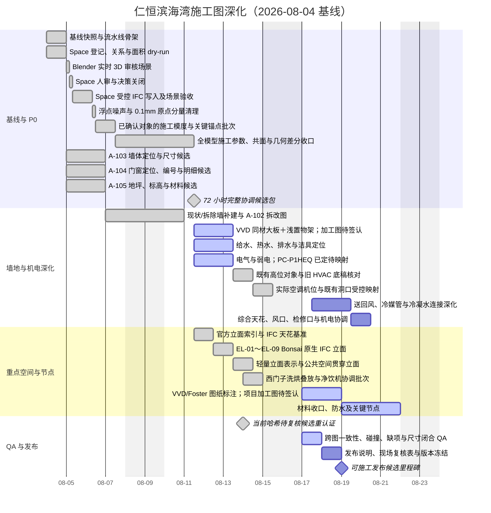

# 仁恒滨海湾装修施工图深化工作管理

> 项目：2504 GBTB Yanlord Zhuhai
> 文档创建时间：2026-08-04
> 数据快照时间：2026-08-15（仅表示下方 IFC 数量、哈希和 QA 结果的采集时间，不是每日计划起点）
> 最近更新时间：2026-08-17 15:35 +08:00
> 目标：以 IFC 为单一几何与已确认语义源，按“自动生成候选—人眼审核—现场/业主确认—机械 QA—受控发布”推进完整装修施工图。
> 本文档只管理工作，不直接授权任何 IFC 写入。

## 1. 当前结论与状态

### 1.1 状态图例

| 状态 | 含义 | 进入下一状态的条件 |
| --- | --- | --- |
| ✅ 已完成 | 已有可追溯产物并通过当前阶段检查 | 仅在源模型或决策变更时重开 |
| 🟡 进行中 | 已有输入和执行人，正在生成或审核 | 产物、证据和停止条件均关闭 |
| ⚪ 未开始 | 尚未进入执行 | 上游依赖完成且输入冻结 |
| 🟠 待业主/现场确认 | 无法由 IFC、IDS 或设计规则可靠决定 | 决策记录含责任人、日期和证据 |
| 🔴 阻塞 | 继续工作会造成猜测、返工或不可验证写入 | 阻塞原因消除并重新跑基线检查 |

### 1.2 当前可验证基线

| 项目 | 当前值 | 状态/风险 |
| --- | --- | --- |
| IFC | `2504 GBTB Yanlord Zhuhai.ifc`，IFC4，SHA-256 `7a50b87e8f48a7c2bfbaa9f1dabdfca7155fa684b2325c66aa1ae15c8ab0a25c` | ✅ 当前 `893541` 实体、`3228` 个唯一 GlobalId、`927` 个 IfcProduct、22 Space、101 面墙、177 个 Opening、1 个 placement-only `IfcSensor/FIRESENSOR`、1 个 placement-only `IfcUnitaryEquipment/A06` 与 APP-017 的 2 个 placement-only `IfcElectricAppliance`；44 张 Bonsai 原生立面 Drawing 已保存到正式 IFC |
| 核心对象 | 22 Space、101 Wall（84 `EXISTING`＋4 `NEW`＋13 `DEMOLISH`）、8 Door、11 Window、19 Slab、20 GridAxis、169 Annotation（49 `DRAWING`＋76 `GRID`＋44 `ELEVATION`） | 🟡 20/20 GridAxis、22/22 Space、88/88 最终建成 Wall 及全部 16 个有宿主洞口的门窗锚点已归整；13 面拆除墙仅服务 A-102；3 樘无洞口门转 A-104 建模例外 |
| IFC 图纸定义 | Wall Plan、FFL PLAN、Wall Finish Plan、Sanitary Plan、Furniture Plan | ✅ 有基础图；尚非完整施工图发布集 |
| A-103 | `Wall Plan-A103-candidate.svg` 与单页 `output/pdf/A-103-wall-plan-candidate.pdf`；29 条候选尺寸线，20 轴双向尺寸链闭合 | ✅ 88 面最终建成墙已收口为 84 面 `EXISTING` 与 4 面 `NEW`；64 面现状非承重墙、20 面现状承重墙均有标准 IFC 属性；正式 `Tag` 为 `EW01–EW84`、`NW01–NW04` 且唯一；厨房门垛厚度已归整为 `154 mm`，已调整客卫门洞保持不动 |
| A-104 | `Wall Plan-A104-candidate.svg` 与单页 `output/pdf/A-104-door-window-plan-candidate.pdf`；19 个候选编号 | ✅ 19 个 Tag、4 个门名和 3 个门窗组已写入正式 IFC；关系、Placement 与世界几何通过 `0.1 mm` 写后门 |
| A-105 | `FFL PLAN-A105-candidate.svg`、单页 PDF、21 个地坪登记与 8 樘门槛交接登记 | ✅ 21 个 Tag、18 个坡向属性、3 个地坪材料/完成面意图和 2 个降板属性已写入正式 IFC；关系、Placement 与世界几何通过 `0.1 mm` 写后门 |
| P0 IDS | `pipeline/ids/p0-construction-information.ids`；可重复报告 `build/ids/p0-report.json/.md` | 🔴 587/593 项检查通过、4/5 规格通过；101/101 墙 Length、88/88 最终建成墙 Tag、8/8 门与 11/11 窗 `PredefinedType` 已通过，剩余仅为 M05–M07 三樘门的宽高 6 项 |
| P0 决策 | `SPACE-REF-001` 已实施：玄关 `R01`、按平面顺时针至 `R22`；门、地坪、Slab 与洁具锚点已从 C003 精确移交对应任务 | 🟡 未关闭项继续按对应任务停止条件处理 |
| 机械 QA | 9 PASS / 1 WARN / 3 BLOCK，当前不可施工发布 | 🔴 新增的集中人审门已把全部发布阻断收敛到稳定根因项；`reviewed-candidate` 已通过，不允许标记为施工发布版 |
| 正式尺寸 | IFC 中没有正式 A-103-DIM 尺寸注释 | ⚪ 自动化先生成候选，人审后才决定是否写入 IFC |
| PM 进度（派生） | 23 项中 14 项完成（61%）；21 个图号中 20 个已形成候选，仅 A-101 因现场实测保持 planned；VVD 材料、Foster 与 600 mm 定制水槽边界已进入 I-501，PC-P1HEQ 型号与 5 个既有控制点已进入 E-302/E-304；54 个开放根审项已全部归责为厂家、现场、主管部门或业主偏好，未分派为 0 | 8 月 19 日风险为高：QA01、REL1、MREL 均未完成；外部回复未齐时只能维持 `reviewed-candidate`，不得冒充可施工发布 |

已确认且不得误改：

- `1To6gRjrf2nBU5GQuuD8FV` 是客卫门，不是主卧门。
- `3xKBbA2CT9mfby2$MODnzM` 已确认为次卧门 M04；`1TW6$_GfnABRZusYvx0zZG` 已确认为主卧门 M07。正式 IFC 编号、关系或 placement 仍须先通过候选 QA。
- 已删除的 3 个旧楼梯 Space 决策已实施，不应重新引入。

### 1.3 立即下一步

`2026-08-17` 当前口径取代下文旧 WFIN 快照：中厨灶台／主要操作墙采用 `Travertino titan marble` 台面同材大板，台面产品意向厚 60 mm；远端墙采用浅置物架；全生堂不再作为厨房墙面体系。I-501 已显式读取 VVD 材料方向、Foster `838×500 mm` 与另一定制水槽仅确认宽 `600 mm`的边界，并明示排除 VVD 产品页的示例水槽 `W1200`。下一步由全屋定制、台面加工、灯光电气和现场以联合 shop drawing 关闭墙段、分缝、边型、开孔、支撑、防水收口、LED 驱动检修、浅置物架和定制盆其余加工参数。厕所地漏定制渠道与“水母地漏／中央集水器＋托克乐思网＋线性排水渠”组合方向已入库，逐房间 shop drawing 与现有吉博力构件分配关系待商家／给排水／防水方关闭。最终图纸交付保持材质化正投影产品页，待定尺寸不得用效果图或通用目录补造。E-302/E-304 已显式显示 5 个 `PC-P1HEQ` 既有控制点；型号已定，A01–A06 兼容、逐点映射、保留／迁移／合并和最终定位继续由空调方与现场签认。

同日已生成可直接分发的总入口 `drawings/evidence/EXT-外部信息最短清单-20260817.md`，按收件人链接 5 份可直接编辑的 Markdown：门组、日立空调、给排水设备、燃气消防和弱电现场。对外表统一采用“我方拟采用做法＋是／否／不适用＋否项修正”格式，不再混入冻结、blocker、release、IFC 或 SSOT 等内部状态语言；项目内部清单另按厂家／现场／主管部门／业主偏好跟踪。41 项设计输入中旧中厨全生堂两项已标记 `不适用`；剩余 33 项无保留发布阻断的自动关闭数为 0。底层安装条件继续按稳定证据包归并跟踪，未映射数为 0。

S003 已完成：22 个 Space 已正式写入唯一 `Pset_SpaceCommon.Reference=R01-R22`，玄关为 `R01`、书房为 `R22`，世界几何变化 `0.0 mm`，Bonsai 已 reload/rebuild。WFIN 当前意图已更新：中厨 R04 全部室内垂直墙面改用全生堂腻子并明确不用瓷砖；与西厨和中厨飘窗共用对象只在中厨侧按 Grid Space 边界分段。全生堂准确产品、颜色表面、涂层、厚度、基层底涂、防潮耐污和收口仍未定，正式 IFC 材料和几何未修改。P-202、E-301、E-303、I-501～I-504 已形成可读 SVG/PDF 候选。RCP1/M-401 已完成 117 个高位对象、29 个空调通风相关实例（5 个有 Body 的正式 AC＋1 个 placement-only A06，另含既有洞口、管线和风口协调对象）和 6,786 个对象对的只读机械核对；原剩余 10 对管段/AC 相交在哈希固定的旧 `2504_lowpoly.blend` 中均以相同状态存在，已从当前硬碰撞人审队列关闭。紫色管线仅为拆改后旧方案底稿，装修后的冷媒液管、冷媒气管和冷凝水管仍须重新设计。旧文件同时保存厨房机位与 `1QBd...` 东侧额外机位；全部空调机位均已确认固定，东侧 A06 已建立正式 placement-only IFC 身份，旧文件只保留位置溯源。7 个 AC Hole 已确认为开发商原有洞口且位置已核对，装修不新增洞口。WD02/WD03 已确认是梁墙共面收口的木工板打底，不是最终天花饰面；`3Bv...` 已确认为有缺陷旧方案中的空调出风口。16 个天花/灯槽 Proxy 的边界和高低关系已整体确认正确，`16Ey9Flj9BK9VRun$ozzjH` 已确认为转角空调风口。书架跌级天花与转角风口两个 handoff 已完成纯原点写入；2/2 placement 精确，全模型世界几何超差 0，Bonsai 已 reload/rebuild。厨房探测器点位、A06 身份与 APP-017 西门子两机语义现位于正式 IFC SHA-256 `7a50b87e8f48a7c2bfbaa9f1dabdfca7155fa684b2325c66aa1ae15c8ab0a25c`；系统连接、回路、厂家接口中心和现场条件继续阻断施工发布。

`2026-08-11` 已完成当前哈希的待复核候选门：21 个图号唯一，20 个图号已有候选输出，仅 A-101 因现场实测保持 planned；20/20 份专业报告均声明并匹配正式 IFC SHA-256，20 个登记图纸输出与 25 个报告声明输出全部存在，发布门错误为 0。P-201 已逐项表达 24 个服务需求候选和 3 个非服务组合构件，冷热水需求全部保持 unknown，未生成管线、管径、水压或设备接口。M-401 已把 28 个既有实例、3 个 AC 类型/5 个已分配实例、6 条用户确认约束、7 个顺序锚点和 5 个 BLOCK 汇为证据化协调候选，旧紫色管线继续明确为非最终路线。E-303 定位候选与 E-302/E-304 控制网络候选已单独纳入发布报告清单，未完成定位继续硬阻断施工发布。D-601/D-602 已各形成 6 个变量化节点候选，36 个材料/厂家/构造字段全部保持未决；S-701 已形成 52 条证据化记录，严格区分家具产品身份、家电存放与使用位置、门窗五金、既有暖通类型和墙面材料系统，并将中厨全生堂腻子的已确认范围与未定施工体系分开。A-101 已建立 6 类严格现场输入模板与编译脚本，只有 confirmed 状态产生有效值。该里程碑只证明“待复核候选包”完整可追溯，不代表施工发布或下单条件关闭。

`2026-08-12` 因新增 Bonsai 原生轻量立面与 Drawing 注释，本轮对当前正式 IFC 哈希重新认证全部派生图纸：Wall Plan 的 SVG、underlay PNG 与 source manifest 已由 Bonsai 无缓存重建；20/20 份专业报告、20/20 登记输出和 25/25 报告声明输出再次匹配，`reviewed-candidate` 门保持通过。两台未采购洗碗机候选改为西门子 `SJ85ZX26MC`，只从官方规格书和安装说明冻结 `2000 W`、`775×598×550 mm` 产品包络、`780–835×600–608×≥550 mm` 安装空间及给排水/电气接口条件，最终采购、柜门板、踢脚、阀门、排水与插座现场位置仍开放。WD01/WD01L 补录为 Poliform `Senzafine + Pivot` 的 `freestanding wardrobe and wall mounted Pivot` 组合证据，但不据此推断 M07 开门方向或关闭 Master A/B。

`2026-08-13` 已把设备、家具、洁具、门窗和暖通安装输入迁入项目内三张单一真源表；纳入当日最新吉博力采购/收货证据、厨房与卫浴定制选型、客卫镜柜意向、官方安装条件、Rimadesio Sail 单轨 CAD、A05 厂家型号族条件及 A06 正式 placement-only 身份后，当日快照为设备主表 `153` 条、安装条件 `590` 条、证据 `119` 条。机械校验覆盖正式 IFC 范围内 `163/163` 个对象，缺失 `0`、重复归属 `0`；A06 仅关闭 occurrence 身份、点位与 CEL 归属，未写入 Body、厂家、型号、容量、尺寸、端口或系统，postwrite 审计同时证明原 `924` 个产品世界几何变化 `0.0 mm`。新增的采购设备/配件和未建模 Foster 厨房水槽、客卫镜柜以逻辑输入登记，不虚构 IFC 对象。Duofix 与 Sigma01 的 IFC 需求数 `2`、实收数 `1` 和缺口数 `1` 已分别字段化，第二件未到货状态及各产品尚未关闭的标高、防水、装配方向和检修节点均以 `blocks_release=yes` 进入发布门，避免仅靠自然语言备注。五张旧专业表与只读兼容投影须逐行对账一致；Excel 的“设备主表 / 安装条件 / 证据索引”仅为只读派生视图。该里程碑关闭的是数据归属、外键和遗漏审查，不代表候选型号、现场接口或施工定位已获确认；PLUM、ELEC、RCP1、INT1 和 S-701 必须从三表消费，并继续按 `status`、`blocks_release` 和证据边界关闭施工发布条件。

`2026-08-13` 用户补充确认：厨房水槽采用国内定制 Foster Milano `1014 850`，官方精确产品代码 `1014850` 支持台下安装、`838×500 mm` 外形、`790×452 mm` 开孔、`790×400×200 mm` 盆体和 `3.5 in` 排水器；正式 IFC 目前没有可可靠归属的厨房水槽对象，因此只登记逻辑设备，不把 VVD 岛台 `SIN01` 或 KITCHEN 柜体代理误认成本产品。岛台水槽与岛台台面只冻结为大理石定制方向，所有石材、厚度、开孔、支撑和加工尺寸继续开放。BATHM 的 `STREET`/`STREET-H` 与 BATHG 的 `BS01` 结合用户两套台盆输入，分别形成 antoniolupi Street 与 Falper Sorgente 的房间映射候选；两者均为国内定制，官方 Rosso Levanto、原型几何和接口只用于协调，不能代替加工厂盖章图。客卫干区后墙全高分格镜柜按参考意向进入 INT1，图中灯带、饰面和分格不得自动写为项目要求，最终采用、尺寸、柜深、门扇、墙体基层、防潮与电源均保持发布阻断。Rimadesio 官方 `SAIL_MONOROTAIA.dwg` 已固化为 A-104 产品族证据，并转换为 21 MB ASCII DXF 机械读取 `1338` 个实体、`52` 个 DIMENSION 和 `52` 个 MTEXT；厂家通用示例标注门板宽 `1000 mm`、门洞宽 `976/989/1978 mm`、轨道长 `2011/2037/4022 mm`、门板高 `2670 mm` 和门洞高 `2666/2678 mm`。它关闭 M05/M06 属于 Sail 单轨滑动系统这一层级，但不替代项目下单尺寸、左右滑向、宿主洞口、轨道基层和收口安装图。正式 IFC 门板现状包围为 `1000×38×2400 mm`、轨道长 `1200 mm`：M05 宽度虽与通用示例数值相同，M05 高度和 M06 轨道长度均不匹配，因此只作为项目几何观察保留，`IfcDoor.OverallWidth/OverallHeight` 继续为空。

`2026-08-13` 原生立面保存批次已闭环：内存相对旧正式 IFC 只新增 `44` 个 `IfcAnnotation/ObjectType=ELEVATION` 与对应 `44` 个 `IfcRelAssignsToProduct`，另更新既有 Wall Plan 图组成员关系；旧正式 IFC 的 `831/831` 个原有产品几何图完全一致，写后正式 IFC 相对保存候选的 `875/875` 个原有产品几何图完全一致，世界几何与 placement 最大变化均为 `0.0 mm`。Bonsai 保存调用虽超时，但磁盘哈希、实体数和 reload 后内存均证明保存成功；Wall Plan SVG 与 underlay 又以缓存全关重建。设备真源新增受控 IFC 证据哈希刷新命令，只在 `162/162` 身份覆盖通过后更新 `52` 条明确指向正式 IFC 的证据。当前 `reviewed-candidate` 门再次通过：正式 IFC 可真实解析，20/20 份专业报告、20/20 个登记输出和 26/26 个报告声明输出均为当前哈希；施工发布门仍按设计失败并披露 A-101、13 份专业阻断与 `392/593` IDS 结果。

`2026-08-13` P0 元数据批次已闭环：88 面最终建成墙新增标准 `Qto_WallBaseQuantities.Length`，8 樘门与 11 樘窗 occurrence 分别补齐 `PredefinedType=DOOR/WINDOW`；该批未写墙编号、未补 M05–M07 尺寸、未更改门开启方式、宿主关系、placement 或 representation。写前候选把 IDS 从 `392/593` 提升到 `499/593`；写后候选幂等复跑仍为 `499/593`。候选与正式 IFC 的 `875/875` 个受保护非 Drawing 产品物理图、placement 和 fills/voids 关系完全一致，世界几何最大变化 `0.0 mm`。Bonsai 保存调用超时后，磁盘哈希 `60552c51c71de8e86f6a7f0b722cddbb901843b81ec8c5d56d52d659cb86b2a6`、reload 内存、924 产品和 IDS 均证明保存成功；Wall Plan 与 `4724×4724` underlay 已禁用缓存重建。三张设备真源保持 `146/396/89` 条并覆盖 `162/162` 个 IFC 对象；当时全部专业报告和登记输出已重认证，`reviewed-candidate` 门通过。施工发布门仍按设计失败并披露现场、厂家和系统级未决项。

`2026-08-13` 墙编号已正式闭环：用户批准 84 面现状最终墙使用 `EW01–EW84`、4 面新建墙使用 `NW01–NW04`，各组按北到南、同排西到东、最后按 GlobalId 稳定排序，且不与门 `Mxx`、窗 `Wxx`、拆除墙 `Dxx` 冲突；今后普通内部协调编号默认由编译器直接生成。88/88 个 `IfcWall.Tag` 已写入正式 IFC，写后 IDS 为 `587/593`，候选幂等复跑仍为 `587/593`。相对 Git 写前基线，101/101 面墙世界几何均为 `unchanged`；写入器报告 875/875 个受保护产品物理图、placement 与 fills/voids 关系完全一致，最大世界几何变化 `0.0 mm`。Bonsai 已 reload/rebuild，13 面 `DEMOLISH` 在非 A-102 审核中隐藏，Solid、X-Ray 关闭、`show_in_front=0`；`Wall Plan.svg`、`underlay.png` 与 manifest 已在同一相机下无缓存重建。三张设备真源保持 `146/396/89` 条并覆盖 `162/162` 个 IFC 对象；21/21 专业报告、20/20 登记输出与 29/29 报告声明输出全部匹配新哈希，`reviewed-candidate` 门通过。当前仅剩 M05/M06 Rimadesio Sail 组合与 M07 主卧门的宽高 6 项等待项目/厂家证据，不能用常见值代替。

`2026-08-14` APP-017 洗烘与 APP-014 净饮机协调批次已闭环：APP-017 从 LG WashTower 历史候选改为西门子 `WG54M7D20W` 独立洗衣机＋`WQ55M7U20W` 独立热泵干衣机上下叠放，产品机身分别为 `598×848×600 mm` 与 `598×842×600 mm`、两者 90° 开门总深均为 `1111 mm`，项目按 `650W×800D×1900H mm` 有效净空协调。正式 IFC 保留原 GlobalId `3JAkt8PsX7vPfGKWLK5EKp` 作为项目协调净空，并新增两个无 Body 的语义正确 `IfcElectricAppliance` 子件；原 924 个产品世界几何变化 `0.0 mm`，新增子件除外。说明书订货号 `17008829` 已确认；官网 `WTZ27510` 是带抽板连接组件候选，但尚无官方证据证明二者映射或本两台 E-Nr./FD 逐型号兼容，采购门继续开放。APP-014 优选改为 `WS7FSB0C1C`，`WS7060BC1C` 仅保留比价备选；APP-015 为同一实物功能别名且数量 0。设备单一真源现为 `161` 条设备、`724` 条安装条件、`163` 条证据，IFC 范围 `165/165` 覆盖、缺失 `0`、重复 `0`；施工输入工作簿的三张只读派生表已与 CSV 逐单元格一致。I-503、P-201/P-202、E-303 与 S-701 已刷新到正式 IFC SHA-256 `7a50b87e…`。严格 E-303 编译器现停在 `E303-NS01-CIRCUIT`：APP-001～003 的准确型号/铭牌功率尚缺，故不以常见值虚构回路容量；这是下一处必须由业主输入关闭的审核点。

`2026-08-15` 第一组电气决策已正式吸收：设备插头额定、墙面插座、支路断路器和独立回路拆分为不同参数；烤箱采用官方 `3400 W / 16 A` 插头与 16A 插座、独立 C16 RCBO／4 mm²，洗烘采用两个 10A 可检修插座共用一路洗衣区 C16 RCBO／2.5 mm²，净饮机、油烟机、燃气灶备用点和两台洗碗机均按精确语义入表。NS-01 按两个 10A 端口同时使用的 `20 A / 4.4 kW` 不利工况分两路 C16，NS-02 对选装咖啡机按 `2600 W` 预留独立 C16 与接线盒，未冻结面板。Entry/Master A/Master B 的逻辑面板数、最少键数、键序、真实双控／场景关系以及两台卧室 AP 的 CAT6 星型 PoE 拓扑均已闭合；说明书没有提供的接口中心继续为 unknown。E-301～E-304 派生图和正式工作簿已刷新，正式 IFC 未修改。

同日第二组证据推进已完成内部可查范围：Rimadesio Sail 官方 CAD 的通用构造与项目订单尺寸严格分离；Poliform Pivot、开发商 DXF 和正式 IFC 只关闭可证明的衣柜—墙—门套关系，Master A 必须避开活动门扇／门套；日立 A01–A04 的三类管径和冷凝坡度保留官方确认，A05/A06 及六台精确端口坐标转为逐项厂家索取；PLUM 以设备为行整理吉博力、Foster、洗烘、定制盆和 APP-016 缺项；燃气／消防与弱电现场清单均已形成可直接发送或填写的最短包。公开检索没有找到可核验的勒科斯 F50 厂家官方资料，因此其功率、法兰和排水接口不估算。27 个开放发布阻断中脚本可自动关闭为 `0`，后续只接受厂家、现场、主管部门或真正业主偏好的外部证据。

`2026-08-15` 业主新增 APP-019 冰淇淋机 1 台。当前只关闭设备类别与数量；候选设备不表示已选或已购。安装位置、台面/落地/嵌入形式、准确型号、功率、插头、墙面插座、支路保护、是否独立回路、给排水、通风散热、机身尺寸、检修净空和接口中心均保持 `unknown`；在位置与型号证据返回前，不计入 NS-01/NS-02 或其他已闭合回路。

当前为设备主表 `166` 条、安装条件 `880` 条、证据 `205` 条；三者是设备安装输入的单一真源，Excel 只读页签与其逐单元格一致。新增 `KIT-VVD-FINISH-001`、`HVAC-CTRL-001` 和 `ACCESS-INTERCOM-001`：VVD 第 9 页材料组合、Travertino titan marble 60 mm 台面、Thermo oak 36 mm 灯架、Pewter 60 mm 踢脚、Foster 838×500 mm 与定制盆宽 600 mm 已关闭；产品页 1200 mm 示例水槽被明确排除。空调面板准确型号已关闭为 PC-P1HEQ，外部只再确认与 A01–A06 的兼容性、5 点映射、保留／迁移／合并、项目端子图和最终位置。既有可视对讲室内机品牌已由现场照片关闭为 DNAKE／狄耐克，系统版本 `1.6.0 20210615`、应用版本 `1.1.0 20210615 16M` 只作现场观察；准确型号、端子、物业兼容、保留／迁移／接入及最终坐标继续为 `unknown`。5 份对外 Markdown 已同步删除已回答问题；未修改正式 IFC。

S001 已交付：26 个 Space 登记表、关系变更预览、面积证据、人审队列和校验清单，均位于 `build/space-dry-run/`。26/26 面积可复算，合计 `113.800063 m²`；但 GrossFloorArea、NetFloorArea 和 Reference 均为 0/26，需要先确定计量口径。

<!-- OWNER_INPUTS:START -->
### 1.4 用户输入同步状态

- 最近同步：`2026-08-17T18:00:34+08:00`
- 无保留发布阻塞输入仍开放：**35** 项；不阻止明确披露未决项的待复核候选版。
- 其中本地脚本可自动关闭：**0** 项；须由人审、现场、厂家或主管方关闭：**35** 项。
- 家电条目尚未完全确认：**15** 项。
- “采用候选”只关闭设计选择，不自动关闭施工证据；设计状态与施工关闭状态分别计算。
- 同步脚本只更新决策登记与本状态块，不直接写正式 IFC。
<!-- OWNER_INPUTS:END -->

## 2. 数据边界与执行规则

1. **IFC**：只保存几何和已确认语义；每轮只能有一个 IFC 写入者。
2. **IDS**：`pipeline/ids/p0-construction-information.ids` 只描述可机器验证的信息要求，不承载设计选择。
3. **决策表**：无法由 IDS 表达的选择写入清晰的 Markdown/CSV，记录依据、置信度、审核状态和责任人。
4. **派生产物**：候选 SVG/PDF、快照、报告和中间表进入 `build/`；不得覆盖 IFC 源文件。
5. **图纸登记**：图号、名称、状态、来源、版本和发布日期统一由 `pipeline/decisions/drawing-register.csv` 管理。
6. **发布物**：只有通过发布门的不可变版本进入 `releases/`；未关闭项必须写入发布说明，不得隐藏。
7. **IFC 写入回合**：写前冻结哈希和对象清单；写后必须保存、读取磁盘验证、reload/rebuild Blender、恢复验收视图、截图并重跑机械 QA。
8. **禁止猜测**：Space、门窗、地坪、设备、材料和施工语义没有可靠依据时，状态转为“待人审”或“待业主/现场确认”。

## 3. 总体甘特图

基准节奏：48–72 小时形成覆盖全部图纸类别的协调候选包；第 4–10 个高强度工作日完成深化、QA 和带现场复核项的可施工发布候选。若现场关键输入未返回，第 10 日只发布“待复核候选版”，不得冒充最终版。

### 3.1 甘特图使用规则

- 甘特图展示计划日期、依赖和里程碑，是第 5 节 PM 任务台账的排期视图。
- TODO checkbox 和任务元数据是状态的唯一权威来源；两处不一致时以第 5 节为准，并修正甘特图。
- 计划调整只修改计划日期；实际开始和实际完成时间保留在任务台账中，不得被新计划覆盖。

## 4. 自动化、人眼审核与现场决策边界

| 类别 | 应做内容 | 不得越界 |
| --- | --- | --- |
| 自动化 | IFC 快照与对象登记；IDS 校验；房间标注候选；墙体、门洞、洁具、家具和设备定位尺寸候选；门窗/材料/设备明细；图框、图号、版本、图纸索引；批量 SVG/PDF 导出；尺寸闭合、缺项、重复编号、空白区域、文字碰撞和跨图一致性检查；推断依据/置信度/人审标记 | 不得把未审推断写回 IFC；不得自动确认房间、门窗用途、材料和现场条件 |

**编号默认自治规则**：普通图元、图纸、材料与设备的内部协调编号，由编译器按分类、空间/坐标顺序和稳定 ID 生成，保证唯一、可追溯、可重复构建；无需逐项向业主确认，后续不满意可受控重排并做跨图引用迁移。只有编号已属于外部合同/厂家订单、既有现场永久标识、法定消防/燃气身份或电气回路系统身份时，才必须在写入前核对权威来源。编号自治不扩大为产品、尺寸、用途或安装条件确认。
| Blender 实时审核 | 从当前磁盘 IFC reload/rebuild；恢复可交互 3D 验收视图；用 Workbench 语义色、实体显示、选择高亮和逐项聚焦辅助审核人直接检查空间边界与上下文；移动端审核时补充由当前 IFC/矢量候选生成的局部截图 | 不生成独立审核文档或批量截图包；移动端截图只作人眼界面，不替代 IFC/决策记录；未经源哈希验证的旧栅格底图或纹理不得参与判断；审核回合不得修改 IFC |
| 人眼审核 | Space 边界与语义；主卧门候选平面定位；门窗洞口关系；材料分格；洁具/家具/设备可用性；图面层级、可读性与节点合理性；专业碰撞处置 | 不要求人眼判断亚毫米对齐；尺寸、正交、接头残差和非预期变化必须机械计算。不得用“看起来合理”代替现场/业主数据 |
| 业主/现场决策 | 权威测量和现状；拆改范围；最终墙体布局；水压、过滤/增压和热水；窗扇开启、锁具和物业限制；燃气表/管线/柜体安全；最终设备型号；材料样板、基层和不可见管线 | 未确认项不得伪装为定案；可先形成带醒目标记的候选及现场复核表 |

每一条自动推断至少记录：`对象/图纸`、`推断结果`、`依据`、`置信度（高/中/低）`、`是否需人审`、`审核结果`、`关联决策 ID`。

### 4.1 Blender 作为实时 3D 审核界面

Blender 是本项目 Space、门窗候选和跨专业碰撞的人眼审核主界面。审核人直接在可交互 3D 视口中旋转、缩放、平移和切换正交视角，以判断空间体量、边界、相邻关系和遮挡；不生成或依赖审核文档或逐图索引。审核人在移动端时，可补充当前矢量/IFC 候选的局部截图作为临时人眼界面；截图必须注明对象颜色和未知门，且不得包含未经当前源哈希验证的旧栅格底图或纹理。

**Blender 实例资源限制（强制）**：人眼审核理想状态只使用当前 1 个 Blender 实例，在同一窗口内切换审核集合、视图或派生审核文件。只有必须对照当前版与旧版/候选版时，才允许临时启动第 2 个实例；任何时刻同时运行的 Blender 实例（包括可见窗口和后台 Blender 任务）不得超过 2 个。不得为重连 MCP、切换文件或重试脚本连续新开实例；应优先复用当前实例、恢复 bridge 或先关闭失败实例。第 2 个实例在对照完成、失败或失去用途后必须立即关闭。进入人眼审核前先核对实例数量；发现超过 2 个时停止审核，保留正式工作实例和至多 1 个明确命名的审核实例，其余由操作员关闭后再继续。

#### 实时审核闭环

1. **冻结输入**：记录 Git 状态、IFC SHA-256、schema 和对象数量；若与 dry-run 基线不同，停止并重新生成候选。
2. **恢复场景**：从当前磁盘 IFC reload/rebuild Blender 场景；本步骤只读，不写 IFC。
3. **准备 3D 视图**：操作员显示全部 Space 和 Grid，应用现有语义色与半透明显示，保留墙、门、窗等必要上下文，并把家具保持为黄色或默认隐藏。
4. **逐项聚焦**：操作员一次只高亮并聚焦一个待审对象；审核人无需自己查找对象或 GlobalId。
5. **直接人审**：审核人可自由旋转、缩放、平移或切换顶/前/侧视图，然后回复“确认”“修改为……”或“暂缓/现场确认”。
6. **后台记录**：操作员将结论、依据、审核人、时间和 GlobalId 写入受版本控制的决策记录；CSV 只作为后台状态源，不是人工审核界面。
7. **进入下一项**：审核人回复“下一个”后，操作员恢复正确可见性并高亮下一对象；全部条目关闭后才允许准备 IFC 写入清单。

#### Space 实时审核状态

- 全部 22 个 IfcSpace 显示，按现有 LongName/语义使用对象色并保持可选；视口默认使用 `SOLID` + `OBJECT` color，不使用 Material View，不默认使用 wireframe 或全局 X-ray。
- 20 条 GridAxis 全部显示并可选中；Grid M、Grid 08 及当前待审对象由操作员主动高亮，但所有对象的 `show_in_front` 必须保持关闭。
- 默认使用透视等轴测总览；审核人可临时切换顶、前、侧正交视图。操作员在每一项开始时主动 `Frame Selected`，不让审核人自行寻找。
- 墙、门、窗和家具默认以实体显示，保持正常 3D 体量判断；家具统一保持黄色。只有实体遮挡导致目标无法审核时，才临时使用半透明、隐藏或 wireframe，并在切换下一项前恢复实体显示。
- 所有人眼验收必须按真实深度遮挡：全局 X-ray 与每个对象的 `show_in_front` 均保持关闭；半透明对象仍参与深度判断，不得穿透式置前显示。
- 允许临时隐藏遮挡物，但不得移动、重命名、编辑几何或保存 IFC；切换下一项前由操作员恢复标准可见性。

#### 审核人的最短操作说明

- 旋转：按住鼠标中键拖动；平移：`Shift` + 鼠标中键；缩放：滚轮或触控板。
- 聚焦当前对象：小键盘 `.`，或菜单 `View > Frame Selected`；全局视图：`Home`。
- 顶/前/右视图：小键盘 `7` / `1` / `3`；无小键盘时使用 `View > Viewpoint`。
- 只做导航和选择，不进入 Edit Mode，不移动/删除/重命名对象，不点击 IFC 保存。
- 回复格式只需：`确认`、`修改为：<正确名称/边界/关系>`、`暂缓：<需要确认的事项>`，或 `下一个`。

#### 验收与停止条件

| 验收项 | 最低要求 |
| --- | --- |
| 可交互场景 | 22 个 Space、20 条 GridAxis 以及墙/门/窗/家具上下文可见；全部模型使用 Solid View，Space 使用语义对象色，选择高亮可用 |
| 当前审核项 | 目标对象已选中并聚焦；审核人可直接旋转查看，不需要查找对象 |
| 机械基线 | IFC 哈希与 Space/Grid/Wall/Door/Window 数量和 dry-run 一致；场景已从磁盘 IFC 重建 |
| 决策记录 | 每项含确认/修改/暂缓、备注、审核人、审核时间和关联 GlobalId；不要求另写人工 review 文档 |

以下任一情况发生时停止审核：IFC 哈希或对象数量漂移；Space/Grid 不完整；语义色或透明显示无法区分；目标对象未主动高亮/聚焦；审核人被迫自行寻找对象；场景在审核过程中发生未授权 IFC 修改。

## 5. PM 任务台账（唯一状态源）

甘特图只用于查看排期和依赖；本节的 TODO checkbox 是任务完成状态的唯一来源。只有验收产物存在且停止条件未触发时，才把 `[ ]` 改为 `[x]`。

时间统一使用 `YYYY-MM-DD HH:mm +08:00`。历史任务没有准确时刻时，保留日期并标注“具体时间未记录”，不得补猜。状态变化时更新“最近更新”；任务阻塞时保持未勾选并填写阻塞原因。

### P0｜IFC 语义与基础图纸

- [x] **M000｜冻结 IFC、图纸、IDS 与决策基线**
  - 状态/优先级/负责人：✅ 已完成 / P0 / 自动化
  - 时间：添加 `2026-08-04`；计划开始 `2026-08-04`；实际开始 `2026-08-04（具体时间未记录）`；目标完成 `2026-08-04`；实际完成 `2026-08-04（具体时间未记录）`；最近更新 `2026-08-04`
  - 依赖：无
  - 验收产物：IFC 快照、图纸登记、P0 决策表、QA 报告
  - 停止条件：IFC 哈希或 Git 基线发生未知变化

- [x] **S001｜Space 登记、关系与面积 dry-run**
  - 状态/优先级/负责人：✅ 已完成 / P0 / 自动化子任务
  - 时间：添加 `2026-08-04`；计划开始 `2026-08-04`；实际开始 `2026-08-04（具体时间未记录）`；目标完成 `2026-08-04`；实际完成 `2026-08-04（具体时间未记录）`；最近更新 `2026-08-04`
  - 依赖：M000
  - 验收产物：`build/space-dry-run/` 下的 26 个 Space 登记、关系预览、面积证据、53 条人审队列和校验清单；14 项输出校验 PASS
  - 停止条件：数量/GlobalId 不一致；面积无可追溯来源；需要猜测语义

- [x] **S002A｜Blender 实时 3D 审核场景**
  - 状态/优先级/负责人：✅ 已完成 / P0 / Blender 操作员 + 自动化
  - 时间：添加 `2026-08-04 11:27 +08:00`；计划开始 `2026-08-05`；实际开始 `2026-08-04 11:40 +08:00`；目标完成 `2026-08-05`；实际完成 `2026-08-04 11:55 +08:00`；最近更新 `2026-08-04 11:55 +08:00`
  - 依赖：S001；当前磁盘 IFC 与 dry-run 哈希一致
  - 验收产物：Blender 中可交互的 Solid View；22 个 Space、20 条 GridAxis 和墙/门/窗/家具上下文可见；Space 使用语义对象色；合并后的走廊与玄关已选中高亮；对象数量和 IFC 哈希已核对
  - 停止条件：Space/Grid 不完整；语义色或透明显示不清；审核对象需要用户自行寻找；无法自由旋转查看；审核回合发生 IFC 修改

- [x] **S002｜Space 人审与决策关闭**
  - 状态/优先级/负责人：✅ 已完成 / P0 / BIM + 设计人审
  - 时间：添加 `2026-08-04`；计划开始 `2026-08-05`；实际开始 `2026-08-04 11:55 +08:00`；目标完成 `2026-08-05`；实际完成 `2026-08-08 18:09 +08:00`；最近更新 `2026-08-08 18:09 +08:00`
  - 依赖：S002A
  - 验收产物：全部 Space 原边界人审已确认；3 个飘窗、走廊和玄关均按重新标记后的同名 Grid Box 合并为 4 角矩形 Box；22/22 Space 均为 Box；`SPACE-REL-001` 已改为 FFL aggregation；22/22 `GrossFloorArea` 已按 Grid 语义边界写入且合计 `113.8 m²`；`NetFloorArea` 保持为空；房间码规则已确认为玄关 `R01`、按平面顺时针至 `R22`
  - 停止条件：当前人审决策已关闭。几何未严格 Boolean 贴合完成面登记为非阻塞后续 QA 项，不能把 GrossFloorArea 当作 NetFloorArea

- [x] **S003｜Space 受控 IFC 写入及场景验收**
  - 状态/优先级/负责人：✅ 已完成 / P0 / 唯一 IFC 写入者
  - 时间：添加 `2026-08-04`；计划开始 `2026-08-06`；实际开始 `2026-08-04 12:28 +08:00`；目标完成 `2026-08-06`；实际完成 `2026-08-08 18:34 +08:00`；最近更新 `2026-08-08 18:34 +08:00`
  - 依赖：S002；同名合并与 Grid 语义边界已有用户明确批准
  - 验收产物：22 Space 的几何合并、Grid 锚点、IFC4 Storey aggregation、`GrossFloorArea` 与标准 `Pset_SpaceCommon.Reference` 均已写入。房间码为玄关 `R01`、顺时针至书房 `R22`，22/22 唯一；Reference 数据类型按 IFC4 官方 Pset 模板为 `IfcIdentifier`。正式 IFC SHA-256 `c7295688003f3f36775a25f6adc2c9878e203c52c980f8e46faed66a3537c4a8`；相对批准候选全部 Space 世界几何最大变化 `0.0 mm`，LongName 与 Root 边界通过。Blender 已保存并 reload/rebuild，验收场景为 Solid、X-Ray/Wireframe/`show_in_front` 关闭，22 Space、20 Grid 和墙/门/窗/家具上下文可见，R01 玄关已选中
  - 停止条件：当前任务已关闭；任何 Reference 重复、LongName 覆盖、Space 几何变化或恢复错误 containment 均必须重开 S003

- [x] **C001｜浮点噪声与 0.1 mm 原点分量清理**
  - 状态/优先级/负责人：✅ 已完成 / P0 / 唯一 IFC 写入者 + 自动化
  - 时间：添加 `2026-08-04 13:17 +08:00`；计划开始 `2026-08-05`；实际开始 `2026-08-04 14:28 +08:00`；目标完成 `2026-08-05`；实际完成 `2026-08-04 17:25 +08:00`；最近更新 `2026-08-04 17:53 +08:00`
  - 依赖：S003 中的 Space 重新标记与再次合并完成
  - 验收产物：IFC 从 SHA-256 `73b515fabd996572b3a31e14220639397ad437f4286416fffac14fa8aa65cceb` 更新为 `443ff085af96c39dad59e66ad987b2c2b5e93b7753063387b5408744ff55bedc`；166,585 个小于等于 `0.01 mm` 的长度尾数已精确化且再次扫描为 0；63 个关键对象的 72 个原点分量按 `0.1 mm` 阈值归整；IFC4、2,272 个 Root GUID、22 Space、89 Wall、8 Door、11 Window、20 GridAxis 和 89 Furniture 保持；IFC 已保存并 reload/rebuild；126 个剩余关键 origin 标红，40 面墙体尺寸候选标橙
  - 停止条件：清理结果、磁盘哈希、reload 和主要数量已通过；超过 `0.1 mm` 的原点和橙色墙体转入 C002，不得在 C001 中继续自动取整

- [x] **C002｜已确认对象的施工模度与关键锚点批次**
  - 状态/优先级/负责人：✅ 已完成；3 樘无洞口门转 A-104 待解决；共享曲线墙仅在本历史批次暂缓，后续已于 C003 完成归整 / P0 / 自动化 + 唯一 IFC 写入者
  - 时间：添加 `2026-08-04 17:53 +08:00`；计划开始 `2026-08-04`；实际开始 `2026-08-04 17:53 +08:00`；目标完成 `2026-08-05`；实际完成 `2026-08-05 00:47 +08:00`；最近更新 `2026-08-05 11:31 +08:00`
  - 依赖：C001；执行标准 `pipeline/standards/ifc-geometry-normalization.md`
  - 验收产物：40 面原始橙色墙完成当批分类，39 面按当批已确认规则归整、1 面共享曲线墙暂缓；该墙 `3hKNxGFpT1NPjsqhFgHhOQ` 后续已在 C003 完成原点与坐标系归整，不再是当前例外。20/20 GridAxis 归整到 `20 mm` 模度，22/22 Space 精确贴 Grid 且原点位于整数边界角点，全部 16 个有宿主洞口的门窗原点在整数底边中点。本任务只关闭当批锚点，不代表全模型施工尺寸和共面关系完成；剩余工作进入 C003
  - 停止条件：`1TW6$_GfnABRZusYvx0zZG`、`2D5BPoo2XFSvhTdfPenCh7`、`0zjVS5FBbBewgUkk0fdfiv` 缺少宿主洞口，转 A-104 建模/语义确认；`3hKNxGFpT1NPjsqhFgHhOQ` 已在 C003 完成整数原点与正交坐标系归整，共享曲线 Profile 不原位改写。除非取得独立表示或明确重建依据，否则不重开 C002

- [x] **C003｜全模型施工参数、共面/接缝与几何差分收口**
  - 状态/优先级/负责人：✅ 已完成 / P0 / 自动化 + 唯一 IFC 写入者
  - 时间：添加 `2026-08-05`；计划开始 `2026-08-05`；实际开始 `2026-08-05（具体时间未记录）`；目标完成 `2026-08-07`；实际完成 `2026-08-07 19:30 +08:00`；最近更新 `2026-08-07 19:30 +08:00`
  - 依赖：C002；执行标准 `pipeline/standards/ifc-geometry-normalization.md`
  - 当前状态：正式 IFC SHA-256 `bd2f0290d088663b65d8e19e185a03457a93db1c04ebf7ebc0001ccd6c742c2a`，`888336` 实体、`2269` Root；最新 8 对象原子批次已完成 5 个 `WW20 CLADDING`、2 个主卧飘窗组合件和 1 个 Cabinet 组合件纯原点写入。8/8 placement 与批准候选一致，全模型非目标 placement、世界几何、IfcRelAggregates、实体数和 Root GlobalId 集合保持；PVC110 六根立管相对写前基线变化 `0.0 mm`。当前例外权威表为 `pipeline/decisions/p0-review.csv`；114 个随宿主 Opening 是委托验收，3 樘无宿主门是 A-104 待解决项，两者都不是已批准受控例外。
  - 当前例外边界：9 类已记录项——5 个拓扑敏感 Direction、14 面曲线 Profile 墙、两组 `0.05 mm` Boolean 安全余量、`9.5 mm` 板材、`2.0 mm` 地砖分缝、`14.6 mm` 地漏留口、19 件活动复杂家具、4 个插座，以及 2 个各含 3 根既定立管的 PVC110 组合对象。精确范围、原因、状态及证据见 [IFC 几何归整标准 §9.1](../pipeline/standards/ifc-geometry-normalization.md#91-当前归整例外与非例外边界) 和 `pipeline/decisions/p0-review.csv`。114 个随宿主 Opening 是委派项；两个共享裁切组的 5 个 Opening 及其 5 个耦合 Covering 宿主均已完成专用原子写入；3 樘无宿主门仍转 A-104 处理。`AC700` 已实施，不再属于待决项。
  - 历史验收记录：参数化 `0.1 mm` 机械检查脚本、ObjectPlacement/世界几何差分、墙体共面与接缝、施工参数候选及每批 Hausdorff 证据已持续生成；各阶段旧哈希和旧队列数字仅作为当批证据，当前数量统一以上一项“当前状态”和下一项“当前独立原点口径”为准。
  - 当前独立原点口径：835 个带 LocalPlacement 的 IfcProduct 中 617 个已满足 `0.1 mm`，现剩 218 个超差原点。114 个随宿主 Opening、19 件活动家具、4 个受控插座和 2 个 PVC110 组合对象由已实施规则关闭；原 81 个任务移交对象中 RCP1 的 2 个已按 `0.1 mm` 门完成，余 79 个仍按精确 GlobalId 移交：A104 3 个、A105 17 个、WFIN 3 个、PLUM 30 个、ELEC 9 个、INT1 16 个、DET1 1 个。移交不是数值例外；各任务仍须完成候选、写入和 QA。墙体当前 195/195 共面与 183/183 接头继续满足 `0.1 mm`。
  - 本轮 8 对象原子写入：93 个 `IfcCovering` 均已有明确有效语义（51 `CLADDING` / 19 `SKIRTINGBOARD` / 21 `FLOORING` / 2 `CEILING`）。5 个 `WW20 CLADDING` 已重设到既有物理边或表面的整数施工锚点；两个主卧飘窗组合件已重设到 `-6500/-4600/3000` 与 `-6500/-4600/0 mm`；Cabinet 组合件已复用确认的 SB03 底边 `2900/-1400/0 mm`。写后 8/8 placement、全部子构件、非目标 placement、全模型世界几何、关系、实体数及 Root GlobalId 集合通过 `0.1 mm`；Bonsai 已保存并 reload/rebuild。
  - 排水管中心线只读审计：剩余 13 个超差 `IfcFlowSegment` 家族对象（7 个直接 `IfcFlowSegment`、6 个 `IfcPipeSegment`）已按可传入 `0.1 mm` 连接门槛检查网格拓扑和端面中心，13/13 均没有 `IfcDistributionPort`。两个 PVC110 对象各自保留 3 根由原公寓设计确定的独立立管；流水线只读识别 6 个分支用于逐根定位、标注和机械检查，候选拆分文件只作为验证证据，禁止写入正式 IFC。DN75 的两个网格组件共享同一顶点，机械判定为一条连续管路。两个 `TEE01` 三通实例虽各有两个相距约 `1.019 mm` 的网格组件，但都有明确且相同的 `IfcPipeSegmentType`，保留为两件独立的完整产品。
  - 最新正式写入：两个共享 Opening 组、57 个 IfcCovering 与 10 个 IfcSlab 已串成一次 72 对象原子批次。写入时正式 IFC 与批准候选逐字节一致；完整比较覆盖 138 个相关对象，72 个只改变原点且世界几何保持，66 个完全不变。其后新增的 5 个近正交 Direction 尾差已单独清理，最大世界顶点变化 `0.0 mm`；墙体 183/183 共面与 165/165 接头满足 `0.1 mm`。Blender 已 reload/rebuild，并恢复 Solid、对象色、X-Ray 关闭、`show_in_front=0`、22 个 Space 语义着色及 89 件家具黄色显示。
  - 梁锚点批次：`2kLVkB_bX7GeSBXYrxJJvh`、`3DNT0yqe1EMRpVglm_yCZ4`、`3BCFVt2qzDKggYI_ZPNxK4` 已以现有 Body 顶点为锚点刚体归整到明确 `100/50 mm` 模度坐标；移动量分别为 `0.239327/0.178722/0.244989 mm`。3 个直属 Opening 随宿主移动；写后批准对象几何 `6/6` 一致、非目标产品变化为 0、墙体 `183/183` 共面与 `165/165` 接头继续满足 `0.1 mm`。其余 3 根梁的刚体候选已被机械检查否决：虽然改善 5 个梁—墙关系，却会破坏 6 个既有梁—楼板接触；因此改为纯原点重设到梁顶面的 `100 mm` Grid 交点，梁 Axis/Body 施加逆变换且 Opening 保持世界 placement。该替代方案现已随 25 对象原子批次写入，3 个锚点到实际三角面最大 `0.000127 mm`，世界几何和结构关系均保持。
  - 板锚点批次：写前整数几何锚点审计在 530 个超差原点中证明 103 个对象已有整数顶点或物理轴向边整数点，但不自动授权写入。首批 7 块 `IfcSlab` 已采用真实物理边上的 `100 mm` Grid 点作纯原点重设；12 个直属 Opening 保持原世界 placement。5 个原省略 Position 显式补为等价局部位置，新增 10 个非 Root 表示实体与预计值一致；该批现已与 3 根梁及 15 个固定天花/灯槽对象合并写入。
  - 结构纯原点写入：3 根梁与 7 块板已与固定天花/灯槽合并为当前哈希的 25 对象原子批次并正式写入；13 个直属 Opening 保持原世界 placement。结构锚点到面最大 `0.002426 mm`，新增 10 个非 Root 表示实体与预计值一致，schema 和 Root GlobalId 保持。
  - 固定天花/灯槽纯原点写入：15 个名称和几何均明确的 `IfcBuildingElementProxy` 已采用既有物理轴向边上的整数 Grid 点重设 ObjectPlacement；局部 Tessellation 与可选 Box 表示施加逆变换，世界几何不移动。与结构对象合并后的 25 对象候选及正式 IFC 逐字节一致；25/25 placement 精确，锚点到实际三角面最大 `0.002556 mm`，796/796 产品世界几何均在 `0.1 mm` 内，最大对应顶点变化 `5.5e-12 mm`。写后墙体 183/183 条共面关系及 165/165 个接头继续满足 `0.1 mm`；Blender 已 reload/rebuild 并恢复 18 块本层地砖、2 个线性地漏、19 条砖缝与 4 条地漏留口审核视图，全部关闭 `show_in_front`。`AC Diffuser Embeded` 属于机电风口，未纳入本批。
  - 踢脚线纯原点写入：2 条已明确为 `SKIRTINGBOARD` 的踢脚线采用现有底部物理轴向边上的 `100 mm` Grid 点，已并入 39 对象固定表面/设备批次；锚点到面距离均为 `0`，世界几何保持。
  - 固定表面/设备纯原点写入：5 个固定 Proxy、6 个施工表面、4 个空调设备、8 个灯具、4 段排水管和 12 个洁具已采用现有整数几何点重设 ObjectPlacement；Tessellation、SweptSolid、Clipping 与独占 IfcMappedItem.MappingTarget 均施加局部逆变换，1 个直属 Opening 保持原世界 placement。写前候选与正式 IFC 逐字节一致；39/39 placement 精确，锚点到实际几何最大 `0.009187 mm`，796/796 产品世界几何在 `0.1 mm` 内，最大世界顶点变化 `4.3e-11 mm`，实体数、schema 和 Root GlobalId 不变。写后墙体 183/183 条共面关系与 165/165 个接头继续满足 `0.1 mm`；Blender 已 reload/rebuild 并恢复 A-105 审核视图。
  - 固定家具角色与锚点写入：`pipeline/decisions/furniture-installation-role.csv` 按 exact type name 或 GlobalId 将 89 件家具分成 19 件活动家具与 70 件固定安装构件；安装角色依据、置信度和人审要求均已记录，不再逐件询问角色。已确认的产品身份独立记录在 `pipeline/decisions/furniture-product-register.csv`：SHE01 为 Baxter Rafiki 书架；Libelle 为 Baxter Libelle 模块化书架，用于存放酒和调酒器具；WD01/WD01L/WD02/WD03 为 Poliform Senzafine 模块化衣柜系统；BST01/BST02/BST03 分别为 Baxter Ninfea、Beside 和 Stone 床头柜，三者均保持活动家具角色。F1–F9 的纯原点批次之后，剩余 61 个固定构件按 8 个安装接触组归整：3 个相交敏感对象使用原几何表面内已有整数点，仅重设 ObjectPlacement；其他对象每轴刚体位移不超过 `0.5 mm`。61/61 placement 与锚点通过 `0.1 mm`；原有 150 组家具接触全部保留，只按记录依据关闭 SKI03–SB03 的 `0.393455 mm` 余量；22 组墙/板/饰面接触保持，0 个新相交、0 个非目标几何变化。墙体共面 183/183、接头 165/165 继续通过；Bonsai 已保存并 reload/rebuild，89 件家具保持黄色，Solid View、X-Ray 关闭、`show_in_front=0`。
  - RA.LP 灯具安装中心写入：79 个 `IfcLightFixture` 全部属于同一 `RA.LP / DIRECTIONSOURCE` 类型，外形统一为 `55×55×89 mm`，现有 ObjectPlacement 精确位于 XY 安装中心且 Z 已为整数。70 个超过 `0.1 mm` 的 XY 中心按每轴最大 `0.497681 mm` 刚体吸附；9 个已满足门槛的实例不动。13 组既有天花/构件接触全部保留，0 个新增或丢失相交、0 个非目标几何变化；Bonsai 保存后与候选比较 788/788 个可比较产品世界几何完全一致，墙体共面 183/183、接头 165/165 继续通过。
  - 关闭依据：既有 C003 测试与机械门通过；PVC110 六分支相对冻结基线变化 `0.0 mm`；墙体当前 195/195 共面与 183/183 接头通过 `0.1 mm`。原 81 个移交对象中 RCP1 的 2 个已在用途确认后完成纯原点写入，余 79 个继续由后续任务处理，不在 C003 猜测写入

- [x] **A103｜新建墙体定位与尺寸候选**
  - 状态/优先级/负责人：✅ 已完成 / P0 / 自动化 + 设计人审
  - 时间：添加 `2026-08-04`；计划开始 `2026-08-05`；实际开始 `已开始（历史时间未记录）`；目标完成 `2026-08-08`；实际完成 `2026-08-08 01:23 +08:00`；最近更新 `2026-08-08 01:23 +08:00`
  - 依赖：S001、最终墙体布局
  - 验收产物：当前 IFC 仍为最终建成模型且不含待拆墙实体；88 面墙已写为 84 面 `Pset_WallCommon.Status=EXISTING` 与 4 面 `Status=NEW`。用户确认的橙色 64 面 Aircrete 为现状非承重墙并写入 `LoadBearing=false`；蓝灰 20 面 Concrete 为现状承重墙并写入 `LoadBearing=true`；原紫色 WhiteWall `3pAfMJYxPBlwR30CstZ4kK` 与原绿色三面墙均为新建。厨房移门门垛 `2Ca2tGerPBj8kvUTjlUtDl` 固定 `Y=-3678 mm` 一侧，把另一侧从 `Y=-3831.886884` 调到 `-3832 mm`，完成面总厚从 `153.886884` 归整为 `154 mm`，最大有意几何变化 `0.113116 mm`；其 Opening `3uJdxzrgTCV8XAKZYD$foN` 不动。客卫已调整门洞墙 `0hKdvAZkn1TejLgJhK_vDp` 与 Opening `1YxMx6s0r3ZPPohkRKXWbl` 均保持世界几何 `0.0 mm` 变化。写后正式 IFC 与批准候选对 284 个墙/Opening/门/窗对象比较为 284/284 不变；相对写前只有厨房门垛一面墙发生上述预期变化。183/183 共面、165/165 接头继续满足 `0.1 mm`。Wall Plan 已刷新；A-103 SVG 与单页 `500×400 mm` PDF 已重建，20 条 GridAxis 含 08，双向尺寸链闭合残差 `0.000000 mm`，4 面新建墙、5 个有宿主门洞已定位，3 樘无宿主门移交 A-104，生成标注碰撞为 0。Blender 已恢复 Solid、对象色、X-Ray 关闭、`show_in_front=0`：绿色 4 面新墙、橙色 64 面现状非承重墙、蓝灰 20 面现状承重墙；8 门青色、11 窗蓝色、89 件家具黄色、20 条 Grid 绿色
  - 停止条件：A-103 墙体状态、门垛厚度与机械门已关闭。两面 `WAL170` 的板材/龙骨/填充/防水/加固层次、壁龛/垃圾桶位，以及厨房门垛内部净深和五金动作继续由 WFIN/INT1/DET1 深化，不阻塞 A-103 候选完成

- [x] **A104｜门窗定位、编号与明细候选**
  - 状态/优先级/负责人：✅ 已完成 / P0 / 自动化 + 唯一 IFC 写入者
  - 时间：添加 `2026-08-04`；计划开始 `2026-08-05`；实际开始 `2026-08-08`；目标完成 `2026-08-08`；实际完成 `2026-08-08 16:28 +08:00`；最近更新 `2026-08-08 16:28 +08:00`
  - 依赖：S001、A103
  - 验收产物：已生成 `drawings/Wall Plan-A104-candidate.svg`、`output/pdf/A-104-door-window-plan-candidate.pdf`、`pipeline/decisions/a104-door-window-review.csv` 和 `build/a104/a104-report.json`。8 门、11 窗的 19 个候选编号无重复；5 个有宿主门与 11 个有宿主窗的洞口宽高均在 `0.1 mm` 内符合 IFC 名义宽高；生成标注碰撞为 0。人审已确认 M04 `3xKBbA2CT9mfby2$MODnzM`=次卧门、M07 `1TW6$_GfnABRZusYvx0zZG`=主卧门；M05 `2D5BPoo2XFSvhTdfPenCh7` 为 Rimadesio Sail 格栅门板、M06 `0zjVS5FBbBewgUkk0fdfiv` 为同樘门轨道；W02/W03 与 W09/W10 分别作为一个窗组且不重构现有窗/洞口几何。决定记录于 `pipeline/decisions/p0-review.csv`。
  - 候选写入边界：`build/candidates/2504-GBTB-a104-a105-semantics.ifc` 已写入 19 个门窗 Tag、4 个已确认门名及 3 个 `IfcGroup`。M05/M06、W02/W03、W09/W10 各组成一个精确双成员组；不新增无宿主门的宿主关系，不重构窗或 Opening。原子候选重复生成 SHA-256 均为 `2ec94cce86eb764533bdb81b78a02b67ff2167694e851cf690ad37f74967856e`。
  - 后续深化依赖：M07 主卧门身份已确认，但仍无宿主洞口且 `OperationType=NOTDEFINED`。A-104 须依据官方 CAD、门表或现场开门照片确认合页侧、开启方向和门后占墙；该结果是 E-302 Master A/B 墙侧正式关闭的前置条件。用户当前只暂定优选 Master A，不构成施工点位冻结。
  - 停止条件：原子候选已写入正式 IFC；写后门、窗、Opening 的世界几何、19 个目标 ObjectPlacement、Fills/Voids 关系和门窗组通过机械门。窗户执行器、自动锁闭、密封和物业限制继续作为现场/厂家确认项，不阻塞 A104 候选阶段完成

- [x] **A105｜地坪、标高与材料候选**
  - 状态/优先级/负责人：✅ 已完成 / P0 / 自动化 + 唯一 IFC 写入者
  - 时间：添加 `2026-08-04`；计划开始 `2026-08-05`；实际开始 `已存在 FFL 基线（历史时间未记录）`；目标完成 `2026-08-08`；实际完成 `2026-08-08 16:28 +08:00`；最近更新 `2026-08-08 16:28 +08:00`
  - 依赖：S001、材料/标高规则
  - 验收产物：已生成 `drawings/FFL PLAN-A105-candidate.svg`、`output/pdf/A-105-floor-finish-candidate.pdf`、`pipeline/decisions/a105-floor-review.csv`、`pipeline/decisions/a105-threshold-review.csv`、`build/a105/a105-report.json` 和 `build/a105/floor-build-up-audit.json`。21 个地坪候选编号无重复，生成标注碰撞为 0；18/18 `TerrazzoMosaicTile` 顶面均从世界三角面拟合为 `1.047%` 坡度，最大拟合残差 `4.46e-11 mm`，SVG/PDF 与 Blender 各生成 18 个沿平面负梯度指向下坡的箭头。F11 次卧与 F21 主卧确认为地板，F20 公共区确认为银白洞石岩板；三个参考面均为 `Z=0`，且各有底面 `Z=-50 mm` 的楼板 Opening 交叠证据。客卫降板 `3ARl_CqPrCWQrA6_$W073W`/Opening `1Ro3zU6lXBjuo7VDM3mTa7` 与主卫降板 `1UixnpnQb97wuNAGrTmMJd`/Opening `2F667JcWnAm9Hchuxrf8vg` 均机械证明 Opening 底面相对楼板顶面低 `50.0 mm`。门槛规则确认为全部优先齐平；只有溢水风险被证明时才采用高差加 45° 倒角。此前 `2.0 mm` 地砖分缝、`14.6 mm` 线性地漏留口及 4 块低层参考砖删除结论继续有效。
  - 正式写入：源 SHA-256 `9723b80c9996e9cc1b734c643878ab2b00bcb564ec9bc2dbda6689d668e13511`；批准删除候选与正式 IFC 均为 SHA-256 `1dcffdd91a3010f4a9691ae4e35c85fcefab0e5286bbf747e157abb9de9fd9a3`。保留候选 SHA-256 `f7ddde29045364215c85ca85b0a9d806577044612ebf5c446ed90b5fb01e2b00`，未写入。
  - 候选写入边界：同一原子候选已写入 21 个地坪 Tag；18 块湿区砖各有 `Pset_A105SlopeReview`；F11/F20/F21 各有 `Pset_A105FinishIntent` 和标准 `IfcRelAssociatesMaterial`，同时明确 `GeometryRole=FINISH_REFERENCE_PLANE`、构造区 `50 mm`、真实层几何仍待深化；两块降板各有 `Pset_A105DepressedSlabReview`。候选不改变 Slab、Covering 或 Opening 几何。
  - 停止条件：已确认的 Tag、坡向、材料/完成面意图和降板属性已写入正式 IFC；Covering、Slab、Opening 的 placement 与世界几何通过 `0.1 mm` 写后机械门。门口溢水风险、45° 倒角和真实分层几何继续作为后续节点候选，不阻塞 A105 候选阶段完成

- [x] **M072｜完成 72 小时协调候选包**
  - 状态/优先级/负责人：✅ 已完成 / 里程碑 / 项目负责人 + 自动化
  - 时间：添加 `2026-08-04`；计划开始 `2026-08-06`；实际开始 `2026-08-08 16:44 +08:00`；目标完成 `2026-08-06`；实际完成 `2026-08-08 17:05 +08:00`；最近更新 `2026-08-08 17:05 +08:00`
  - 依赖：C003、A103、A104、A105
  - 验收产物：已建立 21 张图纸的唯一索引，生成 A-001，并审计 20 张候选输出。人读状态见 `drawings/滨海湾M072协调候选包.md`，机器问题源为 `pipeline/decisions/m072-coordination-review.csv`，机械报告为 `build/m072/m072-report.json`。该报告现已纳入 `release-report-register.csv`；与正式 IFC SHA-256 `7a50b87e8f48a7c2bfbaa9f1dabdfca7155fa684b2325c66aa1ae15c8ab0a25c` 一致，20/20 候选输出与 15/15 候选 PDF 的存在性、幅面/结构门和实际 SHA-256 均通过。发布门不再只检查“文件存在”，任何报告声明产物的字节漂移都会阻断 reviewed candidate
  - 停止条件：M072 候选包阶段已关闭。Release QA 为 `9 PASS / 1 WARN / 3 BLOCK`；门尺寸/宿主、正式施工尺寸与集中人审缺口已披露并分派，但不等于已解决，因此本包不是施工发布版

### P1｜墙地与机电深化

- [x] **A102｜现状/拆除墙补建与拆改图**
  - 状态/优先级/负责人：✅ 已完成当前候选阶段 / P1 / 设计 + BIM + 现场
  - 时间：添加 `2026-08-05 13:50 +08:00`；计划开始 `2026-08-07`；实际开始 `2026-08-08 00:50 +08:00`；目标完成 `2026-08-10`；实际完成 `2026-08-08 02:34 +08:00`；最近更新 `2026-08-08 02:34 +08:00`
  - 依赖：A103；权威现状测量；已确认拆除范围
  - 验收产物：待拆墙 IFC 对象及标准 `Pset_WallCommon.Status=DEMOLISH`、A-102 拆改图候选、拆除对象表、现状/拆除/新建图例和跨图核对表；待拆墙不得计入最终建成墙数量。D01–D13 已写入正式 IFC，墙总数 101＝84 `EXISTING`＋4 `NEW`＋13 `DEMOLISH`；用户人审结论记录为 `CONFIRMED_APPROXIMATE`，不是测量级放线依据。写后 0.1 mm 审计通过：拆除墙包围盒最大差 `4.55e-13 mm`，Git 写前基线中 284 个墙/Opening/门/窗超差数为 0，受保护墙 `0hKdvAZkn1TejLgJhK_vDp` 与 Opening `1YxMx6s0r3ZPPohkRKXWbl` 世界几何变化均为 `0.0 mm`。Bonsai 已从正式 IFC 刷新 `drawings/Wall Plan.svg`，流水线生成 `drawings/Wall Plan-A102-candidate.svg` 和 `output/pdf/A-102-demolition-plan-candidate.pdf`；13/13 拆除墙源几何与 overlay 齐全、13 个标签碰撞为 0、侧栏对象表统一带 `≈`。跨图检查确认 A-103 只保留 88 面最终建成墙并排除 13 面 `DEMOLISH`
  - 停止条件：当前候选阶段已关闭。现场发布前若没有复核实际拆除范围、图上 `≈` 尺寸被当作测量值、13 面拆除墙被计入最终建成数量，或受保护墙/门洞发生移动，必须重开 A102

- [ ] **WFIN｜墙面材料、分格与收口**
  - 状态/优先级/负责人：🟡 进行中（中厨灶台／操作墙同材大板＋远端浅置物架方向已确认；分墙段与节点待深化） / P1 / 设计 + 自动化
  - 时间：添加 `2026-08-04`；计划开始 `2026-08-07`；实际开始 `2026-08-08 18:09 +08:00`；目标完成 `统一选材后重排`；实际完成 `—`；最近更新 `2026-08-17`
  - 依赖：A103、材料表、M072
  - 验收产物：51 个有效 `CLADDING` 的当前意图候选保持 54 个分段：24 个 Tadelakt、26 个大白墙、4 个中厨方案段；3 个跨材料对象禁止整件赋材，其中仅 `06wFwLoDD6ie5iCTnc_yad` 继续延后人审。旧“中厨全生堂满墙”输入已被新决定取代。R04 中厨已确认采用 VVD 第 9 页材料语言：Slate 结构、Nebula steel 柜门、Thermo oak 木件、Pewter 金属件，灶台／主要操作墙为 Travertino titan marble 60 mm 台面同材背板，远端墙为浅置物架；I-501 已表达该方向。项目样板批次、墙段排版、节点与加工图仍待外部签认。现有正式 IFC 材料关系和几何全部保留，正式 IFC 哈希不变
  - 停止条件：台面／背板准确材料、厚度、分缝、基层、收边、穿孔和柜体接口，以及浅置物架的范围、长度、深度、标高、承重、固定、表面与清洁方式未关闭前，不冻结施工节点或写正式 IFC 材料；中厨飘窗 R05 自身墙面与窗洞返口不自动纳入。其余 Tadelakt、大白墙和既有延后分界继续按原 WFIN 门关闭

- [ ] **PLUM｜给水、热水、排水与洁具定位**
  - 状态/优先级/负责人：🟡 进行中（P-202 现状与开发商交付参考差异层已完成） / P1 / 机电 + 设计
  - 时间：添加 `2026-08-04`；计划开始 `2026-08-07`；实际开始 `2026-08-08 18:09 +08:00`；目标完成 `2026-08-10`；实际完成 `—`；最近更新 `2026-08-17 15:35 +08:00`
  - 依赖：A105、洁具定位、现场条件、M072
  - 验收产物：P-201 已登记 27 个 `IfcSanitaryTerminal`，其中 24 个是服务需求候选；P-202 已按正式 IFC 哈希 `7a50b87e…` 刷新 49 个既有对象。33 个 PLUM 对象已全部关联设备单一真源，形成 27 个设备服务候选；当前仍有 32 条 PLUM 与 14 条 HVAC/PLUM 施工级安装条件未关闭。PLUM 接口审核矩阵已从设备单一真源完整投影 `36` 台设备、`226` 条 PLUM 安装条件和 `48` 条发布阻断；IFC 归属分为 `11` 个单一 occurrence、`4` 个多 occurrence/歧义与 `21` 个无正式 occurrence。`101` 条精确型号条件、`39` 条产品族/项目候选、`5` 条其他候选、`37` 条其他确认/观察和 `44` 条待关闭阻断均保持证据边界；引用证据 ID 与本地证据哈希门全部通过。该矩阵不产生接头坐标、方向、连管或 IFC 写入，`construction_release_ready=false`。APP-017 已补入洗衣机 G3/4 进水、最高 `1000 mm` 排水及干衣机冷凝水盒或直排条件；APP-014 已补入 WS7FSB0C1C 的水压、温度、通风、柜孔和邻柜接口条件，但全部具体接口中心继续 unknown。24 个服务候选中，只有 2 个 Duofix `SAN-014` 端点可由精确型号官方证据确认“冷水是、热水否、排水是”，1 个 CleanLine50 `SAN-001` 端点可确认“冷水否、热水否、排水是”；其余 21 个继续保持介质需求 unknown，全部 27 个端点的连接坐标仍为 unknown。20 个排水几何分支与 24 个服务候选的只读邻近配对仅有 3 个几何接触和 3 个在 `150 mm` 内，不得自动连管。交付 DXF 与 DWG 转出证据在户型范围内的 103 个水电点完全一致；其中 26 个给排水参考点已转换至当前 Grid/Space，与当前几何为 2 个近合、11 个协调区、13 个仅交付/已迁移参考。P-201 参考 SVG/PDF 和 Blender 审核层已生成。PVC110 保持 2 个 IFC 产品、6 个只读分支，世界几何变化 `0.0 mm`。孤立地漏 `3IVqCnhGr51hY4LrOq_5G_` 仍未修改
  - `2026-08-15` 外部关闭包：APP-009/010 与 APP-014 的官方通用接口已从阻断索取中移除；吉博力、Foster、APP-017、Falper、antoniolupi 与定制石材盆按标高、孔位、阀门／排水、防水、检修和 shop drawing 逐台列项。APP-016 F50 没有准确厂家证据，功率、法兰和排水继续 unknown。索取表为 `drawings/evidence/RCP1-PLUM-厂家接口索取表-20260815.md`。
  - `2026-08-17` 厕所地漏新增定制渠道方向：采用水母地漏／中央集水器＋托克乐思网＋线性地漏排水渠组合，商家稳定主页已登记；准确商家主体、逐房间数量、型号／材质、渠体与出水口、标高、坡向、防水、过滤、清扫检修及盖章 shop drawing 仍阻断 P-202、I-502、D-602 与 S-701。该方向不自动替换已采购／已登记吉博力构件，须按房间加工图决定沿用、替换或连接关系。
  - 停止条件：当前 IFC 的 Port/System/连接关系均为 0；水压与过滤/增压空间、热水路径/管径/保温、厂家粗装点、厨房排水转接口位置及检修条件未确认时，不冻结管线、连接中心或柜体开孔。孤立地漏经 Blender 人审前不得删除、移动或重新分类

- [ ] **ELEC｜照明、开关、强电与弱电定位**
  - 状态/优先级/负责人：🟡 进行中（第一轮候选与 22 房间功能程序已完成，当前区域/XY 原则已获用户认可并继续深化） / P1 / 电气 + 设计
  - 时间：添加 `2026-08-04`；计划开始 `2026-08-07`；实际开始 `2026-08-08 18:09 +08:00`；目标完成 `2026-08-10`；实际完成 `—`；最近更新 `2026-08-17 15:35 +08:00`
  - 依赖：家具/设备布置、M072；E-302 Master A/B 正式关闭依赖 A-104 的 M07 开启方向深化
  - 验收产物：E-301 SVG/PDF 已绘制 79 个现有灯具，E-303 已绘制 11 个现有插座、8 个类型化设备和 9 个 Proxy。厨房 10 页水电底稿及 11 个现有插座的用途候选已登记。开发商交付平面的 66 个电气点和 11 个开关/控制点已转换至当前 Grid/Space；其中 40 个红色迁移/替换点已由用户确认为“旧点位仅作参考”。装修用电第一轮另建立 4 个床头灯平面候选、2 个新增插座候选（岛台、餐厅飘窗各 1）、7 个有灯柜体供电协调区，并将 11 个现有厨房插座全部重开为设备/柜体立面复核点。22 个 Space 已编译为 23 个控制、26 个普通用电、7 个弱电/数据、9 个手动补充专用及 7 个柜体灯最小功能组。最新确认规则已写入 `pipeline/decisions/elec-design-rules.csv`：全屋只用实体有线开关；主卧/次卧各 1 个 AP，客厅与书房作为开放空间共用 1 个路由器且不设 AP；入户门与主卧门口设置客厅、书房、餐厅三组双控；入户设照明总控并排除持续供电回路；普通插座/电视点/开关按面板底边分别取 300/600/1300 mm；两个 SJ45ZB24MC Proxy 已确认为两台独立岛台洗碗机。所有天花设备须与灯位共同排版；烟感优先采用房间几何中心或中心轴最近安全点，AP 可退到房间边缘既有灯网空交点；无法避免的偏位须登记冲突依据并经人审。卧室 AP 可使用可下拆的磁吸齐平预埋底座，但辐射面不得被石膏板或金属遮挡。主卧、次卧、客厅均保留烟感协调区；小米烟雾报警器及齐平预埋件为外观/包络候选，开孔/沉孔/预埋深度为 105/140/30 mm。厨房同时保留火灾探测与可燃气体探测两套独立需求；火灾探测按感温优先协调但最终类型待消防确认；小米燃气报警器候选为 94/120/43 mm，但燃气公司确认型号前不得锁定专用开孔。探测器均保持探测口、指示灯和下拆检修面外露。`E302-E304-control-network-candidate.svg/PDF` 已扩展为 2 个门口控制区、2 个卧室 AP 房间区、1 个客厅—书房共享路由器协调区、3 个烟感房间区和 1 个厨房燃气报警器房间区。`A106-ceiling-device-candidate.svg/PDF` 已进一步给出 3 个烟感、2 个卧室 AP 与 1 个厨房火灾探测定位点：次卧烟感位于几何中心，客厅烟感距中心 `123 mm`，主卧中心被灯具占用而沿中心轴移至距中心 `522 mm` 的最近安全点；两个 AP 采用房间边缘既有灯网空交点。XY 保持整数毫米，Z 服从既有天花下表面。A-106 生成器按 A-102 登记排除全部 13 面 `DEMOLISH` 墙。烟感与厨房火灾探测定位点对灯具采用 500 mm 保守净距。6/6 房间边界、梁、79 个灯具包络、RCP1 其他高位对象实际网格和既有天花下表面检查通过。厨房火灾探测器 `A106-FIRE-R04` 已按四灯阵列中心定位为世界坐标 `(1800,-4576,2400) mm`，距最近灯具边缘 `662 mm`、距房间边界最小 `724 mm`，并于 `2026-08-10` 获用户人眼确认；现已作为无实体几何的 `IfcSensor/FIRESENSOR` 定位点写入正式 IFC 并关联 R04 中厨，仅点位关闭，最终感温/感烟/复合类型、产品、供电通信、厂家安装条件、正式装修风口及送风禁距仍待关闭。Blender 电气审核场景现显示 9 个当前焦点标注，其中门控为 4 个 A/B 墙侧候选、两个 AP 明示候选 Z=2720 mm、共享路由器明示为区域占位且 Z 未定；并机械确认 13/13 `DEMOLISH` 墙隐藏、可见数 0。17 个设备供电需求均有 GlobalId、受控旧方案依据或 APP-017 两个 placement-only 语义子件。设备中心不当作插座位置，反向缺项检查已登记为后续 QA；除已确认的厨房火灾探测定位点外，其余候选不写正式 IFC
  - 当前联动：用户于 `2026-08-10` 确认 E-302/E-303/E-304 当前门口控制区、新增插座和卧室 AP 的大概位置可继续推进，并进一步明确共享路由器必须放入户玄关/过道高柜内。官方 `01 成品房(D1户型-115)平面系统图.dwg` SHA-256 `ba355f6a…22d7e` 及验证转换 DXF `706483de…f0f0` 已机械取证：通用说明 TEXT `#2598C0` 明确强弱电箱位于过道高柜，E-2 的 TEXT `#224270/#224295`、LEADER `#224271`、VIEWPORT `#224238` 和柜体 `#22017E/#220182` 将弱电箱落到右侧柜格，换算 IFC 平面约 `(4600.016,-735.369) mm`。用户于 `2026-08-11` 补充五张现场照片并确认上部透明盖箱为空气开关/强电配电箱、右下白色箱为弱电箱；照片显示箱内现有 Huawei 联通智家带天线设备、电源适配器、另一白色未识别组件、橙色网线及盘留线缆。用户随后纠正 Huawei 设备日常在弱电箱内部运行，箱外照片只是为了拍清设备和端口标签而临时拉出，不构成箱外运行证据。三根橙色线的标签候选为客厅、次卧、主卧，但须逐根通断测试后才可写正式端口表；设备底部铭牌未取证，不能锁定其型号或光猫/路由功能。最终主动设备是否继续箱内安装，须待光猫/主路由/PoE 交换机产品清单、柜深、电源数据口、柜门关闭状态散热、射频覆盖和检修条件实测后决定；同柜非金属通风层板仅为未确认备选。用户同时按实际观察的主卧门开启后贴墙关系暂定优选 E-302 Master A，但 M07 缺少宿主洞口且 `OperationType=NOTDEFINED`，因此 Blender 同时保留 A/B 并把 A 标为 `PREFERRED / A104 CHECK`，不得冻结施工点位；A-104 须依据官方 CAD、门表或现场开门照片确认合页侧、开启方向和门后占墙后再关闭 Master A/B。Entry A/B、两处面板宽度、门套边距、墙面收口及每键标签仍待关闭。Blender 审核继续把卧室 AP 明示为真实候选 `Z=2720 mm`，路由器只保留玄关柜平面证据 overlay、明确 `Z=TBD`；`H+350 mm` 只解释为弱电箱底边，不能扩大为路由器高度。E-304 现对两个 AP 直接消费当前 A-106 机械评估：主卧 AP 当前控制净距余量为墙边界约 `260.0 mm`，次卧 AP 为同房烟感约 `121.563 mm`，两者均通过当前几何候选门；旧的硬编码 `1.5 mm` 余量已移除。这不等于产品、PoE/本地供电或最终安装方式已确认。网络设备清单、安装方式、电源数据口及最终拓扑仍未关闭。CAD 取证图为 `drawings/E304-router-entry-cabinet-evidence.svg`，现场原图位于 `drawings/evidence/E304-entry-cabinet-*.jpg`，结构化证据登记于 `pipeline/decisions/elec-source-evidence.csv`。
  - 产品证据门：用户于 `2026-08-11` 补充到货包装照，仅冻结三台已到货西门子设备的准确型号：烤箱 `HB754G2B1W`、燃气灶 `ER9EPA33MP/01`、油烟机 `LS33R6VB9W/01`。三者的安装条件均由西门子/BSH 官方 PDF 按精确型号和页码取证，分别关闭烤箱配电/柜体开口/通风、燃气灶开孔/净空/通风/软管及阀门可达、油烟机配电/排烟管径/检修口/与灶具净距的设计输入；现场完成尺寸和施工验收仍是末端门。用户表格中的两台洗碗机于 `2026-08-12` 更新为未采购候选 `SJ85ZX26MC`；西门子/BSH 官方规格书和安装说明支持 `220 V / 50 Hz`、`2000 W`、最大 `10 A`、`775×598×550 mm` 产品包络及 `780–835×600–608×≥550 mm` 安装空间，正式采购、铭牌、柜门板、踢脚、现场插座和给排水接口继续开放。其余未采购设备继续保持可变更，存放位置不等于使用位置，无精确型号官方说明书时不冻结开孔、供电、给排水或检修条件。补充水电图 `珠海-陈总(水电图)2025.5.29.pdf` 经机械比对只作早期辅助版本，不覆盖 `2025.12.23` 最新项目修订。厨房火灾探测器用户文本 `JTW-ZD-920A20 复合式`未能匹配为厂家单一产品：官方资料分别证明 `JTW-ZD-A20` 与 `JTW-ZD-920E` 为感温探测器，而复合式使用独立型号 `JTF-GDM-936`；因此只保留已确认 IFC 点位，不写候选产品。燃气报警器只完成 `JT-GS838` 厂家系列匹配，精确后缀 `C-NBAC-H05`、当前认证及燃气公司准入仍未关闭。
  - `2026-08-14` 设备联动：APP-017 已拆分为 `WG54M7D20W/1900 W` 与 `WQ55M7U20W/800 W` 两个独立插头需求，均优先侧置于可检修区；两机算术合计 `2700 W` 不自动等于共用回路获准。APP-014 当前优选 `WS7FSB0C1C/2200 W`，旧款 `WS7060BC1C` 只作比价。房间程序现为 17 个设备供电需求；严格第一轮编译已推进到下一处人审门 `E303-NS01-CIRCUIT`，因 APP-001～003 的准确型号/铭牌功率仍缺而按设计停止，不用常见功率补造回路。
  - `2026-08-15` 第一组电气决策：E-303 已以研究结论关闭 NS-01 两个 10A 端口同时的 `20 A / 4.4 kW` 不利工况和 NS-02 选装咖啡机 `2600 W` 预留，不再因未知产品名牌阻断粗装。烤箱、洗烘、净饮机、油烟机、灶具备用点和两台洗碗机的产品插头／墙面插座／支路保护／独立回路语义已拆分；洗烘明确为两个 10A 插座共用一路 C16，而非两个天然 16A 插座。E-302 已关闭 Entry/Master A/Master B 的 4/2/3 键功能和真实双控／场景关系；E-304 已关闭 AP 的 CAT6 星型 PoE 架构。准确面板 SKU/负载/底盒、M07 净距、AP 功耗预算以及现场尺寸、温升和测线仍为外部门。
  - `2026-08-17` 空调控制面板：`HVAC-CTRL-001` 的准确型号 `PC-P1HEQ`、开发商 5 个既有控制点、通用两芯 `1P-0.75 mm²` 最小导线与距动力线最小 300 mm 已进入 E-302/E-304 候选图。图纸同时醒目保留 A01–A06 兼容、五点映射、保留／迁移／合并、端子图线长和最终位置待签认，未写正式 IFC。
  - 停止条件：当前正式 IFC 没有开关实例、正式回路、端口或系统连接；逻辑功能与 PoE 拓扑虽已闭合，准确面板产品/负载/底盒、门套净距、4 个床头灯的灯具/高度/开关、岛台与餐厅飘窗插座的型式/防水、柜体照明出线/驱动电源/检修口、AP 型号功耗预算及现场温升/测线未确认时不得写入正式 IFC 或冻结施工定位。烟感最终型号/数量/覆盖范围未由消防或设备方确认时不得冻结产品；厨房燃气报警器未获燃气公司型号与安装要求确认时不得锁定候选开孔。非 A-102 审核必须隐藏 13 面 `DEMOLISH` 墙

- [ ] **RCP1｜综合天花与机电协调**
  - 状态/优先级/负责人：🟡 进行中（约束预览已确认并暂存；施工端口和正式拓扑后置） / P1 / 设计 + 多专业
  - 时间：添加 `2026-08-04`；计划开始 `2026-08-11`；实际开始 `2026-08-08 20:00 +08:00`；目标完成 `2026-08-12`；实际完成 `—`；最近更新 `2026-08-17 15:35 +08:00`
  - 依赖：ELEC、PLUM、暖通输入
  - [x] `RCP1A`｜既有高位对象、开发商洞口与旧 HVAC 底稿核对；完成 `2026-08-09 13:27 +08:00`
  - [x] `RCP1B`｜空调机位、共享/多段路径约束与 6 台设备—7 个既有接口位置的受控映射已完成；其中 2 条用户确认、4 条几何候选，全部禁止自动 IFC 写入；完成 `2026-08-13`
  - [ ] `RCP1C`｜逐台设计送风、回风、冷媒液管、冷媒气管及冷凝水连接；记录管径、坡度、保温、吊架、检修和既有洞口封堵
  - [ ] `RCP1D`｜完成系统/端口拓扑、综合碰撞检查、移动端 Blender 人审、正式 IFC 写入与发布门验证
  - 验收产物：RCP1 已登记 118 个高位对象＝2 个 CEILING Covering＋79 个灯具＋18 个 DCL Proxy＋5 个有 Body 的正式 AC＋1 个 placement-only A06＋7 个 AC Hole＋5 个高位管段＋1 个排烟止回阀 Proxy；M-401 另以 29 个唯一实际实例、3 个已分配 AC 类型和 5 个缺项 BLOCK 组织审核。118/118 均有标高、Space 重叠、依据、置信度和人审状态；A06 因语义正确的 placement-only 表达不虚构包围盒或 Body，其他 117/117 均有可审包围盒；两个 C003 handoff 保持不动。6,786 个旧对象对全部机械分类：6,474 对由 AABB 证明远离，312 对经实际世界网格检测，12 对接触、106 对相交、6,668 对分离。原 54 对逐对审核关系中，44 对预期构造/穿洞/风口嵌入或已分离关系先行关闭；其余 10 对又经旧 blend 逐对核对为 `10/10` 相交状态一致，因此当前硬碰撞逐对队列为 `0`。五条旧管线的分支数全部一致，组件包围尺寸最大差 `0.015289 mm`。旧 blend SHA-256 为 `a8e0a94ef766667ad3749b96c158afdd538a330009b135e49ed461d1634c78ed`；东侧固定 AC 与三台正式 AC 求得的旧/新平移基准最大轴差 `4.938 mm`，只作为位置溯源。A06 已以 `IfcUnitaryEquipment/AIRCONDITIONINGUNIT`、Tag `A06`、GlobalId `0YzEUom7522RIg1TonOQXn` 和 CEL 归属写入正式 IFC，保持无 Representation/Body、无厂家、型号、容量、尺寸、端口或系统。7 个开发商既有 AC Hole 保留，装修不新增洞口；原有 924 个产品世界几何变化 `0.0 mm`。A-106 现生成 6 个可追溯候选＝3 个烟感、2 个卧室 AP 与 1 个正式厨房火灾探测定位点；正式风口、产品、系统与端口仍未虚构
  - 当前 HVAC 候选：5 个有 Body 的正式 AC＋1 个已有 GlobalId 的 placement-only A06、7 个开发商既有洞口、5 个旧管道产品＝12 个独立几何分支、2 个已确认身份的风口已进入同一只读报告。所有空调机位均视为固定，不再进行 A05/A06 选址比较。受控映射现覆盖 `A01→H05`、`A02→H03`、`A03→H04`、`A04→H06`、`A05→H07`、`A06→H03`；其中 A02/A03 为用户确认，A01/A04/A05/A06 为当前 IFC AABB 最近几何候选，不扩大为连接定案。H01–H07 已全部获得受控角色；H01/H07 是用户确认的室外机/冷凝水接口位置，H02/H03/H04 是已确认路线锚点，H05/H06 只是几何候选。两个已确认风口证明设备局部 `-Y` 是当前出风侧；沿该方向取样得到 `A01→主卧`、`A02→餐厅`、`A03→次卧`、`A04→西厨`、`A05→书房`、`A06→餐厅`。客厅 R20 没有直接设备或已确认风口，仍须从固定机位深化实际跨房风管。正式 IFC 几何未修改
  - 固定机位路径诊断：A05 到 R20 最近边界约 `2309.365 mm`，与当前局部 `-Y` 出风方向夹角 `0°`，只经过 `DEMOLISH` D11（`12lp8aIu9LTeewHdYAmHs2`），不穿永久墙；A06 到 R20 约 `1399.338 mm`，但需从当前餐厅方向转 `135.922°`，路径穿现状墙 `3Iwtjib290RgoxOZXiXjY_`，且尚须补正式 IFC 身份。这些数据只用于固定机位后的送回风设计，不构成设备位置备选或推荐
  - RCP1C 路由准备度：原“6 台设备对 7 个洞口做全局一对一最短配对”的假设已撤销，因为实际路线允许共用洞口和依次穿越多个洞口。用户已确认 A02/A06 均服务餐厅、`A02→H03`、`A03→H04→H02`、H07 为冷凝水排放接口位置、H01 为室外机接口位置。H01/H07 当前仍是 `IfcOpeningElement`，这里只确认接口位置，不把洞口重分类为设备。约束数据分别记录在 `pipeline/decisions/rcp1-hvac-route-register.csv` 与 `pipeline/decisions/rcp1-hvac-route-waypoints.csv`；生成报告允许共享锚点和有序多段路径。当前路线准备度已直接消费设备单一真源中的 77 条厂家要求，其中 14 条继续阻断发布；A01–A04 已获得 `12.7/6.35/32 mm` 气管、液管、排水外径候选及 `1/100–1/25` 排水坡度范围，A05 已获得 `450×450 mm` 检修口与送回风各至少 `1000 mm` 风管等协调条件。精确端口坐标/朝向、A05 冷媒与排水参数、A06 身份和全部参数、风量/风管截面、保温外径、最终弯曲半径、吊架与检修净距仍未关闭。旧 `.blend` 的管线分支数与当前旧管线一致，组件包围尺寸最大差 `0.015289 mm`；交付 DWG SHA-256 为 `f24efb0796c59c07b3f70dc3c08d54051cd00afe48ee96767f7dbcb83b51fe77`，其中的空调布置、系统和预埋孔洞只作为开发商底稿。正式 IFC 未修改
  - RCP1C 编制方法：按 [HVAC 约束式路线编制标准](../pipeline/standards/hvac-route-authoring.md) 执行。IFC＋路线/弯点决策表是唯一可重建真源；Blender 负责移动设备/弯点和三维审查，Geometry Nodes 只做曲线圆角、截面和可视预览，Python 负责确定性重建、机械检查和显式 IFC 候选编译。`.blend` 不作为 IFC 同步副本，也不允许移动对象时自动写正式 IFC
  - RCP1C Blender 原型：`RCP1 HVAC` 侧栏、A02/A03/H02/H03/H04/H01/H07 共 7 个锚点与 2 条 Geometry Nodes 路线曾在正式 IFC 哈希 `9a4dac0fceaa4d274c604e59f0c73d187b6db7aaece0a028f51d8d036449df1c` 上完成预览与审计：A02/A03 从设备局部 `+X` 厂家接管侧候选端面出发，先退出 `150 mm`，随后只走世界单轴控制段，以 `120 mm` 圆角显示；5 个固定参考锚点最大偏差 `0.000081 mm`。当前正式 IFC 已为 `bd5ee6d2cad49cd03bbef7c15ab8a9bc5a246925705f86032271c6aa3e103fb8`，因此 `hvac-route-preview-candidate.json`、`hvac-route-preview-audit.json` 和可审核 `.blend` 只保留为旧哈希预览缓存，已机械排除出当前发布登记与图纸目标。当前有效真源仍是已重跑到新哈希的路线/弯点决策表与 `route-readiness-candidate.json`；再次进入施工路线审核时必须先在当前 IFC 重建并重跑预览审计
  - RCP1C 厂家接口证据：日立 P02010Q 与 A01–A04 的 `RPIZ-22FSLN5QD/QDF/P 700×447×192` 型号文本匹配，支持接管侧、18–50 容量段 `φ12.7 mm` 气管、`φ6.35 mm` 液管及外径 `32 mm` PVC 排水证据；这些产品证据只用于路线依据，不等于最终独立管段已设计。A05 已由官方 P01530Q 的 `RPIZ-18~71*LN5Q*` 通配范围确认型号族覆盖，现可采用机身 `1180×447×192 mm`、吊杆中心 `1220×410 mm`、回风口 `1029×171 mm`、送风口 `1020×130 mm`、电控箱侧不小于 `450×450 mm` 检修口、送回风端各不少于 `1 m` 风管及 `W3/8 或 M10` 吊杆作为候选约束；P02010Q 只列 QD/QDF 型号，故 A05 冷媒管径、冷凝水管径、`/P` 接管侧和端口坐标继续阻断施工发布。当前 `build/rcp1/hvac-interface-candidate.json` 已重跑到正式 IFC 哈希 `bd5ee6d2…`，可证明 6 台设备身份与厂家证据链当前；A06 仅关闭 occurrence 身份、点位与 CEL 归属，厂家产品、容量、尺寸、精确端口坐标/朝向和系统均继续开放，且 0 台具备已批准的精确端口坐标，因此施工写入门保持关闭。证据真源记录在三张设备单一真源表，旧 `pipeline/decisions/rcp1-hvac-equipment-interface-evidence.csv` 仅为只读兼容投影；每次正式 IFC 或安装条件变更后仍须重跑厂家接口与路线准备度报告
  - `2026-08-15` 厂家索取已压缩为 A01/A04、A02/A03、A05、A06 四行：A01–A04 已确认的气液管、排水外径和排水坡度不再重复询问；只索取变体端口坐标／朝向、送回风法兰、风量截面、保温、吊架和检修。A05 只索取未被通配资料覆盖的准确管径／端口，A06 索取产品身份与全接口。六台精确端口坐标仍为 `0/6`，故不冻结最终路线。
  - `2026-08-17` 线控器联动：`PC-P1HEQ` 准确型号与通用安装条件已从 SSOT 投影到 E-302/E-304；RCP1 不再向厂家询问“用什么面板”，只请日立供货安装方签认它与 A01–A06 的兼容、五点映射、保留／迁移／合并、项目端子图与线长，并由现场补最终定位照片。
  - 视图规则：13 面 `DEMOLISH` 墙只服务 A-102，普通、RCP 和机电审查默认隐藏，也不作为现存墙参与碰撞/净距判断；需要核对拆除范围时，单独开启 `A102_DEMOLITION_REFERENCE` 半透明参考层。该层保持真深度、`show_in_front=0`，不得让拆除墙在普通视图中看起来像实体墙
  - 停止条件：集中人审已关闭：16 个天花/灯槽 Proxy 的边界和高低关系正确，`16Ey9Flj9BK9VRun$ozzjH` 是转角空调风口；该对象与 `0zWtSQZzjFQg_PORjlssbe` 的整数锚点已写入并通过全模型差分。空调机位、路线固定锚点、A02/A03 设备接管端候选、正交路径与预览圆角已于 `2026-08-09` 获用户认可，当前审核 `.blend` 保留但不继续深化。后续重开 RCP1C 时仍需逐台厂家送回风口、冷媒液/气管口和冷凝水口的精确坐标/朝向，以及风管/管道截面、保温、最终弯曲半径、冷凝水坡度、吊架和检修净距。A06 已建立正式 placement-only IFC 身份；其厂家产品、容量、尺寸、端口、系统和精确接口仍未关闭，正式风口、传感器/报警器、卫生间暖风、检修口、风量、功率和控制也仍缺失。在这些输入关闭前不得生成施工发布几何或写入正式 IFC

### P2｜重点空间、节点与发布

- [ ] **INT1｜厨房、卫生间与固定家具深化**
  - 状态/优先级/负责人：🟡 进行中（I-501～I-504 与 C003 木作 Proxy 移交均已完成只读登记） / P2 / 室内设计 + 机电
  - 时间：添加 `2026-08-04`；计划开始 `2026-08-07`；实际开始 `2026-08-08 18:09 +08:00`；目标完成 `2026-08-17`；实际完成 `—`；最近更新 `2026-08-17 15:35 +08:00`
  - 依赖：A103、A104、A105、设备表、M072
  - 验收产物：I-501～I-504 四张既有协调候选已形成 129 个唯一对象，其中 123/123 个设备真源范围对象均已关联权威设备 ID，未关联数为 0。I-501 现另从设备单一真源消费 APP-009/010 两台未采购 `SJ85ZX26MC` 候选，生成 2 条无定位接口表项：官方柜孔、G3/4 冷水、Ø38 排水等产品约束可见，但粗装 XYZ、阀门、排水转接、软管路径和实际开孔位置继续为空且阻断发布，不新增任何几何。官方平面 DWG 的 36 个立面视图已按 01～36 去重登记并映射到 EL-01～EL-09、A1～A12、当前 Space 与四个视向；正式 IFC 现有 44 个 `IfcAnnotation/ObjectType=DRAWING` 立面，其中原 36 张为 1:50，新增 EL-P01 六段公共空间折线展开与 EL-P02 两条客厅—餐厅—西厨—中厨互补贯穿长立面为 1:30。全部由 Bonsai `bim.create_drawing` 生成无 underlay、无栅格 `<image>` 的矢量 SVG，并新增两张 2400×1500 手机 PNG。天花只采用当前 DCL IFC 完成面，Space 顶面不补齐，材质未绑定时不推断；13 面 DEMOLISH 墙在 reload 后保持隐藏。非整数检查保留原始值并在矢量图中高亮，不自动归整 IFC。12 个超复杂管段、洁具、家具或高位代理已新增 `Model/Body/ELEVATION_VIEW` 的 `Curve3D` 受控纯折线表示，0 曲面/面片；详细 `MODEL_VIEW` Body 未替换。公共空间 OCC 批次复杂对象排除数由 4 降为 0，全量 36 图重编又识别并关闭 1 个此前由 Freestyle 掩盖的 BED02。原有非 Drawing 产品的物理 Placement/Representation 前向子图逐实体完全一致，世界几何变化机械证明为 `0.0 mm`；正式 IFC reload 后为 49 个 Drawing、12/12 轻量表示可读、`show_in_front=0`。官方产品证据和候选边界登记于 `pipeline/decisions/int1-lightweight-elevation-evidence.csv`；Geberit 排水槽有官方 CAD，Gessi 精确 CAD 仍需 Area Pro，Duofix 具体料号仍未确认。9 个官方旧图名与当前 Space 映射冲突、I-503/玄关无官方 DWG 立面索引、厨卫/家具接口标注仍为 INT1C 人审与深化项；这些图不是施工发布或加工尺寸
  - [x] `APP17`｜I-503 已把 LG WashTower 历史候选替换为西门子两台独立设备：项目协调净空 `650W×800D×1900H mm` 入图，两个 placement-only 语义设备不虚构 Body；官方产品尺寸、开门总深、给排水、电源、通风、调平、羊毛程序与挂架篮限制均已进入单一真源。原厂连接件映射/兼容、侧置接口坐标、最终柜体加工与整套前抽维修图继续作为 INT1C 外部关闭项。
  - [x] `ENTRY-PARCEL`｜业主已确认入户必须支持拿快递、签收及临时落包；I-503 候选图须显式标注该功能。准确墙侧、形式、宽深、标高和承载仍待玄关平立面结合门扇包络、通行净宽、Entry 控制面板、强弱电箱及柜门检修范围关闭，不按常见玄关柜尺寸推测。
  - `2026-08-15` 门／柜联动：M05/M06 Sail 与 M07 Pivot 的项目 shop drawing 索取表已形成；M07 可证明的衣柜—墙—既有门套关系用于直接约束 Master A 只能落固定可检修基层，不把开发商门块扩大为左右手或订货尺寸。洗烘、Foster、吉博力和定制盆的柜体加工门已逐台列入 RCP1/PLUM 索取表。
  - `2026-08-17` VVD 厨房图纸：I-501 已从设备主表、安装条件和证据表直接消费 `KIT-VVD-FINISH-001`、`SAN-KIT-001` 和 `SAN-022`，表达 Slate、Nebula steel、Thermo oak、Pewter、Travertino titan marble 60 mm 台面／同材背板、Foster `838×500 mm` 及定制盆仅确认宽 `600 mm`。VVD 示例水槽 `W1200` 已显式标注为非项目尺寸；项目样板、排版分缝、开孔支撑、LED 检修、浅置物架和定制盆其余尺寸继续保持外部加工图门。
  - 停止条件：最终电器安装图、燃气表/阀门/管线现场实测、洁具厂家粗装图、门/抽屉/镜柜/厨房门垛五金运动包络未确认时，不冻结柜体开孔、专用点位或加工尺寸。8 个几何角色候选的具体加工身份与 4 个旧 `CAD/Curve3D` 对象的保留/替换策略未确认前，不把 16 个移交对象并入加工图或重设原点

- [ ] **DET1｜材料收口、防水与关键节点**
  - 状态/优先级/负责人：🟡 进行中（变量化候选已完成，产品/厂家/现场构造待关闭） / P2 / 设计 + 现场技术
  - 时间：添加 `2026-08-04`；计划开始 `2026-08-11`；实际开始 `2026-08-11`；目标完成 `2026-08-18`；实际完成 `—`；最近更新 `2026-08-17 15:35 +08:00`
  - 依赖：WFIN、A105、INT1
  - 验收产物：D-601/D-602 已各生成 6 个变量化节点候选及独立 PNG；12 个节点的材料/产品、厂家、施工构造共 36 个字段全部显式未决，虚构尺寸 0；节点索引、CSV 和未决项清单可重建
  - `2026-08-15` 接口分流：Sail/Pivot 基层与收口、吉博力地漏／排水槽标高坡向、定制盆防水收口及检修已映射到对应厂家 shop drawing 或现场证据，未用通用尺寸填充 36 个未决字段。
  - `2026-08-17` 中厨节点边界：面层名称已收窄为 Travertino titan marble 台面／同材背板、Thermo oak 浅置物架和 Pewter 金属件；D-601/D-602 不再重问材料方向，只保留排版分缝边型、基层支撑、设备开孔、墙地防水连续、密封收口、置物架固定承载与 LED 驱动检修待联合加工图签认。
  - 停止条件：构造层总厚度不闭合；防水/排水路径中断；节点与平立剖矛盾

- [x] **MREV｜当前哈希待复核候选重认证**
  - 状态/优先级/负责人：✅ 已完成 / 发布门里程碑 / 自动化
  - 时间：添加 `2026-08-14`；计划开始 `2026-08-14`；实际开始 `2026-08-14`；目标完成 `2026-08-14`；实际完成 `2026-08-14`；最近更新 `2026-08-14`
  - 依赖：APP17、M072、当前正式 IFC 与全部登记派生报告
  - 验收产物：正式 IFC SHA-256 `7a50b87e8f48a7c2bfbaa9f1dabdfca7155fa684b2325c66aa1ae15c8ab0a25c` 可解析；21 个图号唯一、20/20 个登记输出存在、24/24 份专业报告为当前哈希、129/129 条显式哈希产物与 11/11 条源依赖逐字节一致，错误 0；唯一 planned 图为须现场实测的 A-101。该门仅授权“待复核候选”，不等于施工发布
  - 停止条件：本里程碑已关闭；任何正式 IFC、单一真源、登记输出或声明依赖继续变化时，必须重新运行重认证，不得沿用本次结论

- [ ] **QA01｜全套机械 QA 与联合人审**
  - 状态/优先级/负责人：🟡 进行中（待复核候选门通过；施工发布级 QA 未通过） / 发布门 / 自动化 + 联合审图
  - 时间：添加 `2026-08-04`；计划开始 `2026-08-11`；实际开始 `2026-08-11`；目标完成 `2026-08-18`；实际完成 `—`；最近更新 `2026-08-17 15:35 +08:00`
  - 依赖：A102、RCP1、DET1、WFIN、PLUM
  - 验收产物：`2026-08-14` 重新执行 `reviewed-candidate` 发布门并通过：21 个图号唯一、20/20 个登记输出存在、24/24 份专业报告匹配当前 IFC、129/129 条显式哈希产物与 11/11 条源依赖逐字节匹配，错误 0；仅 A-101 一张 planned 图显式披露。18 份仍含施工阻断的专业报告均被完整披露，reviewed 阶段的 `construction_release_candidate_ready` 保持 `false`。ELEC/RCP1 关键路径聚合门机械核对 E-301～E-304、A-106、M-401 共 6 张图，9/9 份源报告与当前 IFC 一致，4/4 组发布文件的 SVG/PDF/PNG 哈希匹配；4 份旧 IFC 哈希的 Blender 预览/诊断缓存明确排除出发布登记和图纸目标。M072 通过 20/20 候选输出与 15/15 候选 PDF，新增集中人审阻断也已显式分派，机械门恢复 PASS。集中人审编译器将设备单一真源的 176 条 release-blocking 安装条件零遗漏聚合为 17 个稳定根因包，其中 INT1 的 36 条收敛为 11 包；再与 27 个待关闭业主输入合并为 44 个根审项，`unmapped_blocker_count=0`。工作簿六个页签已机械对账和渲染复核：设备主表 161/161、安装条件 724/724、证据索引 163/163 逐单元格匹配，APP-015 已作为 APP-014 的同一实物功能别名归零，不重复统计。发布门原子快照已刷新到正式 IFC SHA-256 `7a50b87e…`。当前 QA 为 `9 PASS / 1 WARN / 3 BLOCK`：M05–M07 门尺寸/宿主关系、正式 `DIMENSION` 注释缺失和 44 个集中根审项继续阻断。当前 IDS 为 `587/593`、`status=false`，仅剩 M05–M07 三樘门的宽高 6 项。施工发布级尺寸闭合、系统拓扑、厂家/现场输入和联合人审继续推进
  - `2026-08-17` 最新机械快照取代上述历史数量：设备主表 `166`、安装条件 `880`、证据 `205`；IFC 范围 `165/165`，缺失 `0`、重复 `0`。45 项设计输入中 37 项尚待关闭，213 条发布阻断安装条件零遗漏收敛为 22 个条件包，与业主输入合并为 57 个根审项，未分派 `0`。本批新增干区齐平宽踢脚＋上下阴影缝候选及其 D-601 节点／样板关闭项，并修正客卫纸巾垃圾桶方案的状态语义；中厨 VVD Pewter 60 mm 踢脚保持独立，湿区不自动套用。狄耐克既有对讲的品牌及软件版本已关闭，外部只再确认准确型号、端子、物业兼容、保留／迁移／接入和最终定位。没有再发现可仅凭项目内现有资料自动关闭的根审项；施工发布门保持关闭。
  - 停止条件：存在未分派 BLOCK；同一对象跨图编号/尺寸冲突；待确认项未醒目标记

- [ ] **REL1｜发布候选与现场复核包**
  - 状态/优先级/负责人：⚪ 待开始（待 QA01 关闭后进入发布编制） / 发布门 / 项目负责人
  - 时间：添加 `2026-08-04`；计划开始 `2026-08-18`；实际开始 `—`；目标完成 `2026-08-19`；实际完成 `—`；最近更新 `2026-08-14`
  - 依赖：QA01
  - 验收产物：SVG/PDF/DXF、图纸索引、版本与校验清单、发布说明、现场复核表和回退依据
  - 停止条件：任一发布级 BLOCK；版本不一致；源哈希缺失；未决项未披露；输出损坏或空白

- [ ] **MREL｜可施工发布候选里程碑**
  - 状态/优先级/负责人：⚪ 未开始 / 里程碑 / 项目负责人 + 签发人
  - 时间：添加 `2026-08-04`；计划开始 `2026-08-19`；实际开始 `—`；目标完成 `2026-08-19`；实际完成 `—`；最近更新 `2026-08-11`；计划变化：把带未决项披露的施工候选集中到 `2026-08-19`，不以缺失现场/厂家输入换取虚假完成
  - 依赖：REL1；五道发布门全部通过
  - 验收产物：不可变发布候选、签发记录、现场复核项和源文件校验值
  - 停止条件：关键现场/业主项未披露；签发或归档证据不完整

### 任务台账操作规则

1. 新增任务：分配唯一 ID，填写添加时间、优先级、负责人、依赖、目标完成、验收产物和停止条件。
2. 开始任务：保持 `[ ]`，把状态改为“🟡 进行中”，填写实际开始时间和最近更新时间。
3. 阻塞任务：保持 `[ ]`，把状态改为“🔴 阻塞”，在停止条件后补充阻塞原因、责任人和下次复核时间。
4. 完成任务：确认产物和证据存在，填写实际完成时间，把 checkbox 改为 `[x]`；只完成一部分时不得勾选。
5. 计划变化：更新计划开始/目标完成和甘特图，并在最近更新时间后简述变更原因；不得覆盖实际时间。
6. 待业主/现场确认：保持 `[ ]`，状态用“🟠 待确认”，同步更新第 6 节责任分流表。

## 6. 待确认事项与责任分流

| 事项 | 当前处理 | 决策责任 | 影响图纸 | 未确认时允许的动作 |
| --- | --- | --- | --- | --- |
| 权威测量、现状与拆改范围 | 🟠 待确认 | 现场/业主/设计 | A-101/A-102/A-103、全专业 | 标记假设，生成候选，不发布最终尺寸 |
| 最终墙体布局 | ✅ 88 面最终建成墙已确认；13 面 A-102 拆除墙已另建并近似确认 | 设计/业主 | A-102/A-103 及所有下游图 | 按 `Status` 分图；13 面 `DEMOLISH` 必须从最终建成数量和建成视图中过滤 |
| 墙体施工状态 | ✅ 101/101 已写入：84 `EXISTING`、4 `NEW`、13 `DEMOLISH`；现状墙分为 64 非承重与 20 承重 | 设计/BIM | A-103、A-102、墙体明细 | A-103 只读取 88 面最终建成墙；A-102 读取 `DEMOLISH` 并保留近似而非测量级精度声明 |
| 快装龙骨墙与卫浴定制 | 🟠 系统和 170 mm 完成面总厚已确认；具体层次、壁龛、垃圾桶位待深化 | 设计/全屋定制/防水 | A-103、INT1、WFIN、DET1 | 保留设计意图和净空检查项，不在 IFC 中虚构尚未确认的板材、龙骨、防水或五金 |
| 墙面材料范围 | 🟡 中厨灶台／主要操作墙采用台面同材大板，远端墙采用浅置物架；全生堂不再作为厨房墙面体系；Tadelakt/大白墙原意图保留 | 设计/橱柜/石材或板材供应商 | WFIN、D-601/D-602、I-501、S-701 | 更新只读材料分段与候选图；保持正式 IFC 材料和几何不变，待 I-501 关闭分墙段、分缝、基层、收边、穿孔和置物架节点 |
| 厕所定制地漏系统 | 🟡 水母地漏／中央集水器＋托克乐思网＋线性排水渠方向及渠道已确认；逐房间加工与接口未定 | 定制商家/给排水/防水/全屋定制 | P-202、I-502、D-602、S-701 | 保留定制设备与 shop drawing 门，不自动覆盖吉博力采购记录，不推测尺寸、标高、出水口、防水或分配关系 |
| 材质化正投影产品页 | 🟡 交付形式已确认；准确尺寸与材质输入待各专业和厂家证据 | 设计/BIM/全屋定制/厂家 | A-001、I-501～I-504、S-701 | 可建立平面＋正立面／展开立面＋材质纹理＋尺寸链版式，不把参考效果图或待定尺寸冒充施工／加工依据 |
| 厨房移门门垛及调料收纳 | 🟠 墙体用途已确认；门扇/五金未建模，内部净深未验证 | 设计/全屋定制/五金供应商 | A-103、A-104、INT1 | 先做可用净深与酱油瓶包络检查；深度不足时不得锁定按压内退上升方案 |
| Space 关系 `SPACE-REL-001` | ✅ 22/22 已采用 FFL aggregation | BIM/设计 | 房间标注、明细、全专业 | 保持现有关系；跨图检查不得恢复普通构件 containment |
| Space Reference `SPACE-REF-001` | ✅ 已写入并通过 IDS/几何门 | BIM/设计 | 房间标注、明细、全专业 | 统一读取正式 IFC 的 `R01-R22`；不得以中文 LongName 替代稳定编号或重新排序 |
| 门身份与无宿主门组 | ✅ M04=次卧门、M07=主卧门；M05 格栅门板＋M06 轨道=一樘 Rimadesio Sail | 设计/BIM | A-103/A-104/灯控 | 生成语义候选；未证明宿主前不得按最近墙体猜宿主 |
| A-105 地坪材料与构造区 | ✅ F11/F21=地板、F20=银白洞石岩板；50 mm 完成面构造区已机械确认 | 设计/BIM | A-105、墙地收口、明细 | 生成真实构造层候选；不得把零厚度参考面直接当实体材料层 |
| 卫生间坡向 | ✅ 1.047% 与 18 个箭头所示下坡方向均已确认 | 设计/BIM | A-105、给排水、门槛节点 | 保持现有坡面几何；后续标注继续由拟合平面自动生成 |
| 水压、过滤/增压、热水 | 🟠 待确认 | 现场/业主/机电 | P-201/P-202、厨卫家具 | 预留方案位和比较表，不锁定系统 |
| 窗扇开启、锁具、物业限制 | 🟠 待确认 | 物业/业主/现场 | A-104、立面、窗边节点 | 保留现状对象，标注复核 |
| 燃气表、管线、柜体安全 | 🟠 待确认 | 燃气/现场/设计 | I-501、P/E、节点 | 不锁定柜体开孔和密闭方式 |
| 厨房燃气报警器型号与安装要求 | 🟠 待确认 | 燃气公司/设备方/电气 | E-303、A-106、M-401、I-501 | 必须设置；小米款仅作外观/包络候选，确认前不锁定专用开孔、标高或联动方式 |
| 厨房火灾探测器类型与安装要求 | 🟠 待确认 | 消防/设备方/电气 | A-106、M-401、I-501 | 必须设置；厨房油烟环境按感温优先协调，最终采用感烟、感温或复合类型及数量、点位、供电/通信由消防/设备方确认 |
| 卧室与客厅烟感产品及覆盖 | 🟠 待确认 | 消防/设备方/电气 | E-303、A-106、M-401 | 主卧、次卧、客厅需求已确认；小米款作候选，最终数量、点位、供电/通信和覆盖待核 |
| 最终电器/洁具型号 | 🟠 待确认 | 业主/设计 | P/E、厨卫、固定家具 | 采用参数包络并标注待定 |
| 材料样板、基层与现场厚度 | 🟠 待确认 | 设计/现场/供应商 | A-105、WFIN、D-601/D-602 | 做构造候选，不发布最终收口尺寸 |

## 7. QA 与发布门

只有以下五道门全部通过，图纸才可从“候选”升级为“发布候选”；最终版还需关闭现场复核项。

1. **内容门**：图纸索引中的应交图全部存在；图框、项目名、图号、比例、日期、版本和责任信息完整。
2. **尺寸门**：总尺寸—分尺寸—洞口/设备定位可闭合；尺寸依据明确；无自相矛盾的跨图数字。
3. **专业门**：建筑、墙地、给排水、强弱电、天花、暖通、厨卫和固定家具之间无未处置硬碰撞。
4. **图面门**：无异常空白、越界、乱码、重复编号、不可读文字、严重标注碰撞或错误线型/填充。
5. **追溯门**：源 IFC 哈希、IDS 结果、决策表版本、机械 QA、人工审核和现场复核项均可追溯；SVG/PDF/DXF 可打开且内容一致。

发布状态只能使用：

- `candidate`：自动化或人工候选，禁止施工。
- `reviewed-candidate`：已完成人审，但仍有现场/业主项。
- `construction-release-candidate`：机械与人工发布门通过，现场复核项显式附带。
- `construction-release`：现场/业主关键项关闭并完成最终签发。

## 8. 更新节奏

- 任务创建时：填写 ID、添加时间、负责人、依赖、目标时间、验收产物和停止条件。
- 任务开始/阻塞/完成时：立即更新 checkbox、状态、实际时间、最近更新时间和证据路径。
- 每次 roadmap 复盘：校对任务台账与甘特图的依赖和日期；任务台账状态优先。
- 每个 IFC 修改回合：执行保存—磁盘验证—reload/rebuild—正确验收视图—截图—机械 QA 的完整闭环。
- 每个里程碑：更新图纸登记、版本清单、发布说明和现场复核表；禁止用口头结论替代决策记录。

## 9. 本计划依据

- `2504 GBTB Yanlord Zhuhai.ifc`
- `drawings/滨海湾施工图纸检查清单.md`
- `drawings/滨海湾深化设计注意事项.md`
- `pipeline/README.md`
- `pipeline/decisions/drawing-register.csv`
- `pipeline/decisions/p0-review.csv`
- `pipeline/ids/p0-construction-information.ids`
