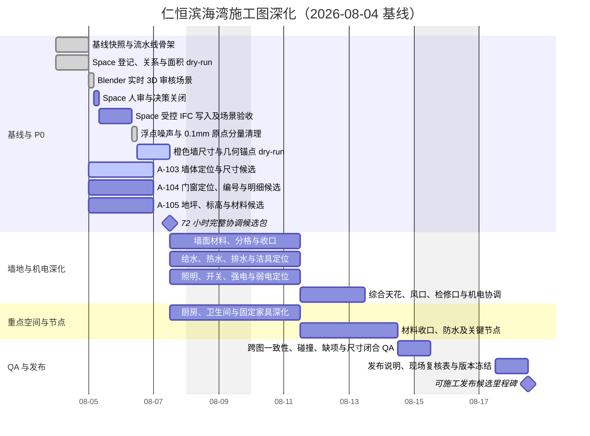

# 仁恒滨海湾装修施工图深化工作管理

> 项目：2504 GBTB Yanlord Zhuhai
> 文档创建时间：2026-08-04
> 数据快照时间：2026-08-05（仅表示下方 IFC 数量、哈希和 QA 结果的采集时间，不是每日计划起点）
> 最近更新时间：2026-08-05 00:06 +08:00
> 目标：以 IFC 为单一几何与已确认语义源，按“自动生成候选—人眼审核—现场/业主确认—机械 QA—受控发布”推进完整装修施工图。
> 本文档只管理工作，不直接授权任何 IFC 写入。

## 1. 当前结论与状态

### 1.1 状态图例

| 状态 | 含义 | 进入下一状态的条件 |
| --- | --- | --- |
| ✅ 已完成 | 已有可追溯产物并通过当前阶段检查 | 仅在源模型或决策变更时重开 |
| 🟡 进行中 | 已有输入和执行人，正在生成或审核 | 产物、证据和停止条件均关闭 |
| ⚪ 未开始 | 尚未进入执行 | 上游依赖完成且输入冻结 |
| 🟠 待业主/现场确认 | 无法由 IFC、IDS 或设计规则可靠决定 | 决策记录含责任人、日期和证据 |
| 🔴 阻塞 | 继续工作会造成猜测、返工或不可验证写入 | 阻塞原因消除并重新跑基线检查 |

### 1.2 当前可验证基线

| 项目 | 当前值 | 状态/风险 |
| --- | --- | --- |
| IFC | `2504 GBTB Yanlord Zhuhai.ifc`，IFC4，SHA-256 `aee3bec85c9edb1264cabe475925626e88a60ebe402bda44bfcb568597c43a05` | ✅ 40 面原始橙色墙已完成机械收口：39 面归整，1 面共享曲线墙登记为受控例外；保存、reload/rebuild 与逐批全模型 QA 通过 |
| 核心对象 | 22 Space、89 Wall、8 Door、11 Window、19 Slab、20 GridAxis、75 Annotation | 🟡 22/22 Space 均为 4 角矩形 Box；楼层关系与面积口径仍待收口 |
| IFC 图纸定义 | Wall Plan、FFL PLAN、Wall Finish Plan、Sanitary Plan、Furniture Plan | ✅ 有基础图；尚非完整施工图发布集 |
| A-103 | `Wall Plan-A103-candidate.svg`，已有 14 条 SVG 尺寸线候选 | 🟡 不是正式 IFC 尺寸注释，须验证尺寸闭合与定位依据 |
| A-104 | 图纸登记为 `not-started` | ⚪ 8 门、11 窗需定位、编号、洞口与明细一致性检查 |
| A-105 | 以 FFL PLAN 为 `baseline-only` | 🟡 地坪语义、标高、材料、排水坡度尚未收口 |
| P0 决策 | `COORD-REVIEW-001`、`COORD-WALL-001`、`SPACE-REL-001`、`SPACE-AREA-001`、`SPACE-REF-001`、`DOOR-ROOM-002`、`FLOOR-SEM-001` 未关闭 | 🟡/🟠 进入相应 IFC 写入或正式出图前必须按各自停止条件处理 |
| 机械 QA | 5 PASS / 1 WARN / 6 BLOCK，当前不可发布 | 🔴 允许生成候选，不允许标记为发布版 |
| 正式尺寸 | IFC 中没有正式 A-103-DIM 尺寸注释 | ⚪ 自动化先生成候选，人审后才决定是否写入 IFC |
| PM 进度（派生） | 20 项中 4 项完成（20%）；C002 与 A-103 进行中；A-105 已有基线 | 第 5 节任务台账是权威状态源 |

已确认且不得误改：

- `1To6gRjrf2nBU5GQuuD8FV` 是客卫门，不是主卧门。
- `3xKBbA2CT9mfby2$MODnzM` 只是主卧门候选；必须完成平面定位和人眼确认后才能修改。
- 已删除的 3 个旧楼梯 Space 决策已实施，不应重新引入。

### 1.3 立即下一步

Space 几何收口和 C001 坐标尾差清理已完成。C002 的墙体施工参数阶段也已机械收口：12 面墙的非整数拉伸深度归整到整数毫米，最大位移 `0.090194 mm`；9 面四点直墙的世界角点、轴线和原点归整，最大位移 `0.513105 mm`；14 面共享曲线墙只做刚体锚点和轴线归整，圆弧采样点保持，最大位移 `0.487059 mm`；漏报的长斜切墙 `322GWgwy5EpfjZYxs3LRoD` 恢复为 `4000×200 mm` 正交墙，最大关联位移 `2.629310 mm`，与两面短墙的完成包围面分别精确闭合到 `x=-200/0`、`x=3800/4000`、`y=4700/4900 mm`。共享 Profile 的不安全改写曾触发非预期变化，已完整撤销并由 760/760 几何指纹证明残留变化为 0。当前全模型 638 个对象 origin 超过 `0.1 mm`，关键红点 90 个（54 Wall、22 Space、7 Door、7 Window）；原始 40 面橙色墙中 39 面已归整，`3hKNxGFpT1NPjsqhFgHhOQ` 因两个洞口会被放大移动 `3.871716 mm` 而登记为受控例外。立即下一步是 **对剩余 90 个关键 origin 做机械锚点分组**；毫米级对齐由机械计算验收，仅在施工尺寸或语义存在多解时转人审。

S001 已交付：26 个 Space 登记表、关系变更预览、面积证据、人审队列和校验清单，均位于 `build/space-dry-run/`。26/26 面积可复算，合计 `113.800063 m²`；但 GrossFloorArea、NetFloorArea 和 Reference 均为 0/26，需要先确定计量口径。

## 2. 数据边界与执行规则

1. **IFC**：只保存几何和已确认语义；每轮只能有一个 IFC 写入者。
2. **IDS**：`pipeline/ids/p0-construction-information.ids` 只描述可机器验证的信息要求，不承载设计选择。
3. **决策表**：无法由 IDS 表达的选择写入清晰的 Markdown/CSV，记录依据、置信度、审核状态和责任人。
4. **派生产物**：候选 SVG/PDF、快照、报告和中间表进入 `build/`；不得覆盖 IFC 源文件。
5. **图纸登记**：图号、名称、状态、来源、版本和发布日期统一由 `pipeline/decisions/drawing-register.csv` 管理。
6. **发布物**：只有通过发布门的不可变版本进入 `releases/`；未关闭项必须写入发布说明，不得隐藏。
7. **IFC 写入回合**：写前冻结哈希和对象清单；写后必须保存、读取磁盘验证、reload/rebuild Blender、恢复验收视图、截图并重跑机械 QA。
8. **禁止猜测**：Space、门窗、地坪、设备、材料和施工语义没有可靠依据时，状态转为“待人审”或“待业主/现场确认”。

## 3. 总体甘特图

基准节奏：48–72 小时形成覆盖全部图纸类别的协调候选包；第 4–10 个高强度工作日完成深化、QA 和带现场复核项的可施工发布候选。若现场关键输入未返回，第 10 日只发布“待复核候选版”，不得冒充最终版。

### 3.1 甘特图使用规则

- 甘特图展示计划日期、依赖和里程碑，是第 5 节 PM 任务台账的排期视图。
- TODO checkbox 和任务元数据是状态的唯一权威来源；两处不一致时以第 5 节为准，并修正甘特图。
- 计划调整只修改计划日期；实际开始和实际完成时间保留在任务台账中，不得被新计划覆盖。

## 4. 自动化、人眼审核与现场决策边界

| 类别 | 应做内容 | 不得越界 |
| --- | --- | --- |
| 自动化 | IFC 快照与对象登记；IDS 校验；房间标注候选；墙体、门洞、洁具、家具和设备定位尺寸候选；门窗/材料/设备明细；图框、图号、版本、图纸索引；批量 SVG/PDF 导出；尺寸闭合、缺项、重复编号、空白区域、文字碰撞和跨图一致性检查；推断依据/置信度/人审标记 | 不得把未审推断写回 IFC；不得自动确认房间、门窗用途、材料和现场条件 |
| Blender 实时审核 | 从当前磁盘 IFC reload/rebuild；恢复可交互 3D 验收视图；用 Workbench 语义色、实体显示、选择高亮和逐项聚焦辅助审核人直接检查空间边界与上下文 | 不生成审核文档或截图包；Blender 不是决策数据库；不得以场景临时状态替代 IFC/决策记录；审核回合不得修改 IFC |
| 人眼审核 | Space 边界与语义；主卧门候选平面定位；门窗洞口关系；材料分格；洁具/家具/设备可用性；图面层级、可读性与节点合理性；专业碰撞处置 | 不要求人眼判断亚毫米对齐；尺寸、正交、接头残差和非预期变化必须机械计算。不得用“看起来合理”代替现场/业主数据 |
| 业主/现场决策 | 权威测量和现状；拆改范围；最终墙体布局；水压、过滤/增压和热水；窗扇开启、锁具和物业限制；燃气表/管线/柜体安全；最终设备型号；材料样板、基层和不可见管线 | 未确认项不得伪装为定案；可先形成带醒目标记的候选及现场复核表 |

每一条自动推断至少记录：`对象/图纸`、`推断结果`、`依据`、`置信度（高/中/低）`、`是否需人审`、`审核结果`、`关联决策 ID`。

### 4.1 Blender 作为实时 3D 审核界面

Blender 是本项目 Space、门窗候选和跨专业碰撞的人眼审核主界面。审核人直接在可交互 3D 视口中旋转、缩放、平移和切换正交视角，以判断空间体量、边界、相邻关系和遮挡；不生成或依赖审核文档、总览截图、局部截图或逐图索引。截图仅保留给 IFC 写入后的机械 QA/可追溯验收，不作为本阶段的人审界面。

#### 实时审核闭环

1. **冻结输入**：记录 Git 状态、IFC SHA-256、schema 和对象数量；若与 dry-run 基线不同，停止并重新生成候选。
2. **恢复场景**：从当前磁盘 IFC reload/rebuild Blender 场景；本步骤只读，不写 IFC。
3. **准备 3D 视图**：操作员显示全部 Space 和 Grid，应用现有语义色与半透明显示，保留墙、门、窗等必要上下文，并把家具保持为黄色或默认隐藏。
4. **逐项聚焦**：操作员一次只高亮并聚焦一个待审对象；审核人无需自己查找对象或 GlobalId。
5. **直接人审**：审核人可自由旋转、缩放、平移或切换顶/前/侧视图，然后回复“确认”“修改为……”或“暂缓/现场确认”。
6. **后台记录**：操作员将结论、依据、审核人、时间和 GlobalId 写入受版本控制的决策记录；CSV 只作为后台状态源，不是人工审核界面。
7. **进入下一项**：审核人回复“下一个”后，操作员恢复正确可见性并高亮下一对象；全部条目关闭后才允许准备 IFC 写入清单。

#### Space 实时审核状态

- 全部 22 个 IfcSpace 显示，按现有 LongName/语义使用对象色并保持可选；视口默认使用 `SOLID` + `OBJECT` color，不使用 Material View，不默认使用 wireframe 或全局 X-ray。
- 20 条 GridAxis 全部显示、可选中并 `show_in_front`；Grid M、Grid 08 及当前待审对象由操作员主动高亮。
- 默认使用透视等轴测总览；审核人可临时切换顶、前、侧正交视图。操作员在每一项开始时主动 `Frame Selected`，不让审核人自行寻找。
- 墙、门、窗和家具默认以实体显示，保持正常 3D 体量判断；家具统一保持黄色。只有实体遮挡导致目标无法审核时，才临时使用半透明、隐藏或 wireframe，并在切换下一项前恢复实体显示。
- 允许临时隐藏遮挡物，但不得移动、重命名、编辑几何或保存 IFC；切换下一项前由操作员恢复标准可见性。

#### 审核人的最短操作说明

- 旋转：按住鼠标中键拖动；平移：`Shift` + 鼠标中键；缩放：滚轮或触控板。
- 聚焦当前对象：小键盘 `.`，或菜单 `View > Frame Selected`；全局视图：`Home`。
- 顶/前/右视图：小键盘 `7` / `1` / `3`；无小键盘时使用 `View > Viewpoint`。
- 只做导航和选择，不进入 Edit Mode，不移动/删除/重命名对象，不点击 IFC 保存。
- 回复格式只需：`确认`、`修改为：<正确名称/边界/关系>`、`暂缓：<需要确认的事项>`，或 `下一个`。

#### 验收与停止条件

| 验收项 | 最低要求 |
| --- | --- |
| 可交互场景 | 22 个 Space、20 条 GridAxis 以及墙/门/窗/家具上下文可见；全部模型使用 Solid View，Space 使用语义对象色，选择高亮可用 |
| 当前审核项 | 目标对象已选中并聚焦；审核人可直接旋转查看，不需要查找对象 |
| 机械基线 | IFC 哈希与 Space/Grid/Wall/Door/Window 数量和 dry-run 一致；场景已从磁盘 IFC 重建 |
| 决策记录 | 每项含确认/修改/暂缓、备注、审核人、审核时间和关联 GlobalId；不要求另写人工 review 文档 |

以下任一情况发生时停止审核：IFC 哈希或对象数量漂移；Space/Grid 不完整；语义色或透明显示无法区分；目标对象未主动高亮/聚焦；审核人被迫自行寻找对象；场景在审核过程中发生未授权 IFC 修改。

## 5. PM 任务台账（唯一状态源）

甘特图只用于查看排期和依赖；本节的 TODO checkbox 是任务完成状态的唯一来源。只有验收产物存在且停止条件未触发时，才把 `[ ]` 改为 `[x]`。

时间统一使用 `YYYY-MM-DD HH:mm +08:00`。历史任务没有准确时刻时，保留日期并标注“具体时间未记录”，不得补猜。状态变化时更新“最近更新”；任务阻塞时保持未勾选并填写阻塞原因。

### P0｜IFC 语义与基础图纸

- [x] **M000｜冻结 IFC、图纸、IDS 与决策基线**
  - 状态/优先级/负责人：✅ 已完成 / P0 / 自动化
  - 时间：添加 `2026-08-04`；计划开始 `2026-08-04`；实际开始 `2026-08-04（具体时间未记录）`；目标完成 `2026-08-04`；实际完成 `2026-08-04（具体时间未记录）`；最近更新 `2026-08-04`
  - 依赖：无
  - 验收产物：IFC 快照、图纸登记、P0 决策表、QA 报告
  - 停止条件：IFC 哈希或 Git 基线发生未知变化

- [x] **S001｜Space 登记、关系与面积 dry-run**
  - 状态/优先级/负责人：✅ 已完成 / P0 / 自动化子任务
  - 时间：添加 `2026-08-04`；计划开始 `2026-08-04`；实际开始 `2026-08-04（具体时间未记录）`；目标完成 `2026-08-04`；实际完成 `2026-08-04（具体时间未记录）`；最近更新 `2026-08-04`
  - 依赖：M000
  - 验收产物：`build/space-dry-run/` 下的 26 个 Space 登记、关系预览、面积证据、53 条人审队列和校验清单；14 项输出校验 PASS
  - 停止条件：数量/GlobalId 不一致；面积无可追溯来源；需要猜测语义

- [x] **S002A｜Blender 实时 3D 审核场景**
  - 状态/优先级/负责人：✅ 已完成 / P0 / Blender 操作员 + 自动化
  - 时间：添加 `2026-08-04 11:27 +08:00`；计划开始 `2026-08-05`；实际开始 `2026-08-04 11:40 +08:00`；目标完成 `2026-08-05`；实际完成 `2026-08-04 11:55 +08:00`；最近更新 `2026-08-04 11:55 +08:00`
  - 依赖：S001；当前磁盘 IFC 与 dry-run 哈希一致
  - 验收产物：Blender 中可交互的 Solid View；22 个 Space、20 条 GridAxis 和墙/门/窗/家具上下文可见；Space 使用语义对象色；合并后的走廊与玄关已选中高亮；对象数量和 IFC 哈希已核对
  - 停止条件：Space/Grid 不完整；语义色或透明显示不清；审核对象需要用户自行寻找；无法自由旋转查看；审核回合发生 IFC 修改

- [ ] **S002｜Space 人审与决策关闭**
  - 状态/优先级/负责人：🟡 进行中 / P0 / BIM + 设计人审
  - 时间：添加 `2026-08-04`；计划开始 `2026-08-05`；实际开始 `2026-08-04 11:55 +08:00`；目标完成 `2026-08-05`；实际完成 `—`；最近更新 `2026-08-04 13:17 +08:00`
  - 依赖：S002A
  - 验收产物：全部 Space 原边界人审已确认；3 个飘窗、走廊和玄关均按重新标记后的同名 Grid Box 合并为 4 角矩形 Box；22/22 Space 均为 Box；待补 `SPACE-REL-001` 及 Gross/Net/Reference 面积口径决定
  - 停止条件：楼层关系或面积口径仍未确认；任一后续拟写入项缺依据、置信度或审核人。几何未严格 Boolean 贴合完成面登记为非阻塞后续 QA 项

- [ ] **S003｜Space 受控 IFC 写入及场景验收**
  - 状态/优先级/负责人：🟡 部分完成 / P0 / 唯一 IFC 写入者
  - 时间：添加 `2026-08-04`；计划开始 `2026-08-06`；实际开始 `2026-08-04 12:28 +08:00`；目标完成 `2026-08-06`；实际完成 `—`；最近更新 `2026-08-04 13:52 +08:00`
  - 依赖：S002；本次同名合并已有用户明确批准；其余写入仍须关闭 S002 并另行批准
  - 验收产物：走廊与玄关语义合并批次已保存，磁盘 SHA-256 `73b515fabd996572b3a31e14220639397ad437f4286416fffac14fa8aa65cceb`；Blender reload/rebuild 后 838 个场景对象、22 Space、20 GridAxis、89 Wall、8 Door、11 Window、89 Furniture；全部 22 个 Space 底面均为 4 角矩形，走廊与玄关实体均可生成；Solid View 已恢复
  - 停止条件：本次保存、reload、数量、形状和可视验收均通过；任务保持未勾选，直至 `SPACE-REL-001` 与面积口径的后续写入和验收完成

- [x] **C001｜浮点噪声与 0.1 mm 原点分量清理**
  - 状态/优先级/负责人：✅ 已完成 / P0 / 唯一 IFC 写入者 + 自动化
  - 时间：添加 `2026-08-04 13:17 +08:00`；计划开始 `2026-08-05`；实际开始 `2026-08-04 14:28 +08:00`；目标完成 `2026-08-05`；实际完成 `2026-08-04 17:25 +08:00`；最近更新 `2026-08-04 17:53 +08:00`
  - 依赖：S003 中的 Space 重新标记与再次合并完成
  - 验收产物：IFC 从 SHA-256 `73b515fabd996572b3a31e14220639397ad437f4286416fffac14fa8aa65cceb` 更新为 `443ff085af96c39dad59e66ad987b2c2b5e93b7753063387b5408744ff55bedc`；166,585 个小于等于 `0.01 mm` 的长度尾数已精确化且再次扫描为 0；63 个关键对象的 72 个原点分量按 `0.1 mm` 阈值归整；IFC4、2,272 个 Root GUID、22 Space、89 Wall、8 Door、11 Window、20 GridAxis 和 89 Furniture 保持；IFC 已保存并 reload/rebuild；126 个剩余关键 origin 标红，40 面墙体尺寸候选标橙
  - 停止条件：清理结果、磁盘哈希、reload 和主要数量已通过；超过 `0.1 mm` 的原点和橙色墙体转入 C002，不得在 C001 中继续自动取整

- [ ] **C002｜施工模度、几何锚点与橙色墙体归整**
  - 状态/优先级/负责人：🟡 40 面橙色墙已机械收口，转入剩余关键 origin 锚点分组 / P0 / 自动化 + 唯一 IFC 写入者；语义多解时才转人审
  - 时间：添加 `2026-08-04 17:53 +08:00`；计划开始 `2026-08-04`；实际开始 `2026-08-04 17:53 +08:00`；目标完成 `2026-08-05`；实际完成 `—`；最近更新 `2026-08-05 00:06 +08:00`
  - 依赖：C001；执行标准 `pipeline/standards/ifc-geometry-normalization.md`
  - 验收产物：40 面原始橙色墙完成分类与收口，39 面已归整、1 面登记为共享曲线受控例外；非整数墙体拉伸深度为 0；四点直墙施工轮廓异常为 0；当前 IFC SHA-256 `aee3bec85c9edb1264cabe475925626e88a60ebe402bda44bfcb568597c43a05`；IFC4、2,272 个 Root GUID、760 个可生成产品几何、74 个既有失败和主要对象数量保持；逐批全模型 QA 均无非预期变化，关系集合保持，Bun 测试 `5/5` 通过
  - 停止条件：剩余 90 个关键 origin 继续按墙、Space、门窗及父子关系机械分组；复杂曲线采样点不得逐点取整，共享 Profile 不得原位改写。只有施工尺寸、锚点或语义存在多解时才停止并请求人审

- [ ] **A103｜新建墙体定位与尺寸候选**
  - 状态/优先级/负责人：🟡 进行中 / P0 / 自动化 + 设计人审
  - 时间：添加 `2026-08-04`；计划开始 `2026-08-05`；实际开始 `已开始（历史时间未记录）`；目标完成 `2026-08-06`；实际完成 `—`；最近更新 `2026-08-04`
  - 依赖：S001、最终墙体布局
  - 验收产物：A-103 SVG/PDF 候选、墙体定位与门洞尺寸链、尺寸闭合报告
  - 停止条件：最终墙体位置未确认；尺寸链不闭合；标注碰撞未清除

- [ ] **A104｜门窗定位、编号与明细候选**
  - 状态/优先级/负责人：⚪ 未开始 / P0 / 自动化 + 设计人审
  - 时间：添加 `2026-08-04`；计划开始 `2026-08-05`；实际开始 `—`；目标完成 `2026-08-06`；实际完成 `—`；最近更新 `2026-08-04`
  - 依赖：S001、A103
  - 验收产物：A-104 SVG/PDF、门窗编号表、洞口/完成面尺寸、跨图核对表
  - 停止条件：主卧门候选未经人眼确认；对象与洞口关系不可靠；编号重复

- [ ] **A105｜地坪、标高与材料候选**
  - 状态/优先级/负责人：🟡 基线已有 / P0 / 自动化 + 设计人审
  - 时间：添加 `2026-08-04`；计划开始 `2026-08-05`；实际开始 `已存在 FFL 基线（历史时间未记录）`；目标完成 `2026-08-06`；实际完成 `—`；最近更新 `2026-08-04`
  - 依赖：S001、材料/标高规则
  - 验收产物：A-105 SVG/PDF、房间材料/标高/坡向表、门槛节点索引
  - 停止条件：`FLOOR-SEM-001` 影响分类且未决；湿区坡向或标高无依据

- [ ] **M072｜完成 72 小时协调候选包**
  - 状态/优先级/负责人：⚪ 未开始 / 里程碑 / 项目负责人
  - 时间：添加 `2026-08-04`；计划开始 `2026-08-06`；实际开始 `—`；目标完成 `2026-08-06`；实际完成 `—`；最近更新 `2026-08-04`
  - 依赖：A103、A104、A105
  - 验收产物：覆盖完整图纸类别的候选包、图纸索引、问题清单和现场复核项
  - 停止条件：缺页、错号、未披露的关键假设或 P0 候选缺失

### P1｜墙地与机电深化

- [ ] **WFIN｜墙面材料、分格与收口**
  - 状态/优先级/负责人：⚪ 未开始 / P1 / 设计 + 自动化
  - 时间：添加 `2026-08-04`；计划开始 `2026-08-07`；实际开始 `—`；目标完成 `2026-08-10`；实际完成 `—`；最近更新 `2026-08-04`
  - 依赖：A103、材料表、M072
  - 验收产物：墙面索引、立面编号、材料分格、阴阳角/门窗收口索引
  - 停止条件：材料样板或分格原则未确认；立面与平面不一致

- [ ] **PLUM｜给水、热水、排水与洁具定位**
  - 状态/优先级/负责人：⚪ 未开始 / P1 / 机电 + 设计
  - 时间：添加 `2026-08-04`；计划开始 `2026-08-07`；实际开始 `—`；目标完成 `2026-08-10`；实际完成 `—`；最近更新 `2026-08-04`
  - 依赖：A105、洁具定位、现场条件、M072
  - 验收产物：P-201/P-202 候选、点位标高、管径/坡度/检修说明
  - 停止条件：水压、过滤增压、热水或排水条件影响系统且未确认

- [ ] **ELEC｜照明、开关、强电与弱电定位**
  - 状态/优先级/负责人：⚪ 未开始 / P1 / 电气 + 设计
  - 时间：添加 `2026-08-04`；计划开始 `2026-08-07`；实际开始 `—`；目标完成 `2026-08-10`；实际完成 `—`；最近更新 `2026-08-04`
  - 依赖：家具/设备布置、M072
  - 验收产物：E-301～E-304 候选、回路/控制/网络点位表
  - 停止条件：设备功率、控制逻辑或 Wi-Fi/有线方案不明确

- [ ] **RCP1｜综合天花与机电协调**
  - 状态/优先级/负责人：⚪ 未开始 / P1 / 设计 + 多专业
  - 时间：添加 `2026-08-04`；计划开始 `2026-08-11`；实际开始 `—`；目标完成 `2026-08-12`；实际完成 `—`；最近更新 `2026-08-04`
  - 依赖：ELEC、PLUM、暖通输入
  - 验收产物：A-106/M-401 候选、灯/风口/消防/传感器/检修口综合图和碰撞报告
  - 停止条件：天花标高或设备净空不明；硬碰撞未关闭；检修不可达

### P2｜重点空间、节点与发布

- [ ] **INT1｜厨房、卫生间与固定家具深化**
  - 状态/优先级/负责人：⚪ 未开始 / P2 / 室内设计 + 机电
  - 时间：添加 `2026-08-04`；计划开始 `2026-08-07`；实际开始 `—`；目标完成 `2026-08-10`；实际完成 `—`；最近更新 `2026-08-04`
  - 依赖：A103、A104、A105、设备表、M072
  - 验收产物：I-501～I-504 候选、关键尺寸、五金/设备/检修空间和点位—家具一致性表
  - 停止条件：电器型号、燃气、水电接口或人体工学关键尺寸未确认

- [ ] **DET1｜材料收口、防水与关键节点**
  - 状态/优先级/负责人：⚪ 未开始 / P2 / 设计 + 现场技术
  - 时间：添加 `2026-08-04`；计划开始 `2026-08-11`；实际开始 `—`；目标完成 `2026-08-13`；实际完成 `—`；最近更新 `2026-08-04`
  - 依赖：WFIN、A105、INT1
  - 验收产物：D-601/D-602、节点索引、材料交接、防水做法和构造未决项清单
  - 停止条件：构造层总厚度不闭合；防水/排水路径中断；节点与平立剖矛盾

- [ ] **QA01｜全套机械 QA 与联合人审**
  - 状态/优先级/负责人：⚪ 未开始 / 发布门 / 自动化 + 联合审图
  - 时间：添加 `2026-08-04`；计划开始 `2026-08-14`；实际开始 `—`；目标完成 `2026-08-14`；实际完成 `—`；最近更新 `2026-08-04`
  - 依赖：RCP1、DET1、WFIN、PLUM
  - 验收产物：尺寸闭合、缺项、重复编号、空白、文字碰撞和跨图一致性统一 QA 报告
  - 停止条件：存在未分派 BLOCK；同一对象跨图编号/尺寸冲突；待确认项未醒目标记

- [ ] **REL1｜发布候选与现场复核包**
  - 状态/优先级/负责人：⚪ 未开始 / 发布门 / 项目负责人
  - 时间：添加 `2026-08-04`；计划开始 `2026-08-17`；实际开始 `—`；目标完成 `2026-08-17`；实际完成 `—`；最近更新 `2026-08-04`
  - 依赖：QA01
  - 验收产物：SVG/PDF/DXF、图纸索引、版本与校验清单、发布说明、现场复核表和回退依据
  - 停止条件：任一发布级 BLOCK；版本不一致；源哈希缺失；未决项未披露；输出损坏或空白

- [ ] **MREL｜可施工发布候选里程碑**
  - 状态/优先级/负责人：⚪ 未开始 / 里程碑 / 项目负责人 + 签发人
  - 时间：添加 `2026-08-04`；计划开始 `2026-08-17`；实际开始 `—`；目标完成 `2026-08-17`；实际完成 `—`；最近更新 `2026-08-04`
  - 依赖：REL1；五道发布门全部通过
  - 验收产物：不可变发布候选、签发记录、现场复核项和源文件校验值
  - 停止条件：关键现场/业主项未披露；签发或归档证据不完整

### 任务台账操作规则

1. 新增任务：分配唯一 ID，填写添加时间、优先级、负责人、依赖、目标完成、验收产物和停止条件。
2. 开始任务：保持 `[ ]`，把状态改为“🟡 进行中”，填写实际开始时间和最近更新时间。
3. 阻塞任务：保持 `[ ]`，把状态改为“🔴 阻塞”，在停止条件后补充阻塞原因、责任人和下次复核时间。
4. 完成任务：确认产物和证据存在，填写实际完成时间，把 checkbox 改为 `[x]`；只完成一部分时不得勾选。
5. 计划变化：更新计划开始/目标完成和甘特图，并在最近更新时间后简述变更原因；不得覆盖实际时间。
6. 待业主/现场确认：保持 `[ ]`，状态用“🟠 待确认”，同步更新第 6 节责任分流表。

## 6. 待确认事项与责任分流

| 事项 | 当前处理 | 决策责任 | 影响图纸 | 未确认时允许的动作 |
| --- | --- | --- | --- | --- |
| 权威测量、现状与拆改范围 | 🟠 待确认 | 现场/业主/设计 | A-101/A-102/A-103、全专业 | 标记假设，生成候选，不发布最终尺寸 |
| 最终墙体布局 | 🟠 待确认 | 设计/业主 | A-103 及所有下游图 | 保留尺寸候选和变更影响清单 |
| Space 关系 `SPACE-REL-001` | 🟡 待人审 | BIM/设计 | 房间标注、明细、全专业 | 只读 dry-run，不写 IFC |
| 主卧门候选 `3xKBbA2CT9mfby2$MODnzM` | 🟡 待人眼定位 | 设计 | A-103/A-104/灯控 | 保持候选状态，不改语义 |
| 地坪语义 `FLOOR-SEM-001` | 🟡 待人审 | 设计/BIM | A-105、墙地收口、明细 | 生成分类预览，不写正式语义 |
| 水压、过滤/增压、热水 | 🟠 待确认 | 现场/业主/机电 | P-201/P-202、厨卫家具 | 预留方案位和比较表，不锁定系统 |
| 窗扇开启、锁具、物业限制 | 🟠 待确认 | 物业/业主/现场 | A-104、立面、窗边节点 | 保留现状对象，标注复核 |
| 燃气表、管线、柜体安全 | 🟠 待确认 | 燃气/现场/设计 | I-501、P/E、节点 | 不锁定柜体开孔和密闭方式 |
| 最终电器/洁具型号 | 🟠 待确认 | 业主/设计 | P/E、厨卫、固定家具 | 采用参数包络并标注待定 |
| 材料样板、基层与现场厚度 | 🟠 待确认 | 设计/现场/供应商 | A-105、WFIN、D-601/D-602 | 做构造候选，不发布最终收口尺寸 |

## 7. QA 与发布门

只有以下五道门全部通过，图纸才可从“候选”升级为“发布候选”；最终版还需关闭现场复核项。

1. **内容门**：图纸索引中的应交图全部存在；图框、项目名、图号、比例、日期、版本和责任信息完整。
2. **尺寸门**：总尺寸—分尺寸—洞口/设备定位可闭合；尺寸依据明确；无自相矛盾的跨图数字。
3. **专业门**：建筑、墙地、给排水、强弱电、天花、暖通、厨卫和固定家具之间无未处置硬碰撞。
4. **图面门**：无异常空白、越界、乱码、重复编号、不可读文字、严重标注碰撞或错误线型/填充。
5. **追溯门**：源 IFC 哈希、IDS 结果、决策表版本、机械 QA、人工审核和现场复核项均可追溯；SVG/PDF/DXF 可打开且内容一致。

发布状态只能使用：

- `candidate`：自动化或人工候选，禁止施工。
- `reviewed-candidate`：已完成人审，但仍有现场/业主项。
- `construction-release-candidate`：机械与人工发布门通过，现场复核项显式附带。
- `construction-release`：现场/业主关键项关闭并完成最终签发。

## 8. 更新节奏

- 任务创建时：填写 ID、添加时间、负责人、依赖、目标时间、验收产物和停止条件。
- 任务开始/阻塞/完成时：立即更新 checkbox、状态、实际时间、最近更新时间和证据路径。
- 每次 roadmap 复盘：校对任务台账与甘特图的依赖和日期；任务台账状态优先。
- 每个 IFC 修改回合：执行保存—磁盘验证—reload/rebuild—正确验收视图—截图—机械 QA 的完整闭环。
- 每个里程碑：更新图纸登记、版本清单、发布说明和现场复核表；禁止用口头结论替代决策记录。

## 9. 本计划依据

- `2504 GBTB Yanlord Zhuhai.ifc`
- `drawings/滨海湾施工图纸检查清单.md`
- `drawings/滨海湾深化设计注意事项.md`
- `pipeline/README.md`
- `pipeline/decisions/drawing-register.csv`
- `pipeline/decisions/p0-review.csv`
- `pipeline/ids/p0-construction-information.ids`
