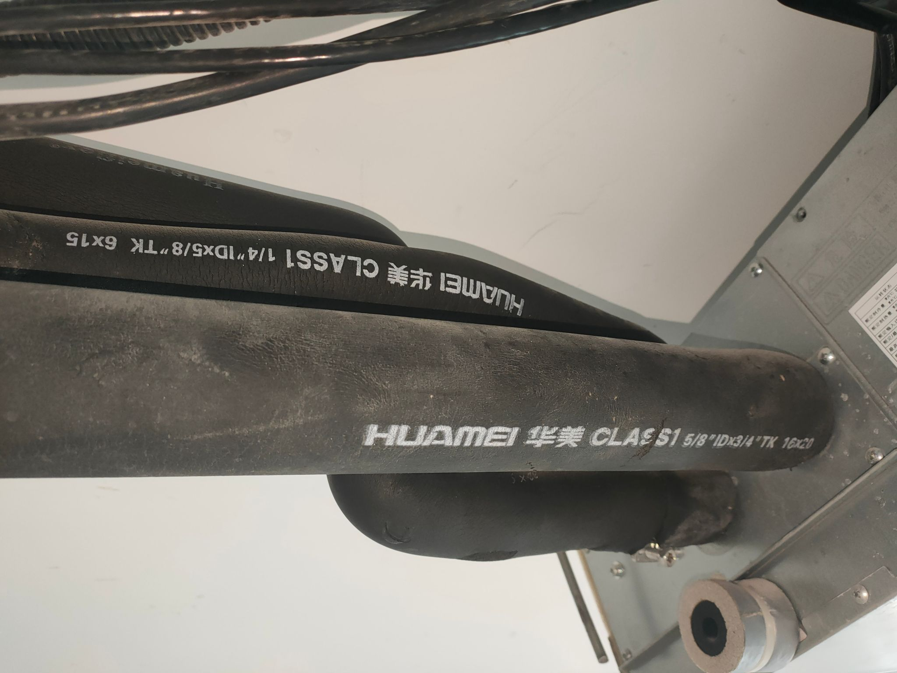
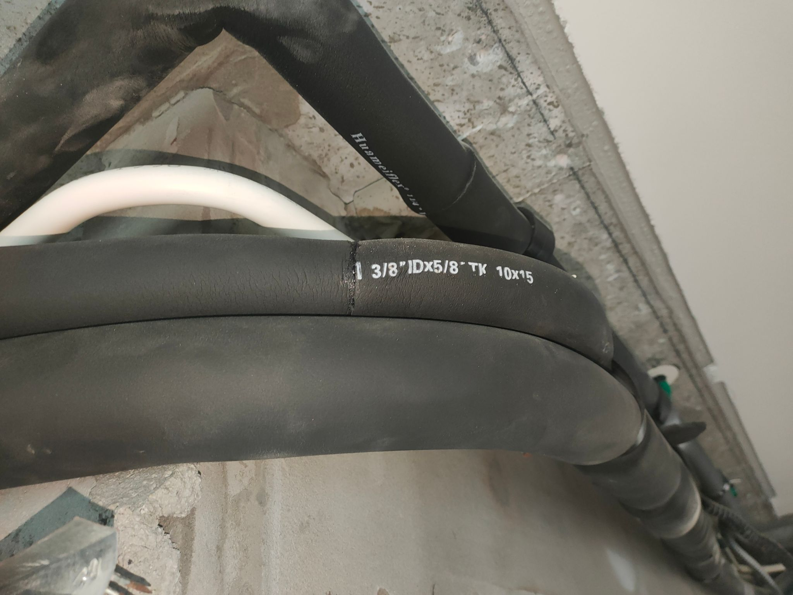
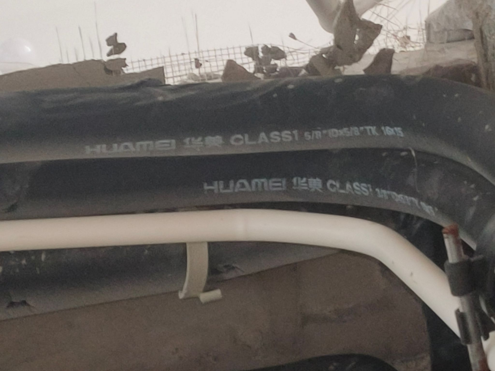
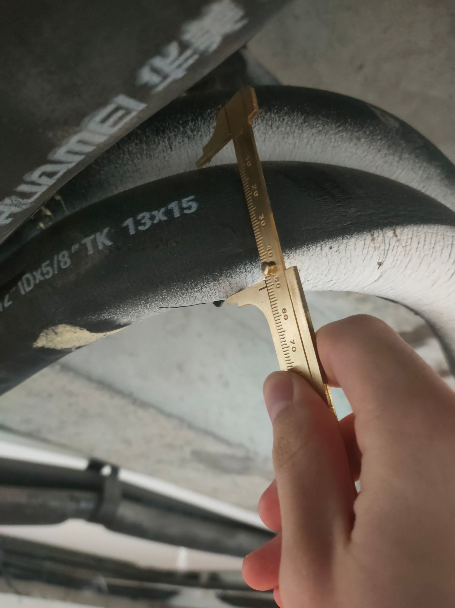
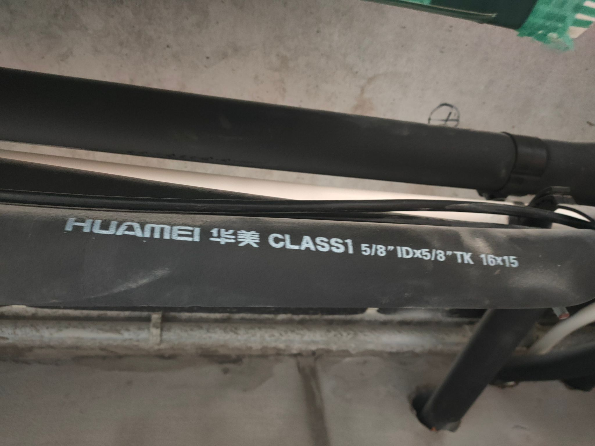
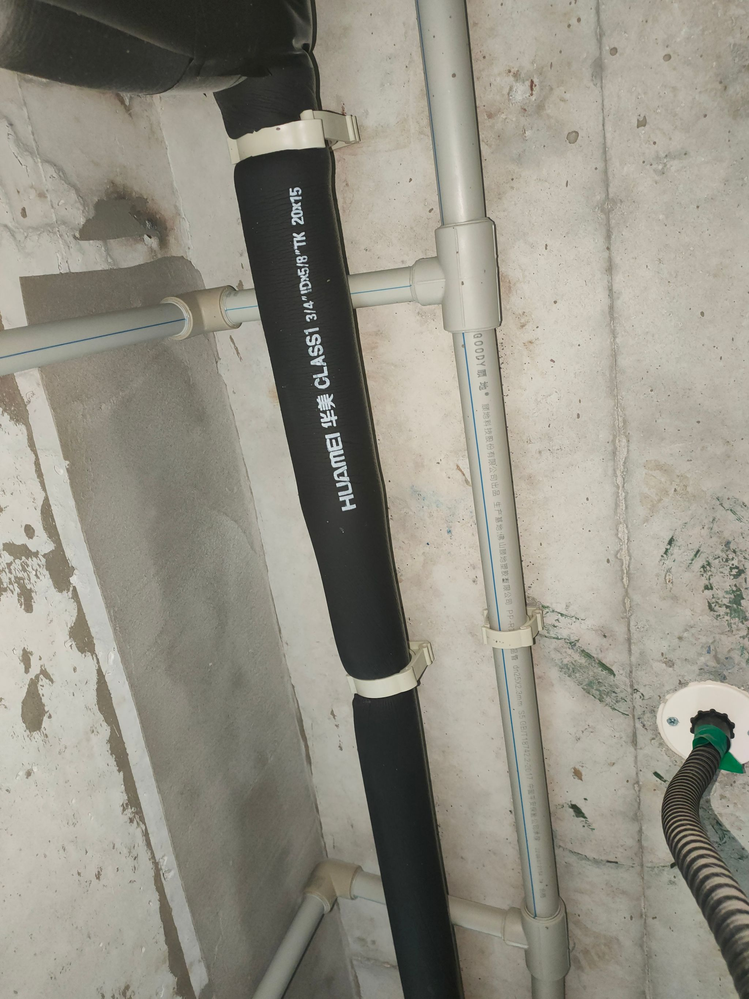
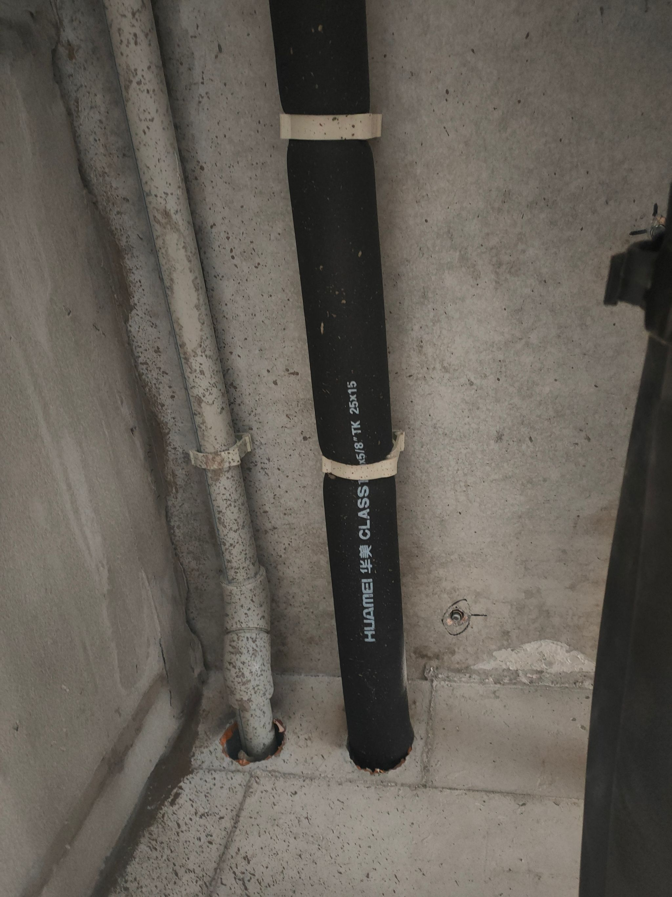
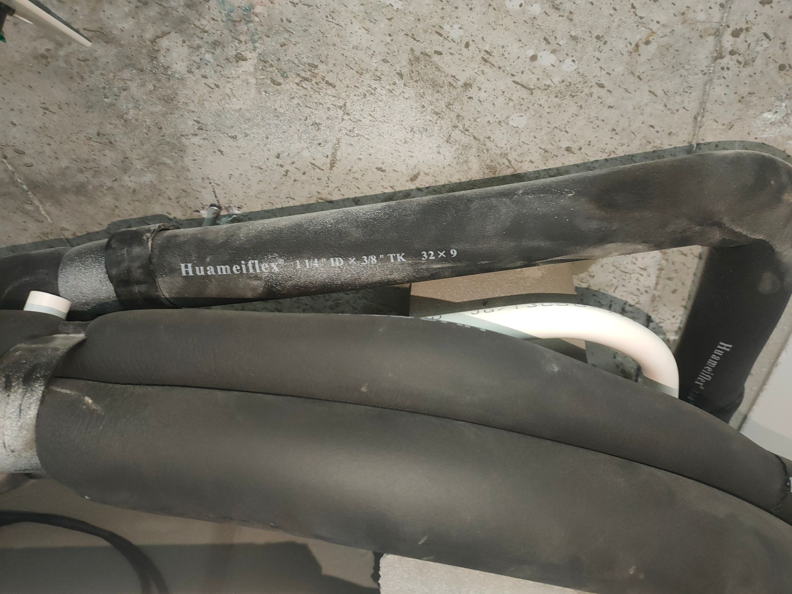
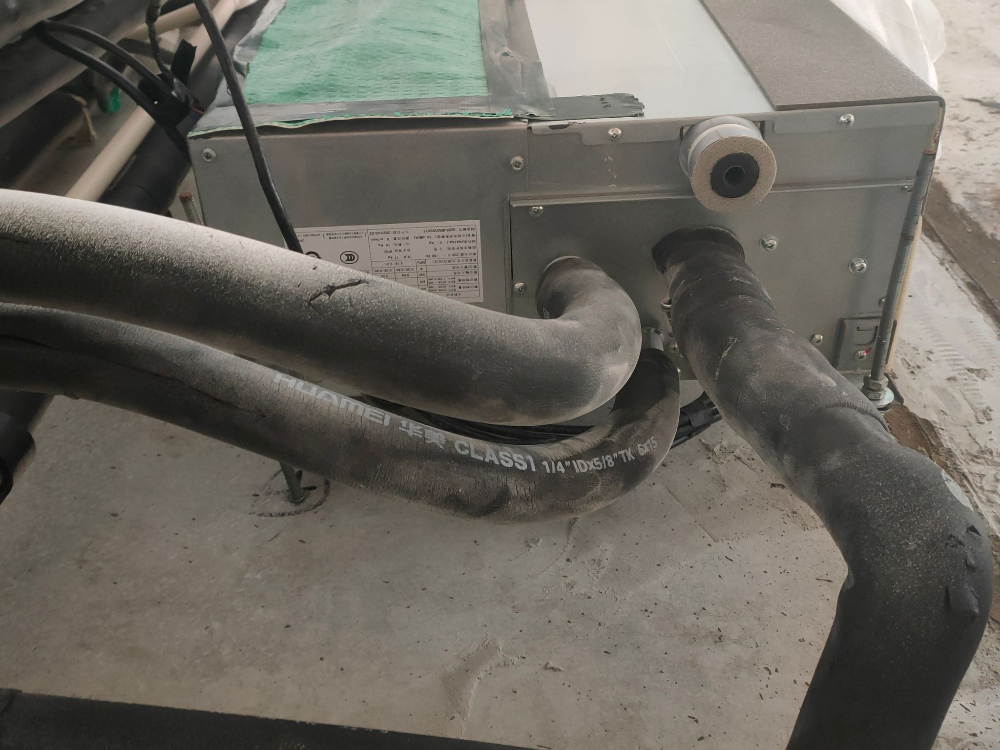

# 日立空调项目结论与施工复核表

> 发送给：日立技术人员、空调安装方。
>
> A01～A06 是项目机位编号，不是产品型号。业主已确认项目所用室内机和 PC-P1HEQ 面板均为开发商随精装交付的既有设备，不再做产品选型。本表先把项目已经确认的型号、保温管、路线原则和检修做法写清楚；项目完成 M-401／RCP1／E-302 后，外部单位只按图复核和提交竣工记录。业主不用填写；日立技术人员和安装方只回复第五部分。当前照片只拍到 3 台室内机的铭牌，另有 2 台实物因遮挡无法拍到铭牌；照片覆盖范围不得写成“全部机组已逐台拍照核验”。

## 一、项目已经确定，不用回复

| 项目 | 已确定做法 | 依据／状态 |
| --- | --- | --- |
| 设备采购状态 | A01～A06 所用设备均按开发商随精装交付的既有日立系统处理，不是候选，也不需要厂家重新选型。 | “开发商交付”来自业主确认。2026-08-19 Notion 照片只拍到 3 台铭牌，另有 2 台因遮挡未拍；照片不是全部机位的逐台采购／安装证明。 |
| A01／A04 | `RPIZ-22FSLN5QD/P`，机身 `700×447×192 mm`；采用正式 IFC 中 QD 接管方向。 | 业主历史确认＋正式 IFC 现有建模关系；设备已由开发商交付。 |
| A02／A03 | `RPIZ-22FSLN5QDF/P`，机身 `700×447×192 mm`；QDF 与 QD 接管侧互为镜像，正式 IFC 已按这组关系建模，后续不得把四台统一成同一接管侧，也不得再次镜像。 | 业主明确确认正式 IFC 的镜像关系正确；设备已由开发商交付。 |
| 现场铭牌新增证据 | 业主实际拍到 3 台室内机铭牌，可清楚读到 `RPIZ-71FSLN5QD/P`、`RPIZ-32FSLN5QD/P`、`RPIZ-28FSLN5QD/P`。其中 71 型关闭 A05 原来缺少 QD 后缀的问题；28 型和 32 型照片没有拍到房间或 A 编号，先作为既有实物库存，不擅自绑定机位。另有 2 台实物被遮挡，当前无法拍到铭牌。 | 2026-08-19 Notion 现场照片；3 张铭牌已逐张放大复核。未拍到的 2 台保持“型号未由照片逐台核验”，不要求业主强行拆遮挡补拍。 |
| 官方型号覆盖 | P02010Q 封面明确覆盖 18～71 容量段的 `RPIZ-…FSLN5QD(/P)` 与 `RPIZ-…FSLN5QDF(/P)`，因此上述 22／28／32／71 型均在同一本官方安装说明书范围内。 | 日立 P02010Q 第 1 页。 |
| 18～50 型冷媒及排水裸管 | 气管外径 `12.7 mm（1/2"）`；液管外径 `6.35 mm（1/4"）`；冷凝水采用外径 `32 mm` 的 VP25 PVC 管。 | P02010Q 图 5.2、图 6.1。说明书未给出的接口中心坐标继续记为“未提供”，不猜数。 |
| 56 型冷媒裸管 | 气管外径 `15.88 mm（5/8"）`；液管外径 `6.35 mm（1/4"）`。 | P02010Q 图 5.2。 |
| 63～71 型冷媒裸管 | 气管外径 `15.88 mm（5/8"）`；液管外径 `9.53 mm（3/8"）`；冷凝水仍为外径 `32 mm` VP25。 | P02010Q 图 5.2、图 6.1。 |
| 现场保温产品 | 既有保温套为华美 `HUAMEI／Huameiflex CLASS1` 橡塑管。厂家页给出：0℃ 平均温度导热系数 `≤0.034 W/(m·K)`；燃烧性能 B1、氧指数 `≥32%`、烟密度 `≤75`；建筑使用燃烧等级按 `GB 8624-2012` 不低于 C 级。 | P02010Q 只要求采用现场提供的保温管，本身没有给材料、导热系数、防火等级或厚度；这些现由现场管套印字和华美 Class 1 官方产品页补齐，不再说成“日立随机配固定厚度”。 |
| 保温规格读法 | `ID` 是保温套内径，用来匹配裸铜管外径；`TK` 是单边保温壁厚。例：`1/2" ID × 3/8" TK` 表示套住约 1/2 英寸裸管、单边约 3/8 英寸厚，完成外径约为 `1/2 + 2×3/8 = 1 1/4 英寸`，不是“1/2 英寸厚”。 | 业主补充的产品标注释义；与现场 `13×9` 毫米印字一致。 |
| 冷凝水路线 | 由项目机电图画出排水方向、接入点和支吊架，连续坡度保持 `1/100～1/25`，不得倒坡。 | P02010Q。施工方不替项目决定路线；完工后逐个记录管箍／支吊点标高，用实测标高差验收坡度。 |
| 检修方式 | 可拆卸回风口同时作为检修口，不再另开独立装饰检修口。回风口必须能拆洗过滤网、到达电控箱并满足整机检修／抽出。 | 业主决定；项目平面和剖面负责落实净开口与拆机路线。 |
| 空调面板 | 保留开发商原配 `PC-P1HEQ`。它正在既有日立系统中使用，不再问“是否兼容”。 | 现场既有条件＋业主决定。官方说明书：一只面板最多控制 6 台室内机；控制线两芯、至少 `1P-0.75 mm²`；与电源线至少相距 `300 mm`，不足时单独穿接地金属管。 |
| 五个控制点 | 每个点控制哪台／哪组机器，哪些保留、移动或合并，由业主和项目设计决定并画入 E-302；不交给厂家代选。 | 业主决定事项。安装方只按发出的接线图施工并提交实际端子和线长记录。 |

## 二、六个机位采用什么

| 机位 | 项目结论 | 只剩什么 |
| --- | --- | --- |
| A01、A04 | 开发商已交付 `RPIZ-22FSLN5QD/P`；`700×447×192 mm`；气管 `12.7 mm`、液管 `6.35 mm`、排水管外径 `32 mm`；采用正式 IFC 中 QD 方向。 | 项目出 M-401／RCP1 后，由日立和安装方按图复核。 |
| A02、A03 | 开发商已交付 `RPIZ-22FSLN5QDF/P`；尺寸、管径同上；采用正式 IFC 中与 QD 互为镜像的 QDF 方向。 | 项目出 M-401／RCP1 后，由日立和安装方按图复核。 |
| A05 | 现场铭牌确认 `RPIZ-71FSLN5QD/P`，不再是候选。机身 `1180×447×192 mm`；吊杆中心 `1220×410 mm`；气管 `15.88 mm`、液管 `9.53 mm`、排水管外径 `32 mm`；通过可拆卸回风口检修。 | 项目按 P02010Q 画出接口方向、风口、路线和检修净空后复核。接口中心坐标仍按官方图，不自行编数。 |
| A06 | 机位已经确定，设备也按开发商交付的既有系统处理。Notion 照片另确认现场存在 `RPIZ-32FSLN5QD/P` 与 `RPIZ-28FSLN5QD/P`，但照片没有房间／A 编号；另外 2 台实物因遮挡无法拍铭牌，现阶段不能凭现有照片判断哪台就是 A06。 | 不要求业主现在拆遮挡补拍。待施工开放遮挡或检修条件形成时，由安装方在同一组记录中拍“房间／机位环境＋铭牌”，项目内部再绑定 A06；不让厂家重新选型。28／32 型的官方裸管均为气管 `12.7 mm`、液管 `6.35 mm`、排水管外径 `32 mm`。 |

## 三、现场实际拍到的保温管规格

照片中有些文字倒置或反向，以下已经按正常阅读方向复核。毫米印字是“内径 × 单边壁厚”；名义完成外径按 `ID + 2×TK` 计算。该表证明现场不止一种厚度，不能再把所有冷媒管统一写成 15 mm。

| 管套印字 | 毫米对应 | 名义完成外径 | 现场照片（点击可打开原图） | 目前能证明什么 |
| --- | ---: | ---: | --- | --- |
| `1/4" ID × 5/8" TK` | `6×15 mm` | `36 mm` |  照片 P06；这行印字倒置，按旋转 180° 后读取。 | 现场存在适配 1/4 英寸裸管、15 mm 壁厚的套管。 |
| `3/8" ID × 5/8" TK` | `10×15 mm` | `40 mm` |  照片 P04。 | 现场存在适配 3/8 英寸裸管、15 mm 壁厚的套管。 |
| `1/2" ID × 3/8" TK` | `13×9 mm` | `31 mm` |  照片 P02；与下一种规格同框。 | 现场存在适配 1/2 英寸裸管、约 9 mm 壁厚的套管。 |
| `1/2" ID × 5/8" TK` | `13×15 mm` | `43 mm` |  照片 P14。 | 现场存在适配 1/2 英寸裸管、15 mm 壁厚的套管。 |
| `5/8" ID × 3/8" TK` | `16×9 mm` | `34 mm` |  照片 P02；与上一种 9 mm 壁厚规格同框。 | 现场存在适配 5/8 英寸裸管、约 9 mm 壁厚的套管。 |
| `5/8" ID × 5/8" TK` | `16×15 mm` | `46 mm` |  照片 P13。 | 现场存在适配 5/8 英寸裸管、15 mm 壁厚的套管。 |
| `5/8" ID × 3/4" TK` | `16×20 mm` | `56 mm` |  照片 P06；与 6×15 mm 规格同框。 | 现场存在适配 5/8 英寸裸管、20 mm 壁厚的套管。 |
| `3/4" ID × 5/8" TK` | `20×15 mm` | `50 mm` |  照片 P01。 | 现场存在适配 3/4 英寸管、15 mm 壁厚的套管。 |
| `1" ID × 5/8" TK` | `25×15 mm` | `55 mm` |  照片 P17。 | 现场存在适配 1 英寸管、15 mm 壁厚的套管。 |
| `1 1/4" ID × 3/8" TK` | `32×9 mm` | `50 mm` |  照片 P07。 | 现场存在适配约 32 mm 管、约 9 mm 壁厚的套管。 |
| `1 1/4" ID × 5/8" TK` | `32×15 mm` | `62 mm` |  照片 P19。 | 现场存在适配约 32 mm 管、15 mm 壁厚的套管；可用于核对 VP25 冷凝水保温完成外径。 |

这些照片只证明现场产品和规格存在。照片没有逐根对应 A01～A06，也没有证明所有接缝、弯头和破损处都连续保温；项目图仍须逐段标注裸管、套管规格和完成外径，现场按图复核。

### 华美官方页列出的主要标准

- 密度：`GB/T 6343`；
- 氧指数：`GB/T 2406`；烟密度：`GB/T 8627`；建筑材料燃烧性能：`GB 8624-2012`；
- 导热系数：`GB/T 10294`；水蒸气透过性能：`GB/T 17146-1997`；真空吸水率与使用温度：`GB/T 17794-2008`；
- 尺寸稳定性：`GB/T 8811`；抗裂：`GB/T 10808`；压缩回弹：`GB/T 6669-2001`；抗臭氧：`GB/T 7762`；老化：`GB/T 16259`。

## 四、施工开放遮挡后补位置对应

这一步不是现在要求业主补拍，也不是重新选型。现有照片只覆盖 3 台铭牌，另 2 台因遮挡无法拍到。待吊顶、柜体或其他遮挡在施工中正常开放时，由安装方为被遮挡机组补拍：一张包含房间／机位环境，一张贴近拍清同一台机器铭牌。项目收到带位置关系的记录后再绑定机位并完成 M-401／RCP1；在此之前不从 28 型、32 型或其他型号中猜 A06。

## 五、外部单位只做施工复核和竣工记录

以下内容必须等项目发布带图号、修订号和日期的 M-401／RCP1／E-302 后再发送。日立和安装方不得用文字另起路线、检修或控制方案。

| 编号 | 现在请你做什么 | 由谁回答 | 请在这里回复 |
| --- | --- | --- | --- |
| R01 | 项目图已画清每台实物型号、裸管与保温完成外径、冷凝水路线和坡度、回风口检修方式、五个面板分组及控制接线；请复核能否按图施工。 | 日立技术人员／安装方 | 可以按图施工 □　有冲突 □；项目图号／修订：________；冲突已圈图 □；位置／限制：________。不得另画一套方案。 |
| R02 | 完工后提交竣工记录：实际室内机型号、逐段冷媒与排水管套规格、每个管箍／支吊点标高、相邻点距离和坡度、实际端子号及线长，并附压力／真空／排水试验和检修照片。 | 安装方 | 竣工图号：________；试验记录编号：________；照片文件名：________。 |

## 六、不再重复询问的内容

- 不再问六台设备是否已经采购：均为开发商随精装交付的既有设备。
- 不再让日立重新选择 A05：铭牌已确认 `RPIZ-71FSLN5QD/P`。
- 不再让日立替项目选择 A06，也不要求业主现在拆遮挡补拍：等施工正常开放遮挡后，由安装方补机位与铭牌对应记录。
- 不再问“日立统一配多少厚的保温棉”：保温管由现场提供，既有产品为华美 Class 1，实际规格见第三部分。
- 不再让安装方决定冷凝水怎么走：项目画图，安装后按每个管箍／支吊点标高验收。
- 不再另设检修口：回风口就是检修口。
- 不再问 PC-P1HEQ 是否兼容：它是开发商原配面板。
- 不再让厂家决定五个控制点如何分组：这是业主和项目设计决定。

## 七、可点击资料

- [2026-08-19 现场铭牌与保温管照片（Notion）](https://app.notion.com/p/weihanshen/3c1fda08ab6c80bb9c3af2dea8411222?source=copy_link)
- [华美 Class 1 橡塑保温官方产品与标准](https://www.huameiworld.com/rubber-foam/class-1-rubber-foam.html)
- [业主提供的华美保温管淘宝商品页](https://item.taobao.com/item.htm?id=678707645061)
- [日立 P02010Q 安装资料](../../../drawings/evidence/HITACHI-P02010Q.pdf)
- [日立 P01530Q 产品资料](../../../drawings/evidence/HITACHI-P01530Q.pdf)
- [项目原保温证据边界记录](../../../drawings/evidence/RCP1-HITACHI-保温厚度证据边界-20260818.md)
- [PC-P1HEQ 官方说明书 P02037Q](../../../drawings/evidence/HITACHI-PC-P1HEQ-P02037Q-official.pdf)
- [PC-P1HEQ 操作指导 H5](https://ux1p2b.epub360.com.cn/v2/manage/book/tphoih/)
- [M-401 空调协调图](../../../drawings/M-401-hvac-safety-coordination-candidate.svg)
- [E-302～E-304 控制面板与弱电协调图](../../pdf/E-302-E-304-control-network-candidate.pdf)

回复单位／人：________________

回复日期：________________
