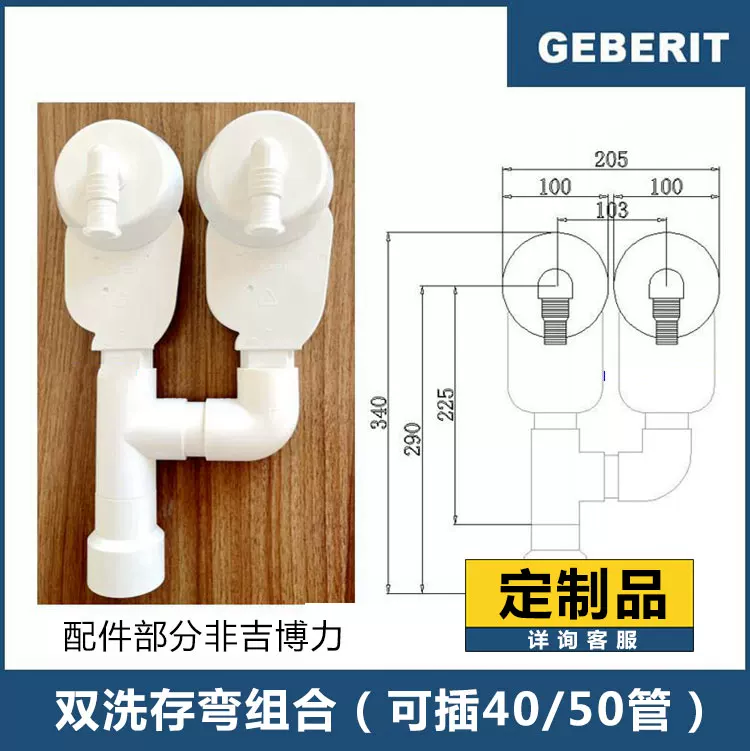

# 给排水设备项目结论与施工复核表

> 发送给：西门子售后、洁具／地漏供货方、给排水施工方和柜体方。
>
> 项目做法已经写在第一部分，不要再向业主重复询问。准确货号、兼容性和官方安装资料属于项目出图前必须取得的产品输入；安装位置、管线、柜体和检修问题必须由项目先画入 I-501／I-502／I-503／P-201／E-303，再交外部单位按图复核。说明书没有的接口中心坐标保持 `unknown`，不得按经验填写。

## 一、项目已经确定，不用回复

| 项目 | 已确定做法 | 依据／状态 |
| --- | --- | --- |
| 洗烘组合 | `WG54M7D20W` 洗衣机在下，`WQ55M7U20W` 热泵干衣机在上；采用 `WTZ27510` 带抽板连接件方向。中厨柜门为蝴蝶门，必须能把两台机器整组拉出。 | 业主决定。连接件是项目采用方向，最终仍以两台实物 E-Nr.／FD 的西门子书面兼容结论为准。 |
| 洗烘供电 | 一个洗衣区独立 C16 RCBO、2.5 mm² 铜线；两个相互独立、侧置可检修的 10A 接地插座。插座不放在机器正后方，不用排插。 | 洗衣机 1900 W、干衣机 800 W，同时运行约 2700 W／12.3 A。两个插头不等于两个 16A 插座或两个回路。 |
| 洗烘给排水 | 洗衣机和热泵干衣机各用一只独立存水弯，在存水弯下游再合流；冷水阀、两路排水接口和合流检修均放在侧面检修格，不放机器正后方。采购候选改为淘宝商品 `703917654224` 的“**双存水弯组合**”，SKU `5125125938318`。 | 业主提供新链接；2026-08-20 已登录读取商品页。商家为“良舍高端进口卫浴”，不是吉博力官方旗舰店。SKU 图片标注约 `205 mm` 总宽、`340 mm` 总高、可插 `40/50` 管，同时明确写着“定制品、配件部分非吉博力”。因此它是项目优先深化候选，不是全套原厂件、不是已采购，也不能仅凭商品图开孔。 |
| Sigma01 面板 | `115.770.11.5`，白色亮面、双冲、正面操作，`246×164×13 mm`；项目需 2 件，目前到货 1 件。面板同时是水箱正面检修入口。 | Geberit 官方目录＋到货记录。只缺第二件到货和项目立面定位。 |
| Duofix Sigma | 保留 `224.212.00.2` 隐蔽水箱支架，项目需 2 件，目前到货 1 件；约 `500×1120×120 mm`。 | 业主决定＋到货记录。旧排水组件不再投影到当前方案。 |
| Geberit Nuna V Combo 智能壁挂坐便器 | `146.361.00.1` 是整套产品货号，已经到货；包装标签同时确认电子部件 `245.963.00.1` 和陶瓷体 `245.964.00.1`。采用即热、暖风、遥控以及水管／电线全隐藏做法。 | 到货单、两个包装标签及吉博力官方产品族页面。准确安装接口必须来自该货号安装图，不借用其他 Nuna 型号。 |
| 旧 Geberit 组件 | `152.464.00.1`、`154.150.00.1`、`388.013.00.2`、`154.446.KS.1` 当前方案不采用；采购／收货记录仅作历史证据。 | 业主决定。不采用不等于未购买。 |
| 淋浴区地漏 | 两个淋浴区均采用指定商家的“水母地漏／中央集水器＋托克乐思网＋线性排水渠”；毛发过滤件须能从完成面上方取出。 | 业主决定。定制方向已定，产品尺寸、排水能力、防水法兰和坡度仍以项目加工图为准。 |
| 600 mm 石材盆 | SAN-022 为 600 mm 模数 Travertino titan marble 定制石材盆；盆下做抽拉式垃圾桶及海绵／清洁用品收纳。盆体净尺寸、排水／溢水、支撑、抽拉结构和检修包络由项目在 I-501 平面、剖面及节点中设计。 | 业主决定＋项目设计任务；Molteni Eco kits 只作功能参考。石材、柜体和给排水方不得替项目决定布局或接口中心。 |
| WS7FSB0C1C 管路 | 随机管已由官方说明书明确：白色 3/8 英寸 PE 进水、蓝色 1/4 英寸直饮水、黄色 3/8 英寸生活水、红色 3/8 英寸废水；随机管约 3 m；水源／排水距设备 2～3 m；柜侧孔不小于 80 mm；龙头孔约 30 mm。 | 西门子官方说明书。无需再问“随机管是什么”。 |
| 净水管可抽换做法 | 保留“装修时预埋连续套管，设备安装时再穿 PE 管，后期可整根抽换”的方向。当前推荐两路连续光滑套管：净水三根 PE 管走一根内径不小于 40 mm 的套管，红色废水管单独走一根内径不小于 25 mm 的套管；两端可见、可拆、带拉线，转弯用大半径弯，封板前做整根抽换测试。 | “连续套管＋后穿 PE 管”的概念来自业主分享的小红书笔记；40／25 mm 分套管是项目结合西门子四根随机管形成的工程候选，不是笔记原规格，也不是厂家要求。准确弯曲半径仍以实物和西门子答复为准。 |

## 二、网上研究后形成的选型结论

### 洗烘墙排

- **新商品页已核清：** 商品 ID `703917654224`，店铺“良舍高端进口卫浴”，页面列出 30 个组合。业主贴来的 URL 默认选中 SKU `5200499599180`，名称是“洗衣机＋烘干机＋台盆地排＋扫地机”，页面价 `¥680`；它包含本项目洗烘位不需要的台盆和扫地机接口，因此不作为项目选型。
- **项目优先方案：双存水弯。** 采用页面里的“**双存水弯组合**”，SKU `5125125938318`；2026-08-20 页面价 `¥399`，只作当日页面记录，不是报价。两台设备各有独立水封，合流点位于两只存水弯下游，比“一只存水弯前加共用三通”更符合本项目避免两台互相顶水、串味并便于分别检修的目标。
- **这不是全套原厂组合。** SKU 图片直接注明“定制品、配件部分非吉博力”；项目只把两只存水弯本体作为待核的 Geberit 部件，其余弯头、三通、变径和密封件必须逐件列出品牌、材质、口径。商家未给出准确吉博力货号、双机同时排水能力、水封深度和完整安装图前，不得下单或据图开孔。
- **页面其他做法不作为首选：** `5125125938329`“洗烘三通组合（20+10+15）”只是三通接头；`5971176849961`“意大利进口双洗衣机三通（防串水）”仍是一只存水弯前的双入口件；`5125125938316`“烘洗共用洗存弯”也是共用水封方向。它们可以作为商家说明接口的参考，但不替代本项目的双独立水封方案。
- **原官方旗舰店链接变灰的原因未知。** “可能因为串水而下架”仅是业主推测，未向店铺核实，不写成产品缺陷或下架原因。
- **若该定制组合无法提供合格资料：** 改由项目分别采购两只具有准确货号和安装图的 Geberit 存水弯，再按 P-201／I-503 设计可见、可拆的下游合流；不再回退到无资料的共用三通。

### 净水管套管

- **来源说明：** 小红书原做法是“4 分铝塑管作连续套管，内穿 2 分 PE 管”；它提供的是可抽换思路，不适合直接照搬到本机四根不同规格随机管。
- 推荐：净水管与废水管分套管，漏水更容易被发现，后期也更容易整根抽换。
- 可接受备选：如果柜体空间不够，可把四根管放入一根内径不小于 50 mm 的连续光滑套管，但两端必须全部可达并实测抽换成功。
- 不采用：四分铝塑管套二分 PE 管的网络固定配方；它与本机四根不同规格管路不匹配。

### 600 mm 石材盆：由项目先设计

- 项目设计输入已经确定：600 mm 模数、Travertino titan marble、盆下抽拉式垃圾桶和海绵／清洁用品收纳。
- 项目下一步在 I-501 中先画盆体平面、纵横剖面和 1:5 节点，确定盆内净尺寸、石材厚度与拼接、排水／溢水策略、存水弯、支撑、抽屉和检修包络。
- 石材、橱柜和给排水方收到项目图后只做“可加工／有具体冲突”的复核；不得自行移动排水、改盆体比例或取消已定收纳功能。

## 三、先补产品输入，再按项目图复核

R01、R02 先补齐实物兼容性和准确货号，供项目出图使用。R03～R06 只有在相应项目图写明图号、修订号和日期后才发送；外部单位只确认能否按图安装，并把冲突圈在项目图上，不能自行决定设备位置、排水中心、盆体比例或柜内布局。

| 编号 | 请确认的唯一问题 | 谁回复 | 直接填写 |
| --- | --- | --- | --- |
| R01 | `WTZ27510` 是否与本项目两台实物 `WG54M7D20W`／`WQ55M7U20W` 的完整 E-Nr.／FD 组合兼容？ | 西门子售后 | 兼容 □　不兼容 □；如不兼容，准确连接件货号：________。请附两台铭牌照片。 |
| R02 | 项目拟采用商品 `703917654224` 的“**双存水弯组合**”SKU `5125125938318`：洗衣机和 `WQ55M7U20W` 热泵干衣机各接一只独立存水弯，两只存水弯下游再合流，全部置于侧面可检修柜格。请商家按这个既定方案核对实物，不要改成一只存水弯前加共用三通。 | 淘宝商家／Geberit 供货方；干衣机软管只由西门子售后确认 | SKU 与发货组合一致：是 □／否 □；两只存水弯本体的准确 Geberit 货号：________；非吉博力配件清单、品牌、材质及口径：________；洗衣机入口：________ mm；干衣机入口：________ mm；干衣机原管可直接连接：是 □／否 □；下游插接管：DN40 □／DN50 □；水封深度：________；双机同时排水测试通过：是 □／否 □；总包络 `205×340 mm` 正确：是 □／否 □；请附带尺寸、拆洗方向和固定方式的组合安装图：________。任何一项不符时只圈出冲突，不得自行替换为共用水封方案。 |
| R03 | 项目先依据 `146.361.00.1` 准确安装图，在 I-502／P-201／E-303 画出隐藏给水、电源、排水、固定和检修；Geberit 只复核项目节点。 | Geberit 供货／安装方 | 可按图安装 □　存在冲突 □；项目图号／修订：________；冲突已圈图 □；限制：________。若项目尚缺准确安装图，请先提供官方文件：________。 |
| R04 | 项目先在 I-502／P-201／防水节点中画出两处定制地漏的长度、位置、排水方向、完成标高、找坡、防水层和上方检修；商家据此形成同一方案的加工图。 | 地漏商家／防水方 | 可按项目图加工安装 □　存在冲突 □；项目图号／修订：________；加工图号：________；排水能力／毛发过滤／防臭／法兰限制：________；冲突已圈图 □。 |
| R05 | 收到项目发布的 I-501 石材盆平面、剖面和节点后，只复核该方案能否加工和安装。 | 石材／柜体／给排水方 | 可按项目图实施 □　存在具体冲突 □；如有冲突，只在项目图上圈出位置并注明加工／安装限制：________。不得另行改盆体、排水中心或收纳布局。 |
| R06 | 项目先在 I-501／P-201 画出两路连续套管的起终点、管径、弯曲、拉线和两端检修；西门子只复核该图是否满足设备软管限制。 | 西门子售后 | 可按图实施 □　存在冲突 □；项目图号／修订：________；最小弯曲半径／具体限制：________；冲突已圈图 □。 |
| R07 | 完工记录。 | 给排水施工方 | 竣工图号：________；阀门／排水口标高：________；套管抽换测试照片：________；通水／防臭／排水测试记录：________。 |

## 四、可点击资料

### 洗烘

- [WG54M7D20W 洗衣机官方说明书](../../../drawings/evidence/APP-017-Siemens-WG54M7D20W-manual-9002062046_A.pdf)
- [WQ55M7U20W 干衣机官方说明书](../../../drawings/evidence/APP-017-Siemens-WQ55M7U20W-manual-9001938966_A.pdf)
- [WTZ27510 连接件安装说明](../../../drawings/evidence/APP-017-Siemens-stacking-kit-manual-9001824701_B.pdf)
- [业主提供的新淘宝商品页｜商品 703917654224；原 URL 默认 SKU 5200499599180](https://item.taobao.com/item.htm?id=703917654224&skuId=5200499599180)
- [项目优先深化候选｜双存水弯组合 SKU 5125125938318](https://item.taobao.com/item.htm?id=703917654224&skuId=5125125938318)
- [双存水弯 SKU 商家尺寸图｜项目内固化副本](../../../drawings/evidence/PLUM-GEBERIT-TAOBAO-703917654224-SKU-5125125938318-double-trap.webp)
- [Geberit 152.234.21.1 官方产品页](https://catalog.geberit-global.com/en-SA/product/PRO_102445)
- [I-503 入户与家政位协调图](../../pdf/I-503-entry-laundry-existing-candidate.pdf)

### 吉博力、地漏与石材盆

- [Sigma01 115.770 官方产品资料](../../../drawings/evidence/GEB-official-115770-Sigma01.pdf)
- [Duofix 224.212 官方目录页](../../../drawings/evidence/GEB-official-224212-catalogue-page11.pdf)
- [Nuna V Combo 官方页面](https://wei.geberit.com.cn/bathroom/nunavcombo)
- [吉博力到货单](../../../drawings/evidence/GEB-delivery-note-nuna-duofix.jpg)
- [厕所定制地漏渠道与组合方向](../../../drawings/evidence/OWNER-PLUM-厕所定制地漏渠道-20260817.md)
- [I-502 卫浴协调图](../../pdf/I-502-bathroom-existing-candidate.pdf)

### 净饮机

- [WS7FSB0C1C 官方说明书](../../../drawings/evidence/APP-014-Siemens-WS7FSB0C1C-WS7060BC1C-manual-8001325304_D.pdf)
- [可抽换套管原记录](../../../drawings/evidence/OWNER-APP-014-净水管可抽换套管候选-20260817.md)

回复单位／人：________________

回复日期：________________
