# 蓝皮书：家装施工规范（2.0版）

> 湖南天品（长沙）装个家技术服务《家装施工规范》扫描件转录版。  
> 文中空白处用“________”表示；“□ 合格 / □ 不合格”等选项按原表保留。  
> 原件为无文字层扫描 PDF。本版经过高清 OCR、表格重建和明显识别错误校正；每个章节附原始扫描页，遇到尺寸、数值或措辞歧义时请以扫描页为准。

建设单位（业主）：________  
施工单位：________  
施工合同：________  
合同编号：________

---

查看原始扫描页：封面

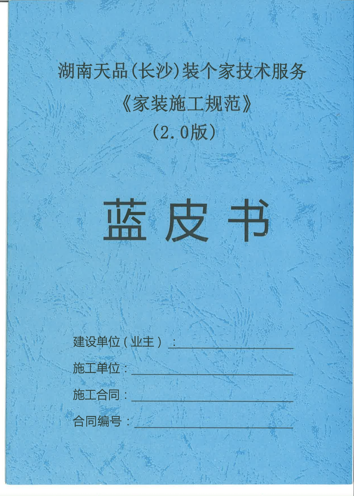

---

## 前言

家庭装修是一个系统工程，前前后后数十个环节，需要多环节相匹配协调，才能够确保落地和最终成品交付。装修业主的权益如何保障？现场的施工品质如何监管？具体标准怎么量化？有没有一套科学规范、且行之有效的监管办法？

而蓝皮书的出台就是为监管而生。在蓝皮书验收规范 1.0 版本，我们已经对装饰公司施工流程以及 26 项管理与质量控制标准进行了详细的量化规定。但随着装修主材的升级、产业技术的革新，很多以前的验收方法和内容已不再适用，所以我们又升级了 2.0 版本。

这本 2.0 版验收规范是严格依照国家住建部和国家质量监督检验检疫总局共同颁布的现行国标验收规范最新版本 GB 50210-2018《建筑装饰装修工程质量验收标准》，并结合施工现场实操中遇到的痛点，按流程的先后顺序，重新对参与装修的 60 多个节点环节都进行详细、清晰的规定，而生成的一套科学管理办法。做到有标准可依，有规章可循，让客户、现场管理者、参与者对全程的操作更加清晰明了。

流程化、标准化、规范化，才是保证施工品质不降标的前提，也是企业可复制和存续的基石。

---

查看原始扫描页：前言

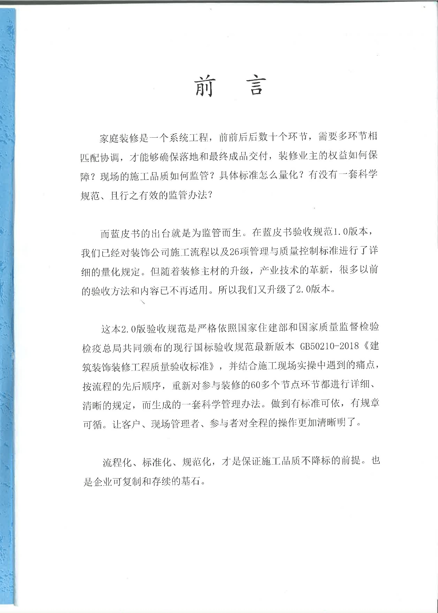

---

## 目录

1. 工地服务人员签到表
2. 从开工到竣工验收整套工序表
3. 施工进度管理计划表
4. 客户特殊要求记录
5. 施工前现场原状交接单
6. 施工图现场设计交底单
7. 公司购买主要材料品牌确认单（水电）
8. 水电隐蔽工程验收记录单
9. 防水验收及蓄水情况记录
10. 工程延期单
11. 公司购买主要材料品牌确认单（泥工）
12. 公司购买主要材料品牌确认单（木工）
13. 木工基层结构隐蔽工程验收记录单项
14. 木工饰面工程验收记录单项
15. 瓦工工程验收记录单项
16. 公司购买主要材料品牌确认单（涂装）
17. 涂装工艺饰面验收记录单项
18. 成品柜、门、家具安装质量检测表
19. 水电安装质量检测表
20. 工程延期确认单
21. 工地竣工验收表
22. 业主满意度、安全访问表
23. 工程管理日志

---

查看原始扫描页：目录

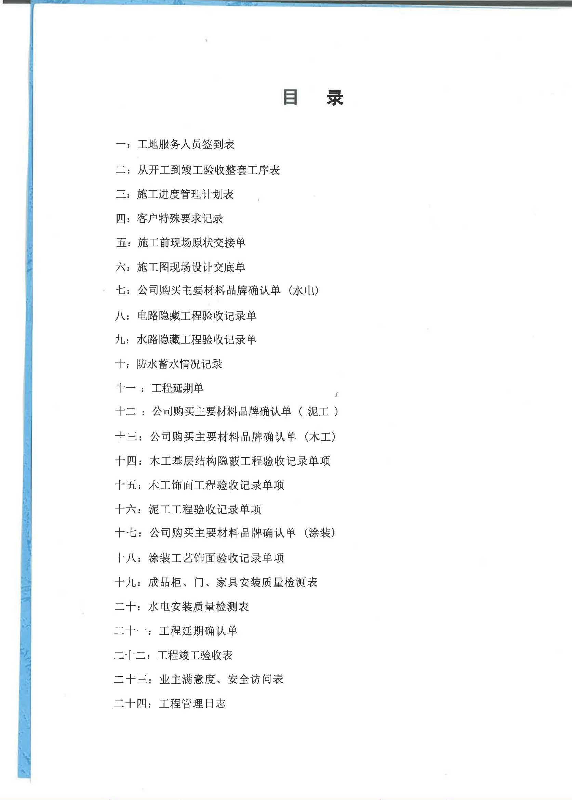

---

## 一、工地服务人员签到表

| 时间 | 部门 | 姓名 | 内容 |
| --- | --- | --- | --- |
|  |  |  |  |
|  |  |  |  |
|  |  |  |  |
|  |  |  |  |
|  |  |  |  |
|  |  |  |  |
|  |  |  |  |
|  |  |  |  |
|  |  |  |  |
|  |  |  |  |
|  |  |  |  |
|  |  |  |  |
|  |  |  |  |
|  |  |  |  |
|  |  |  |  |
|  |  |  |  |

---

查看原始扫描页：工地服务人员签到表

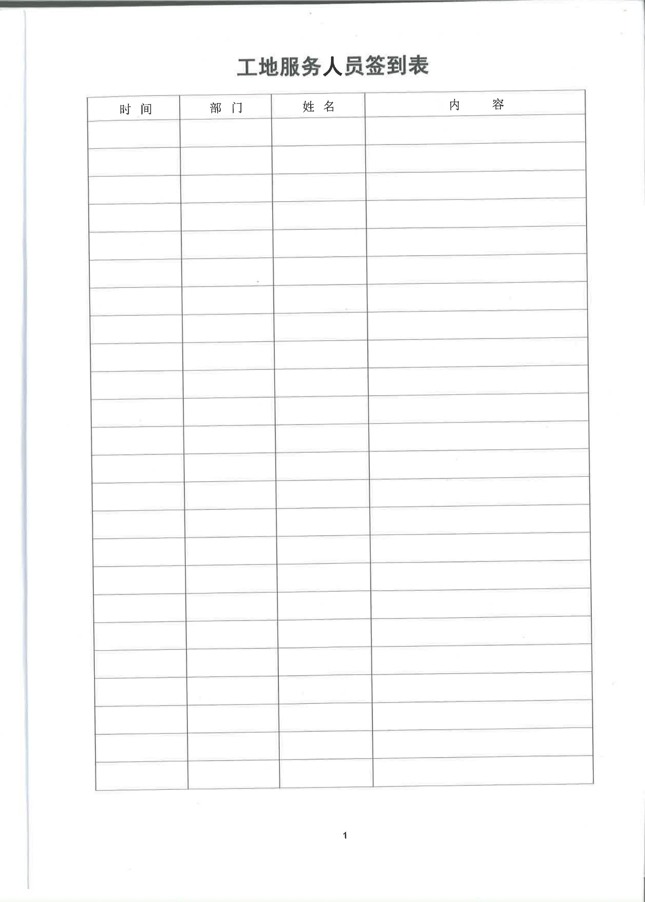

---

## 二、从开工到竣工验收整套工序表

开工日期：____年__月__日　到竣工日期：____年__月__日

| 工序号 | 项目内容 |
| --- | --- |
| 1 | 开工当天，现场负责人跟业主一起办好开工手续，确认水和电的开通 |
| 2 | 开工当天，设计师对现场交底，拆墙和砌墙 |
| 3 | 3 天内做好开工成品保护，做好安全防护 |
| 4 | 敲墙、拆保温层（拆旧） |
| 5 | 砌墙、粉墙 |
| 6 | 做好标识、标化、放样（低位平水线 350mm、一米水平线必做） |
| 7 | 做好公司形象标牌、全程工期计划 |
| 8 | 水电定位（设计师、空调、地暖、灯具、洁具、橱柜、定制柜等商家现场交底） |
| 9 | 电线、水管、材料进场，通知业主验收 |
| 10 | 水电开槽、打孔、布线、布管 |
| 11 | 通知业主、监理，水电验收（水管试压、检测、VR 拍照） |
| 12 | 中央空调、新风、地暖安装 |
| 13 | 通知窗户量尺 |
| 14 | 水电验收通过，业主交清二期款（进下一道工序材料） |
| 15 | 防水区域底部找坡处理，做好暗排（仅针对下沉式卫生间） |
| 16 | 防水区域墙面提前 2 小时以上做渗透界面处理 |
| 17 | 防水材料验收，做好防水，间隔 24 小时后闭水测试（闭水不宜超过 48H），通知业主、物业验收 |
| 18 | 瓦工进场，先做拆除后的墙面修补找平及地面找平 |
| 19 | 厕所沉箱回填或架空（仅针对下沉式卫生间）、包管 |
| 20 | 地砖、墙砖业主验收（放在卧室地面找平处），确认花色和排版及留缝大小 |
| 21 | 窗户安装 |
| 22 | 厚贴工艺：瓷砖先做拉毛，待初步成膜后（至少间隔一天）方可水泥砂浆铺贴 |
| 23 | 薄贴工艺：先做墙面渗透界面，再规方、冲筋、找平 |
| 24 | 先铺贴客餐厅瓷砖和厨房墙砖 |
| 25 | 通知橱柜公司复尺（定制） |
| 26 | 铺贴其他区域墙砖 |
| 27 | 通知房门和厨卫平开门复尺（定制） |
| 28 | 做好地砖成品保护 |
| 29 | 窗台大理石安装 |
| 30 | 做厕所专业填缝（铺完瓷砖 3 天即可填缝），间隔 24H 后方可进入下道工序 |
| 31 | 板材进场验收，业主、设计师、项目经理三方在场木工交底 |
| 32 | 木作吊顶施工（注意顶部暗藏预埋线和型材） |
| 33 | 泥工、木工完工，通知业主、监理验收 |
| 34 | 通知成品衣柜复尺（定制） |
| 35 | 泥工、木工验收通过，业主交清三期款（进下一道工序材料） |
| 36 | 腻子、墙漆材料进场验收 |
| 37 | 做成品保护、天花界面拉毛、墙面界面处理 |
| 38 | 做接缝及阴阳角校正（打水平仪） |
| 39 | 底料腻子找平施工 |
| 40 | 安装卧室成品房门，安装定制衣柜 |
| 41 | 腻子修补，精细找平 |
| 42 | 墙面打磨、做抗碱底漆 |
| 43 | 查验、修补及封闭面漆（待自然阴干后再进入下个环节） |
| 44 | 油漆、墙漆完工，通知业主、监理验收 |
| 45 | 安装厨卫铝天花吊顶 |
| 46 | 安装橱柜 |
| 47 | 安装衣柜门、隔断门等 |
| 48 | 安装洁具（和小五金挂件） |
| 49 | 安装灯具、开关插座 |
| 50 | 全房保洁 |
| 51 | 安装木地板 |
| 52 | 安装家电、家具 |
| 53 | 安装窗帘、挂饰 |
| 54 | 全房安装到位，通知公司内部验收；自检合格后再通知业主、监理进行竣工验收，办好交接手续 |

备注：

1. 本计划须在合同施工工期内完工。
2. 如工期延误，每天罚款参照合同条款；项目经理找不到负责人的，由项目经理全部承担。
3. 因业主原因造成的工期延误，必须有业主签字认可的书面同意，并开具延期变更单。

---

查看原始扫描页：工序表第 1 页

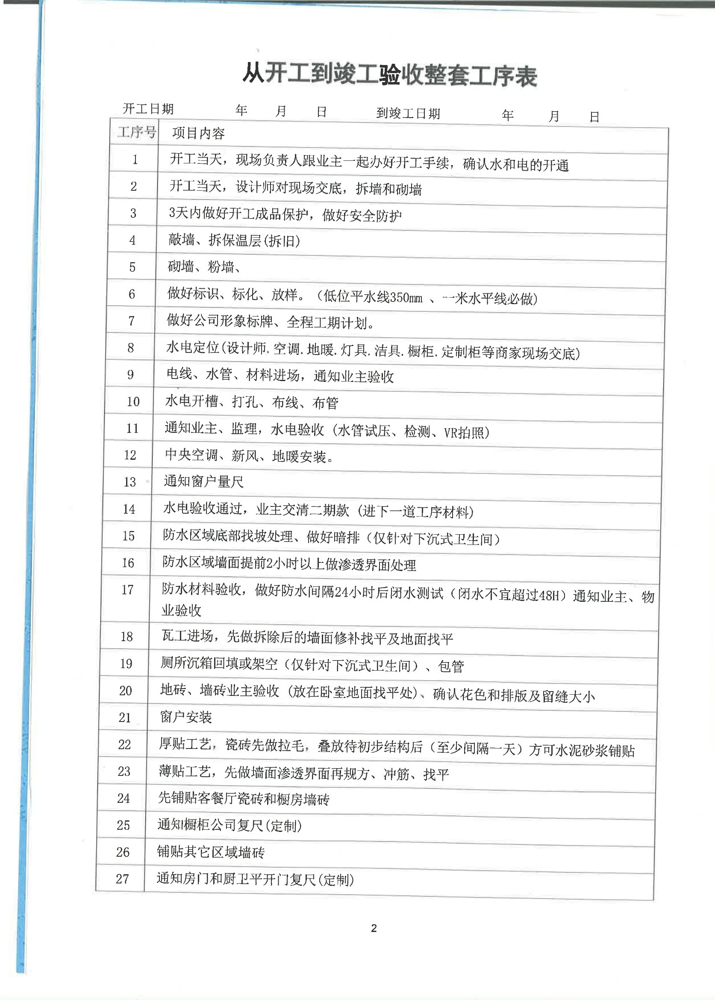

查看原始扫描页：工序表第 2 页

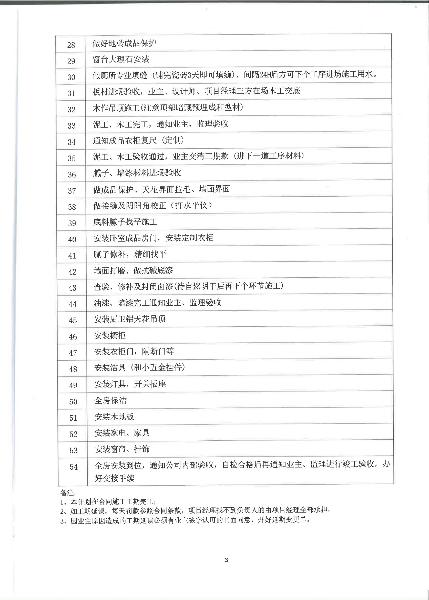

---

## 三、施工进度管理计划表

客户：________　地址：________  
设计：________　工长：________  
预算：________　监理：________  
开工时间：________　交付期限：________

| 施工项目 | 计划用时 | 第几周 | 计划日期 | 实际完成 | 备注说明 |
| --- | --- | --- | --- | --- | --- |
| 安全防护 | 1天 | 第1周 | __月__日至__月__日 |  |  |
| 拆除工程 | 1-2天 | 第1周 | __月__日至__月__日 |  |  |
| 新建工程 | 2-3天 | 第1周 | __月__日至__月__日 |  |  |
| 标识放线 | 1-2天 | 第1周 | __月__日至__月__日 |  |  |
| 水电工程 | 7-10天 | 第2-3周 | __月__日至__月__日 |  |  |
| 中央空调、新风地暖 | 3-7天 | 第3周 | __月__日至__月__日 |  |  |
| 隐蔽验收 | 1天 | 第3周 | __月__日至__月__日 |  |  |
| 地面找平 | 2-3天 | 第4周 | __月__日至__月__日 |  |  |
| 回填包管 | 1-2天 | 第5周 | __月__日至__月__日 |  |  |
| 防水 | 2-3天 | 第5周 | __月__日至__月__日 |  |  |
| 瓷砖进场 | 1天 | 第5周 | __月__日至__月__日 |  |  |
| 镶贴工程 | 15-20天 | 第5-8周 | __月__日至__月__日 |  |  |
| 橱柜复尺下单 | 2-3天 | 第6周 | __月__日至__月__日 |  |  |
| 瓷砖填缝 | 2-3天 | 第6周 | __月__日至__月__日 |  |  |
| 板材进场 | 1天 | 第6周 | __月__日至__月__日 |  |  |
| 木作工程 | 7-10天 | 第6-7周 | __月__日至__月__日 |  |  |
| 衣柜复尺下单 | 3-7天 | 第7周 | __月__日至__月__日 |  |  |
| 房门、铝门量尺下单 | 1-2天 | 第7周 | __月__日至__月__日 |  |  |
| 中期验收 | 1-2天 | 第7周 | __月__日至__月__日 |  |  |
| 窗台大理石安装 | 1-2天 | 第7周 | __月__日至__月__日 |  |  |
| 涂装材料进场 | 1天 | 第8周 | __月__日至__月__日 |  |  |
| 腻子施工 | 20-30天 | 第8-10周 | __月__日至__月__日 |  |  |
| 衣柜安装 | 3-5天 | 第10-12周 | __月__日至__月__日 |  |  |
| 房门安装 | 1-2天 | 第11-12周 | __月__日至__月__日 |  |  |
| 修补打磨 | 3-5天 | 第12周 | __月__日至__月__日 |  |  |
| 墙漆施工 | 3-5天 | 第13周 | __月__日至__月__日 |  |  |
| 开关面板、灯具安装 | 1-2天 | 第14周 | __月__日至__月__日 |  |  |
| 橱柜安装 | 1-2天 | 第14周 | __月__日至__月__日 |  |  |
| 集成吊顶 | 1-2天 | 第14周 | __月__日至__月__日 |  |  |
| 开荒保洁 | 1-2天 | 第14周 | __月__日至__月__日 |  |  |
| 地板安装 | 1-2天 | 第15周 | __月__日至__月__日 |  |  |
| 洁具安装 |  | 第15周 | __月__日至__月__日 |  |  |
| 家电安装 | 1-2天 | 第16周 | __月__日至__月__日 |  |  |
| 挂饰、软饰安装 | 1-2天 | 第16周 | __月__日至__月__日 |  |  |
| 竣工验收 | 1天 | 第16周 | __月__日至__月__日 |  |  |

备注：自开工始，必须把整个交付周期的进度安排全部计划出来，一式两份，现场负责人一份，另一份交至工程部同期跟进。工地实时进度状态须如实填写；如有延迟，需备注原因并责任到相关环节，依公司制度处理。

- 奖励：在限定交付周期内，交付每提前一天奖 50 元，依次叠加。
- 处罚：在限定交付周期内，每延迟一天罚款 50 元，依次叠加。责任无法落实到相关环节的，由项目经理承担；责任可落实的，须填写项目延期单并经客户确认签字。

---

查看原始扫描页：施工进度管理计划表第 1 页

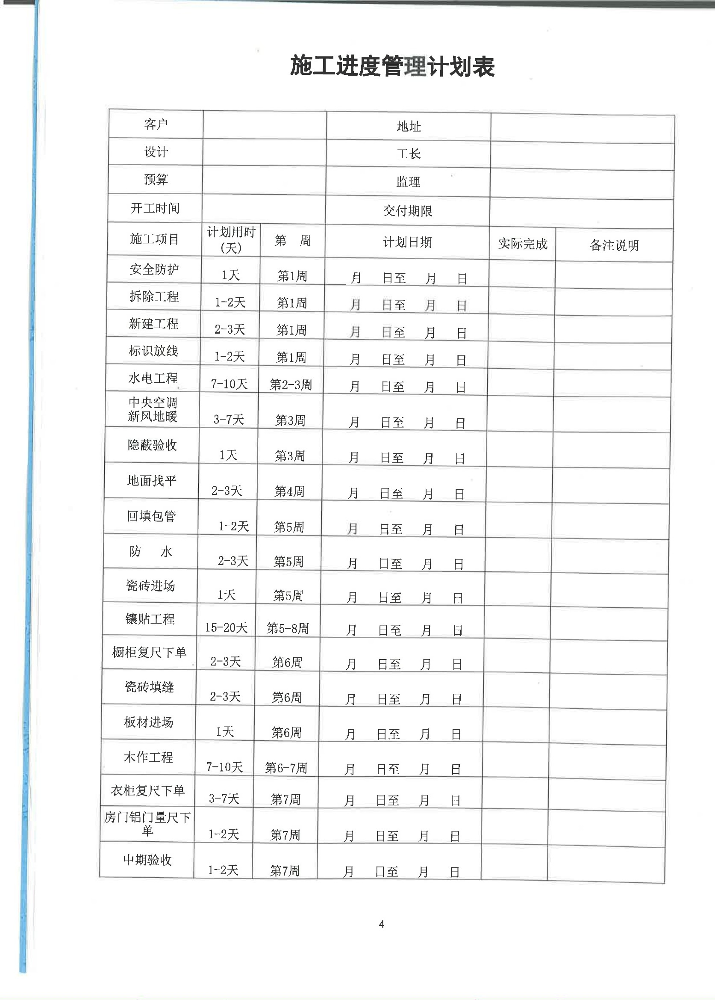

查看原始扫描页：施工进度管理计划表第 2 页

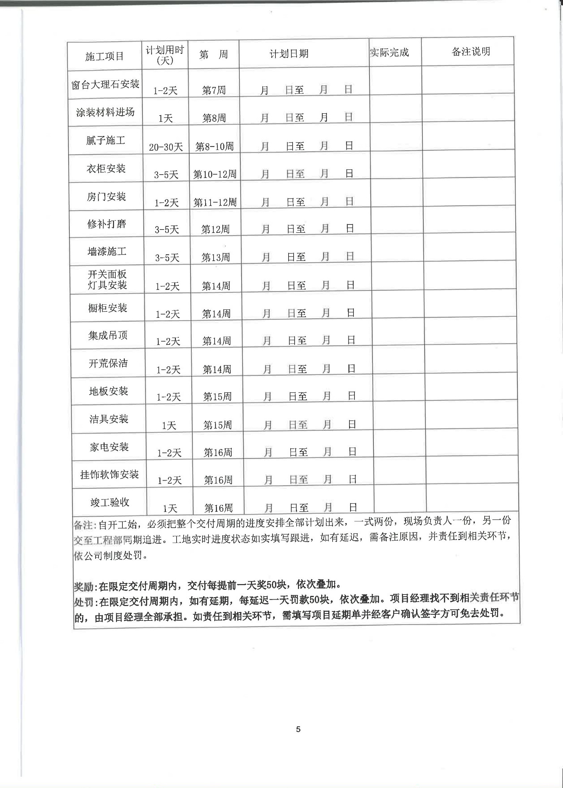

---

## 四、客户特殊要求记录

| 类别 | 特殊要求详细内容 |
| --- | --- |
| 合同方面 |  |
| 设计方面 |  |
| 材料方面 |  |
| 工艺方面 |  |
| 服务方面 |  |
| 其他 |  |

说明：所签装修合同任何人不得增减内容或涂改。客户有特殊要求时，在不违反合同及公司原则的前提下详细填入表格，并由当事人签字，最后由客户审核签字确认。任何口头承诺公司一概不予认可。若该项目已实施，装饰方不承担改造费用。

| 工程监理 | 客户 | 项目经理 |
| --- | --- | --- |
|  |  |  |

---

查看原始扫描页：客户特殊要求记录

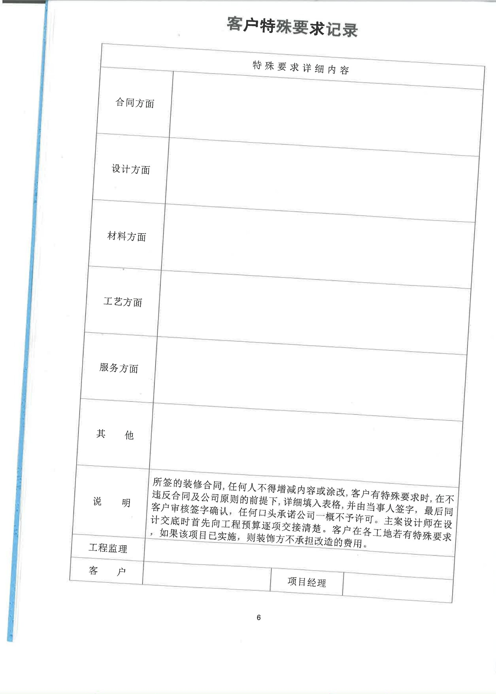

---

## 五、施工前现场原状交接单

填表日期：____年__月__日　装修地址：________

| 原始现场情况 | 现场情况（如无问题填写“正常”） |
| --- | --- |
| 进门防盗门现状 |  |
| 门窗及玻璃有无破损，开合推拉是否灵活 |  |
| 厨房下水及地漏是否畅通 |  |
| 客卫下水及地漏是否畅通 |  |
| 主卫下水及地漏、阳台下水是否畅通 |  |
| 中央空调及取暖设施 |  |
| 家用电器及原有家具 |  |
| 进水管、水表、煤气管、煤气表等情况 |  |
| 墙面及顶面是否有基层开裂、空鼓脱层现象 |  |
| 地面、横梁及墙面是否有明显的不直、不平整现象 |  |
| 原有电视线、网络线、电话线入户、防盗系统是否到户 |  |

| 质检员签字 | 客户确认签字 | 项目经理验收签字 |
| --- | --- | --- |
|  |  |  |

项目经理意见：□ 可开工　□ 不能开工  
质检员处理意见：□ 可开工　□ 不能开工

### 原装交接签字确认记录

| 交接项目 | 数量/状态 | 特殊说明 |
| --- | --- | --- |
| 水表 |  |  |
| 冲洗阀门 |  |  |
| 龙头 |  |  |
| 洁具 |  |  |
| 入户门钥匙 |  |  |
| 水电充值卡 |  |  |
| 门禁系统钥匙 |  |  |

| 人员 | 签字 | 特殊说明 |
| --- | --- | --- |
| 客户 |  |  |
| 项目经理 |  |  |
| 质检员 |  |  |

注明：交接完后立即进行原状保护。工程竣工验收时对照原状交接单检查；若出现损害客户财产的情况，必须照价赔偿。

---

查看原始扫描页：施工前现场原状交接单

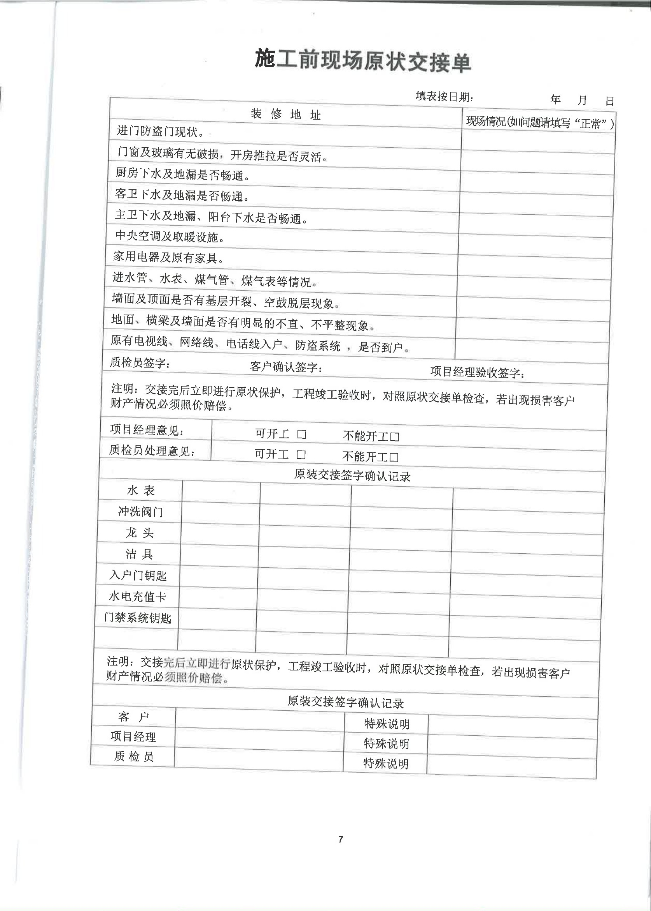

---

## 六、施工图现场设计交底单

开工日期：____年__月__日　竣工日期：____年__月__日

| 交底项目 | 客户签字及日期 | 设计师签字及日期 | 项目经理签字及日期 |
| --- | --- | --- | --- |
| 拆墙、砌墙交底 |  |  |  |
| 全方位水电交底 |  |  |  |
| 泥工交底 |  |  |  |
| 木工交底 |  |  |  |
| 成品安装交底 |  |  |  |
| 油漆交底 |  |  |  |
| 其他交底说明 |  |  |  |

注明：拆墙、砌墙、水电、瓦工、木工、成品安装、油漆等交底，设计师必须到工地现场。进场施工前必须方案交底；施工人员须严格服从设计方案施工，如遇问题或不明细节，不得擅自做主，应及时与管理人员通报确认后方可继续施工。

---

查看原始扫描页：施工图现场设计交底单

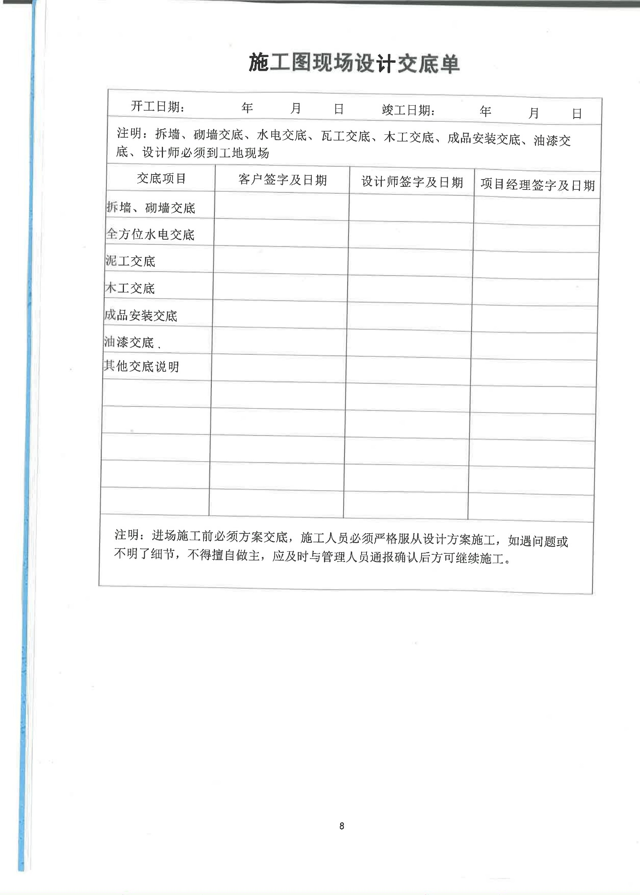

---

## 七、公司购买主要材料品牌确认单（水电）

填表日期：____年__月__日

| 材料名称 | 品牌 | 客户验收签字 | 项目经理签字 | 备注 |
| --- | --- | --- | --- | --- |
|  |  |  |  |  |
|  |  |  |  |  |
|  |  |  |  |  |
|  |  |  |  |  |
|  |  |  |  |  |
|  |  |  |  |  |
|  |  |  |  |  |
|  |  |  |  |  |
|  |  |  |  |  |
|  |  |  |  |  |
|  |  |  |  |  |
|  |  |  |  |  |
|  |  |  |  |  |
|  |  |  |  |  |
|  |  |  |  |  |

注明：保证配送到现场的材料品牌与设计及预算中要求的材料品牌一致。发现不一致必须立即更换。本次主要确认水电材料。客户若更换品牌，必须由工程书面出具变更单并办理预算签字手续，口头承诺一概无效。

| 质检员签字 | 特殊说明 |
| --- | --- |
|  |  |

---

查看原始扫描页：公司购买主要材料品牌确认单（水电）

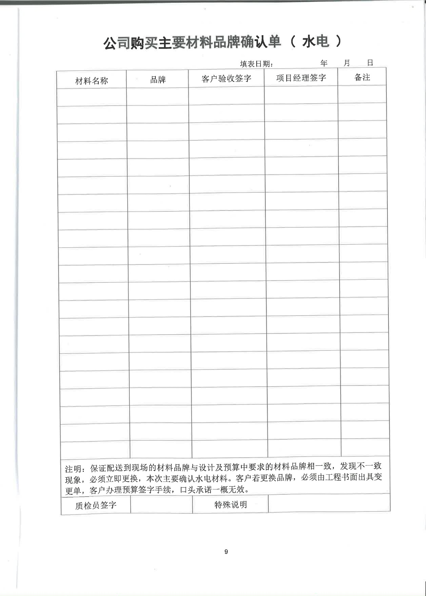

---

## 八、水电隐蔽工程验收记录单

填表日期：____年__月__日

### 强电、弱电

| 序号 | 施工项目及验收要求 | 验收结果 | 备注 |
| --- | --- | --- | --- |
| 1 | 电线品牌和导线截面规格符合预算要求。 | □ 合格　□ 不合格 |  |
| 2 | 回路设置合理（两房不低于 8 组、三房不低于 10 组、四房不低于 12 组）；空气开关负荷配置合理；涉水电器、大功率电器单独设漏保；特大功率电器从总控分组；布线完毕按回路贴标签。 | □ 合格　□ 不合格 |  |
| 3 | 强弱电位置合理，标高符合设计要求（强电离地高度不低于 1600mm）。 | □ 合格　□ 不合格 |  |
| 4 | 底盒安装前必须湿水；未验收前不得封槽。封槽不能凸出墙面，并应低于墙面 1-2mm；高于墙面必须整改。 | □ 合格　□ 不合格 |  |
| 5 | 客厅空调 6 平方电线，卧室空调 4 平方电线，厨房插座全部用 4 平方电线，其他插座 2.5 平方，灯线 1.5 平方；卫生间浴霸预留 7 根 1.5 平方电线。 | □ 合格　□ 不合格 |  |
| 6 | 相线与零线颜色应不同；零线宜用蓝色，保护线必须用黄绿双色线；强电用红色套管，弱电用蓝色套管。 | □ 合格　□ 不合格 |  |
| 7 | 厨卫强电线严禁走地面。 | □ 合格　□ 不合格 |  |
| 8 | 布线应穿管敷设，不得在住宅顶棚内、墙体及顶棚抹灰层、保温层及饰面板内直敷。 | □ 合格　□ 不合格 |  |
| 9 | 除同类照明外，不同回路、不同电压等级的导线不得穿入同一管内。 | □ 合格　□ 不合格 |  |
| 10 | 导线应在箱（盒）内连接，导管内不得有接头；接头应牢固、绝缘包缠均匀紧密；末端预留电线打卷放入底盒并盖好盖板；多股导线连接应拧紧搪锡或采用压接帽；端子连接应牢固紧密。 | □ 合格　□ 不合格 |  |
| 11 | 强电单管穿线不宜超过 3 根，弱电单管单线；线径不超过管截面 40%；线管进底盒用锁扣；三通盒出线及灯线末端套波纹软管，管间留不低于排卡间距并固定牢固。 | □ 合格　□ 不合格 |  |
| 12 | 天花原顶灯线须开槽使用黄蜡管，与 PVC 管接头用胶布固定。 | □ 合格　□ 不合格 |  |
| 13 | 给水管及线管交叉时必须采用过桥，严禁直接叠加。 | □ 合格　□ 不合格 |  |
| 14 | 水电施工完毕，每个房间保留一个照明、一个插座；锁好所有点位盖板（含强弱电箱盖板、临时开关及插座），完工场清、拍照传群。 | □ 合格　□ 不合格 |  |
| 15 | 弱电布线时检查开发商原预留是否畅通；门禁可视对讲须测试通过后再进入下一步。如发现损坏，须从管道井重新布线，严禁接头。 | □ 合格　□ 不合格 |  |

### 给水、排水

| 序号 | 施工项目及验收要求 | 验收结果 | 备注 |
| --- | --- | --- | --- |
| 1 | 水管品牌和管径尺寸符合预算要求。 | □ 合格　□ 不合格 |  |
| 2 | 给水管道严禁开横槽；卫生间给水管路纵向爬墙上顶；顶部吊卡每米不低于 3 个，转弯 10cm 内一个；特殊情况下横槽长度不得超过 60cm。 | □ 合格　□ 不合格 |  |
| 3 | 管道除上墙转角用 90 度弯外，其余使用顺水大弯，并固定牢固。 | □ 合格　□ 不合格 |  |
| 4 | 给水管焊接不得有歪焊、过焊、漏焊、错焊。 | □ 合格　□ 不合格 |  |
| 5 | 给水预留接口位置正确，管口用堵头封闭。 | □ 合格　□ 不合格 |  |
| 6 | 冷热水管道位置正确：左热右冷、上热下冷；热水不过弯，间距 15cm；热水管须套保温棉。 | □ 合格　□ 不合格 |  |
| 7 | 管道试压不得暴力打压，以 8-12 公斤为宜，持续试压不低于 30 分钟，接头无渗漏。 | □ 合格　□ 不合格 |  |
| 8 | 排水布管遵循“不堵、不吵、不漏、不臭、就近”原则。 | □ 合格　□ 不合格 |  |
| 9 | 厨房排水去存水弯改用 90 度弯，立管变径 50。 | □ 合格　□ 不合格 |  |
| 10 | 卫生间主排水使用顺水弯；干区地漏、不常用排水设备设置带补水功能的存水弯；条件允许时台盆做墙排水。 | □ 合格　□ 不合格 |  |
| 11 | 主排污管变径时用三通加补芯，严禁直接变径。 | □ 合格　□ 不合格 |  |
| 12 | 接头无漏粘、打胶；排水预留口位置正确。 | □ 合格　□ 不合格 |  |
| 13 | 排水布管完成后设置排水坡度并用管箍支撑固定，管口做好临时封闭。 | □ 合格　□ 不合格 |  |

工程量确定：见水表附表  
试压时间：从 __时__分开始，至 __时__分结束。  
试验压力：____ MPa；压力降：____ MPa；接头：□ 无渗水。

说明：给水管道布管完毕后，项目经理应向质检部报检，安排质检员验收并签字，同时进行水压试验。试压前所有管道必须堵头封闭。试验压力约 1MPa，试验时间 0.5 小时，0.5 小时内压力降小于 0.05MPa 为合格。排水管施工完毕后必须进行通水试验，保证排水通畅。

| 确认事项 | 签字人 |
| --- | --- |
| 水路隐蔽工程验收合格，可进行下道工序施工 | 客户 |
| 水路隐蔽工程验收合格，可进行下道工序施工 | 项目经理 |
| 水路隐蔽工程验收合格，可进行下道工序施工 | 质检员 |

---

查看原始扫描页：水电隐蔽工程验收记录单第 1 页

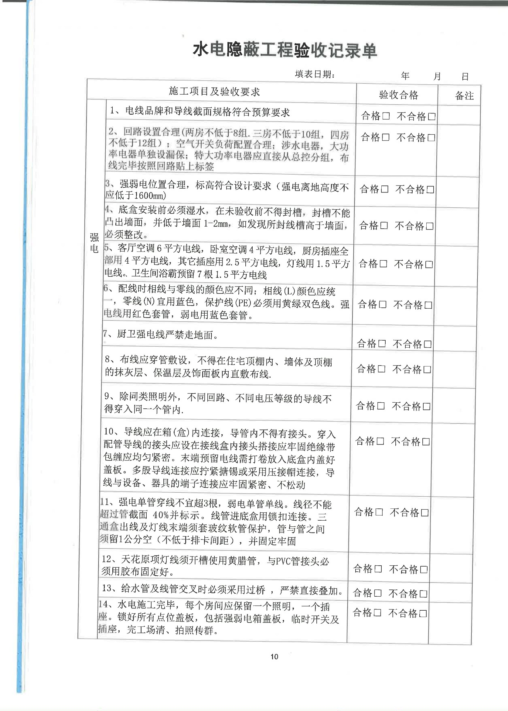

查看原始扫描页：水电隐蔽工程验收记录单第 2 页

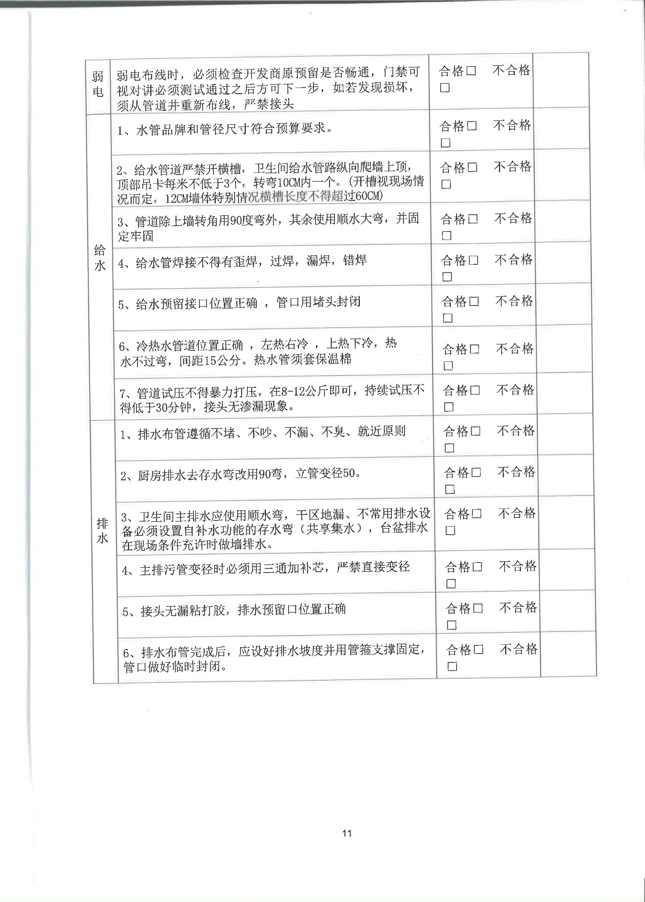

查看原始扫描页：水电隐蔽工程验收记录单第 3 页

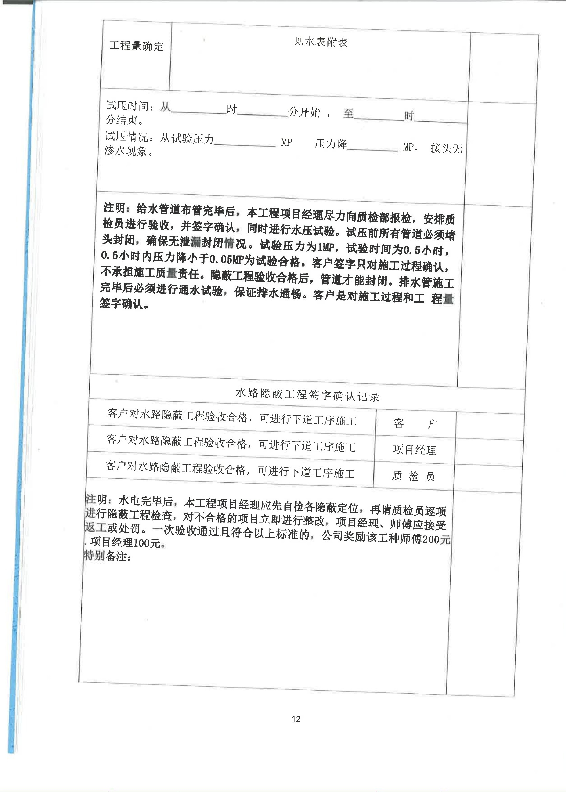

---

## 九、防水验收及蓄水情况记录

填表日期：____年__月__日

| 序号 | 蓄水试验前检查项目 | 检查结果 |
| --- | --- | --- |
| 1 | 确保粉刷层牢固、无脱沙掉粉，并提前 2 小时以上做渗透界面加固强化处理。 | □ 合格　□ 不合格 |
| 2 | 墙面墙根清理干净；水管槽、管口、主排水立管根部封堵加固；用 1:3 水泥砂浆整体找坡，沉箱底层留出暗排最低点，确保找坡层无积水；平层式卫生间和面层防水严禁打二次排水孔。 | □ 合格　□ 不合格 |
| 3 | 建议用柔性防水，地面上返墙面 30cm；涂刷表面平整、不透底、不起泡、不流淌、不开裂。 | □ 合格　□ 不合格 |
| 4 | 防水施工环境温度控制在 5-35°C。 | □ 合格　□ 不合格 |
| 5 | 卫生间面层防水须贴完门槛石或门口过道瓷砖后施工；铺贴面立面和门垛侧面同步刷防水。 | □ 合格　□ 不合格 |
| 6 | 大面积施工前，在阴阳角、管根、地漏、排水口等部位先做附加层，并夹铺增强抗裂材料。 | □ 合格　□ 不合格 |
| 7 | 防水涂料应薄涂多遍，前后两遍方向相互垂直；涂层均匀，无漏刷或堆积；前一遍实干后再涂下一遍。 | □ 合格　□ 不合格 |
| 8 | 防水实干（至少间隔 24H）后做闭水试验，闭水不低于 24 小时，并到楼下检查无渗漏后方可进入下一步；试验前联系楼下。 | □ 合格　□ 不合格 |
| 9 | 闭水区外立面及门口无水迹现象。 | □ 合格　□ 不合格 |

参加人员：________  
蓄水试验时间：从 __时__分开始，至 __时__分结束。  
蓄水试验情况：蓄水深度 ____mm；蓄水总时间 ____ 小时。  
特殊情况处理：________  
工程量确定：防水施工面积 ____ 平方米。

说明：防水施工完毕 24 小时后进行蓄水试验，蓄水深度不小于 20mm，蓄水时间 24 小时，水面无明显下降为合格。发现漏水应立即停止试验并重新处理。

| 确认事项 | 客户 | 项目经理 | 质检员 |
| --- | --- | --- | --- |
| 防水蓄水试验合格，同意进行下道工序施工 |  |  |  |

---

查看原始扫描页：防水验收及蓄水情况记录

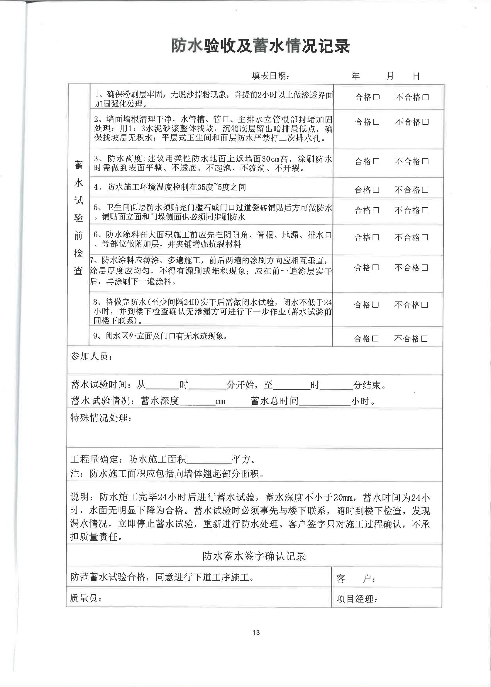

---

## 十、工程延期单

| 客户姓名 | 工程地址 | 施工队长 | 工程主管 |
| --- | --- | --- | --- |
|  |  |  |  |

合同工期：____年__月__日至____年__月__日  
延期天数：____天  
延期原因：________  
客户签字：________　施工队长签字：________　工程主管签字：________

备注：双方须在确认延期原因后签字；延期责任和新竣工日期依合同及本单据执行。

---

查看原始扫描页：工程延期单

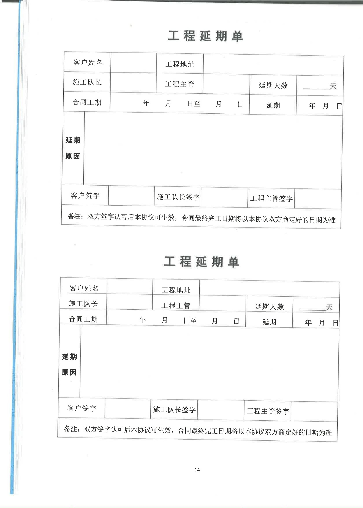

---

## 十一、公司购买主要材料品牌确认单（泥工）

填表日期：____年__月__日

| 材料名称 | 品牌 | 客户验收签字 | 项目经理签字 | 备注 |
| --- | --- | --- | --- | --- |
|  |  |  |  |  |
|  |  |  |  |  |
|  |  |  |  |  |
|  |  |  |  |  |
|  |  |  |  |  |
|  |  |  |  |  |
|  |  |  |  |  |
|  |  |  |  |  |
|  |  |  |  |  |
|  |  |  |  |  |
|  |  |  |  |  |
|  |  |  |  |  |
|  |  |  |  |  |
|  |  |  |  |  |
|  |  |  |  |  |

注明：保证配送到现场的材料品牌与设计及预算中要求的材料品牌一致。发现不一致必须立即更换。本次主要确认泥工材料。客户若更换品牌，必须由工程书面出具变更单并办理预算签字手续，口头承诺一概无效。

| 质检员签字 | 特殊说明 |
| --- | --- |
|  |  |

---

查看原始扫描页：公司购买主要材料品牌确认单（泥工）

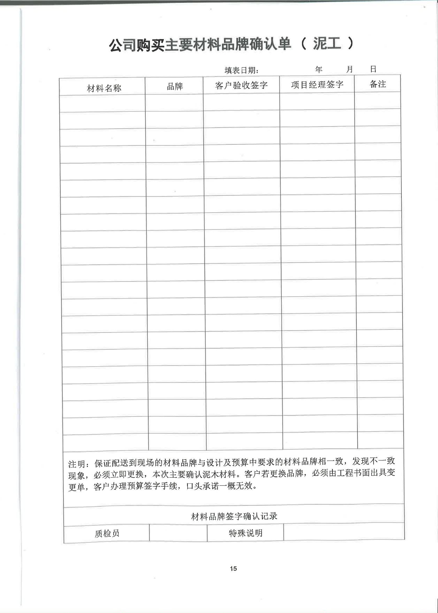

---

## 十二、公司购买主要材料品牌确认单（木工）

填表日期：____年__月__日

| 材料名称 | 品牌 | 客户验收签字 | 项目经理签字 | 备注 |
| --- | --- | --- | --- | --- |
|  |  |  |  |  |
|  |  |  |  |  |
|  |  |  |  |  |
|  |  |  |  |  |
|  |  |  |  |  |
|  |  |  |  |  |
|  |  |  |  |  |
|  |  |  |  |  |
|  |  |  |  |  |
|  |  |  |  |  |
|  |  |  |  |  |
|  |  |  |  |  |
|  |  |  |  |  |
|  |  |  |  |  |
|  |  |  |  |  |

注明：保证配送到现场的材料品牌与设计及预算中要求的材料品牌一致。发现不一致必须立即更换。本次主要确认木工材料。客户若更换品牌，必须由工程书面出具变更单并办理预算签字手续，口头承诺一概无效。

| 质检员签字 | 特殊说明 |
| --- | --- |
|  |  |

---

查看原始扫描页：公司购买主要材料品牌确认单（木工）

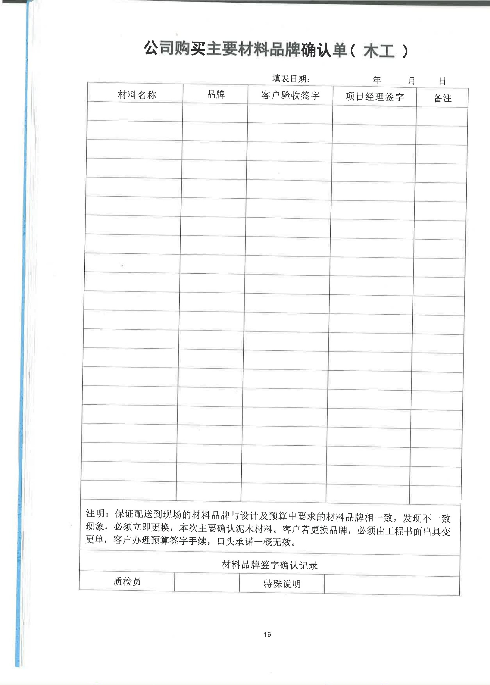

---

## 十三、木工基层结构隐蔽工程验收记录单项

填表日期：____年__月__日

| 序号 | 施工项目及验收要求 | 验收结果 | 备注 |
| --- | --- | --- | --- |
| 1 | 板材及龙骨符合预算品牌和质量要求。 | □ 合格　□ 不合格 |  |
| 2 | 吊顶龙骨按设计标高弹线，水平、垂直位置安装牢固。 | □ 合格　□ 不合格 |  |
| 3 | 副龙骨横向间距不大于 300mm，卡齿龙骨纵向不大于 800mm，膨胀螺杆间距不大于 800mm；吊顶转角加固；木龙骨用膨胀螺丝固定，间距不大于 600mm。 | □ 合格　□ 不合格 |  |
| 4 | 罩面板长边应与次龙骨垂直方向安装；同层和不同层均应错缝排列，错开距离不小于一档次龙骨间距。 | □ 合格　□ 不合格 |  |
| 5 | 吊杆及龙骨结构不得与重型设备和有振动荷载的设备相连接。 | □ 合格　□ 不合格 |  |
| 6 | 顶面结构层打孔深度不应大于 65mm，不得损伤结构钢筋或穿透顶板。 | □ 合格　□ 不合格 |  |
| 7 | 悬挂式灯位、空调、电视机、窗帘盒顶面等受力木质基层结构须用大芯板或欧松板加固。 | □ 合格　□ 不合格 |  |
| 8 | 窗帘盒两端与墙面接头处须铲除粉层入墙，防止涂饰表层开裂。 | □ 合格　□ 不合格 |  |
| 9 | 空调送回风口、检修口等龙骨结构位置符合设计要求、安装牢固；风口加长时，纵向立面加强连接。 | □ 合格　□ 不合格 |  |
| 10 | 面层封板前拍照回传；预埋件、灯具型材、放线等全部确认 OK 方可封板。 | □ 合格　□ 不合格 |  |
| 11 | 双层石膏板用乳胶粘接并错缝；接缝预留 3-5mm 伸缩缝；转角用 7 字型处理；同平面石膏板与墙面搭接 3cm 以上，不得下挂。 | □ 合格　□ 不合格 |  |
| 12 | 石膏板吊顶与梁相平时，必须包梁底拉通。 | □ 合格　□ 不合格 |  |
| 13 | 纸面石膏板螺钉距原边 10-15mm、切割边 15-20mm；水泥板螺钉距板边 8-15mm；板周边钉距 150-170mm、板中不大于 200mm；螺钉头低于板面约 0.2mm。 | □ 合格　□ 不合格 |  |
| 14 | 吊顶基层表面平整，平整度 ≤3mm；曲线造型顺滑流畅。 | □ 合格　□ 不合格 |  |
| 15 | 所有门洞、窗口、反梁、柜与墙交接处须测量垂平度与宽窄是否一致，做到垂二平三（垂直度 2mm、平整度 3mm）并校正；所有门洞必打辅助门套。 | □ 合格　□ 不合格 |  |
| 16 | 天花施工结束后开好筒灯孔，工完场清。 | □ 合格　□ 不合格 |  |

---

查看原始扫描页：木工基层结构验收第 1 页

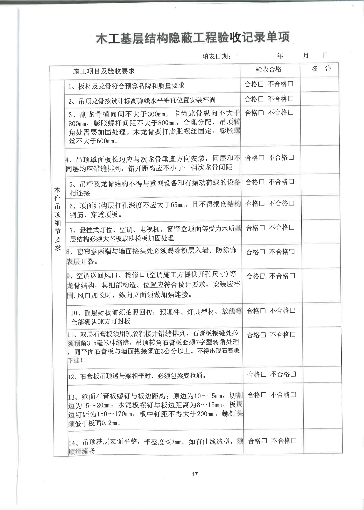

查看原始扫描页：木工基层结构验收第 2 页

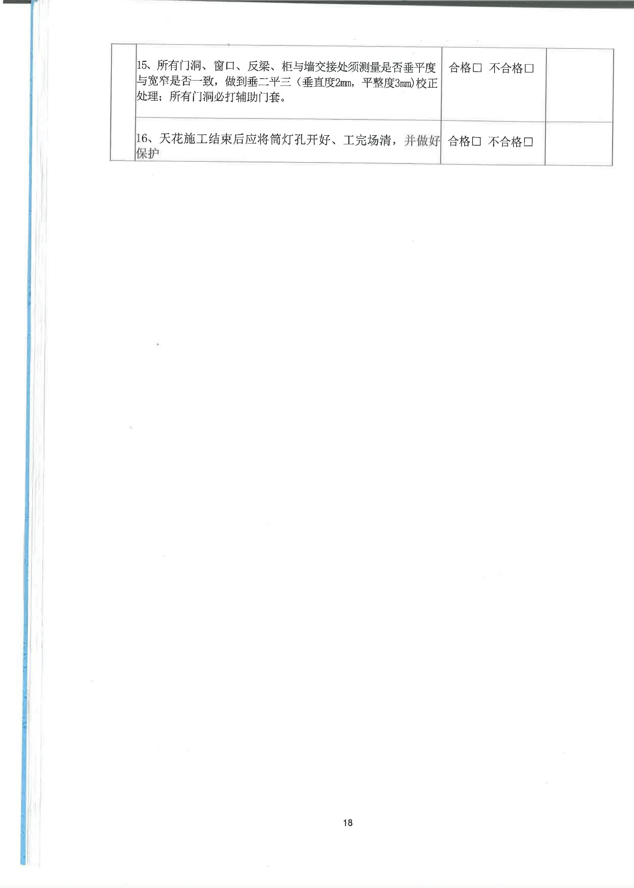

---

## 十四、木工饰面工程验收记录单项

| 序号 | 施工项目及验收要求 | 验收结果 | 备注 |
| --- | --- | --- | --- |
| 1 | 所有材料品牌、规格、颜色符合预算要求。 | □ 合格　□ 不合格 |  |
| 2 | 柜体层板用二合一组装；侧立板加固时先刷乳胶再用纹钉固定，钉位隐藏；层板和侧立板接口平整；枪钉连接不得出现飘钉外露。 | □ 合格　□ 不合格 |  |
| 3 | 柜体竖板木纹卡口向内；柜体对角线误差不大于 3mm，水平误差不大于 2mm，垂直、平直度误差小于 2mm；顶板压竖板。 | □ 合格　□ 不合格 |  |
| 4 | 所有外露面封边处理，不得有爆边。 | □ 合格　□ 不合格 |  |
| 5 | 一门到顶柜门上端部位增加一个铰链。 | □ 合格　□ 不合格 |  |
| 6 | 柜门、抽屉开启灵活、滑动顺畅，伸缩缝大小一致，柜门间缝隙 2-3mm。 | □ 合格　□ 不合格 |  |
| 7 | 悬空式台柜须做加固处理。 | □ 合格　□ 不合格 |  |
| 8 | 门套基层用圆钉或膨胀螺丝与墙体固定，不得用钢排钉；下口离地 1-2cm；垂直方正度 <2mm；基层板铺满大芯板或欧松板；基层厚度超过 30mm 的侧面贴石膏板。 | □ 合格　□ 不合格 |  |
| 9 | 门套侧面与贴墙板基层加饰面板后，符合踢脚线厚度要求。 | □ 合格　□ 不合格 |  |
| 10 | 房门安装留缝：门扇与地面 8mm，侧面门套与地面 3mm；完成后及时做防霉密封。 | □ 合格　□ 不合格 |  |
| 11 | 所有涂饰墙漆的位置用石膏板饰面，不允许直接在木材上刮腻子、墙漆；石膏板饰面采取大面压小面（底板压侧面）。 | □ 合格　□ 不合格 |  |
| 12 | 贴面板刷白乳胶粘贴饱满，使用纹钉固定。 | □ 合格　□ 不合格 |  |
| 13 | 饰面板上的灯具、喷淋头、烟感器、风口、检修口等位置合理、美观，交接严密，符合设计要求。 | □ 合格　□ 不合格 |  |
| 14 | 其他饰面、柜体尽量避免与墙体平接；相平时以墙体最高点为准，饰面盖过墙体接缝 3cm，并高出墙面 3mm。 | □ 合格　□ 不合格 |  |

| 确认事项 | 客户 | 项目经理 | 质检员 |
| --- | --- | --- | --- |
| 木作环节验收合格，同意进行下道工序施工 |  |  |  |

---

查看原始扫描页：木工饰面工程验收记录单项

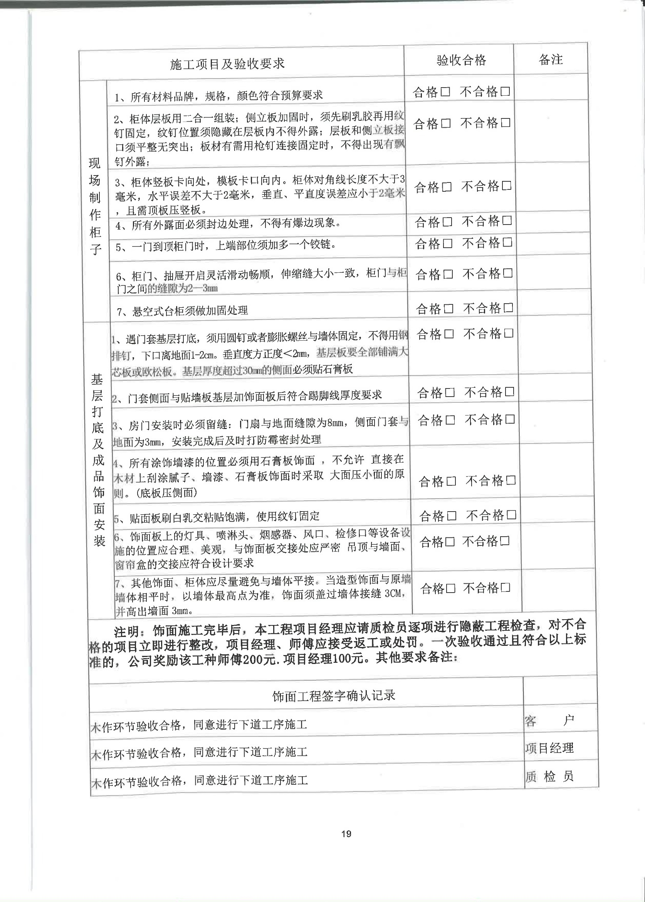

---

## 十五、瓦工工程验收记录单项

填表日期：____年__月__日

| 序号 | 需要检查的项目明细 | 验收结果 | 备注 |
| --- | --- | --- | --- |
| 1 | 砌墙前对新旧墙体接头处凿除、打毛、拉筋；粉刷前原墙粉层接头四周至少各切割 10cm，并带钢网粉整；完成面垂直度和水平度误差不大于 1.5cm。 | □ 合格　□ 不合格 |  |
| 2 | 新建轻质墙体底部先用红砖或水泥砖砌 20cm 打底；需挂重物处用红砖或水泥砖加固；粉刷满带钢网。 | □ 合格　□ 不合格 |  |
| 3 | 粉刷找平抹灰遵循薄批多遍，单次厚度不超过 2cm；混凝土现浇面须界面拉毛后粉刷。 | □ 合格　□ 不合格 |  |
| 4 | 铺贴基层结实、平整、清洁；墙面做渗透界面加固；现浇墙体及其他光滑基层界面处理后拉毛。 | □ 合格　□ 不合格 |  |
| 5 | 厨房烟道界面处理后用钢网粉刷加固再贴砖；满贴到顶；烟道止逆阀安装在瓷砖面；分体灶开直径约 180mm 方孔；安装前烟道填缝，阴阳角用柔性密封胶加固。 | □ 合格　□ 不合格 |  |
| 6 | 贴砖区域包下水管处，贴砖前带钢网加固、防裂。 | □ 合格　□ 不合格 |  |
| 7 | 地面找平前冲筋；水泥砂浆配比 1:3 至 1:4，采用半干砂浆；平整度误差 3mm 内；面层平整、洁净、接槎平整、表面压光，不得严重起沙和脱层。 | □ 合格　□ 不合格 |  |
| 8 | 厚贴：墙面先做渗透界面；泡水墙砖直接水泥砂浆铺贴；全瓷砖背面至少提前一天拉毛；防水层提前一天拉毛。 | □ 合格　□ 不合格 |  |
| 9 | 厚贴拉毛配比：拉毛乳液、山沙、水泥约 1:1:1.1；初次搅拌静置 5 分钟熟化后再搅拌；严禁添加非标材料。 | □ 合格　□ 不合格 |  |
| 10 | 厚贴浆层控制在 2cm 内，误差过大须提前找平。 | □ 合格　□ 不合格 |  |
| 11 | 薄贴：瓷砖胶按外包装兑水比例，初搅后静置 3-5 分钟熟化再搅拌；严禁混合水泥等材料。 | □ 合格　□ 不合格 |  |
| 12 | 薄贴前墙面做渗透处理、规方冲筋，找平误差控制在 3mm 内。 | □ 合格　□ 不合格 |  |
| 13 | 薄贴采用双浆法：瓷砖背面薄刮 1-2mm 无须拉槽，基层拉槽，浆层控制在 3-8mm。 | □ 合格　□ 不合格 |  |
| 14 | 铺贴前检查瓷砖背面脱模剂、脱模粉、平整度、外观及花色。 | □ 合格　□ 不合格 |  |
| 15 | 施工前确认铺贴图、设计说明和纹理方向；放线定位和排砖；非整砖排在次要部位或阴角，墙面不宜有两列非整砖，非整砖不宜小于整砖 1/3。 | □ 合格　□ 不合格 |  |
| 16 | 整体平整度做到垂 2 平 3（垂直误差 ≤2mm，水平误差 ≤3mm）；接缝顺平；单片瓷砖空鼓率不超过 5%。 | □ 合格　□ 不合格 |  |
| 17 | 铺贴留缝：无水区不低于 2mm，有水区不低于 2.5mm；内外阴阳角、大理石转角、瓷砖与地漏接口同步留缝；缝宽均匀，不得错缝。 | □ 合格　□ 不合格 |  |
| 18 | 有缺角、崩边的砖不得用于可见面；阳角不得有锯齿边、爆角；裁切外露边顺直、无毛刺。 | □ 合格　□ 不合格 |  |
| 19 | 排水管口严禁吊空、错位；蹲便器给水管进水口居中并用湿水泥砂浆偎实；禁止在排水管上打二次排水口。 | □ 合格　□ 不合格 |  |
| 20 | 有水区地面放坡 0.5%-1%，门口下沉落差不低于 1.5cm；蹲便器、地漏安装平正牢固并低于排水表面，排水通畅、不积水。 | □ 合格　□ 不合格 |  |
| 21 | 花洒、马桶、面盆、热水器等出水口高出瓷砖完成面约 1mm（内嵌不大于 5mm）；马桶排污管口高于地面 5mm。 | □ 合格　□ 不合格 |  |
| 22 | 厨房橱柜区、台盆区阴阳角方正 90°，误差不超过 3mm；淋浴房隔断门位置绝对垂直，误差不超 2mm。 | □ 合格　□ 不合格 |  |
| 23 | 瓷砖开孔用专业开孔器开圆孔，严禁开方孔；底盒处开孔居中方正；七字转角先开圆孔卸力。 | □ 合格　□ 不合格 |  |
| 24 | 及时清理砖缝水泥浆（瓷砖胶）；钢钉找平器逆向旋转刮掉底胶后再锁紧，避免崩瓷。 | □ 合格　□ 不合格 |  |
| 25 | 厕所贴完砖空置 3 天后及时填缝；填缝前严禁用水，做到防排结合。 | □ 合格　□ 不合格 |  |
| 26 | 填缝后及时做外阳角保护（贴阳角护条），并标示水电走向。 | □ 合格　□ 不合格 |  |

| 确认事项 | 客户 | 项目经理 | 质检员 |
| --- | --- | --- | --- |
| 瓦工环节验收合格，同意进行下道工序施工 |  |  |  |

---

查看原始扫描页：瓦工验收第 1 页

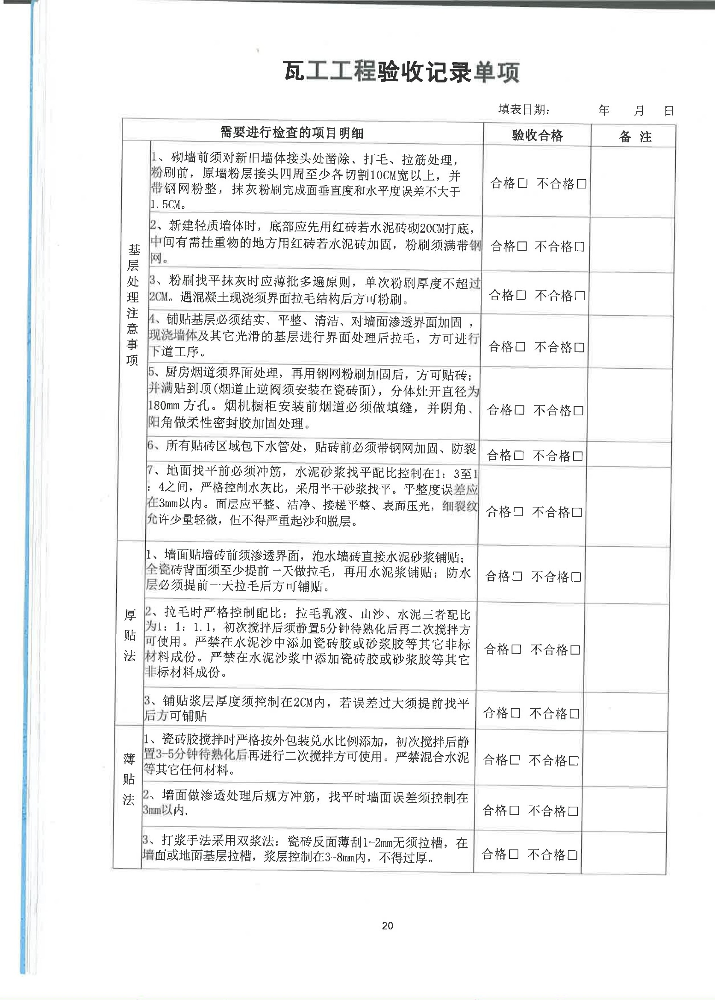

查看原始扫描页：瓦工验收第 2 页

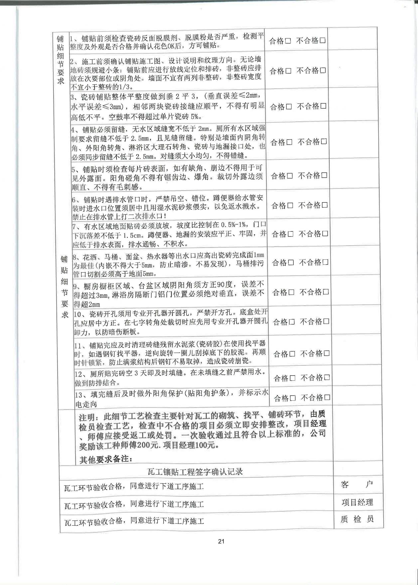

---

## 十六、公司购买主要材料品牌确认单（涂装）

填表日期：____年__月__日

| 材料名称 | 品牌 | 客户验收签字 | 项目经理签字 | 备注 |
| --- | --- | --- | --- | --- |
|  |  |  |  |  |
|  |  |  |  |  |
|  |  |  |  |  |
|  |  |  |  |  |
|  |  |  |  |  |
|  |  |  |  |  |
|  |  |  |  |  |
|  |  |  |  |  |
|  |  |  |  |  |
|  |  |  |  |  |
|  |  |  |  |  |
|  |  |  |  |  |
|  |  |  |  |  |
|  |  |  |  |  |
|  |  |  |  |  |

注明：保证配送到现场的材料品牌与设计及预算中要求的材料品牌一致。发现不一致必须立即更换。本次主要确认涂装材料。客户若更换品牌，必须由工程书面出具变更单并办理预算签字手续，口头承诺一概无效。

| 质检员签字 | 特殊说明 |
| --- | --- |
|  |  |

---

查看原始扫描页：公司购买主要材料品牌确认单（涂装）

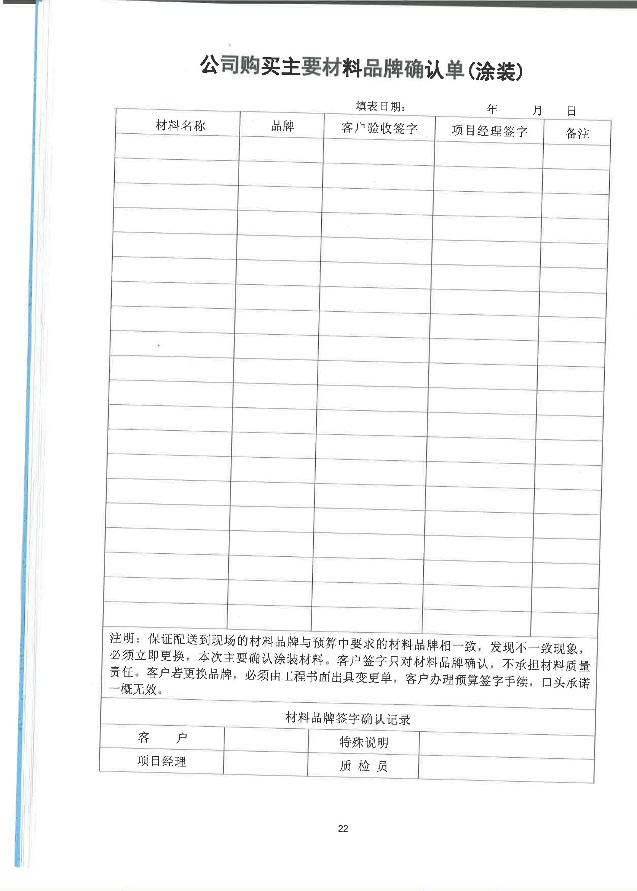

---

## 十七、涂装工艺饰面验收记录单项

填表日期：____年__月__日

| 序号 | 需要检查的项目明细 | 检查结果 |
| --- | --- | --- |
| 1 | 乳胶漆材料符合设计需求、预算需求。 | □ 合格　□ 不合格 |
| 2 | 冬、春季节涂饰施工，室内温度不得低于 5°C。 | □ 合格　□ 不合格 |
| 3 | 施工前做好柜边、窗边、门边分色纸保护，施工完成后及时清除。 | □ 合格　□ 不合格 |
| 4 | 基面提前一天做界面处理：天花原顶及现浇铝模墙体做石英砂拉毛；水泥粉刷层及石膏找平层做渗透界面强化。 | □ 合格　□ 不合格 |
| 5 | 墙面水管、电线开槽处用粉刷石膏填平并挂网；墙体和石膏板或石膏板接缝先用专用接缝材料处理，再带自粘网格布批刮嵌缝石膏找平。 | □ 合格　□ 不合格 |
| 6 | 腻子薄批多遍，每遍干透后进入下一道；底层完全找平后批面料；找平用找平砂浆或粗找平石膏，面料腻子不得用于找平。 | □ 合格　□ 不合格 |
| 7 | 门边、窗边、衣柜边、踢脚线处水平误差不大于 3mm；其他墙面 2m 靠尺内不大于 3mm，整面墙误差不大于 1cm；规方冲筋找平时垂直误差 ≤2mm、水平误差 ≤3mm。 | □ 合格　□ 不合格 |
| 8 | 腻子打磨使用强光照明，表面平整均匀；完成后清理粉尘，垃圾装袋清运。 | □ 合格　□ 不合格 |
| 9 | 乳胶漆兑水按厂家说明，常规体积比不超过 10%，特殊要求除外。 | □ 合格　□ 不合格 |
| 10 | 墙漆一底两面；底漆与面漆节点分开；底漆干透后检查、修补、打磨、清洁，再做面漆。 | □ 合格　□ 不合格 |
| 11 | 滚涂法：按 W 形将涂料大致涂在基层上，再上下、左右回滚均匀展开，最后按一定方向满滚；阴角及上下口用排笔刷齐。 | □ 合格　□ 不合格 |
| 12 | 刷涂法：先左后右、先上后下、先难后易、先边后面。 | □ 合格　□ 不合格 |
| 13 | 喷涂法：喷枪压力 0.4-0.8MPa；喷枪垂直墙面，距离约 500mm，匀速平移；两行重叠宽度约为喷涂宽度 1/3。 | □ 合格　□ 不合格 |
| 14 | 完成效果均匀，不得流坠、泛碱、透底；调色分层用弱粘性分色纸，分界顺直，完成后及时揭除；成品门柜、窗户、地板做好保护。 | □ 合格　□ 不合格 |
| 15 | 调色须按面积一次调足并略有余量；已调乳胶漆不得倒回未加水原装桶；开桶材料做好标记。 | □ 合格　□ 不合格 |
| 16 | 墙漆完成后关闭门窗自然阴干，不得风干。 | □ 合格　□ 不合格 |
| 17 | 每道工序在被下一道覆盖前须拍照传群；撤场整洁、材料堆放整齐、及时清场。 | □ 合格　□ 不合格 |

其他要求备注：________

| 人员 | 签字 | 特殊说明 |
| --- | --- | --- |
| 客户 |  |  |
| 项目经理 |  |  |
| 质检员 |  |  |

---

查看原始扫描页：涂装验收第 1 页

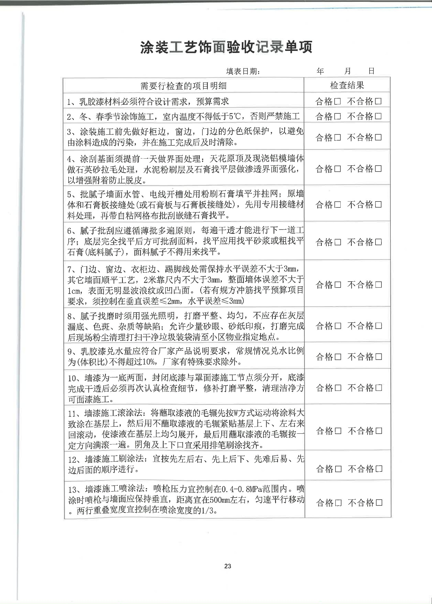

查看原始扫描页：涂装验收第 2 页

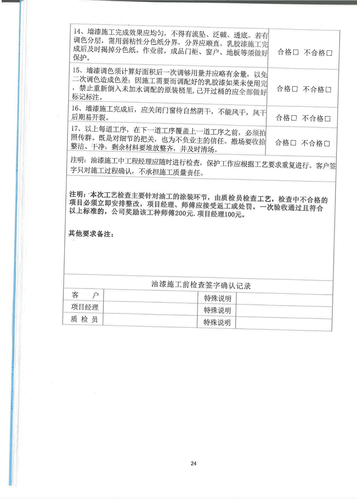

---

## 十八、成品家具安装质量检测表

安装负责人：________　电话：________

| 序号 | 检测项目 | 检查结果 |
| --- | --- | --- |
| 1 | 柜体表面干净，不得有划痕、锤印。 | □ 合格　□ 不合格 |
| 2 | 柜体安装牢固严密，边与墙缝基本一致，收口现场处理。 | □ 合格　□ 不合格 |
| 3 | 平开门门缝不大于 3mm，所有缝隙保持一致。 | □ 合格　□ 不合格 |
| 4 | 柜体侧面、正面垂直度偏差 2mm 以内。 | □ 合格　□ 不合格 |
| 5 | 抽屉开关灵活，面板比柜体低 1-2mm 并保持一致。 | □ 合格　□ 不合格 |
| 6 | 门页开关灵活，关闭严密，表面平整。 | □ 合格　□ 不合格 |
| 7 | 整个柜子的前边在一条线上。 | □ 合格　□ 不合格 |
| 8 | 整个柜子的外观颜色一致，并与图纸所标颜色一致。 | □ 合格　□ 不合格 |
| 9 | 柜体板间连接牢固、无缝隙。 | □ 合格　□ 不合格 |

客户签字：________　质检员签字：________

---

查看原始扫描页：成品家具安装质量检测表

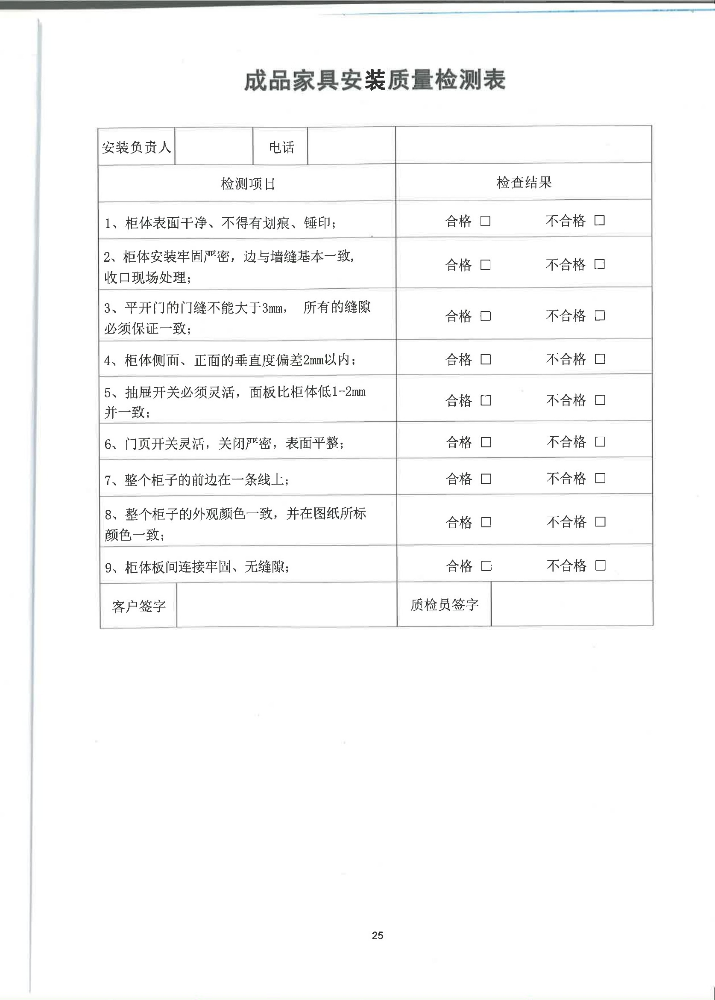

---

## 十九、橱柜安装质量检测表

安装负责人：________　电话：________

| 序号 | 检测项目 | 检查结果 |
| --- | --- | --- |
| 1 | 柜门缝隙均匀且不超过 3mm，无油漆流挂、色差、损坏。 | □ 合格　□ 不合格 |
| 2 | 台面接驳口无明显接口印，台面下必须通长加固。 | □ 合格　□ 不合格 |
| 3 | 台面表面和开孔处刨面光滑平整，平整度 ≤0.5mm。 | □ 合格　□ 不合格 |
| 4 | 包管板与台面的接口处，包管板位于台面挡水边里侧。 | □ 合格　□ 不合格 |
| 5 | 柜体连接用二合一配件螺丝固定，柜体开口处有防潮处理。 | □ 合格　□ 不合格 |
| 6 | 玻璃胶处理美观均匀且无灰尘。 | □ 合格　□ 不合格 |
| 7 | 所有螺丝安装到位、紧固、无偏斜，并确认是否为不锈钢螺丝。 | □ 合格　□ 不合格 |
| 8 | 同一铰链螺丝无色差，所有外露自攻螺丝有装饰盖。 | □ 合格　□ 不合格 |
| 9 | 所有五金配件开启灵活且无损伤。 | □ 合格　□ 不合格 |
| 10 | 拉手、铰链安装坚固，柜门反面无崩边。 | □ 合格　□ 不合格 |
| 11 | 水盆接口及下水无渗漏。 | □ 合格　□ 不合格 |
| 12 | 吊柜安装牢固，垂直度 2mm 内，柜底水平。 | □ 合格　□ 不合格 |
| 13 | 整体卫生干净，无明显积灰。 | □ 合格　□ 不合格 |
| 14 | 安装完后向客户介绍产品使用方法。 | □ 合格　□ 不合格 |

客户签字：________　质检员签字：________

---

查看原始扫描页：橱柜安装质量检测表

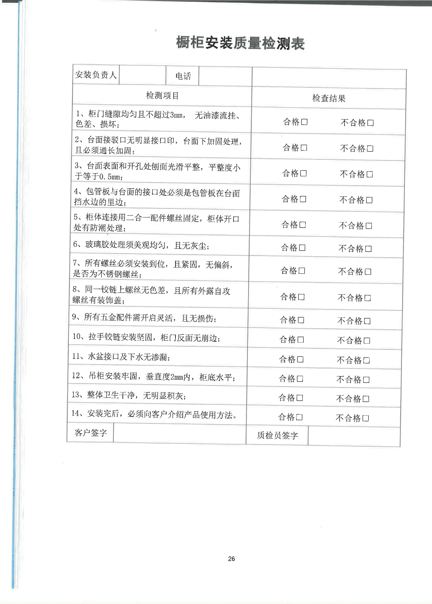

---

## 二十、工程延期确认单

| 工程地址 | 客户姓名 | 联系电话 | 项目经理 |
| --- | --- | --- | --- |
|  |  |  |  |

施工起止时间：________　延期时间：____天

| 主材延期品牌 | 主材延期时间 |
| --- | --- |
| ① | ____天 |
| ② | ____天 |

项目经理情况说明：________  
主材商情况说明：________

| 客户签字 | 主材商签字 | 项目经理签字 | 工程监理签字 | 工程对接人员签字 | 工程部总经理签字 |
| --- | --- | --- | --- | --- | --- |
|  |  |  |  |  |  |

附表 1：发函单  
附表 2：量尺函（附安装时间）

注明：非定制类主材如遇缺货、补货等特殊情况，自接函之日起 3 日内告知不计延期；超过 3 日可计算延期。所有材料延期须有公司发函单确认的延期单方可生效。

---

查看原始扫描页：工程延期确认单

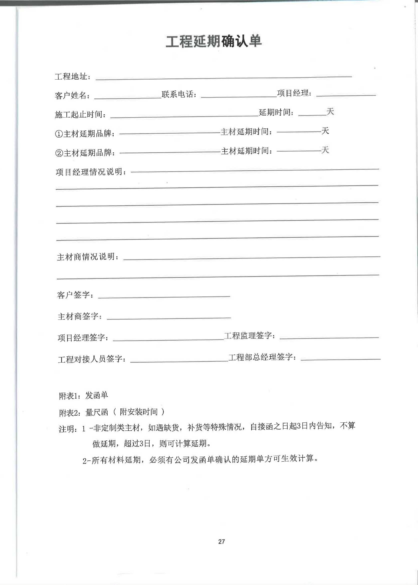

---

## 二十一、工地竣工验收表

填表日期：____年__月__日

| 业主 | 地址 | 项目经理 | 电话 |
| --- | --- | --- | --- |
|  |  |  |  |

| 设计师 | 预算员 | 客服经理 | 质检员 | 备注 |
| --- | --- | --- | --- | --- |
|  |  |  |  |  |

| 工种 | 验收项目 | 验收结果 |
| --- | --- | --- |
| 木工 | 柜门、房门、窗平整；无变形；边缝均匀。 | □ 合格　□ 不合格 |
| 木工 | 五金安装牢固、使用灵活、不挂碰。 | □ 合格　□ 不合格 |
| 木工 | 吊顶、墙面造型平整牢固；扣板吊顶平整；缝隙均匀；收口平齐。 | □ 合格　□ 不合格 |
| 木工 | 玻璃安装安全、牢固，开胶均匀。 | □ 合格　□ 不合格 |
| 泥工 | 墙、地砖平整；勾缝饱满；粘贴无空鼓；无缺棱掉角；无裂缝；坡向正确。 | □ 合格　□ 不合格 |
| 泥工 | 卫生间、阳台地漏在最低处，地面无积水。 | □ 合格　□ 不合格 |
| 泥工 | 洗手间、卫生间、厨房地面与房间、走廊地面高差保证在 10mm 以上。 | □ 合格　□ 不合格 |
| 水电 | 地漏、下水道排水顺畅、无阻塞；水龙头左热右冷。 | □ 合格　□ 不合格 |
| 水电 | 开关、插座同一房间高度差在 3cm 以内。 | □ 合格　□ 不合格 |
| 水电 | 灯具重量大于 3kg 时加膨胀螺丝加固；灯具安装水平、端正、平直。 | □ 合格　□ 不合格 |
| 墙漆 | 阴阳角顺直、平整；无砂眼、流挂；分色清晰；无划痕、无毛刺。 | □ 合格　□ 不合格 |
| 油漆 | 不透底、无流挂、无皱皮、无划痕。 | □ 合格　□ 不合格 |
| 洁具 | 安装牢固、平整、美观；下水管连接通畅无阻塞。 | □ 合格　□ 不合格 |
| 木地板 | 无缺棱掉角，平整，无划痕。 | □ 合格　□ 不合格 |

是否一次性通过验收：□ 是　□ 否  
参加验收人员签名：业主________　工程经理________  
验收日期：____年__月__日  
未通过验收整改项目：________  
整改完成需业主签字认可：________

---

查看原始扫描页：工地竣工验收表

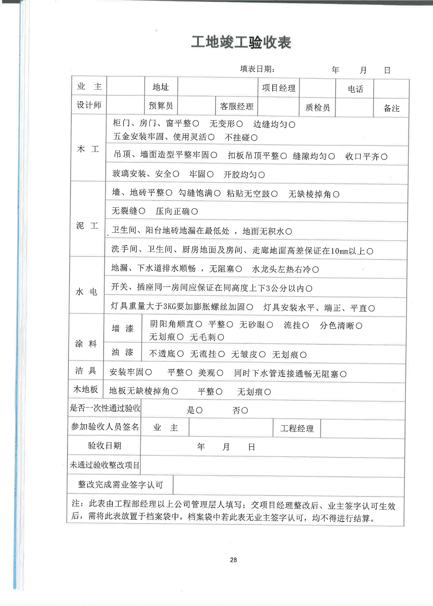

---

## 二十二、业主满意度、安全访问表

客户姓名：________　地址：________　电话：________

| 参加人员/项目 | 评价项目 | 很满意 | 满意 | 基本满意 | 不满意 | 备注 |
| --- | --- | --- | --- | --- | --- | --- |
| 设计师 | 效果 | □ | □ | □ | □ |  |
| 设计师 | 服务 | □ | □ | □ | □ |  |
| 预算师 | 造价 | □ | □ | □ | □ |  |
| 预算师 | 服务 | □ | □ | □ | □ |  |
| 质检员 | 质量 | □ | □ | □ | □ |  |
| 质检员 | 服务 | □ | □ | □ | □ |  |
| 项目经理-木工 | 质量 | □ | □ | □ | □ |  |
| 项目经理-镶贴工 | 质量 | □ | □ | □ | □ |  |
| 项目经理-涂裱工 | 质量 | □ | □ | □ | □ |  |
| 项目经理-水电工 | 质量 | □ | □ | □ | □ |  |
| 项目经理-水电工 | 服务 | □ | □ | □ | □ |  |
| 橱柜 | 质量 | □ | □ | □ | □ |  |
| 橱柜 | 服务 | □ | □ | □ | □ |  |
| 成品家具 | 质量 | □ | □ | □ | □ |  |
| 成品家具 | 服务 | □ | □ | □ | □ |  |
| 成品门 | 质量 | □ | □ | □ | □ |  |
| 成品门 | 服务 | □ | □ | □ | □ |  |
| 衣柜、推拉门、合金门等移门系列 | 质量 | □ | □ | □ | □ |  |
| 衣柜、推拉门、合金门等移门系列 | 服务 | □ | □ | □ | □ |  |
| 地砖 | 质量 | □ | □ | □ | □ |  |
| 地砖 | 服务 | □ | □ | □ | □ |  |
| 墙砖 | 质量 | □ | □ | □ | □ |  |
| 墙砖 | 服务 | □ | □ | □ | □ |  |
| 木地板 | 质量 | □ | □ | □ | □ |  |
| 木地板 | 服务 | □ | □ | □ | □ |  |
| 洁具 | 质量 | □ | □ | □ | □ |  |
| 洁具 | 服务 | □ | □ | □ | □ |  |
| 开关面板、五金 | 质量 | □ | □ | □ | □ |  |
| 开关面板、五金 | 服务 | □ | □ | □ | □ |  |
| 灯具 | 质量 | □ | □ | □ | □ |  |
| 灯具 | 服务 | □ | □ | □ | □ |  |
| 工期 | 评价 | □ | □ | □ | □ |  |
| 材料质量 | 评价 | □ | □ | □ | □ |  |

业主意见：________  
业主签名：________　日期：____年__月__日

### 安全警示

为保证入住后没有安全隐患，请在验收时与项目经理共同检查：

1. 公司规定重量在 3kg 以上的吊灯安装时必须打膨胀螺丝。  
   - 您家有无 3kg 以上的吊灯：□ 有　□ 无　业主签名：________  
   - 如有，安装时是否打膨胀螺丝：□ 有　□ 无　业主签名：________
2. 墙面或顶部如安装大面积玻璃或大理石等，须要求项目经理说明安装方法，以确保安全。

客户签名：________  
项目经理签名：________　质检员签名：________  
验收负责人签名：________

---

查看原始扫描页：业主满意度、安全访问表第 1 页

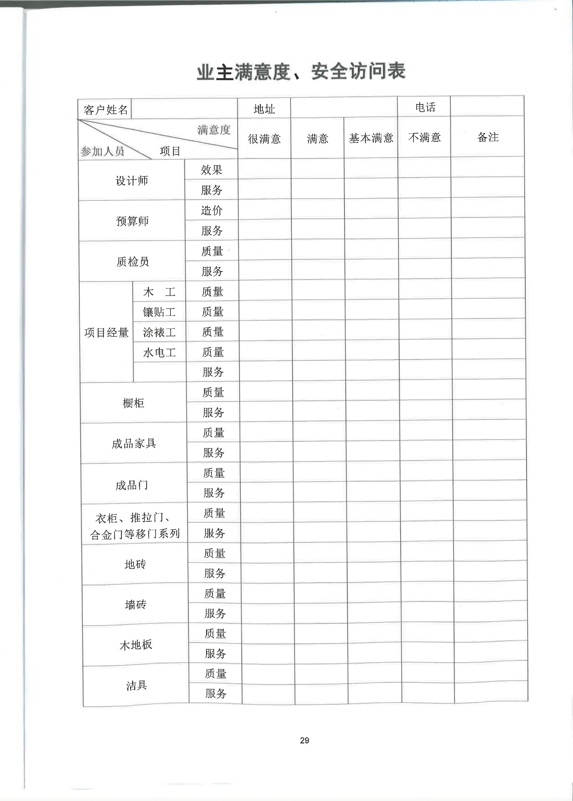

查看原始扫描页：业主满意度、安全访问表第 2 页

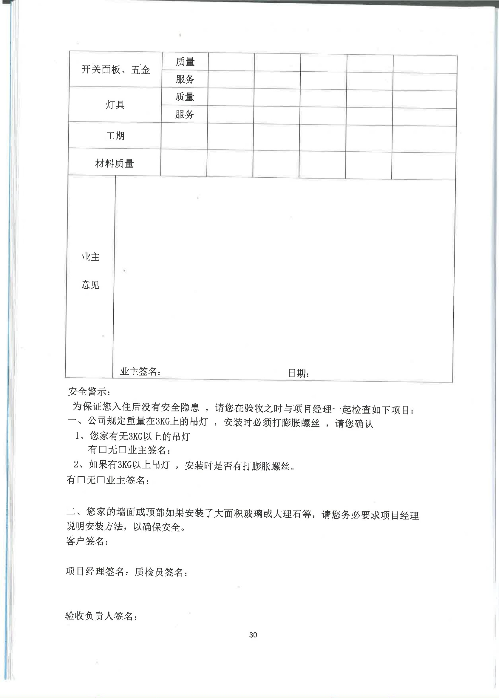

---

## 二十三、工程管理日志

日期：____年__月__日　星期：____　天气情况：________

| 记录项目 | 检查/记录内容 | 签字或结果 |
| --- | --- | --- |
| 上次工地检查情况的复检 |  | 质检员签字： |
| 本次工程检查情况 |  |  |
| 工地标识 |  |  |
| 现场卫生 |  |  |
| 工艺质量 |  |  |
| 与客户联系情况 |  | 客户满意度： |
| 本次验收需要整改的项目 |  | 整改完成时间：____；项目经理签字：____ |
| 主材情况说明 |  |  |
| 本次工地安排记录 |  |  |
| 工地变更项目记录 |  |  |

业主签字：________　项目经理签字：________　质检员签字：________  
日期：____年__月__日

要求：

1. 工程管理人员每次上工地必须对现场、工艺、进度进行监督拍照。
2. 工程管理人员每次上工地必须和客户取得联系，汇报工地进度，了解客户满意度。

---

查看原始扫描页：工程管理日志

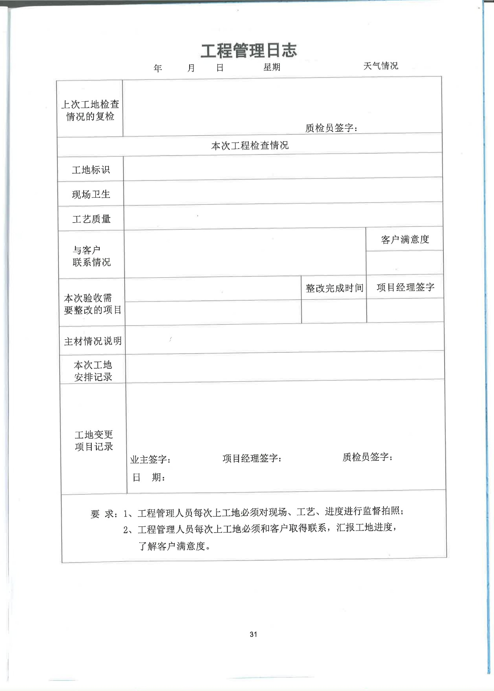

