# 装修宝典 2.0

> 源文件：《抖音岳阳天品邵工-装修宝典2.0.pdf》  
> 扫描跨页：56 页  
> 转换方式：每个 PDF 跨页保留为无损 PNG，并附 macOS Vision 中文 OCR 文字。  
> 注：原 PDF 为扫描件且无文字层；OCR 未经逐字人工校对，以对应扫描图为准。

---

## 扫描页 01

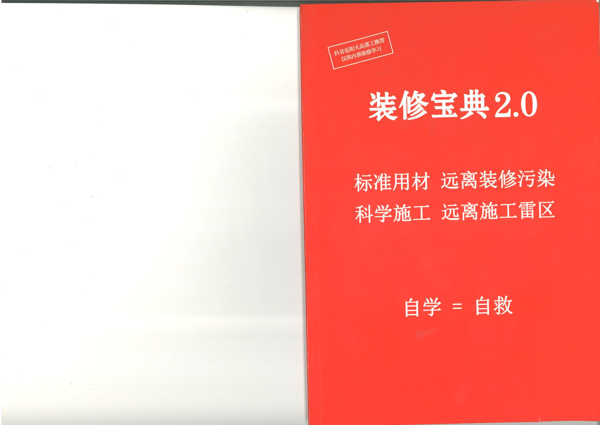

### OCR 文字

抖音岳阴天品邵工推荐  
仅供内部装修学习  
装修宝典2.0  
标准用材 远离装修污染  
科学施工 远离施工雷区  
自学=自救  

---

## 扫描页 02

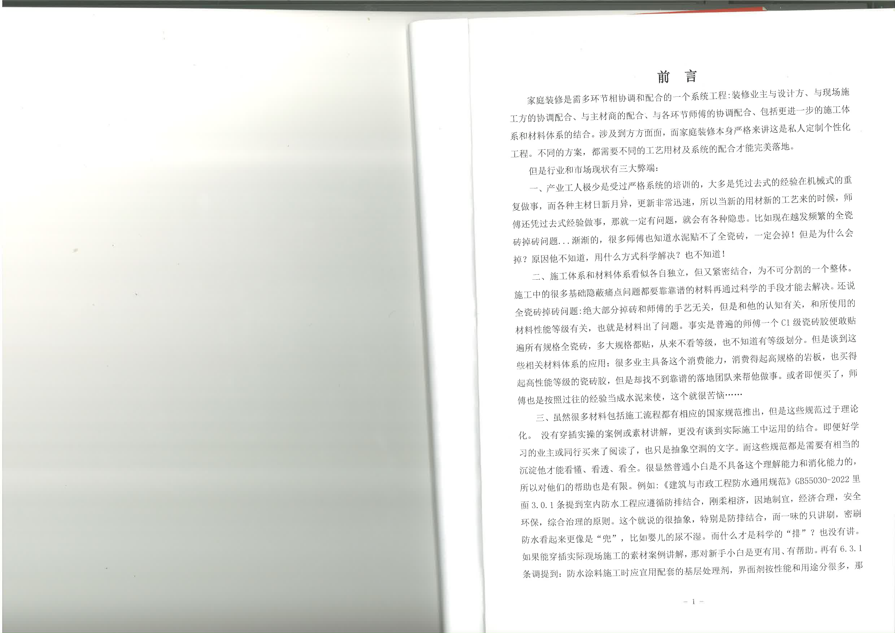

### OCR 文字

前言  
家庭装修是需多环节相协调和配合的一个系统工程：装修业主与设计方、与现场施  
工方的协调配合、与主材商的配合、与各环节师傅的协调配合、包括更进一步的施工体  
系和材料体系的结合。涉及到方方面面，而家庭装修本身严格来讲这是私人定制个性化  
工程。不同的方案，都需要不同的工艺用材及系统的配合才能完美落地。  
但是行业和市场现状有三大弊端：  
一、产业工人极少是受过严格系统的培训的，大多是凭过去式的经验在机械式的重  
复做事，而各种主材日新月异，更新非常迅速，所以当新的用材新的工艺来的时候，师  
傅还凭过去式经验做事，那就一定有问题，就会有各种隐患。比如现在越发频繁的全瓷  
砖掉砖问题•渐渐的，很多师傅也知道水泥贴不了全瓷砖，一定会掉！但是为什么会  
掉？原因他不知道，用什么方式科学解决？也不知道！  
二、施工体系和材料体系看似各自独立，但又紧密结合，为不可分割的一个整体。  
施工中的很多基础隐蔽痛点问题都要靠靠谱的材料再通过科学的手段才能去解决。还说  
全瓷砖掉砖问题：绝大部分掉砖和师傅的手艺无关，但是和他的认知有关，和所使用的  
材料性能等级有关，也就是材料出了问题。事实是普遍的师傅一个CI级瓷砖胶便敢贴  
遍所有规格全瓷砖，多大规格都贴，从来不看等级，也不知道有等级划分。但是谈到这  
些相关材料体系的应用：很多业主具备这个消费能力，消费得起高规格的岩板，也买得  
起高性能等级的瓷砖胶，但是却找不到靠谱的落地团队来帮他做事。或者即便买了，师  
傅也是按照过往的经验当成水泥来使，这个就很苦恼⋯••  
三、虽然很多材料包括施工流程都有相应的国家规范推出，但是这些规范过于理论  
化。没有穿插实操的案例或素材讲解，更没有谈到实际施工中运用的结合。即便好学  
习的业主或同行买来了阅读了，也只是抽象空洞的文字。而这些规范都是需要有相当的  
沉淀他才能看懂、看透、看全。很显然普通小白是不具备这个理解能力和消化能力的，  
所以对他们的帮助也是有限。例如：《建筑与市政工程防水通用规范》GB55030-2022 里  
面3.0.1条提到室内防水工程应遵循防排结合，刚柔相济，因地制宜，经济合理，安全  
环保，综合治理的原则。这个就说的很抽象，特别是防排结合，而一味的只讲刷，密刷  
防水看起来更像是“兜”，比如婴儿的尿不湿。而什么才是科学的“排”？也没有讲。  
如果能穿插实际现场施工的素材案例讲解，那对新手小白是更有用、有帮助。再有6.3.1  
条调提到：防水涂料施工时应宜用配套的基层处理剂，界面剂按性能和用途分很多，那  
1一  

---

## 扫描页 03

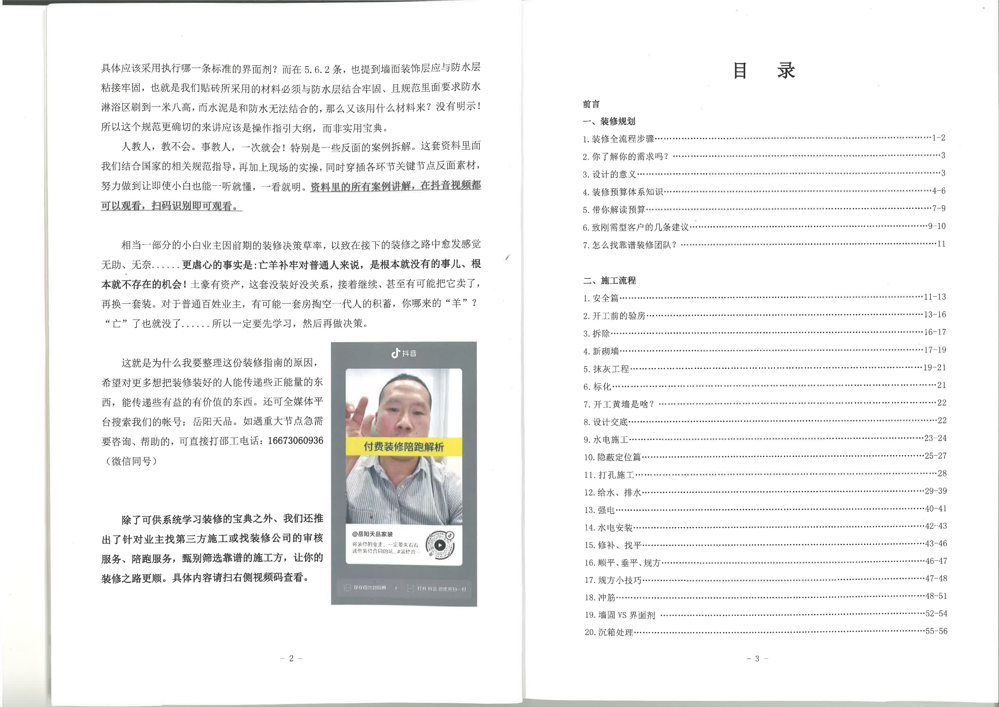

### OCR 文字

具体应该采用执行哪一条标准的界面剂？而在5.6.2条，也提到墙面装饰层应与防水层  
粘接牢固，也就是我们贴砖所采用的材料必须与防水层结合牢固、且规范里面要求防水  
淋浴区刷到一米八高，而水泥是和防水无法结合的，那么又该用什么材料来？没有明示！  
所以这个规范更确切的来讲应该是操作指引大纲，而非实用宝典。  
人教人，教不会。事教人，一次就会！特别是一些反面的案例拆解。这套资料里面  
我们结合国家的相关规范指导，再加上现场的实操，同时穿插各环节关键节点反面素材，  
努力做到让即使小白也能一听就懂，一看就明。资料里的所有案例讲解，在抖音视频都  
可以观看，扫码识别即可观看。  
相当一部分的小白业主因前期的装修决策草率，以致在接下的装修之路中愈发感觉  
无助、无奈•更虐心的事实是：亡羊补牢对普通人来说，是根本就没有的事儿、根  
本就不存在的机会！土豪有资产，这套没装好没关系，接着继续、甚至有可能把它卖了，  
再换一套装。对于普通百姓业主，有可能一套房掏空一代人的积蓄，你哪来的“羊”？  
“亡”了也就没了...所以一定要先学习，然后再做决策。  
小抖音  
这就是为什么我要整理这份装修指南的原因，  
希望对更多想把装修装好的人能传递些正能量的东  
西，能传递些有益的有价值的东西。还可全媒体平  
台搜索我们的帐号：岳阳天品。如遇重大节点急需  
要咨询、帮助的，可直接打邵工电话：16673060936  
付费装修陪跑解析  
（微信同号）  
除了可供系统学习装修的宝典之外、我们还推  
出了针对业主找第三方施工或找装修公司的审核  
@岳阳天品家装  
将装修的业主，  
一作要深白阿  
这些表修合同的坑 #装修命  
服务、陪跑服务，甄别筛选靠谱的施工方，让你的  
装修之路更顺。具体内容请扫右侧视频码查看。  
E 健有图片到影期 打那 具的 搜泰取4一月  
\-2=  
目录  
前言  
一、装修规划  
1\. 装修全流程步骤⋯  
…1-2  
2\. 你了解你的需求吗？•  
…•..3  
3\. 设计的意义⋯…  
4.装修预算体系知识⋯•  
：4-6  
5\. 带你解读预算……  
：7-9  
6\. 致刚需型客户的几条建议•  
9-10  
7\. 怎么找靠谱装修团队？…  
⋯⋯•11  
二、施工流程  
1\. 安全篇⋯•  
…11-13  
2.开工前的验房⋯  
•13-16  
3.拆除⋯  
⋯16-17  
4.新砌墙  
•17-19  
5\. 抹灰工程•  
：19-21  
6\. 标化⋯  
：21  
7\. 开工黄墙是啥？•  
…22  
8\. 设计交底⋯  
9.水电施工⋯  
⋯•23-24  
10\. 隐蔽定位篇•  
•25-27  
11\. 打孔施工⋯  
28  
12.给水、排水⋯⋯  
……29-39  
13.强电⋯…  
…40-41  
14.水电安装•  
⋯•42-43  
15.修补、找平…  
•••43-46  
16\. 顺平、垂平、规方⋯•  
：46-47  
17\. 规方小技巧⋯•  
••47-48  
18.冲筋⋯•••  
：48-51  
19.墙固VS界面剂  
：52-54  
20\. 沉箱处理⋯•  
：55-56  
\- 3  

---

## 扫描页 04

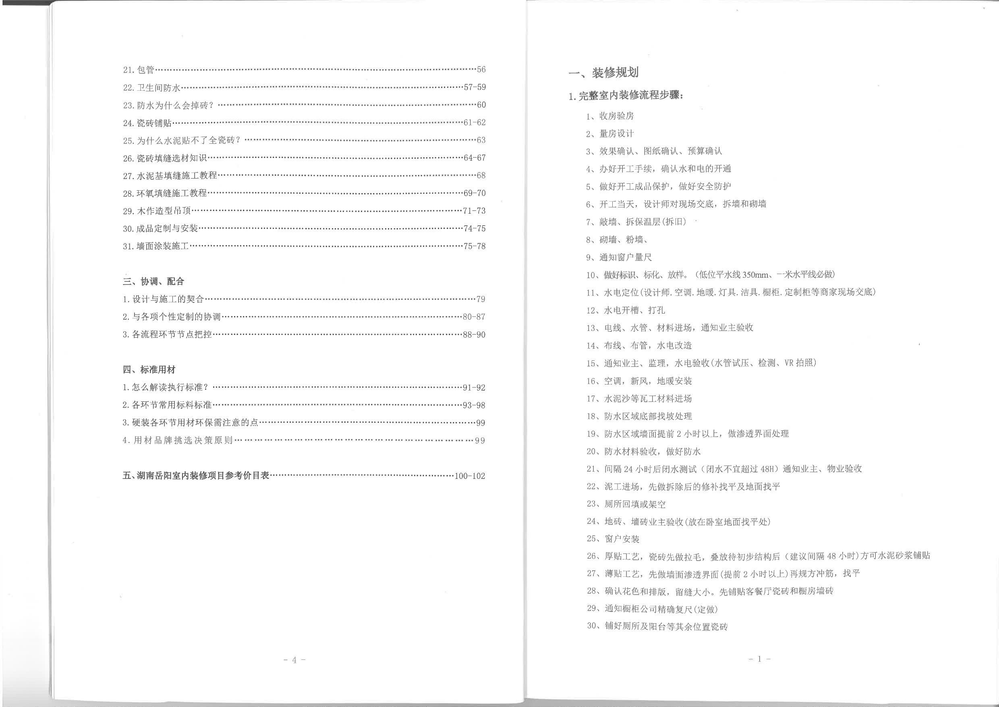

### OCR 文字

21.包管…  
⋯56  
22\. 卫生间防水⋯  
57-59  
23\. 防水为什么会掉砖？  
••60  
24\. 瓷砖铺贴⋯⋯  
•61-62  
25.为什么水泥贴不了全瓷砖？…  
••53  
26\. 瓷砖填缝选材知识⋯•  
•64-67  
27.水泥基填缝施工教程⋯  
•••68  
28\. 环氧填缝施工教程•  
：69-70  
29\. 木作造型吊顶⋯  
⋯71-73  
30.成品定制与安装•  
：74-75  
31\. 墙面涂装施工⋯  
：75-78  
三、协调、配合  
1\. 设计与施工的契合：  
：79  
2.与各项个性定制的协调  
•80-87  
3\. 各流程环节节点把控⋯  
•88-90  
四、标准用材  
1.怎么解读执行标准？…  
…91-92  
2\. 各环节常用标料标准⋯•  
：⋯93-98  
3\. 硬装各环节用材环保需注意的点⋯•  
•••••••••••••••••••••••••99  
五、湖南岳阳室内装修项目参考价目表⋯  
•100-102  
\-4-  
一、装修规划  
1.完整室内装修流程步骤：  
1、收房验房  
2、量房设计  
3、效果确认、图纸确认、预算确认  
4、办好开工手续，确认水和电的开通  
5、做好开工成品保护，做好安全防护  
6、开工当天，设计师对现场交底，拆墙和砌墙  
7、敲墙、拆保温层（拆旧），  
8、砌墙、粉墙、  
9、通知窗户量尺  
10、做好标识、标化、放样。（低位平水线350mm、一米水平线必做）  
11、水电定位（设计师.空调.地暖.灯具，洁具.橱柜.定制柜等商家现场交底）  
12、水电开槽、打孔  
13、电线、水管、材料进场，通知业主验收  
14、布线、布管，水电改造  
15、通知业主、监理，水电验收（水管试压、检测、VR拍照）  
16、空调，新风，地暖安装  
17、水泥沙等瓦工材料进场  
18、防水区域底部找坡处理  
19、防水区域墙面提前2小时以上，做滲透界面处理  
20、防水材料验收，做好防水  
21、间隔24小时后闭水测试（闭水不宜超过48H）通知业主、物业验收  
22、泥工进场，先做拆除后的修补找平及地面找平  
23、厕所回填或架空  
24、地砖、墙砖业主验收（放在卧室地面找平处）  
25、窗户安装  
26、厚贴工艺，瓷砖先做拉毛，叠放待初步结构后（建议间隔 48 小时）方可水泥砂浆铺贴  
27、薄贴工艺，先做墙面渗透界面（提前2小时以上）再规方冲筋，找平  
28、确认花色和排版，留缝大小。先铺贴客餐厅瓷砖和橱房墻砖  
29、通知橱柜公司精确复尺（定做）  
30、铺好厕所及阳台等其余位置瓷砖  
H1-  

---

## 扫描页 05

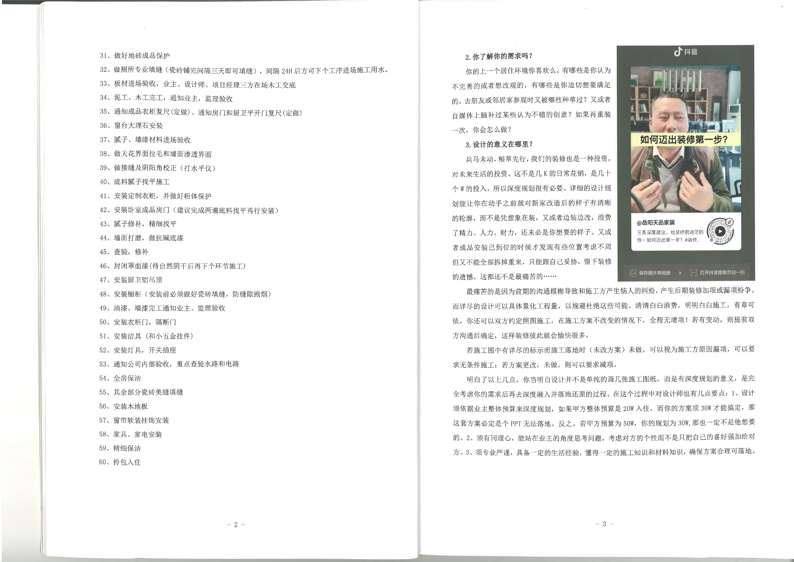

### OCR 文字

31、做好地砖成品保护  
32、做厕所专业填缝（瓷砖铺完间隔三天即可填缝），间满24H后方可下个工序进场施工用水。  
33、板材进场验收，业主、设计师、项目经理三方在场木工交底  
34、泥工、木工完工，通知业主，监理验收  
35、通知成品衣柜复尺（定做）、通知房门和厨卫平开门复尺（定做）  
36、窗台大理石安装  
37、腻子、墻漆材料进场验收  
38、做天花界面拉毛和墙面渗透界面  
39、做接缝及阴阳角校正（打水平仪）  
40、底料腻子找平施工  
41、安装定制衣柜，并做好柜体保护  
42、安装卧室成品房门（建议完成两遍底料找平再行安装）  
43、腻子修补，精细找平  
44、墻面打磨，做抗碱底漆  
45、查验，修补  
46、封闭罩面漆（待自然阴干后再下个环节施工）  
47、安装厨卫铝吊顶  
48、安装橱柜（安装前必须做好瓷砖填缝，防缝隙跑烟）  
49、油漆、墻漆完工通知业主、监理验收  
50、安装衣柜门，隔断门  
51、安装洁具（和小五金挂件）  
52、安装灯具，开关插座  
53、通知公司内部验收，重点查验水路和电路  
54、全房保洁  
55、其余部分瓷砖美缝填缝  
56、安装木地板  
57、窗帘软装挂饰安装  
58、家具、家电安装  
59、精细保洁  
60、拎包入住  
\- 2-  
2.你了解你的需求吗？  
J抖實  
你的上一个居住环境你喜欢么，有哪些是你认为  
不完善的或者想改观的，有哪些是你迫切想要满足  
的，去朋友或邻居家参观时又被哪些种草过？又或者  
自媒体上脑补过某些认为不错的创意？如果再重装  
一次，你会怎么做？  
如何迈出装修第一步？  
3.设计的意义在哪里？  
兵马未动，粮草先行，我们的装修也是一种投资，  
对未来生活的投资。这不是几K的日常花销，是几十  
个留的投入，所以深度规划很有必要。详细的设计规  
划能让你在动手之前就对新家改造后的样子有清晰  
的轮廓，而不是凭想象在装，又或者边装边改，浪费  
@岳阳天品家装  
了精力、人力、财力，还未必是你想要的样子。又或  
三条深度建议，给装修前迷茫的  
你，如何迈出第一步？#装修，  
者成品安装己到位的时候才发现有些位置考虑不周  
但又不能全部拆掉重来，只能跟自己妥协，留下装修  
的遗憾。这都还不是最痛苦的⋯⋯  
图 保存固片到相期•打折科音授索页扫一扫  
最痛苦的是因为前期的沟通模糊导致和施工方产生恼人的纠纷，产生后期装修加项或漏项纷争。  
而详尽的设计可以具体量化工程量，以规避杜绝这些可能。清清白白消费，明明白白施工，有章可  
依，你还可以双方约定照图施工，在施工方案不改变的情况下，全程无增项！若有变动，则提前双  
方沟通后确定，这样装修彼此就会愉快很多。  
若施工图中有详尽的标示而施工落地时（未改方案）未做，可以视为施工方原因漏项，可以要  
求无条件施工；若方案更改，未做，则可以要求减项。  
明白了以上几点，你当明白设计并不是单纯的画几张施工图纸，而是有深度规划的意义，是完  
全考虑你的需求后再去深度融入并落地还原的过程。在这个过程中对设计师也有几点要点：1、设计  
须依据业主整体预算来深度规划，如果甲方整体预算是20W 入住，而你的方案须30W才能搞定，那  
这套方案必定是个 PPT无法落地。反之，若甲方预算为 5OW，你的规划为30W，那也一定不是他想要  
的。2、须有同理心，能站在业主的角度思考问题，考虑对方的个性而不是只把自己的喜好强加给对  
方。3、须专业严谨，具备一定的生活经验，懂得一定的施工知识和材料知识，确保方案合理可落地。  
\--3  

---

## 扫描页 06

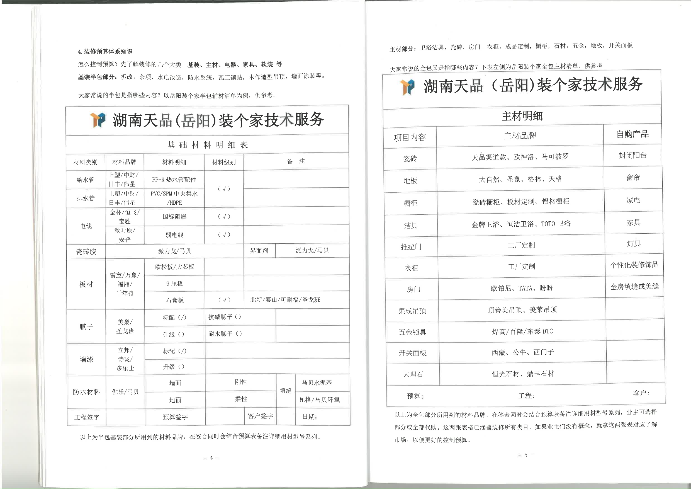

### OCR 文字

4.装修预算体系知识  
怎么控制预算？先了解装修的几个大类 基装、主材、电器、家具、软装 等  
基装半包部分：拆改，杂项，水电改造，防水系统，瓦工镶贴，木作造型吊顶，墙面涂装等。  
大家常说的半包是指哪些内容？以岳阳装个家半包辅材清单力例，供参考。  
）P 湖南天品（岳阳）装个家技术服务  
基础材料明细表  
材料类别  
材料品牌  
材料明细  
材料级别  
备注  
上塑/中财/  
给水管  
PP-R 热水管配件  
日丰/伟星  
（/）  
上塑/中财/  
PVC/SPM 中央集水  
排水管  
日丰/伟星  
/HDPE  
金杯/恒飞/  
国标阻燃  
（人）  
宝胜  
电线  
秋叶原/  
弱电线  
（/）  
安普  
瓷砖胶  
派力戈/马贝  
界面剂  
派力戈/马贝  
欧松板/大芯板  
雪宝/万象/  
板材  
福湘/  
9 厘板  
千年丹  
石膏板  
（/）  
北新/泰山/可耐福/圣戈班  
标配（/）  
抗碱腻子（）  
美巢/  
腻子  
圣戈班  
升级（）  
耐水腻子（）  
立邦/  
标配（/）  
墻漆  
诗珑/  
多乐士  
升级（）  
墙面  
刚性  
马贝水泥基  
防水材料  
伽乐/马贝  
填缝  
地面  
柔性  
瓦格/马贝环氧  
工程签字  
预算签字  
客户签字  
日期：  
以上为半包基装部分所用到的材料品牌，在签合同时会结合预算表备注详细用材型号系列。  
= 4-  
主材部分：卫浴洁具，瓷砖，房门，衣柜，成品定制，橱柜，石材，五金，地板，开关面板  
大家常说的全包又是指哪些内容？下表左侧为岳阳装个家全包主材清单，供参考  
湖南天品（岳阳）装个家技术服务  
主材明细  
项目内容  
主材品牌  
自购产品  
瓷砖  
天品渠道款、欧神洛、马可波罗  
封闭阳台  
地板  
大自然、圣象、格林、天格  
窗帘  
橱柜  
瓷砖橱柜、板材定制、铝材橱柜  
家电  
洁具  
金牌卫浴、恒洁卫浴、TOTO卫浴  
家具  
推拉门  
工厂定制  
灯具  
衣柜  
工厂定制  
个性化装修饰品  
房门  
欧铂尼、TATA、盼盼  
全房填缝或美缝  
集成吊顶  
顶善美吊顶、美莱吊顶  
五金锁具  
焊高/百隆/东泰 DTC  
开关面板  
西蒙、公牛、西门子  
大理石  
恒光石材、鼎丰石材  
预算：  
工程：  
客户：  
以上为全包部分所用到的材料品牌，在签合同时会结合预算表备注详细用材型号系列，业主可选择  
部分或全部代购。这两张表格已涵盖装修所有类目，如果业主们没有概念，就拿这两张表对应了解  
市场，以便更好的控制预算。  
\-5-  

---

## 扫描页 07

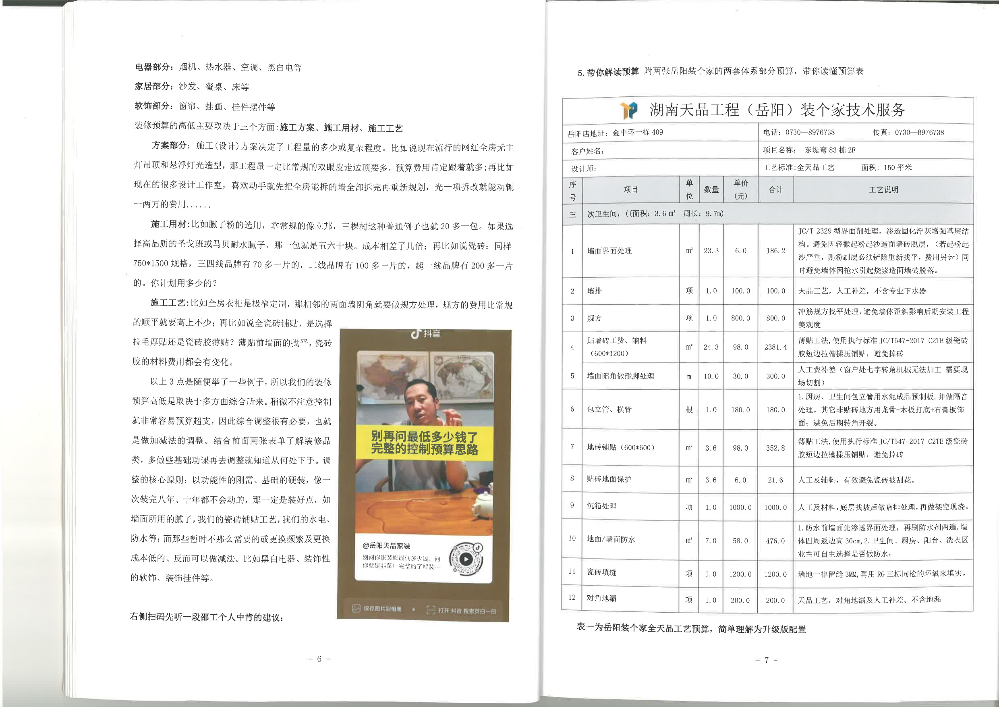

### OCR 文字

电器部分：烟机、热水器、空调、黑白电等  
家居部分：沙发、餐桌、床等  
软饰部分：窗帘、挂画、挂件摆件等  
装修预算的高低主要取决于三个方面：施工方案、施工用材、施工工艺  
方案部分：施工（设计）方案决定了工程量的多少或复杂程度。比如说现在流行的网红全房无主  
灯吊顶和悬浮灯光造型，那工程量一定比常规的双眼皮走边顶要多，预算费用肯定跟着就多：再比如  
现在的很多设计工作室，喜欢动手就先把全房能拆的墙全部拆完再重新规划，光一项拆改就能动辄  
一两万的费用.  
施工用材：比如腻子粉的选用，拿常规的像立邦，三棵树这种普通例子也就20多一包。如果选  
择高品质的圣戈班或马贝耐水腻子，那一包就是五六十块。成本相差了几倍；再比如说瓷砖：同样  
750*1500 规格，三四线品牌有 70多一片的，二线品牌有100多一片的，超一线品牌有200多一片  
的。你计划用多少的？  
施工工艺：比如全房衣柜是极窄定制，那相邻的两面墙阴角就要做规方处理，规方的费用比常规  
的顺平就要高上不少；再比如说全瓷砖铺贴，是选择  
拉毛厚贴还是瓷砖胶薄贴？薄贴前墻面的找平，瓷砖  
胶的材料费用都会有变化。  
以上3点是随便举了一些例子，所以我们的装修  
预算高低是取决于多方面综合所来。稍微不注意控制  
就非常容易预算超支，因此综合调整很有必要，也就  
是做加减法的调整。结合前面两张表单了解装修品  
别再问最低多少钱了  
完整的控制预算思路  
类，多做些基础功课再去调整就知道从何处下手。调  
整的核心原则：以功能性的刚需、基础的硬装，像一  
次装完八年、十年都不会动的，那一定是装好点，如  
墙面所用的腻子，我们的瓷砖铺贴工艺，我们的水电、  
防水等；而那些暂时不那么需要的或更换频繁及更换  
@岳阳天品家装  
成本低的、反而可以做减法。比如黑白电器、装饰性  
别问你家装修最低多少线、问  
你就是非菜！完終的了解装  
的软饰、装饰挂件等。  
图 环存侧片到捐册  
•S拉料着邀烤饭均一百  
右侧扫码先听一段邵工个人中肯的建议：  
15L  
5.带你解读预算 附两张岳阳装个家的两套体系部分预算，带你读懂预算表  
湖南天品工程（岳阳）装个家技术服务  
岳阳店地址：金中环一栋 409  
电话：0730-8976738  
传真：0730—8976738  
客户姓名：  
项目名称： 东堤弯83 栋 2F  
设计师：  
工艺标准：全天品工艺  
面积：150平米  
序  
单  
单价  
项目  
数量  
合计  
工艺说明  
号  
位  
（元）  
次卫生间：（（面积：3.6 m周长：9.7m）  
JC/T 2329 型界面剂处理，渗透固化浮灰增强基层结  
1  
墙面界面处理  
m 23.3  
构。避免因轻微起粉起沙造面墙砖脱层，（若起粉起  
6.0  
186.2  
沙严重，则粉刷层必须铲除重新找平，费用另计）同  
时避免墻体因抢水引起烧浆造面墙砖脱落。  
墙排  
项  
1.0  
100.0  
100.0  
天品工艺，人工补差，不含专业下水器  
冲筋规方找平处理，避免墻体歪斜影响后期安装工程  
3  
规方  
项  
1.0  
800.0  
800.0  
美观度  
贴墙砖工费、辅料  
薄贴工法，使用执行标准JC/T547-2017 C2TE 级瓷砖  
m？  
24.3  
98.0  
2381.4  
（600*1200）  
胶短边拉槽揉压铺贴，避免掉砖  
人工费补差（窗户处七字转角机械无法加工 需要现  
墻面阳角做碰脚处理  
m  
10.0  
30.0  
300.0  
场切割）  
1.厨房、卫生间包立管用水泥成品预制板，并做隔音  
包立管、横管  
根  
1.0  
180.0  
180.0  
处理。其它非贴砖地方用龙骨+木板打底+石膏板饰  
面；避免后期转角开裂。  
薄贴工法，使用执行标准 JC/T547-2017 C2TE 级瓷砖  
地砖铺贴（600*600）  
m”  
3.6  
98.0  
352.8  
胶短边拉槽揉压铺贴，避免掉砖  
贴砖地面保护  
mn  
3.6  
6.0  
21.6  
人工及辅料，有效避免瓷砖被刮花。  
沉箱处理  
项  
1.0  
1000.0  
1000.0  
「人工及材料，底层找坡后做暗排处理，再做架空现浇。  
1.防水前墙面先滲透界面处理，再刷防水剂两遍，墙  
10  
地面/墻面防水  
7.0  
58.0  
476.0  
体四周返边高 30cm, 2. 卫生间、厨房、阳台、洗衣区  
业主可自主选择是否做防水；  
11  
瓷砖填缝  
项  
1.0  
1200.0  
1200.0  
墙地一律留缝 3MM，再用 RG三标同检的环氧来填实。  
12  
对角地漏  
项1.0 200.0  
200.0  
天品工艺，对角地漏及人工补差。不含地漏  
表一为岳阳装个家全天品工艺预算，简单理解为升级版配置  
\-7-  

---

## 扫描页 08

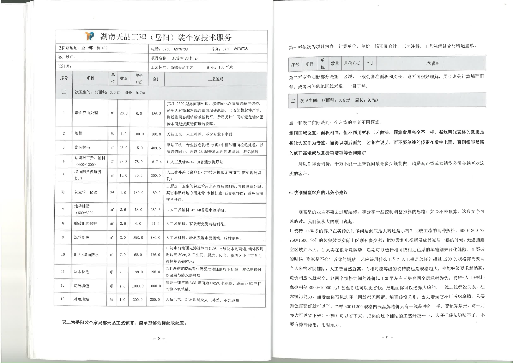

### OCR 文字

湖南天品工程（岳阳）装个家技术服务  
岳阳店地址：金中环一栋 409  
电话：0730-8976738  
传真：0730-8976738  
客户姓名：  
项目名称：东堤弯83栋2F  
设计师：  
工艺标准：局部天品工艺  
面积：150平米  
单  
序号  
项目  
数量  
单价  
位  
（元）  
合计  
工艺说明  
次卫生间：（（面积：3.6 m周长：9.7m）  
JC/T 2329型界面剂处理，渗透固化浮灰增强基层结构。  
1  
墙面界面处理  
避免因轻微起粉起沙造面墙砖脱层，（若起粉起沙严重，  
m 23.3  
6.0  
186.2  
则粉刷层必须铲除重新找平，费用另计）同时避免墙体因  
抢水引起烧浆造面墙砖脱落。  
2  
墙排  
项  
1.0  
100.0  
100.0  
天品工艺，人工补差，不含专业下水器  
瓷砖拉毛  
m26.9  
厚贴工法，专业拉毛乳液+水泥+中粗砂粗面拉毛处理，以  
15.0  
403.5  
增强锚固力，再以42.5#普通水泥砂浆厚贴，避免掉砖  
贴墙砖工费、辅料  
4  
m  
23.3  
78.0  
（600*1200）  
1817.4  
1\. 人工及辅料 42.5#普通水泥厚贴  
墻面阳角做碰脚  
5  
人工费补差（窗户处七字转角机械无法加工 需要现场切  
处理  
10.0  
30.0  
300.0  
割）  
1.厨房、卫生间包立管用水泥成品预制板，并做隔音处理。  
包立管、横管  
根|  
1.0  
180.0  
180.0  
其它非贴砖地方用龙骨+木板打底+石膏板饰面：避免后期  
转角开裂。  
地砖铺贴  
m  
3.6  
78.0  
280.8  
1.人工及辅料 42.5#普通水泥厚贴。  
（600*600）  
贴砖地面保护  
m  
3.6  
6.0  
21.6  
人工及辅料，有效避免瓷砖被刮花。  
沉箱处理  
2.0  
390.0  
780.0  
人工及材料。轻质发泡水泥回填，暗排处理。  
1.防水前墙面先渗透界面处理，再刷防水剂两遍，墙体四周  
10  
地面/墙面防水  
7.0  
68.0  
476.0  
返边高30cm,2.卫生间、厨房、阳台、洗衣区业主可自主  
选择是否做防水；  
11  
防水拉毛  
项  
1.0  
198.0  
198.0  
C2T 级瓷砖胶或专业混泥土增强剂拉毛处理，避免贴砖时  
砂浆层与防水层脱层  
12  
瓷砖填缝  
项  
1.0  
1000.0  
1000.0  
墙地一律留缝3M0M，墙面为 CG2WA 水泥基、地面为 RG 三标  
同检环氧填缝。  
13  
对角地漏  
项  
1.0  
200.0  
200.0  
天品工艺，对角地漏及人工补差。不含地漏  
表二为岳阳装个家局部天品工艺预算，简单理解为标配版配置。  
1 8-  
第一栏依次为项目内容，计算单位，单价，该项目合计，工艺注解。工艺注解结合材料配置单。  
单  
序号  
项目  
数量单价（元）合计  
工艺说明、  
位  
第二栏灰色阴影部分是施工区域，一般会备注面积和周长。地面面积好理解，周长则是计算墙面面  
积，或者房间的地脚线米数，一目了然。  
次卫生间：（（面积：3.6m 周长：9.7m）  
表—和表二实际是同一个户型的两套不同预算。  
相同区域位置，面积相同，但不同用材和工艺做法，预算费用完全不一样。截这两张表格的意思是  
樵让大家作为借鉴，懂得识别后面的工艺备注说明，而不要单纯的停留在数字上面，否则很容易陷  
入低开高走或故意漏项增项等合同陷阱  
所以你得会询价，千万不能一上来就问最低多少钱能做，越是套路型或营销型公司会越喜欢这  
类的客户。  
6.致刚需型客户的几条小建议  
刚需型的业主不要去过度装修，和分享一些控制调整预算的思路：如果不差预算，这段文字可  
以略过。我们就从大的项目说起。  
1\. 瓷砖 非常多的客户在买砖的时候纠结到底是大砖还是小砖？比较主流的两种规格。600*1200 VS  
750*1500，它们的装完效果实际上区别有多少呢？把沙发和电视柜及成品家居一摆的时候，无遮挡露  
空区域并不大。如果实在很介意砖缝，后期可以选择相同或相近色系的填缝剂来弱化缝隙。在买砖  
的时候，商家是不会告诉你的铺贴工艺应该用什么工艺？人工费是怎样？超过1200的规格都需要两  
个人来抬才能铺贴，人工费自然就高，而相对应等级的瓷砖胶也是规格越大，性能等级要求就越高，  
造价相应也就越高。这两个规格之间的造价以120平左右三房套间全房通铺为例：瓷砖＋人工＋材料  
至少相差 8000-10000元！甚至你还可以更省钱，把地面你可以选择大牌的，一线二线都没关系，注  
意抗污能力，而墙面你可以选择三四线都无所谓。墙面砖没关系，因为墙面它不用考虑摩擦，只要  
颜色搭配好就可以了，同样600*1200规格四线品牌造价只有一线品牌的一半。若预算紧张，这一万  
你大可以省下来！干嘛？可以省下来，把你的这个铺贴的工艺升级一下，选择把砖贴稳贴牢了，不  
要有掉砖隐患，用对地方。  
\-9-  

---

## 扫描页 09

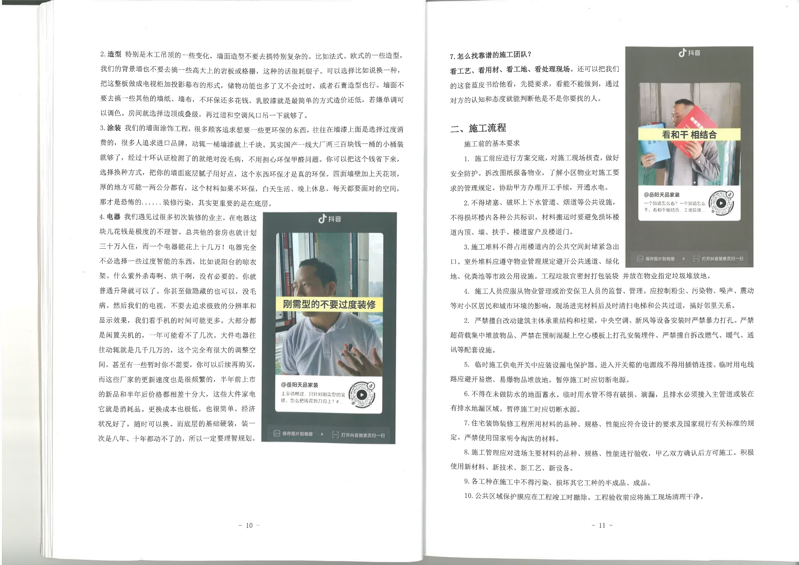

### OCR 文字

2\. 造型 特别是木工吊顶的一些变化，墙面造型不要去搞特别复杂的。比如法式、欧式的一些造型，  
我们的背景墙也不要去搞一些高大上的岩板或格栅，这种的话很耗银子。可以选择比如说换一种，  
把这整板做成电视柜加投影幕布的形式，储物功能也多了又不会过时，或者石膏造型也行。墙面不  
要去搞一些其他的墻纸、墙布，不环保还多花钱。乳胶漆就是最简单的方式造价还低，若嫌单调可  
以调色。房间就选择边顶或叠级，再过道和空调风口吊一下就够了。  
3.涂装 我们的墙面涂饰工程，很多顾客追求想要一些更环保的东西，往往在墙漆上面是选择过度消  
费的，很多人追求进口品牌，动辄一桶墙漆就上干块。其实国产一线大厂两三百块钱一桶的小桶装  
就够了，经过十环认证检测了的就绝对没毛病，不用担心环保甲醛问题。你可以把这个钱省下来，  
选择换种方式，把你的墙面底层腻子用好点，这个东西环保才是真的环保。四面墙壁加上天花顶，  
厚的地方可能一两公分都有，这个材料如果不环保，白天生活、晚上休息。每天都要面对的空间，  
那才是恐怖的……装修污染，其实更重要的是在底层。  
4.电器 我们遇见过很多初次装修的业主，在电器这  
© 抖音  
块儿花钱是极度的不理智。总共他的套房也就计划  
三十万入住，而一个电器能花上十几万！电器完全  
不必选择一些过度智能的东西，比如说阳台的晾衣  
架。什么紫外杀毒啊、烘干啊，没有必要的。你就  
普通升降就可以了。你甚至做隐藏的也可以，没毛  
病。然后我们的电视，不要去追求极致的分辨率和  
刚需型的不要过度装修  
显示效果，我们看手机的时间可能更多。大部分都  
是闲置关机的，一年可能看不了几次。大件电器往  
往动辄就是几千几万的，这个完全有很大的调整空  
间。甚至有一些暂时你不需要，你可以后续再购买，  
而这些厂家的更新速度也是很频繁的，半年前上市  
◎岳阳天品家装  
的新品和半年后价格都相差十分大，这些大件家电  
士豪请略过，只针对刚型的装  
修，怎么把钱花到刀刃上？＃  
它就是消耗品。更换成本也极低，也很简单。经济  
状况好了，随时可以换。而底层的基础硬装，装一  
图 保存膨特到梅辦”•/号 打开料备搜察项扫一目  
次是八年、十年都动不了的，所以一定要理智规划。  
\- 10一  
7.怎么找靠谱的施工团队？  
©广拼音  
看工艺、看用材、看工地、看处理现场。还可以把我们  
的这套蓝皮书给他看，先提要求，看能不能做到，通过  
对方的认知和态度就能判断他是不是你要找的人。  
二、施工流程  
看和干相结合  
施工前的基本要求  
1.施工前应进行方案交底，对施工现场核查，做好  
安全防护。拆改图纸报备物业，了解小区物业对施工要  
求的管理规定。协助甲方办理开工手续，开通水电。  
◎岳阳天品家装  
2\. 不得堵塞、破坏上下水管道、烟道等公共设施，  
一个知道怎么看？一个知道怎么  
干。看和干相结合，工地管理  
不得损坏楼内各种公共标识。材料搬运时要避免损坏楼  
道内顶、墙、扶手、楼道窗户及楼道门。  
3\. 施工堆料不得占用楼道内的公共空间封堵紧急出  
口。室外堆料应遵守物业管理规定避开公共通道、绿化  
打开料金频太页白一的  
地、化类池等市政公用设施。工程垃圾宜密封打包装袋 并放在物业指定垃圾堆放地。  
4.施工人员应服从物业管理或治安保卫人员的监督、管理。应控制粉尘、污染物、噪声、震动  
等对小区居民和城市环境的影响，现场进完材料后及时清扫电梯和公共过道，搞好邻里关系。  
2\. 严禁擅自改动建筑主体承重结构和柱梁，中央空调、新风等设备安装时严禁暴力打孔。严禁  
超荷载集中堆放物品、严禁在预制混凝上空心楼板上打孔安装埋件、严禁擅自拆改燃气、暖气、通  
讯等配套设施。  
5\. 临时施工供电开关中应装设漏电保护器。进入开关箱的电源线不得用插销连接。临时用电线  
路应避开易燃、易爆物品堆放地。暂停施工时应切断电源。  
6\. 不得在未做防水的地面蓄水。临时用水管不得有破损、滴漏，且排水必须接入主管道或装在  
有排水地漏区域。暂停施工时应切断水源。  
7.住宅装饰装修工程所用材料的品种、规格、性能应符合设计的要求及国家现行有关标准的规  
定。严禁使用国家明令淘汰的材料。  
8.施工管理应对进场主要材料的品种、规格、性能进行验收，甲乙双方确认后方可施工。积极  
使用新材料、新技术、新工艺、新设备。  
9.各工种在施工中不得污染、损坏其它工种的半成品、成品。  
10.公共区域保护膜应在工程竣工时撤除。工程验收前应将施工现场清理干净。  
\- 11一  

---

## 扫描页 10

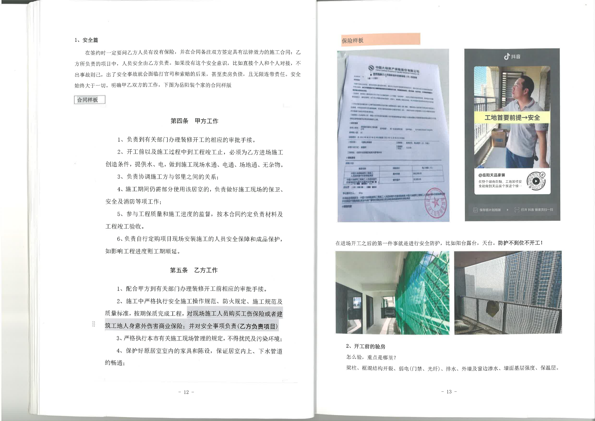

### OCR 文字

1、安全篇  
在签约时一定要问乙方人员有没有保险，并在合同备注双方签定具有法律效力的施工合同：乙  
方所负责的项目中，人员安全由乙方负责。如果没有这个安全意识，比如直接个人和个人对接，不  
出事故则己，出了安全事故就会面临打官司和索赔的后果，甚至卖房负债，且无限连带责任。安全  
始终大于一切。明确甲乙双方的工作，下图为岳阳装个家的合同样版  
合同样板  
第四条 甲方工作  
1、负责到有关部门办理装修开工的相应的审批手续。  
2、开工前以及施工过程中到工程竣工止，必须为乙方进场施工  
创造条件，提供水、电，做到施工现场水通、电通、场地通、无杂物。  
3、负责协调施工方与邻里之间的关系；  
4、施工期间仍需部分使用该居室的，负责做好施工现场的保卫、  
安全及消防等项工作；  
5、参与工程质量和施工进度的监督，按本合同约定负责材料及  
工程竣工验收。  
6、负责自行定购项目现场安装施工的人员安全保障和成品保护，  
如影响工程进度则工期顺延。  
第五条 乙方工作  
1、配合甲方到有关部门办理装修开工前相应的审批手续。  
2、施工中严格执行安全施工操作规范、防火规定、施工规范及  
质量标准，按期保质完成工程，对现场施工人员购买工伤保险或者建  
筑工地人身意外伤害商业保险；并对安全事项负责（乙方负责项目）  
3、严格执行本市有关施工现场管理的规定，不得扰民及污染坏境；  
4、保护好原居室室内的家具和陈设，保证居室内上、下水管道  
的畅通；  
\- 12-  
保险样板  
d 料實  
工地首要前提一安全  
@岳阳天品家装  
在整个湖南岳阳，工地装修安  
全能做到天品装个家这个级  
在进场开工之后的第一件事就是进行安全防护，比如阳台露台，天台。防护不到位不开工！  
2、开工前的验房  
怎么验，重点是哪里？  
梁柱、框混结构开裂、弱电（门禁、光纤）、排水、外墙及窗边渗水、墙面基层强度、保温层。  
\- 13-  

---

## 扫描页 11

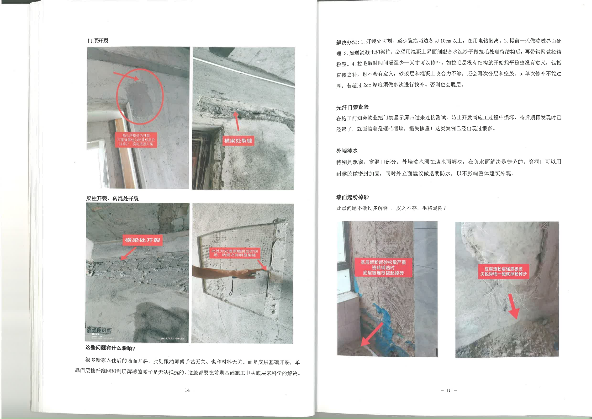

### OCR 文字

门顶开裂  
婦所脍狃为引裂  
封圍；层炎片物业后朋凌  
橫粱处裂缝  
梁柱开裂，砖混处开裂  
横粱处开裂  
此处为处理原墻脱层时玩  
花之面明偏起茶  
丛坐标识线  
这些问题有什么影响？  
很多新家入住后的墙面开裂，实则跟油师傅手艺无关、也和材料无关。而是底层基础开裂，单  
靠面层挂纤维网和刮层薄薄的腻子是无法抵抗的，这些都要在前期基础施工中从底层来科学的解决。  
\-14-  
解决办法：1.开裂处切割，至少裂痕两边各切10cm以上，在用电钻剥离。2.提前一天做滲透界面处  
理3.如遇混凝土和梁柱，必须用混凝土界面剂配合水泥沙子做拉毛处理待结构后，再带钢网做拉结  
粉整。4.拉毛后时间间隔至少一天才可以修补。如拉毛层没有结构就开始找平粉整没有意义，包括  
直接去补，也不会有意义，砂浆层和混凝土咬合力不够，还会再次分层和空鼓。5.单次修补不能过  
厚，若超过 2cm 厚度须做多次进行找补。否则也会脱层。  
光纤门禁查验  
在施工前知会物业把门禁显示屏带过来连接测试，防止开发商施.工过程中损坏，待后期再发现时己  
经迟了，就面临着是砸砖砸墙，损失惨重！这类案例已经出现过很多。  
外墙滲水  
特别是飘窗，窗洞口部分。外墙渗水须在迎水面解决，在负水面解决是徒劳的。窗洞口可以用  
耐候胶做密封加固，同时外立面建议做透明防水，以不影响整体建筑外观。  
墻面起粉掉砂  
此点问题不做过多解释，皮之不存，毛将焉附？  
基层起粉起砂松散严重  
瓷砖铺贴时  
豆腐渣粉层强度极差  
底层被连根拔起掉砖  
尖锐异物一碰就掉粉掉沙  
\- 15-  

---

## 扫描页 12

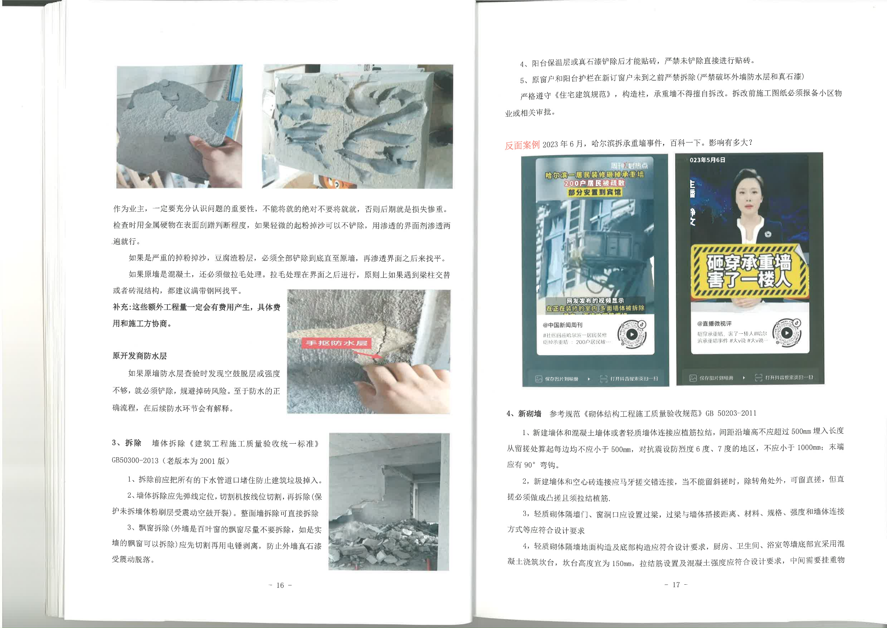

### OCR 文字

作业主，一定要充分认识问题的重要性，不能将就的绝对不要将就就，否则后期就是损失惨重。  
检查时用金属硬物在表面刮蹭判断程度，如果轻微的起粉掉沙可以不铲除，用渗透的界面剂渗透两  
.遍就行。  
如果是严重的掉粉掉沙，豆腐渣粉层，必须全部铲除到底直至原墙，再渗透界面之后来找平。  
如果原墻是混凝土，还必须做拉毛处理。拉毛处理在界面之后进行，原则上如果遇到梁柱交替  
或者砖混结构，都建议满带钢网找平。  
补充：这些额外工程量一定会有费用产生，具体费  
用和施工方协商。  
手抠防水层  
原开发商防水层  
如果原墻防水层查验时发现空鼓脱层或强度  
不够，就必须铲除，规避掉砖风险。至于防水的正  
确流程，在后续防水环节会有解释。  
3、拆除 墙体拆除《建筑工程施工质量验收统一标准》  
GB50300-2013（老版本为2001版）  
1、拆除前应把所有的下水管道口堵住防止建筑垃圾掉入。  
2、墻体拆除应先弹线定位，切割机按线位切割，再拆除（保  
护未拆墙体粉刷层受震动空鼓开裂）。整面墻拆除可直接拆除  
3、飘窗拆除（外墙是百叶窗的飘窗尽量不要拆除，如是实  
墻的飘窗可以拆除）应先切割再用电锤剥离，防止外墙真石漆  
受篾动脱落。  
\- 16 -  
4、阳台保温层或真石漆铲除后才能贴砖，严禁未铲除直接进行贴砖。  
5、原窗户和阳台护栏在新订窗户未到之前严禁拆除（严禁破坏外墻防水层和真石漆）  
严格遵守《住宅建筑规范》，构造柱，承重墙不得擅自拆改。拆改前施工图纸必须报备小区物  
业或相关审批。  
反面案例 2023年6月，哈尔滨拆承重墙事件，百科一下。影响有多大？  
023年5月6日  
哈尔滨一居民装修磴摶承重 墻  
200户居民被疏散  
部分安置到宾馆  
砸享凉重墻  
害了一楼人  
网友发布的视频显示  
@中国新闻周刊  
@直播微视评  
！社区回应哈尔滨一居民装修  
砸密承重墙。害了一楼人日合尔  
｛惊承重路：200户居民被  
洪承非路事件1大v说廿大v说  
图 保存图片到相册 打开抖音搜案页且一扫  
图 保存图片到相1•号 打开打帝题索页扫一扫  
4、新砌墙 参考规范《砌体结构工程施工质量验收规范》GB 50203-2011  
1、新建墙体和混凝土墙体或者轻质墻体连接应植筋拉结，间距沿墙高不应超过 500mm 埋入长度  
从留搓处算起每边均不应小于 500mm，对抗震设防烈度6度、7度的地区，不应小于 1000mm：末端  
应有90°弯钩。  
2，新建墙体和空心砖连接应马牙搓交错连接，当不能留斜搓时，除转角处外，可留直搓，但直  
搓必须做成凸搓且须拉结植筋.  
3，轻质砌体隔墻门、窗洞口应设置过梁，过梁与墙体搭接距离、材料、规格、强度和墙体连接  
方式等应符合设计要求  
4，轻质砌体隔墙地面构造及底部构造应符合设计要求，厨房、卫生间、浴室等墙底部宜采用混  
凝士浇筑坎台，坎台高度宜为 150mm，拉结筋设置及混凝土强度应符合设计要求，中间需要挂重物  
\- 17-  

---

## 扫描页 13

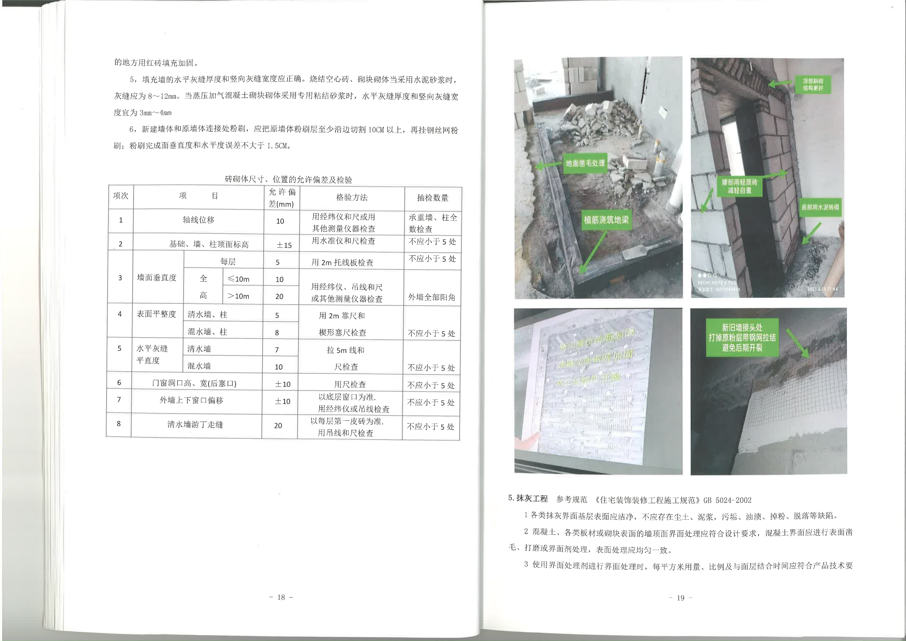

### OCR 文字

的地方用红砖填充加固。  
5，填充墻的水平灰缝厚度和竖向灰缝宽度应正确。烧结空心砖、砌块砌体当采用水泥砂浆时，  
灰缝应为8~12mm。当蒸压加气混凝土砌块砌体采用专用粘结砂浆时，水平灰缝厚度和竖向灰缝宽  
度宜为 3mm~4mm  
6，新建墙体和原墻体连接处粉刷，应把原墙体粉刷层至少沿边切割10CM 以上，再挂钢丝网粉  
刷：粉刷完成面垂直度和水平度误差不大于 1.5CM。  
砖砌体尺寸、位置的允许偏差及检验  
项次  
项目  
允许偏  
格验方法  
差（mm）  
抽检数量  
轴线位移  
10  
用经纬仪和尺或用  
承重墙、柱全  
其他测量仪器检查  
数检查  
2  
基础、墙、柱顶面标高  
士15  
用水准仪和尺检查  
不应小于5处  
每层  
用2m 托线板检查  
不应小于5处  
墙面垂直度  
全  
≤10m  
10  
用经纬仪、吊线和尺  
高  
＞10m  
20  
或其他测量仪器检查  
外墻全部阳角  
表面平整度  
清水墻、柱  
5  
用2m 靠尺和  
混水墻、柱  
楔形塞尺检查  
不应小于5处  
水平灰缝  
清水墙  
7  
拉5m 线和  
平直度  
混水墻  
10  
尺检查  
不应小于5处  
门窗洞口高、宽（后塞口）  
士10  
用尺检查  
不应小于5处  
7  
外墙上下窗口偏移  
以底层窗口为准.  
士10  
不应小于5处  
用经纬仪或吊线检查  
清水墙游丁走缝  
以每层第一皮砖为准.  
20  
不应小于5处  
用吊线和尺检查  
\- 18 -  
顶嘂貌砌  
结召斐好  
地面凿毛处理  
腰部用径质砖  
減轻自重  
底部用水湯碳砌  
植筋浇筑地梁  
新旧墻接头处  
打掉原粉层带钢网拉结  
避免后期开裂  
5.抹灰工程 参考规范《住宅装饰装修工程施工规范》CB 5024-2002  
1各类抹灰界面基层表面应洁净，不应存在尘土、泥浆，污垢、油渍、掉粉、脱落等缺陷。  
2 混凝土、各类板材或砌块表面的墙顶面界面处理应符合设计要求，混凝土界面应进行表面凿  
毛、打磨或界面剂处理，表面处理应均匀一致。  
3使用界面处理剂进行界面处理时，每平方米用量、比例及与面层结合时间应符合产品技术要  
\- 19-  

---

## 扫描页 14

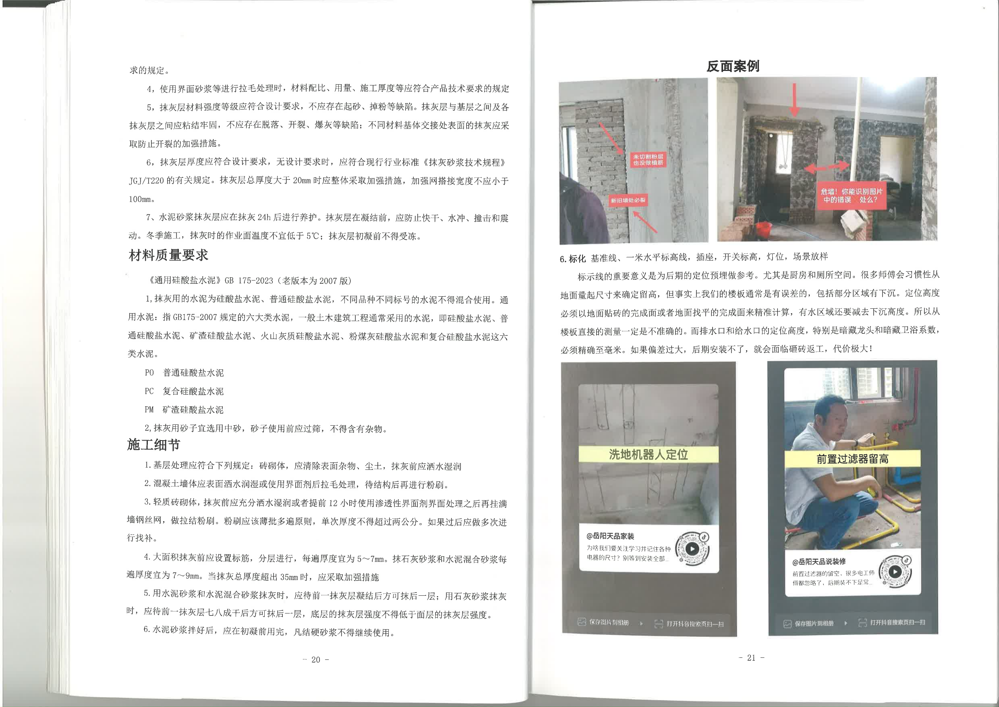

### OCR 文字

求的规定。  
4，使用界面砂浆等进行拉毛处理时，材料配比、用量、施工厚度等应符合产品技术要求的规定  
5，抹灰层材料强度等级应符合设计要求，不应存在起砂、掉粉等缺陷。抹灰层与基层之间及各  
抹灰层之间应粘结牢固，不应存在脱落、开裂、爆灰等缺陷；不同材料基体交接处表面的抹灰应采  
取防止开裂的加强措施。  
6，抹灰层厚度应符合设计要求，无设计要求时，应符合现行行业标准《抹灰砂浆技术规程》  
JGJ/T220的有关规定。抹灰层总厚度大于20mm 时应整体采取加强措施，加强网搭接宽度不应小于  
100mm。  
7、水泥砂浆抹灰层应在抹灰24h 后进行养护。抹灰层在凝结前，应防止快干、水冲、撞击和震  
动。冬季施工，抹灰时的作业面温度不宜低于 5°C；抹灰层初凝前不得受冻。  
材料质量要求  
《通用硅酸盐水泥》GB 175-2023（老版本为2007版）  
1，抹灰用的水泥为硅酸盐水泥、普通硅酸盐水泥，不同品种不同标号的水泥不得混合使用。通  
用水泥：指GB175-2007 规定的六大类水泥，一般土木建筑工程通常采用的水泥，即硅酸盐水泥、普  
通硅酸盐水泥、矿渣硅酸盐水泥、火山灰质硅酸盐水泥、粉煤灰硅酸盐水泥和复合硅酸盐水泥这六  
类水泥。  
PO 普通硅酸盐水泥  
PC 复合硅酸盐水泥  
PM 矿渣硅酸盐水泥  
2， 抹灰用砂子宜选用中砂，砂子使用前应过筛，不得含有杂物。  
施工细节  
1.基层处理应符合下列规定：砖砌体，应清除表面杂物、尘土，抹灰前应洒水湿润  
2.混凝土墙体应表面洒水润湿或使用界面剂后拉毛处理，待结构后再进行粉刷。  
3.轻质砖砌体，抹灰前应充分洒水湿润或者提前12小时使用渗透性界面剂界面处理之后再挂满  
墻钢丝网，做拉结粉刷。粉刷应该薄批多遍原则，单次厚度不得超过两公分。如果过后应做多次进  
行找补。  
4.大面积抹灰前应设置标筋，分层进行，每遍厚度宜为5~7mm。抹石灰砂浆和水泥混合砂浆每  
遍厚度宜为7~9mm。当抹灰总厚度超出35mm 时，应采取加强措施  
5.用水泥砂浆和水泥混合砂浆抹灰时，应待前一抹灰层凝结后方可抹后一层：用石灰砂浆抹灰  
时，应待前一抹灰层七八成干后方可抹后一层，底层的抹灰层强度不得低于面层的抹灰层强度。  
6.水泥砂浆拌好后，应在初凝前用完，凡结硬砂浆不得继续使用。  
\- 20 -  
反面案例  
未切即粉屋  
出没做植  
危墙！你能识别图片  
中的销误 处么？  
6\. 标化 基准线、一米水平标高线，插座，开关标高，灯位，场景放样  
标示线的重要意义是为后期的定位预埋做参考。尤其是厨房和厕所空间。很多师傅会习惯性从  
地面量起尺寸来确定留高，但事实上我们的楼板通常是有误差的，包括部分区域有下沉。定位高度  
必须以地面贴砖的完成面或者地面找平的完成面来精准计算，有水区域还要减去下沉高度。所以从  
楼板直接的测量一定是不准确的。而排水口和给水口的定位高度，特别是暗藏龙头和暗藏卫浴系数，  
必须精确至毫米。如果偏差过大，后期安装不了，就会面临砸砖返工，代价极大！  
洗地机器人定位  
前置过滤器留高  
@岳阳天品家装  
为啥我们要关注学习并记住各种  
电器的尺寸？别等到安装全部  
@岳阳天品说装修  
前置过滤器的留空，很多电工师  
俘都忽路了，后期装不下是常  
园 保存图片到相册，，号打开料音搜索页扫一扫  
）像在個片到信餅：安 打开辯意搜索页為一扫  
\- 21一  

---

## 扫描页 15

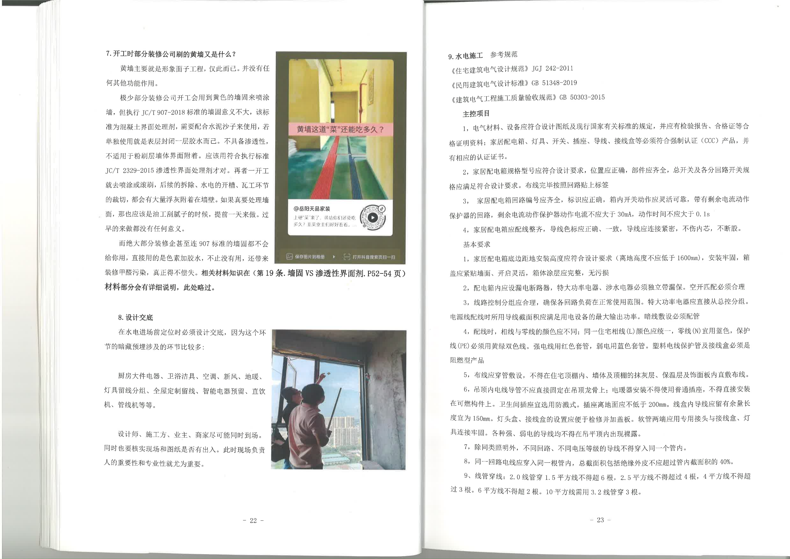

### OCR 文字

7.开工时部分装修公司刷的黄墻又是什么？  
黄墙主要就是形象面子工程，仅此而已。并没有任  
何其他功能作用。  
极少部分装修公司开工会用到黄色的墻固来喷涂  
墙，但执行 JC/T907-2018 标准的墙固意义不大，该标  
准为混凝土界面处理剂，需要配合水泥沙子来使用，若  
黄墻这道“菜”还能吃多久？  
单独使用就是表层封闭一层胶水而己。不具备渗透性，  
不适用于粉刷层墙体界面附着。应该用符合执行标准  
JC/T 2329-2015 渗透性界面处理剂才对。再者一开工  
就去喷涂或滚刷，后续的拆除、水电的开槽、瓦工环节  
的栽切，都会有大量浮灰附着在墙壁。如果真要处理墙  
◎岳阳天品家装  
面，那也应该是油工刮腻子的时候，提前一天来做。过  
上似'求来了，胡墙你们达少吃  
早的来做都没有任何意义。  
多久？非束业主们好好看看。  
而绝大部分装修企甚至连907 标准的墙固都不会  
给你用，直接用的是色素加胶水，不止没有用，还带来  
园 保存嚼片到相羽  
装修甲醛污染，真正得不偿失。相关材料知识在（第19条.墙固 VS 滲透性界面剂.P52-54页）  
材料部分会有详细说明，此处略过。  
8\. 设计交底  
在水电进场前定位时必须设计交底，因为这个环  
节的暗藏预埋涉及的坏节比较多：  
厨房大件电器、卫浴洁具、空调、新风、地暖、  
灯具留线分组、全屋定制留线、智能电器预留、直饮  
机、管线机等等。  
设计师、施工方、业主、商家尽可能同时到场。  
同时也要核实现场和图纸是否有出入。此时现场负责  
人的重要性和专业性就尤为重要。  
\-22一  
9.水电施工 参考规范  
《住宅建筑电气设计规范》JGJ 242-2011  
《民用建筑电气设计标准》GB 51348-2019  
《建筑电气工程施工质量验收规范》GB 50303-2015  
主控项目  
1，电气材料、设备应符合设计图纸及现行国家有关标准的规定，并应有检验报告、合格证等合  
格证明资料；家居配电箱、灯具、开关、插座、导线、接线盒等必须符合强制认证（CCC）产品，并  
有相应的认证证书。  
2，家居配电箱规格型号应符合设计要求，位置应正确，部件应齐全，总开关及各分回路开关规  
格应满足符合设计要求。布线完毕按照回路贴上标签  
3， 家居配电箱回路编号应齐全，标识应正确，箱内开关动作应灵活可靠，带有剩余电流动作  
保护器的回路，剩余电流动作保护器动作电流不应大于 30mA，动作时间不应大于0.1s  
4，家居配电箱应配线整齐，导线色标应正确、一致，导线应连接紧密，不伤内芯，不断股。  
基本要求  
1，家居配电箱底边距地安装高度应符合设计要求（离地高度不应低于1600mm），安装牢固，箱  
盖应紧贴墙面、开启灵活，箱体涂层应完整，无污损  
2，配电箱内应设漏电断路器，特大功率电器、涉水电器必须独立带漏保。空开匹配必须合理  
3，线路控制分组应合理，确保各回路负荷在正常使用范围。特大功率电器应直接从总控分组。  
电源线配线时所用导线截面积应满足用电设备的最大输出功率。暗线敷设必须配管  
4，配线时，相线与零线的颜色应不同；同一住宅相线（L）颜色应统一，零线（N）宜用蓝色，保护  
线（PE）必须用黄绿双色线。强电线用红色套管，弱电用蓝色套管。塑料电线保护管及接线盒必须是  
阻燃型产品  
5，布线应穿管敷设，不得在住宅顶棚内、墙体及顶棚的抹灰层、保温层及饰面板内直敷布线。  
6，吊项内电线导管不应直接固定在吊顶龙骨上；电暖器安装不得使用普通插座，不得直接安装  
在可燃构件上。卫生间插座宜选用防溅式。插座离地面应不低于 200mm。线盒内导线应留有余量长  
度宜为150m。灯头盒、接线盒的设置应便于检修并加盖板。软管两端应用专用接头与接线盒、灯  
具连接牢固。各种强、弱电的导线均不得在吊平顶内出现裸露。  
7，除同类照明外，不同回路、不同电压等级的导线不得穿入同一个管内。  
8，同一回路电线应穿入同一根管内，总截面积包括绝缘外皮不应超过管内截面积的40%。  
9、线管穿线：2.0线管穿1.5平方线不得超6根，2.5平方线不得超过4根，4平方线不得超  
过3根。6平方线不得超2根。10平方线需用3.2线管穿3根。  
23一  

---

## 扫描页 16

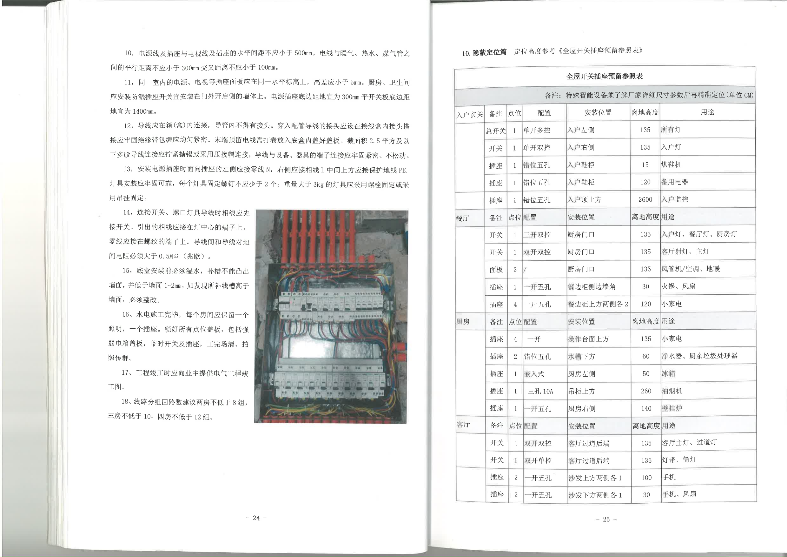

### OCR 文字

10，电源线及插座与电视线及插座的水平间距不应小于500mm。电线与暖气、热水、煤气管之  
间的平行距离不应小于 300mm 交叉距离不应小于 100mm。  
11，同一室内的电源、电视等插座面板应在同一水平标高上，高差应小于5mm。厨房、卫生间  
应安装防溅插座开关宜安装在门外开启侧的墙体上。电源插座底边距地宜为300mm 平开关板底边距  
地宜为1400mm。  
12，导线应在箱（盒）内连接，导管内不得有接头。穿入配管导线的接头应设在接线盒内接头搭  
接应牢固绝缘带包缠应均匀紧密。末端预留电线需打卷放入底盒内盖好盖板。截面积 2.5平方及以  
下多股导线连接应拧紧搪锡或采用压接帽连接，导线与设备、器具的端子连接应牢固紧密、不松动。  
13，安装电源插座时面向插座的左侧应接零线N，右侧应接相线L 中间上方应接保护地线PE.  
灯具安装应牢固可靠，每个灯具固定螺钉不应少于2个；重量大于3kg 的灯具应采用螺栓固定或采  
用吊挂固定。  
14，连接开关、螺口灯具导线时相线应先  
接开关。引出的相线应接在灯中心的端子上，  
零线应接在螺纹的端子上。导线间和导线对地  
间电阻必须大于 0.5M9（兆欧）。  
15，底盒安装前必须湿水，补槽不能凸出  
墙面，并低于墙面1-2mm，如发现所补线槽高于  
墙面，必须整改。  
16、水电施工完毕，每个房间应保留一个  
照明，一个插座。锁好所有点位盖板，包括强  
弱电箱盖板，临时开关及插座，工完场清、拍  
照传群。  
17、工程竣工时应向业主提供电气工程竣  
工图。  
18、线路分组回路数建议两房不低于8组，  
三房不低于10，四房不低于12组。  
\- 24 -  
10\. 隐蔽定位篇 定位高度参考《全屋开关插座预留参照表》  
全屋开关插座预留參照表  
备注：特殊智能设备须了解厂家详细尺寸参数后再精准定位（单位CM）  
入户玄关  
备注点位  
配置  
安装位置  
离地高度  
用途  
总开关 1 单开多控  
入户左侧  
135  
所有灯  
开关  
1 单开双控  
入户右侧  
135  
入户灯  
插座  
1 错位五孔  
入户鞋柜  
15  
烘鞋机  
插座  
1 错位五孔  
入户鞋柜  
120  
备用电器  
插座  
1 错位五孔  
入户顶上方  
2600  
入户监控  
餐厅  
备注  
点位配置  
安装位置  
离地高度用途  
开关  
1 三开双控  
厨房门口  
135  
入户灯、餐厅灯、厨房灯  
开关  
1 双开双控  
厨房门口  
135  
客厅射灯、主灯  
面板  
27  
厨房门口  
135  
风管机/空调、地暖  
插座  
1 一开五孔  
餐边柜侧边墻角  
30  
火锅、风扇  
插座  
4 一开五孔  
餐边柜上方两侧各2  
120  
小家电  
厨房  
备注 点位配置  
安装位置  
离地高度用途  
插座  
4一开  
操作台面上方  
135  
小家电  
插座  
2 错位五孔  
水槽下方  
60  
净水器、厨余垃圾处理器  
插座  
1 嵌入式  
厨房左侧  
50  
冰箱  
插座  
1  
三孔10A  
吊柜上方  
260 油烟机  
插座  
1 一开五孔  
厨房右侧  
140 壁挂炉  
客厅  
备注 点位配置  
安装位置  
离地高度用途  
开关  
1 双开双控  
客厅过道后端  
135  
客厅主灯、过道灯  
开关  
1 双开单控  
客厅过道后端  
135  
灯带、筒灯  
插座  
2 一开五孔  
沙发上方两侧各1  
100  
手机  
插座  
2  
\-开五孔  
沙发下方两侧各 1  
30  
手机、风扇  
\- 25-  

---

## 扫描页 17

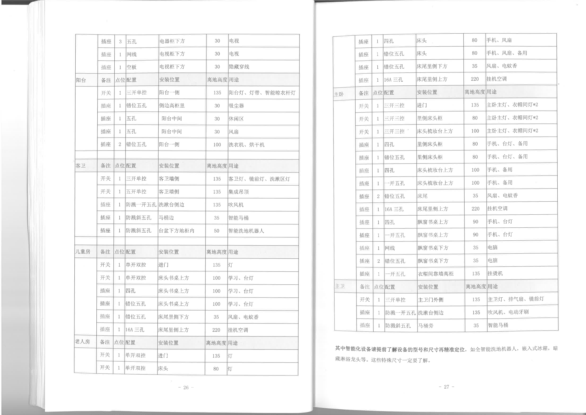

### OCR 文字

插座  
3  
五孔  
电器柜下方  
30  
电视  
插座  
1 网线  
电视柜下方  
30  
电视  
插座1 空板  
电视柜下方  
30  
隐藏穿线  
阳台  
备注 点位配置  
安装位置  
离地高度用途  
开关1三开单控  
阳台一侧  
135 阳台灯、灯带、智能晾衣杆灯  
插座1错位五孔  
侧边高柜里  
30  
吸尘器  
插座1 五孔  
阳台中间  
30  
休闲区  
插座1 五孔  
阳台中间  
30  
风扇  
插座 2 错位五孔  
阳台一侧  
100  
洗衣机、烘干机  
客卫  
备注 点位 配置  
安装位置  
离地高度用途  
开关1三开单控  
客卫墙侧  
135  
客卫灯、镜前灯、洗漱区灯  
开关  
1 五开单控  
客卫墙侧  
135  
集成吊顶  
插座 1 防溅一开五孔 洗漱台侧边  
135  
吹风机  
插座 1 防溅斜五孔 马桶边  
35  
智能马桶  
插座1 防溅斜五孔  
台盆下方地柜内  
50  
智能洗地机器人  
儿童房  
备注 点位配置  
安装位置  
离地高度用途  
开关1 单开双控  
进门  
135  
灯  
开关  
1 单开双控  
床头书桌上方  
100  
学习、台灯  
插座1 四孔  
床头书桌上方  
100  
学习、台灯  
插座1 错位五孔  
床头书桌上方  
100  
学习、台灯  
插座|1错位五孔  
床尾里侧下方  
35  
风扇、电蚊香  
插座1 16A三孔  
床尾里侧上方  
220  
挂机空调  
老人房  
备注 点位配置  
安装位置  
离地高度用途  
开关1 单开双控  
进门  
135 灯  
开关 1 单开双控  
床头  
80  
灯  
\- 26一  
插座  
四孔  
床头  
80  
手机、风扇  
插座  
1 错位五孔  
床头  
80  
手机、风扇、备用  
插座 1 错位五孔  
床尾里侧下方  
35  
风扇、电蚊香  
插座116A三孔  
床尾里侧上方  
220  
挂杌空调  
主卧  
备注 点位 配置  
安装位置  
离地高度用途  
开关|1三开三控  
进门  
135  
主卧主灯、衣帽间灯*2  
开关|1三开三控  
里侧床头柜  
80  
主卧主灯、衣帽间灯*2  
开关| 1 三开三控：  
床头梳妆台上方  
100  
主卧主灯、衣帽间灯*2  
插座1 四孔  
里侧床头柜  
80  
手机、台灯、备用  
插座1 错位五孔  
里侧床头柜  
80  
手机、台灯、备用  
插座1四孔  
床头梳妆台上方  
100  
手机、备用  
插座 1-  
一开五孔  
床头梳妆台上方  
100  
手机、备用  
插座 2 错位五孔  
床尾  
35  
风扇、电蚊香  
插座1 16A三孔  
床尾里侧上方  
220  
挂机空调  
插座1四孔  
飘窗书桌上方  
90  
手机、台灯  
插座1一开五孔  
飘窗书桌上方  
90  
手机、台灯  
插座1网线  
飘窗书桌下方  
35  
电脑  
插座 2错位五孔  
飘窗书桌下方  
35||  
电脑  
插座1一开五孔  
衣帽间靠墻高柜  
135  
挂烫机  
主卫  
备注 点位配置  
安装位置  
离地高度用途  
开关  
1 三开单控  
主卫门外侧  
135  
主卫灯、排气扇、镜前灯  
插座  
防溅一开五孔 洗漱台侧边  
135  
吹风机、电动牙刷  
插座  
1||  
防溅斜五孔 马桶旁  
35  
智能马桶  
其中智能化设备请提前了解设备的型号和尺寸再精准定位，如全智能洗地机器人，嵌入式冰箱，暗  
藏淋浴龙头等。这些特殊尺寸一定要了解。  
\- 27 -  

---

## 扫描页 18

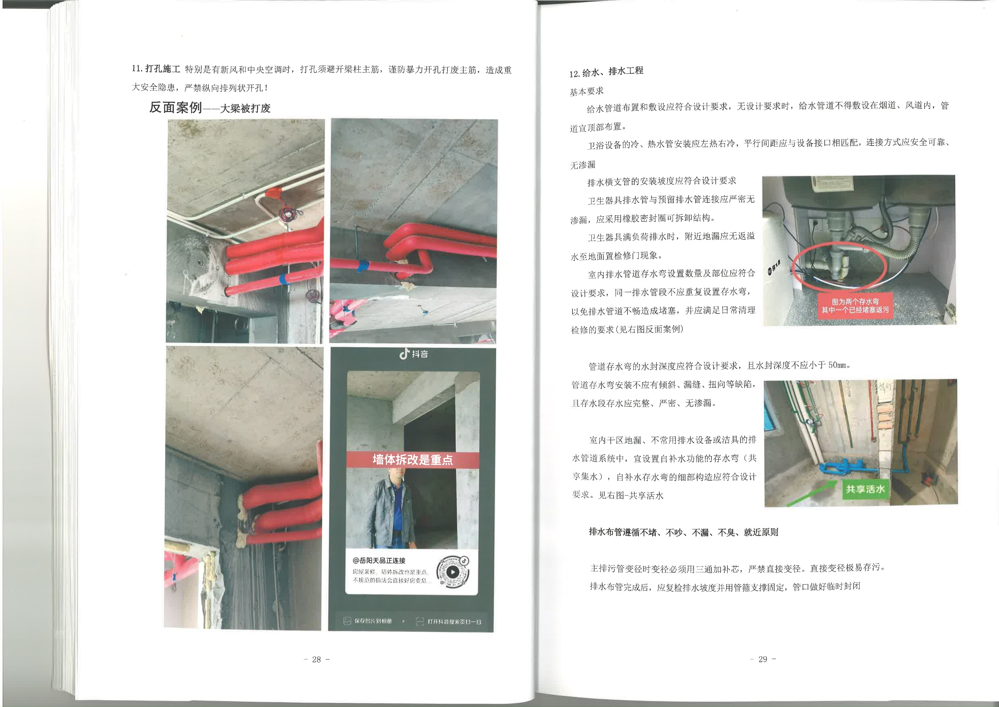

### OCR 文字

11\. 打孔施工 特别是有新风和中央空调时，打孔须避开梁柱主筋，谨防暴力开孔打废主筋，造成重  
大安全隐患，严禁纵向排列状开孔！  
反面案例—-大梁被打废  
抖音  
墙体拆改是重点  
◎岳阳天品正连接  
房屋裂修，墙依拆改也是市点  
不规范的搞法会直接好房变危  
5 保存图片到相册  
打开抖管搜索页扫一扫  
12.给水、排水工程  
基本要求  
给水管道布置和敷设应符合设计要求，无设计要求时，给水管道不得敷设在烟道、风道内，管  
道宜顶部布置。  
卫浴设备的冷、热水管安装应左热右冷，平行间距应与设备接口相匹配，连接方式应安全可靠、  
无渗漏  
排水横支管的安装坡度应符合设计要求  
卫生器具排水管与预留排水管连接应严密无  
滲漏，应采用橡胶密封圈可拆卸结构。  
卫生器具满负荷排水时，附近地漏应无返溢  
水至地面置检修门现象。  
室内排水管道存水弯设置数量及部位应符合  
设计要求，同一排水管段不应重复设置存水弯，  
國为两个存水  
以免排水管道不畅造成堵塞，并应满足日常清理  
其中一个已经堵塞返游  
检修的要求（见右图反面案例）  
管道存水弯的水封深度应符合设计要求，且水封深度不应小于 50mm。  
管道存水弯安装不应有倾斜、漏缝、扭向等缺陷，  
且.存水段存水应完整、严密、无渗漏。  
室内干区地漏、不常用排水设备或洁具的排  
水管道系统中，宜设置自补水功能的存水弯（共  
享集水），自补水存水弯的细部构造应符合设计  
共享活水  
要求。见石图-共享活水  
排水布管遵循不堵、不吵、不漏、不臭、就近原则  
主排污管变径时变径必须用三通加补芯，严禁直接变径。直接变径极易存污。  
排水布管完成后，应复检排水坡度并用管箍支撑固定，管口做好临时封闭  
\- 29 -  

---

## 扫描页 19

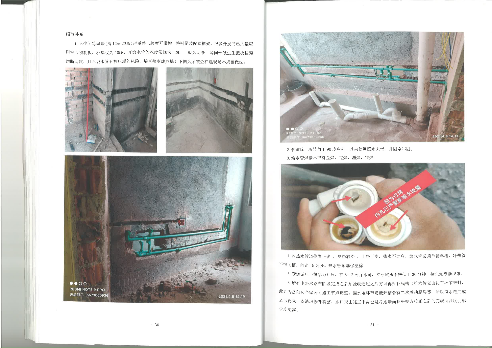

### OCR 文字

细节补充  
1.卫生间等薄墙（指12cm单墻）严重禁长跨度开横槽，特别是装配式框架，很多开发商己大量应  
用空心预制板，板厚仅为 10CM，开给水管的深度常规为5CM，一般为两条，等同于硬生生把板拦腰  
切断两次，且不说水管有被压爆的风险，墙直接变成危墙！下图为某装企在建现场不规范做法。  
•0〇  
REDMI NOTE 9 PRO  
天品邵工 16673060936  
20214.8 14:19  
\- 30-  
00og  
REDMI NOTE 9 PRO  
天保M工 16673060936  
2\. 管道除上墙转角用90度弯外，其余使用顺水大弯，并固定牢固。  
3.给水管焊接不得有歪焊，过焊，漏焊，错焊。  
因为过焊  
内孔己严重影响水流量  
4.冷热水管道位置正确，左热右冷，上热下冷，热水不过弯，给水管必须单管单槽，冷热管  
不得同槽，间距15公分。热水管须套保温棉  
5.管道试压不得暴力打压，在8-12 公斤即可，持续试压不得低于30分钟，接头无渗漏现象。  
6.所有电路水路在阶段完成之后须验收通过之后方可再封补线槽（给水管交由瓦工环节来封，  
此处为岳阳装个家公司施工节点调整。因水电环节隐蔽开槽会有二次震动脱层等，所以待水电完成  
之后再来一次清理修补粉整。水口交由瓦工来封也是考虑墙面找平规方校正之后的完成面高度会配  
合度更高。  
\- 31 -  

---

## 扫描页 20

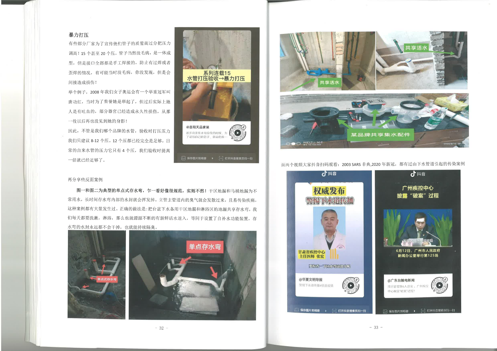

### OCR 文字

暴力打压  
有些部分厂家为了宣传他们管子的质量而过分把压力  
调高！15个甚至20个压，管子当然没毛病，是一体成  
型，但是接口全部都是手工焊接的，防止有过焊或者  
歪焊的情况，有可能当时没毛病，你没发现，但是会  
系列连载15  
水管打压验收一暴力打压  
间接造成损伤！  
举个例子，2008年我们女子奥运会有一个举重冠军叫  
唐功红，当时为了荣誉她是举起了，但过后实际上她  
人是有吐血的，部分器官已经造成永久性损伤，从那  
一役以后再也没见到她的身影！  
@岳阳天品家装  
因此，不管是我们哪个品牌的水管，验收时打压压力  
很实商银在水电验收的时候。为  
了证吗自己的管子，明命的数  
我们只建议8-12个压。12个压都已经完全是足够，日  
常的自来水管的压力它只有4个压，我们验收时提高  
一倍就已经足够了。  
网 保存開片到椹解  
E3 新拼技隆搜索页料一封  
再分享些反面案例  
图一和图二为典型的单点式存水弯，乍一看好像很规范，实则不然！干区地漏和马桶地漏为不  
常用水，长时间存水弯内部的水封就会挥发掉。立管主管道内的臭气就会发散过来，且易传染疾病，  
这种案例都有大量发生过。正确的做法是：把台盆下水备用干区地漏和淋浴区的地漏共享存水弯，我  
们每天都要洗漱，淋浴，那么也就源源不断的有新鲜活水进入，等同于设置了自补水功能装置，存  
水弯的水封永远都不会干掉，也就能持续隔臭。  
单点存水弯  
单椒式存水当  
\- 32 -  
共享活水  
共寧活水  
某品牌共享集水配件  
9〇  
i两个视频大家抖音扫码观看：2003 SARS 非典，2020年新冠，都有过由下水管道引起的传染案例  
d 抖音  
d 抖音  
杈威发布  
广州疾控中心  
披露“破案”过程  
瞥傷下水道传播  
圳因销商一道破裂  
比肃省疾控中心  
6月12日，广州市人民政府  
主任医师 张宏  
新闻办公室举行第125场  
要際錢，下冰烤范部啊  
@华夏文明导报  
@广东台触电新闻  
綮偕下冰沲传掘#铳击疫彼  
排污管曾教6人感染，广兆疾燈  
中心皮認“聽業"过祥！  
｛ 保存图片到相册K  
F，打开抖音搜索页扫一扫  
图 保有图片到相測、（打开料音授素项扫一扫  
\- 33 -  

---

## 扫描页 21

### OCR 文字

岳阳天品家装”  
更多返面案例，尽在反面案例解剖合集。  
好品质  
43.1万洗份 57 朋友 369 头注  
14.7万 份丝  
抖音搜索用户一岳阳天品，  
热爱是所有的理由和答案  
一辈子、一件事、幸祖技修  
点击右图绿框的合集管理一找到反面修缮案例  
业务主弯；毛坯房硬装绝工+岩板薄貼  
＆官方电话 + 增加企业信息  
粉丝通  
几十起现场真实的拆解更有借鉴帮助意义  
小汤建议张翰丝流尻  
&  
粉丝群°  
当能看懂这些的时候，你家现场哪些不合理  
编辑企业资料  
添加朋友◎  
你一眼就能看出并要求改正，以规避隐患。  
作品。 商家  
私密  
收菠  
被@  
海合業管埕＞  
多 前终的的改略）  
多拆改知识》  
下图1和图2为一个粉丝业主求助时发来的现场视频，我让他发来他在改水电的时候图片，我就已  
经想到了这个结果，必然在意料之中！底下大肠式走管，当排污不畅的时候，就一定会从旁边的地  
漏返出！图3是解析怎么改解决这个问题，图4也是典型的回型绕管，完全有更简洁的就近走法。  
J科者  
大肠式排水必堵！  
让人泪崩的厕所排水  
@岳阳天品家装  
冲马桶，返便便，什么情况？  
图 保茶開片到相班：使  
打冰料市抽索顶封一扫  
\-34-  
回形式排水  
长跨度潢槽  
再看排水重点  
我  
@岳阳天品家装  
排水改造的几个重点：不堵塞，  
不返污，不发臭，你真的都理  
图 保存图片到相册•号号 打开料着搜索放往一组  
下面两张图片也是极为不规范的做法：排水管硬生生把它走成了电线布管的横平竖直式，如果使用顺  
水三通或者是斜三通，那么排水是不是更顺畅？  
横平竖直式排水  
横平竖直式  
\- 35 -  

---

## 扫描页 22

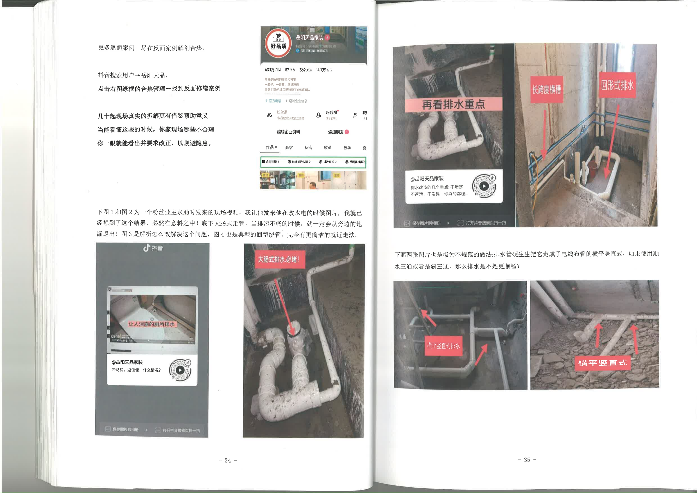

### OCR 文字

岳阳天品家装  
更多返面案例，尽在反面案例解剖合集。  
好品质  
43.1万 秋份 57朋友  
369 关注  
14.7万粉丝  
抖音搜索用户一岳阳天品，  
热爱是所有的理由和答案  
一辈子、一件事、幸福获修  
点击右图绿框的合集管理一找到反面修缮案例  
业务主营；毛坯房硬装絕工+岩版薄貼  
＆官方电话 ＋ 增加企业信息  
粉丝通  
几十起现场真实的拆解更有借鉴帮助意义  
小汤建议綮粉丝流兑  
&  
粉丝群°  
当能看懂这些的时候，你家现场哪些不合理  
编辑企业资料  
添加朋友◎  
你一眼就能看出并要求改正，以规避隐患。  
作品 商家  
私密  
收藏  
被@  
含生W邊>  
多的惨肉的攻略>  
§拆改知倪>  
下图1和图2为一个粉丝业主求助时发来的现场视频，我让他发来他在改水电的时候图片，我就己  
经想到了这个结果，必然在意料之中！底下大肠式走管，当排污不畅的时候，就一定会从旁边的地  
漏返出！图3是解析怎么改解决这个问题，图4也是典型的回型绕管，完全有更简洁的就近走法。  
大肠式排水必堵！  
让人泪崩的厕所排水  
@岳阳天品家装  
冲马桶，返便便，什么情况？  
三；如歼料資控索河拉1扫  
\- 34-  
回形式排水  
长跨度橫槽  
再看排水重点  
我  
喜  
@岳阳天品家装  
排水改造的几个重点：不堵塞，  
不返污，不发臭，你真的都理  
图 碳存图片到相膨号号 打开料育授索預拉一扫  
下面两张图片也是极为不规范的做法：排水管硬生生把它走成了电线布管的横平竖直式，如果使用顺  
水三通或者是斜三通，那么排水是不是更顺畅？  
横平竖直式排水  
横平竖直式  
\- 35 -  

---

## 扫描页 23

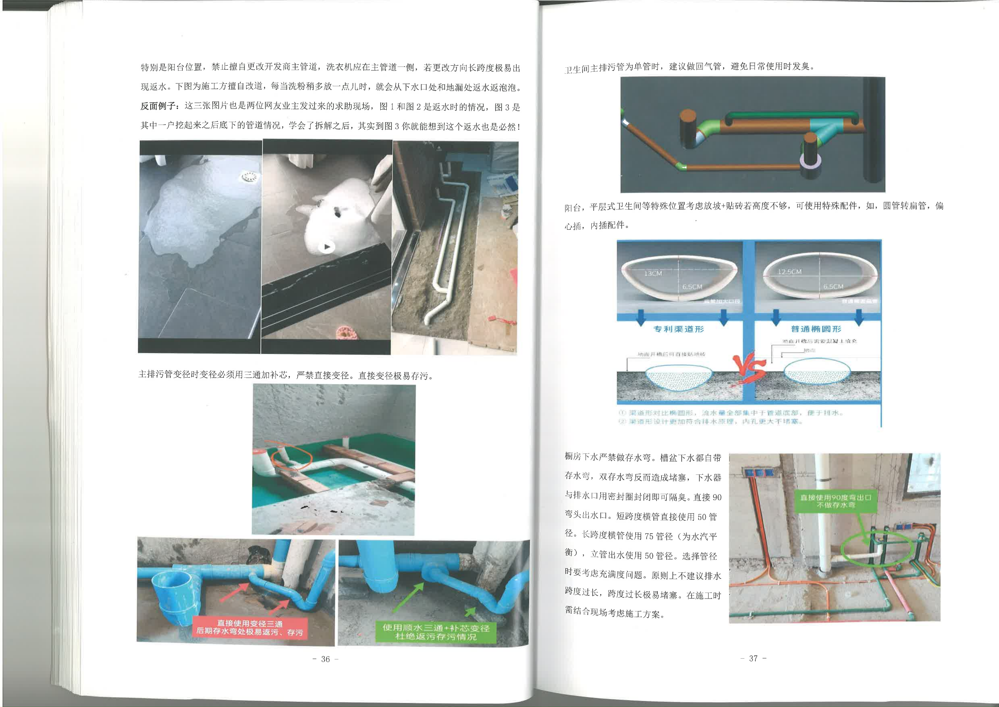

### OCR 文字

特别是阳台位置，禁止擅自更改开发商主管道，洗衣机应在主管道一侧，若更改方向长跨度极易出  
现返水。下图为施工方擅自改道，每当洗粉稍多放一点儿时，就会从下水口处和地漏处返水返泡泡。  
反面例子：这三张图片也是两位网友业主发过来的求助现场，图1和图2是返水时的情况，图3是  
其中一户挖起来之后底下的管道情况，学会了拆解之后，其实到图3你就能想到这个返水也是必然！  
主排污管变径时变径必须用三通加补芯，严禁直接变径。直接变径极易存污。  
直接使用变径三通  
后期存水湾处极易返污、存河  
使用顺水三通+补妆变径  
杜缅返污存污情涴  
\- 36  
卫生间主排污管为单管时，建议做回气管，避免日常使用时发臭。  
阳台，平层式卫生间等特殊位置考虑放坡+贴砖若高度不够，可使用特殊配件，如，圆管转扁管，偏  
心插，内插配件。  
125CMI  
65EM  
专利渠道形  
普通椭圆形  
犯山引楹后湄髮摄凝上項炎  
地做月内后前每传妈期後  
渠遥形姆比粉醬形，流水量全部集中管道食部，是于我永。  
果酒形没计更加符合拜承原理，此私更大不吗菜。  
橱房下水严禁做存水弯。槽盆下水都自带  
存水弯，双存水弯反而造成堵塞，下水器  
与排水口用密封圈封闭即可隔臭。直接90  
直接便用90度造出间  
不做存水唔  
弯头出水口。短跨度横管直接使用50管  
径。长跨度横管使用75管径（为水汽平  
衡），立管出水使用50管径。选择管径  
时要考虑充满度问题。原则上不建议排水  
跨度过长，跨度过长极易堵塞。在施工时  
需结合现场考虑施工方案。  
\- 37 -  

---

## 扫描页 24

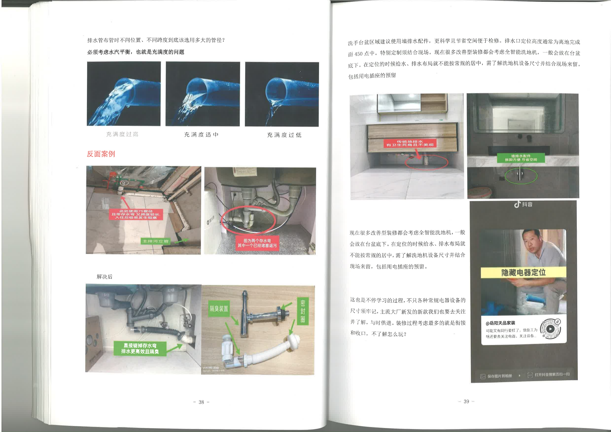

### OCR 文字

排水管布管时不同位置、不同跨度到底该选用多大的管径？  
必须考虑水汽平衡，也就是充满度的问题  
充满度过高  
充满度适中  
充满度过低  
反面案例  
入往后极烟发生脂：  
正排运众官  
图为两个存水章  
其中一个已经堵塞返污  
解決后  
隔臭装置  
直接锯掉存水弯  
排水更离效且隔臭  
\- 38-  
洗手台盆区域建议使用墙排水配件，更科学且节省空间便于检修。排水口定位高度通常为离地完成  
面 450点中。特别定制须结合现场。现在很多改善型装修都会考虑全智能洗地机，一般会放在台盆  
底下。在定位的时候给水、排水布局就不能按常规的居中，需了解洗地机设备尺寸并结合现场米留。  
包括用电插座的预留  
瑙排水而件  
拆面方便书省室间  
O抖音  
现在很多改善型装修都会考虑全智能洗地机，一般  
会放在台盆底下。在定位的时候给水、排水布局就  
不能校常规的居中，需了解洗地机设备尺寸并结合  
现场来留，包括用电插座的预留。  
隐藏电器定位  
这也是不停学习的过程，不只各种常规电器设备的  
尺寸须牢记，主流大厂新发的新款我们也要去关注  
并了解，与时俱进。装修过程考虑最多的就是衔接  
@岳阳天品家装  
可能又有同行要杠了，做施工为  
和收口，不了解怎么玩？  
啥还要去关注电器，关注设备  
图 保族限片到相册• 司 打苏料音搜察源扫一扫  

---

## 扫描页 25

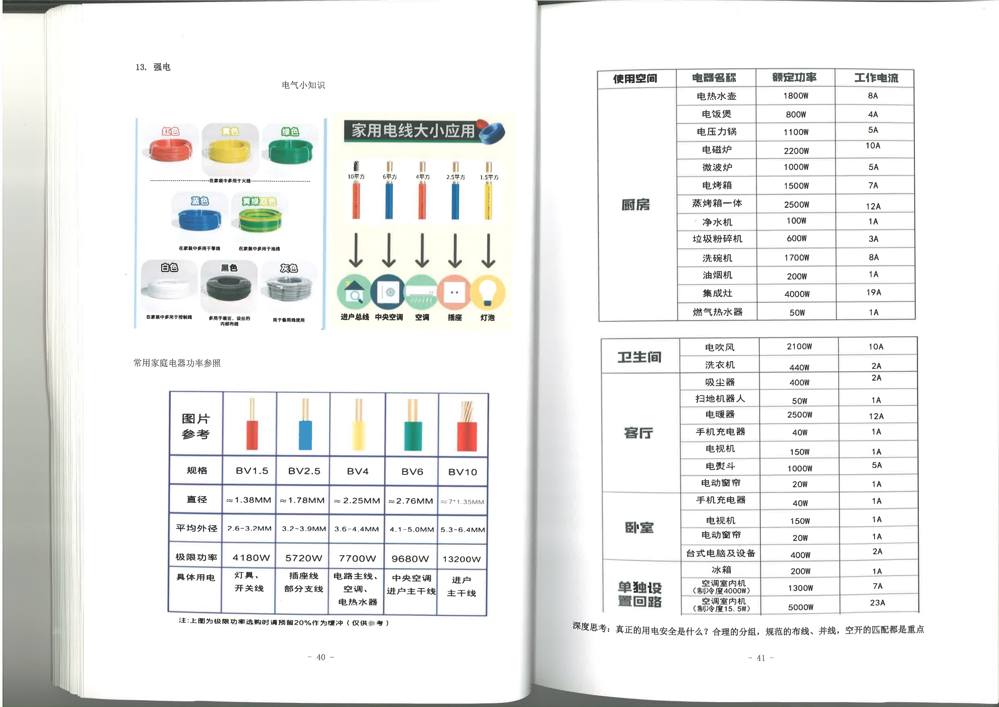

### OCR 文字

13.  
强电  
电气小知识  
红色  
绿色  
家用电线大小应用  
•在豪装中多用于火 --  
10平方  
6平方  
1平方  
2.5平方  
1.5平方  
蓝色  
黃绿色  
在象装中多用于地蝰  
自色  
黑色  
灰色  
：  
在寂装中率用于控侧线  
多用子數置、设备的  
用于备用线便用  
进户总线 中央空调  
空调  
插座  
灯泡  
常用家庭电器功率参照  
图片  
参考  
规格  
BV1.5  
BV2.5  
BV4  
BV6  
BV10  
直径  
1.38MM  
~1.78MM  
2 2.25MM  
~2.76MM  
~7°1.35MM  
平均外径  
2.6-3.2MM  
3.2-3.9MM 3.6-4.4MM  
4.1-5.OMM 5.3-6.4MM  
极限功率  
4180W  
5720W  
7700W  
9680W  
13200W  
具体用电  
灯具、  
插座线  
电路主线、  
中央空调  
进户  
开关线  
部分支线  
空调、  
进户主干线  
主干线  
电热水器  
注：上图为极限功率选购时谓预留20%作为缓冲（仅供公考）  
\-40-  
使用空间  
电器名称  
额定功率  
工作电流  
电热水壶  
1800W  
8A  
电饭煲  
800W  
4A  
电压力锅  
1100W  
5A  
电磁炉  
2200W  
10A  
微波炉  
1000W  
5A  
电烤箱  
1500W  
7A  
厨房  
蒸烤箱一体  
2500W  
12A  
净水机  
100W  
1A  
垃圾粉碎机  
600W  
3A  
洗碗机  
1700W  
8A  
油烟机  
200W  
1A  
集成灶  
4000W  
19A  
燃气热水噐  
50W  
1A  
电吹风  
2100W  
10A  
卫生间  
洗衣机  
440W  
2A  
吸尘器  
400W  
2A  
扫地机器人  
50W  
1A  
电暖器  
2500W  
12A  
客厅  
手机充电器  
40W  
1A  
电视机  
150W  
1A  
电熨斗  
1000W  
5A  
电动窗帘  
20W  
1A  
手机充电器  
40W  
1A  
电视机  
150W  
1A  
卧室  
电动窗帘  
20W  
1A  
台式电脑及设备  
400W  
2A  
冰箱  
200W  
1A  
单独设  
空调室内机  
（制冷度4000W）  
1300W  
7A  
置回路  
空调室内析  
（制冷度15.5W）  
5000W  
23A  
深度思考：真正的用电安全是什么？合理的分组，规范的布线、并线，空开的匹配都是重点  
\- 41 -  

---

## 扫描页 26

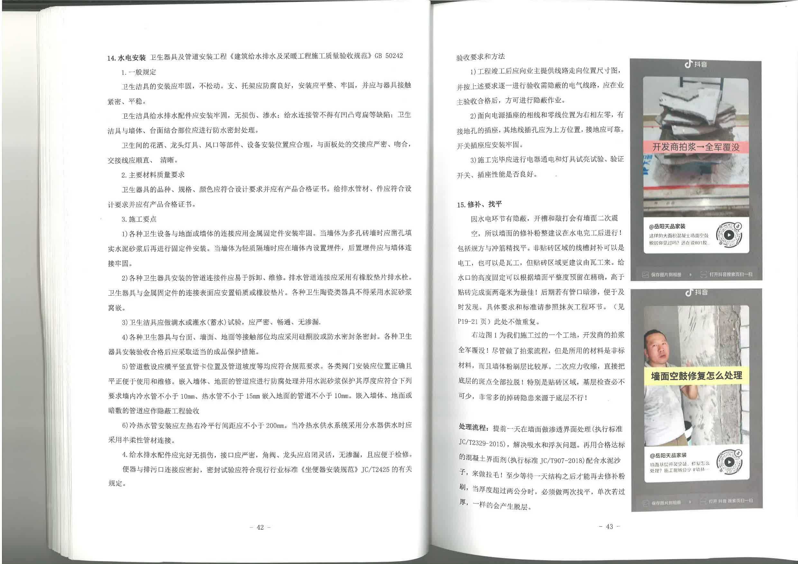

### OCR 文字

14.水电安装 卫生器具及管道安装工程《建筑给水排水及采暖工程施工质量验收规范》GB 50242  
1.一般规定  
卫生洁具的安装应牢固，不松动。支、托架应防腐良好，安装应平整、牢固，并应与器具接触  
紧密、平稳。  
卫生洁具给水排水配件应安装牢固，无损伤、渗水；给水连接管不得有凹凸弯扁等缺陷：卫生  
洁具与墙体、台面结合部位应进行防水密封处理。  
卫生间的花洒、龙头灯具、风口等部件、设备安装位置应合理，与面板处的交接应严密、吻合，  
交接线应顺直、清晰。  
2\. 主要材料质量要求  
卫生器具的品种、规格、颜色应符合设计要求并应有产品合格证书。给排水管材、件应符合设  
计要求并应有产品合格证书。  
3\. 施工要点  
1） 各种卫生设备与地面或墙体的连接应用金属固定件安装牢固。当墙体为多孔砖墙时应凿孔填  
实水泥砂浆后再进行固定件安装。当墙体为轻质隔墙时应在墙体内设置埋件，后置埋件应与墙体连  
接牢固。  
2） 各种卫生器具安装的管道连接件应易于拆卸、维修。排水管道连接应采用有橡胶垫片排水栓。  
卫生器具与金属固定件的连接表面应安置铅质或橡胶垫片。各种卫生陶瓷类器具不得采用水泥砂浆  
窝嵌。  
3） 卫生洁具应做满水或灌水（蓄水）试验，应严密、畅通、无渗漏.  
4） 各种卫生器具与台面、墙面、地面等接触部位均应采用硅酮胶或防水密封条密封。各种卫生  
器具安装验收合格后应采取适当的成品保护措施。  
5）管道敷设应横平竖直管卡位置及管道坡度等均应符合规范要求。各类阀门安装应位置正确且  
平正便于使用和维修。嵌入墙体、地面的管道应进行防腐处理并用水泥砂浆保护其厚度应符合下列  
要求墙内冷水管不小于 10mm、热水管不小于 15mm 嵌入地面的管道不小于 10mm。  
嵌入墙体、地面或  
暗敷的管道应作隐蔽工程验收  
6） 冷热水管安装应左热右冷平行间距应不小于200m。当冷热水供水系统采用分水器供水时应  
采用半柔性管材连接。  
4.给水排水配件应完好无损伤，接口应严密，角阀、龙头应启闭灵活，无渗漏，且应便于检修。  
便器与排污口连接应密封，密封试验应符合现行行业标准《坐便器安装规范》JC/T2425的有关  
规定。  
\-42-  
验收要求和方法  
d 抖音  
1）工程竣工后应向业主提供线路走向位置尺寸图，  
并按上述要求逐一进行验收需隐蔽的电气线路，应在业  
主验收合格后，方可进行隐蔽作业。  
2） 面向电源插座的相线和零线位置右相左零，有  
接地孔的插座，其地线插孔应为上方位置，接地应可靠。  
开关插座应安装牢固。  
开发商拍浆一全军覆没  
3） 施工完毕应进行电器通电和灯具试亮试验、验证  
开关，插座性能是否良好。  
15.修补、找平  
因水电环节有隐蔽，开槽和敲打会有墙面二次震  
@岳阳天品家装  
空，所以墙面的修补粉整建议在水电完工后进行！  
这样的大面积混凝土墙面空鼓  
脱层你见过吗？还在说801胶  
包括规方与冲筋精找平。非贴砖区域的线槽封补可以是  
电工，也可以是瓦工，但贴砖区域更建议由瓦工来。给  
水口的高度固定可以根据墙面平整度预留在精确，高于  
保存图片易相册：—打歼科道超索页拉一过  
贴砖完成面两毫米为最佳！后期若有管口暗渗，便于及  
时发现。具体要求和标准请参照抹灰工程环节。（见  
P19-21 页）此处不做重复。  
右边图1为我们施工过的一个工地，开发商的拍浆  
全军覆没！尽管做了拍浆流程，但是所用的材料是非标  
材料，而且墙体粉刷层比较厚。二次应力收缩，直接把  
墻面空鼓修复怎么处理  
底层的斑点全部拉脱！特别是贴砖区域，基层检查必不  
可少，非常多的掉砖隐患来源于底层不行！  
处理流程：提前一天在墙面做渗透界面处理（执行标准  
JC/T2329-2015），解决吸水和浮灰问题。再用合格达标  
的混凝士界面剂（执行标准 JC/T907-2018）配合水泥沙  
@岳阳天品家装  
诂而具层开裂空鼓、修复怎么  
子，来做拉毛！至少等待一天结构之后才能再去修补粉  
处理？施工现场分享非指休.  
刷，当厚度超过两公分时，必须做两次找平，单次若过  
厚，一样的会产生脱层。  
图 领特血特领植協：潮关科會批%页日一日  
\-43  

---

## 扫描页 27

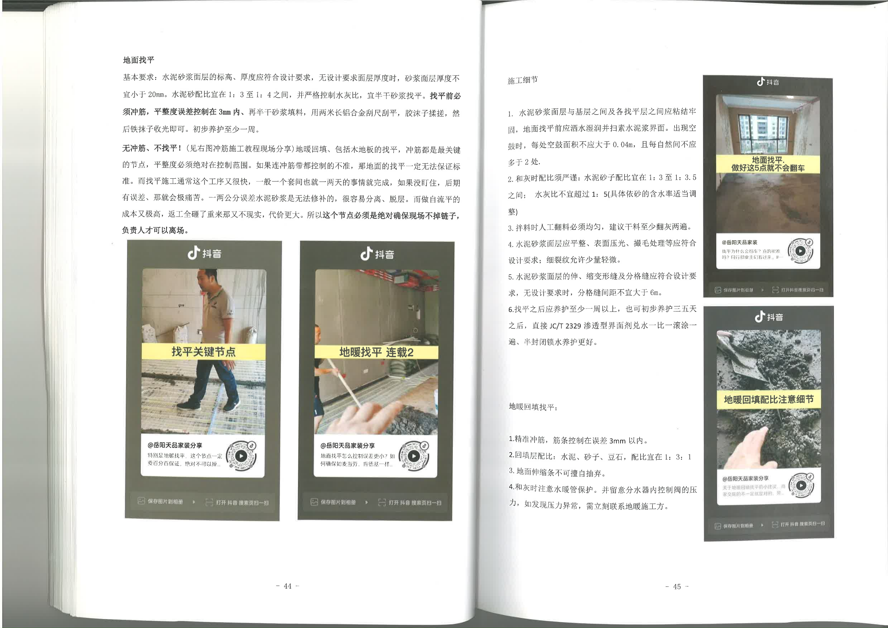

### OCR 文字

地面找平  
基本要求：水泥砂浆面层的标高、厚度应符合设计要求，无设计要求面层厚度时，砂浆面层厚度不  
宣小于 20mm。水泥砂配比宣在1:3至1：4之间，并严格控制水灰比，宜半干砂浆找平。找平前必  
须冲筋，平整度误差控制在3mm 内、再半干砂浆填料，用两米长铝合金刮尺刮平，胶沫子揉搓，然  
后铁抹子收光即可。初步养护至少一周。  
无冲筋、不找平！（见右图冲筋施工教程现场分享）地暖回填、包括木地板的找平，冲筋都是最关键  
的节点，平整度必须绝对在控制范围。如果连冲筋带都控制的不准，那地面的找平一定无法保证标  
准。而找平施工通常这个工序又很快，一般一个套间也就一两天的事情就完成，如果没盯住，后期  
有误差、那就会极痛苦。一两公分误差水泥砂浆是无法修补的，很容易分离、脱层。而做自流平的  
成本又极高，返工全砸了重来那又不现实，代价更大。所以这个节点必须是绝对确保现场不掉链子，  
负责人才可以离场。  
d 抖音  
d 抖音  
找平关键节点  
地暖找平 连载2  
@岳阳天品家装分享  
@岳阳天品家装分享  
特别是地暖找平，这个节点一定  
地而找平怎么控制误差更小？如  
要百分百保证，绝对不可以掉  
何确保如麦当劳，肯德尽一样  
國」爆标菌片到梧游*［舒环拼意授养员扫一扫  
因 保存菌片到相餅】打开拌备 授紫页扫一扫  
\- 44 -  
施工细节  
小 抖音  
1.水泥砂浆面层与基层之间及各找平层之间应粘结牢  
固，地面找平前应酒水湿润并扫素水泥浆界面。出现空  
鼓时，每处空鼓面积不应大于0.04m，且每自然间不应  
多于2处.  
地面找平.  
做好这5点就不会翻车  
2\. 和灰时配比须严谨：水泥砂子配比宜在1:3至1:3.5  
之间；水灰比不宜超过1：5（具体依砂的含水率适当调  
整）  
3\. 拌料时人工翻料必须均匀，建议干料至少翻灰两遍。  
4.水泥砂浆面层应平整、表面压光、撮毛处理等应符合  
@岳阳天品家装  
设计要求；细裂纹允许少量轻微。  
吗？同行们业丰们而刘深。归  
5\. 水泥砂浆面层的伸、缩变形缝及分格缝应符合设计要  
求，无设计要求时，分格缝间距不宜大于 6m。  
6.找平之后应养护至少一周以上，也可初步养护三五天  
J抖音  
之后，直接JC/T 2329 渗透型界面剂兑水一比一滚涂-  
遍、半封闭锁水养护更好。  
地暖回填配比注意细节  
地暖回填找平；  
1.精准冲筋，筋条控制在误差 3mm 以内。  
2.回填层配比：水泥、砂子、豆石，配比宣在1:3:1  
3.地面伸缩条不可擅自抽弃。  
@岳阳天品家装分享  
4.和灰时注意水暖管保护。并留意分水器内控制阀的压  
关王琥司傅婚裁卓的小巿议  
家久庭的而一定就是对的，带  
力，如发现压力异常，需立刻联系地暖施工方。  
四 保加片现推曲  
\- 45  

---

## 扫描页 28

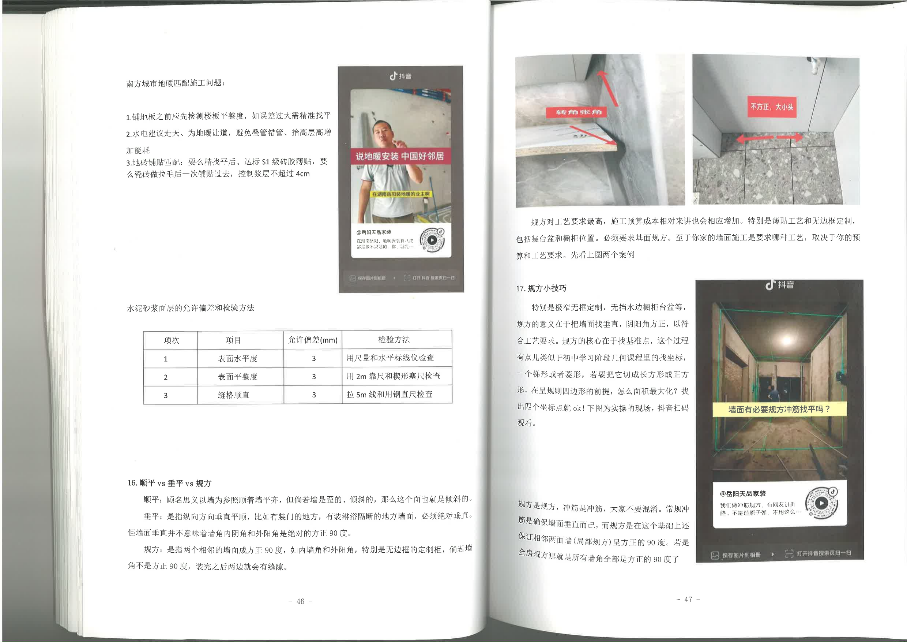

### OCR 文字

小料音  
南方城市地暖匹配施工问题：  
1.铺地板之前应先检测楼板平整度，如误差过大需精准找平  
2.水电建议走天、为地暖让道，避免叠管错管、抬高层高增  
加能耗  
说地暖安装 中国好邻居  
3.地砖铺贴匹配：要么精找平后、达标 S1 级砖胶薄贴，  
要  
么瓷砖做拉毛后一次铺贴过去，控制浆层不超过4cm  
@岳阳天品家装  
在湖南岳阳，地眼安装布八成  
水泥砂浆面层的允许偏差和检验方法  
项次  
项目  
允许偏差（mm）  
检验方法  
表面水平度  
用尺量和水平标线仪检查  
2  
表面平整度  
用2m 靠尺和楔形塞尺检查  
缝格顺直  
3  
拉5m 线和用钢直尺检查  
16\. 顺平vs 垂平 vs规方  
顺平：顾名思义以墙为参照顺着墙平齐，但倘若墙是歪的、倾斜的，那么这个面也就是倾斜的。  
垂平：是指纵向方向垂直平顺，比如有装门的地方，有装淋浴隔断的地方墙面，必须绝对垂直。  
但墻面垂直并不意味着墙角内阴角和外阳角是绝对的方正90度。  
规方：是指两个相邻的墙面成方正 90度，如内墙角和外阳角，特别是无边框的定制柜，倘若墻  
角不是方正90度，装完之后两边就会有缝隙。  
\- 46-  
不方正，大小头  
角张角  
规方对工艺要求最高，施工预算成本相对来讲也会相应增加。特别是薄贴工艺和无边框定制，  
包括装台盆和橱柜位置。必须要求基面规方。至于你家的墙面施工是要求哪种工艺，取决于你的预  
算和工艺要求。先看上图两个案例  
17\. 规方小技巧  
抖音  
特别是极窄无框定制，无挡水边橱柜台盆等，  
规方的意义在于把墙面找垂直，阴阳角方正，以符  
合工艺要求。规方的核心在于找基准点，这个过程  
有点儿类似于初中学习阶段几何课程里的找坐标，  
一个梯形或者菱形，若要把它切成长方形或正方  
形，在呈规则四边形的前提，怎么面积最大化？找  
出四个坐标点就 ok！下图为实操的现场，抖音扫码  
墙面有必要规方冲筋找平吗？  
观看。  
@岳阳天品家装  
规方是规方，冲筋是冲筋，大家不要混淆。常规冲  
我们做冲筋规方，有网反讲折  
腾。不崇造原子弹，不用这么  
筋是确保墙面垂直而己，而规方是在这个基础上还  
保证相邻两面墙（局部规方）呈方正的90度。若是  
金房规方那就是所有墙角全部是方正的90度了  
因 保徐图片到.册  
打开料意搜索页扫一扫  
\- 47 -  

---

## 扫描页 29

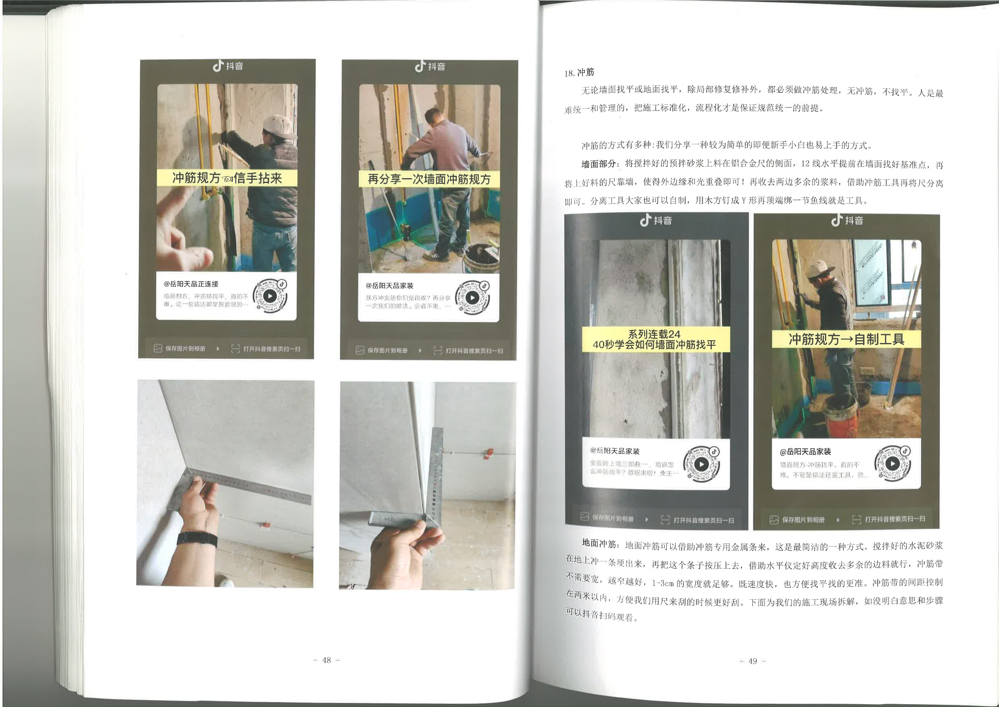

### OCR 文字

d 抖音  
◎ 拼音  
冲筋规方 例信手拈来  
再分享一次墙面冲筋规方  
@岳阳天品正连接  
@岳阳天品家装  
临面归方，冲偷骑我平。真的不  
恕方冲金節你们觉街难？码分享  
雞。这一您撕法罪脆发领的：  
一次我幻的做法。会背不潮。  
图K保存的骨劃相册  
（非开拼普搜索优扫一扫  
图 保容圓片到相册•打开供音搜聚页扫一扫  
\-48-  
18.冲筋  
无论墙面找平或地面找平，除局部修复修补外，都必须做冲筋处理，无冲筋，不找平。人是最  
难统一和管理的，把施工标准化，流程化才是保证规范统一的前提。  
冲筋的方式有多种：我们分享一利较为简单的即便新手小白也易上手的方式。  
墙面部分：将搅拌好的预拌砂浆上料在铝合金尺的侧面，12线水平提前在墙面找好基准点，再  
将上好料的尺靠墙，使得外边缘和光重叠即可！再收去两边多余的浆料，借助冲筋工具再将尺分离  
即可。分离工具大家也可以自制，用木方钉成Y形再顶端绑一节鱼线就是工具。  
J抖音  
J 抖音  
系列连载24  
40秒学会如何墙面冲筋找平  
冲筋规方一自制工具  
@岳阳天品家装  
@岳阳天品家装  
全流砖上那三部山！一，脆面怎  
楼谕规方-冲解战平，真的不  
么冲j批季？没醒来心！北三：  
x不管是圖法还是1具，然  
圖 保有国片到报冊己打开科音搜察页扫一扫  
图 保存園片到相册三！打井科音搜察页扫一扫  
地面冲筋：地面冲筋可以借助冲筋专用金属条来，这是最简洁的一种方式。搅拌好的水泥砂浆  
在地上冲一条项出来，再把这个条子按压上去，借助水平仪定好高度收去多余的边料就行，冲筋带  
不需要宽，越窄越好，1-3cm的宽度就足够。既速度快，也方便找平找的更准。冲筋带的间距控制  
在两米以内，方便我们用尺来刮的时候更好刮。下面为我们的施工现场拆解，如没明白意思和步骤  
可以抖音扫码观看。  
\-49  

---

## 扫描页 30

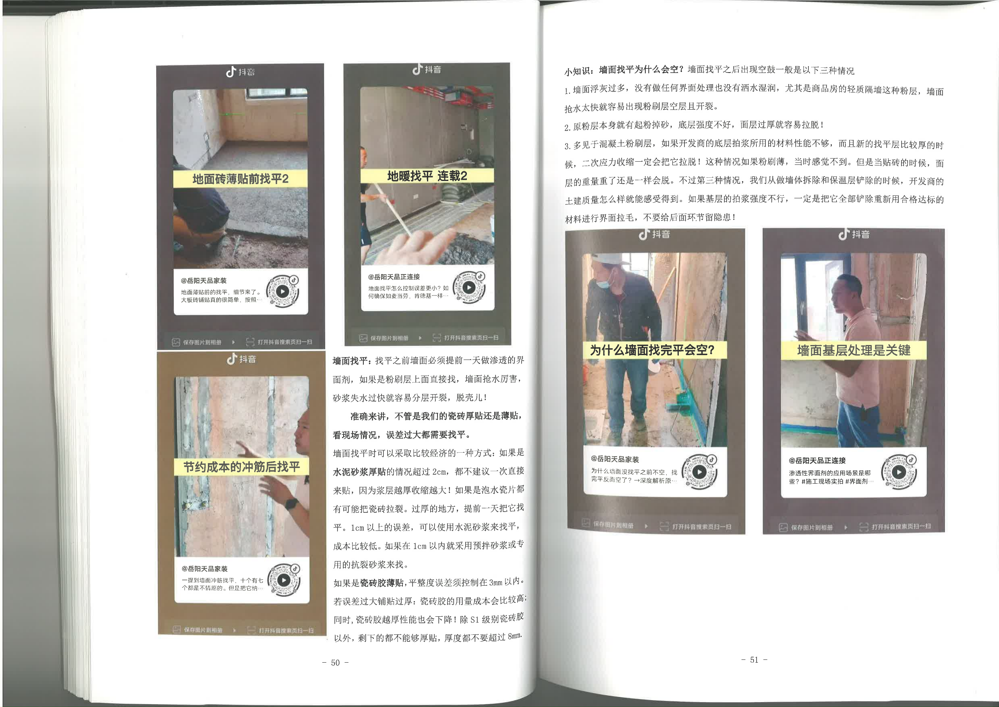

### OCR 文字

J 抖窗  
O 抖音  
地面砖薄贴前找平2  
地暖找平 连载2  
@岳阳天品家装  
@岳阳天品正连接  
地面薄贴前的找平，细节来了。  
地面找平怎么控制误差更小？如  
大板砖铺贴真的很简单，按照•  
何确保如麦当劳，肯德基一样…  
四 森存蘭片到模册忌子打开拼套搬券页进二料  
、 EF打开拉童慢票两坦一扫  
小抖音  
墙面找平：找平之前墙面必须提前一天做滲透的界  
面剂，如果是粉刷层上面直接找，墙面抢水厉害，  
砂浆失水过快就容易分层开裂，脱壳儿！  
准确来讲，不管是我们的瓷砖厚贴还是薄贴，  
看现场情况，误差过大都需要找平。  
墙面找平时可以采取比较经济的一种方式：如果是  
节约成本的冲筋后找平  
水泥砂浆厚贴的情况超过 2cm，都不建议一次直接  
来贴，因为浆层越厚收缩越大！如果是泡水瓷片都  
有可能把瓷砖拉裂。过厚的地方，提前一天把它找  
平。1cm 以上的误差，可以使用水泥砂浆来找平，  
成本比较低。如果在1cm 以内就采用预拌砂浆或专  
@岳阳天品家装  
用的抗裂砂浆来找。  
一提到墻面冲筋找平，十个有七  
个都是不情愿的。但是把它纳  
如果是瓷砖胶薄贴，平整度误差须控制在3mm以内。  
若误差过大铺贴过厚：瓷砖胶的用量成本会比较高；  
同时，瓷砖胶越厚性能也会下降！除S1 级别瓷砖胶  
E 领茶血/到相研：打开料管物发顶扫一甘  
以外，剩下的都不能够厚贴，厚度都不要超过8mm.  
\-50-  
小知识：培面找平为什么会空？墙面找平之后出现空鼓一般是以下三种情况  
1.墙面浮灰过多，没有做任何界面处理也没有洒水湿润，尤其是商品房的轻质隔墙这种粉层，墙面  
抢水太快就容易出现粉刷层空层且开裂。  
2\. 原粉层本身就有起粉掉砂，底层强度不好，面层过厚就容易拉脱！  
3.多见于混凝土粉刷层，如果开发商的底层拍浆所用的材料性能不够，而且新的找平层比较厚的时  
候，二次应力收缩一定会把它拉脱！这种情况如果粉刷薄，当时感觉不到。但是当贴砖的时候，面  
层的重量重了还是一样会脱。不过第三种情况，我们从做墻体拆除和保温层铲除的时候，开发商的  
士建质量怎么样就能感受得到。如果基层的拍浆强度不行，一定是把它全部铲除重新用合格达标的  
材料进行界面拉毛，不要给后面环节留隐患！  
C抖音  
J抖音  
为什么墙面找完平会空？  
墙面基层处理是关键  
@岳阳天品家装  
@岳阳天品正连接  
为什么墙面没找平之前不空，  
找  
渗透性界面剂的应用场景是哪  
完平反而空了？一深度解析原⋯  
些？#施工现场实拍 ＃界面剂  
国 保存四片到相册  
打开排童搜泰页扫一位  
\- 51 -  

---

## 扫描页 31

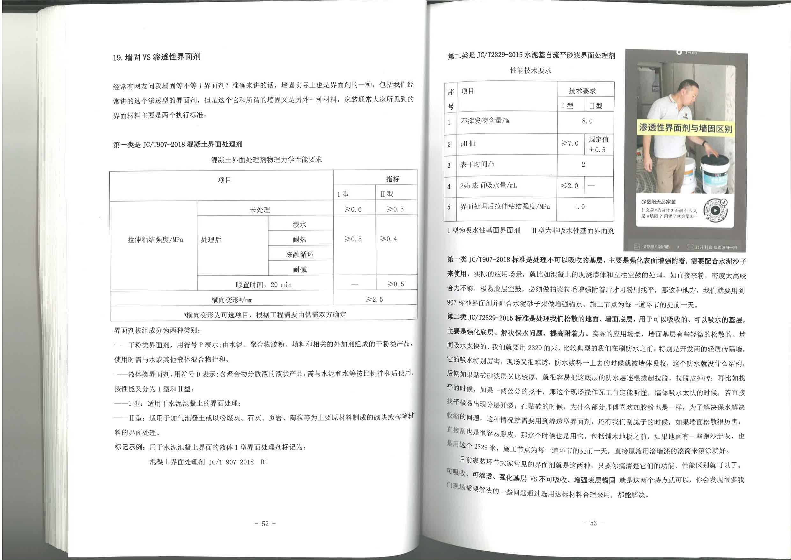

### OCR 文字

19.墙固 vS 滲透性界面剂  
经常有网友问我墻固等不等于界面剂？准确来讲的话，墙固实际上也是界面剂的一种，包括我们经  
常讲的这个渗透型的界面剂，但是这个它和所谓的墙固又是另外一种材料，家装通常大家所见到的  
界面材料主要是两个执行标准：  
第一类是JC/T907-2018混凝士界面处理剂  
混凝土界面处理剂物理力学性能要求  
项目  
指标  
1型  
II型  
未处理  
≥0.6  
≥0.5  
浸水  
拉伸粘结强度/MPa  
处理后  
耐热  
≥0.5  
≥0.4  
冻融循环  
耐碱  
晾置时间，20 min  
横向变形a/mm  
≥2.5  
a横向变形为可选项目，根据工程需要由供需双方确定  
界面剂按组成分为两种类别：  
——干粉类界面剂，用符号P表示；由水泥、聚合物胶粉、填料和相关的外加剂组成的干粉类产品，  
使用时需与水或其他液体混合物拌和。  
——液体类界面剂，用符号 D表示；含聚合物分散液的液状产品，需与水泥和水等按比例拌和后使用。  
按性能又分为1型和II型：  
—1型：适用于水泥混凝土的界面处理；  
\-—1型：适用于加气混凝土或以粉煤灰、石灰、页岩、陶粒等为主要原材料制成的砌块或砖等材  
料的界面处理。  
标记示例：用于水泥混凝土界面的液体1型界面处理剂标记为：  
混凝土界面处理剂 JC/T 907-2018 D1  
\- 52-  
第二类是 JC/T2329-2015 水泥基自流平砂浆界面处理剂  
性能技术要求  
序 项目  
技术要求  
号  
1型  
II型  
1 不挥发物含量/%  
8.0  
渗透性界面剂与墙固区别  
2  
叫l 值  
≥7.0  
规定值  
士0.5  
3 表干时间/h  
2  
24h表面吸水量/mL  
≤2.0  
@岳阳天品家装  
5 界面处理后拉伸粘结强度/MPa  
1.0  
什么是#渗达性界面剂 什么叉  
是#皆固？用错了就会带来  
1 型为吸水性基面界面剂  
II型为非吸水性基面界面剂  
第一类JC/T907-2018 标准是处理不可以吸收的基层，主要是强化表面增强附着，需要配合水泥沙子  
来使用，实际的应用场景，就比如混凝土的现浇墙体和立柱空鼓的处理，如直接来粉，密度太高咬  
≥0.5  
合力不够，极易脱层空鼓，必须做拍浆拉毛增强附着后才可粉刷找平，那这种地方，我们就要用到  
907标准界面剂并配合水泥砂子来做增强锚点。施工节点为每一道环节的提前一天。  
第二类JC/T2329-2015标准是处理我们松散的地面、墙面底层，用于可以吸收的、可以吸水的基层，  
主要是强化底层、解决保水问题、提高附着力。实际的应用场景，墙面基层有些轻微的松散的、墙  
面吸水太快的、我们就要用2329的来，比较典型的我们在刷防水之前：特别是开发商的轻质砖隔墻，  
它的吸水特别厉害，现场又很难透，防水浆料一上去的时候就被墙体吸收，这个防水就没什么结构，  
后期如果贴砖砂浆层又比较厚，就很容易把这底层的防水层连根拔起拉脱，拉脱皮掉砖：再比如找  
平的时候，如果一两公分的找平，那这个现场操作瓦工肯定能听懂，墙体吸水太快的时候，若直接  
找平极易出现分层开裂：在贴砖的时候，为什么部分师傅喜欢加胶粉也是一样，为了解决保水解决  
收缩的问题，这科情况就需要用到渗透型界面剂，还有我们刮賦子的时候，如果墙面松做很厉害，  
直接副也是很容易脱皮，那这个时候也是用它。包括铺木地板之前，如果地面有一些跑沙起灰，也  
是用这个2329来，施工节点为每一道环节的提前一天，直接原液用滚墙漆的滚筒来滚涂就好。  
目前家装环节大家常见的界面剂就是这两种，只要你搞清楚它们的功能、性能区别就可以了。  
可吸收、可渗透、强化基层VS不可吸收，增强表是锚周 就是这两个墟占就可以，你会发现很多我  
们现场篇要解决的一些问题通过选用达标材料合理来用，都能解决。  
\- 53 -  

---

## 扫描页 32

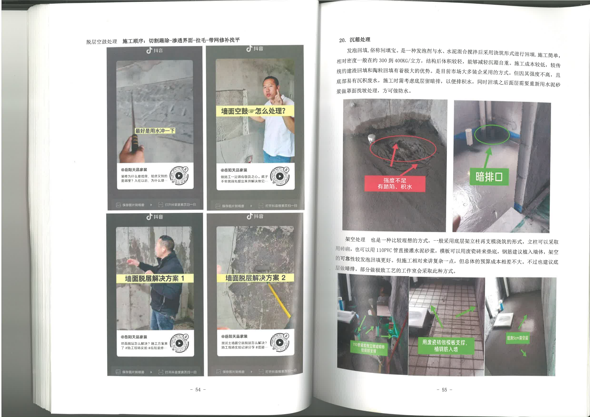

### OCR 文字

脱层空鼓处理  
施工顺序：切割踢除-滲透界面-拉毛-带网修补找平  
J抖音  
C抖音  
墻面空鼓®怎么处理？  
最好是用水冲一下  
@岳阳天品家装  
@岳阳天品家装  
装修为什么要验房，验房又验的  
做施工一定得有敬畏之心。底子  
是哪里？人任以后，  
不牢就得先提出来并解决他它•  
叉 噬春興片到牾册  
：号打开4意退养两过一注  
国 最 商片动指曲1街开批僱提和派份一日  
掛音  
d抖音  
墙面脫层解決方案1  
墻面脱层解決方案 2  
@岳阳天品家装  
@岳阳天品家装  
墙面脱层怎么解决？施工方案来  
混泥土墻面空鼓脱层怎么解决？  
了#施工现场实拍 #岳阳装修  
施工现场实拍记录分享 #混凝  
空 你邦国林到将册志今打开料會搜系颈扫一日  
开料金提纳颜日一起  
\- 54 -  
20\. 沉箱处理  
发泡回填，俗称回填宝。是一种发泡剂与水、水泥混合搅拌后采用浇筑形式进行回填.施工简单，  
相对密度一般在约300到400KG/立方，结构后体积较轻，能够减轻沉箱自重。施工成本较低，较传  
统的建渣回填和陶粒回填有着极大的优势。是目前市场大多装企采用的方式。但因其强度不高，且  
底部易有沉积废水，施工时需考虑底层留暗排，以便排积水，同时回填之后面层需要重新用水泥砂  
浆做罩面找坡处理，方可做防水。  
暗排口  
强度不足  
有踏陷、积水  
架空处理 也是一种比较理想的方式，一般采用底层架立柱再支模浇筑的形式，立柱可以采取  
用砖砌，也可以用110PVC管直接灌水泥砂浆，模板可以用废瓷砖来垫底，钢筋建议植入墙体，架空  
的可靠性较发泡回填更好。但施工相对来讲复杂一点，但总体的预算成本相差不大。不过也建议底  
层做暗排。部分做极致工艺的工作室会采取此种方式。  
规浇5cm樂空糕  
H0毫礼 溪仁卖散或树传  
用废瓷砖做模板支撑，  
植钢筋入墙  
\- 55 -  

---

## 扫描页 33

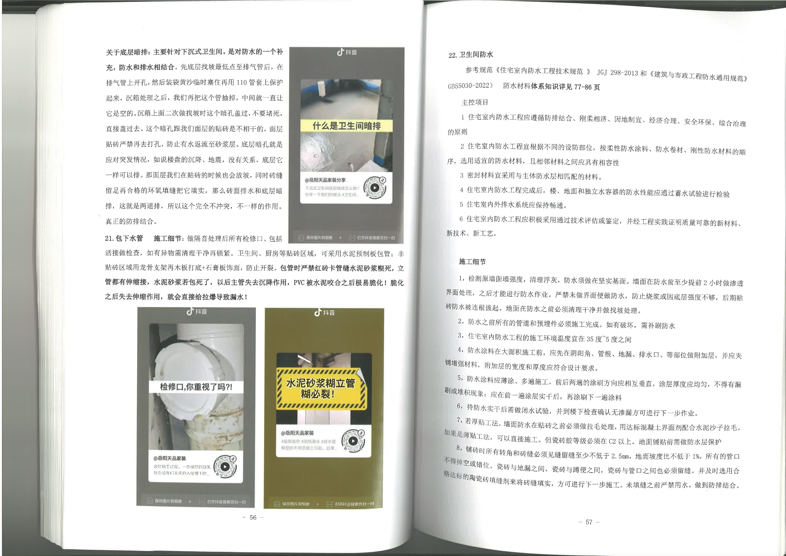

### OCR 文字

关于底层暗排：主要针对下沉式卫生间。是对防水的一个补  
d掛音  
充，防水和排水相结合。先底层找坡最低点至排气管后，在  
排气管上开孔，然后装袋黄沙临时塞住再用110管套上保护  
起来，沉箱处理之后，我们再把这个管抽掉，中间就一直让  
它是空的。沉箱上面二次做找坡时这个暗孔盖过，不要堵死，  
直接盖过去。这个暗孔跟我们面层的贴砖是不相干的，面层  
什么是卫生间暗排  
贴砖严禁再去打孔，防止有水返流至砂浆层。底层暗孔就是  
应对突发情况，如说楼盘的沉降、地震，没有关系，底层它  
一样可以排。那面层我们在贴砖的时候也会放坡，同时砖缝  
@岳阳天品家装分享  
留足再合格的环氧填缝把它填实，那么砖面排水和底层暗  
下沉式卫生间庭后的出怎么缴？  
分享一下我们暌缴法。卫生前  
排，这就是两道排，所以这个完全不冲突，不一样的作用。  
真正的防排结合。  
21.包下水管 施工细节：做隔音处理后所有检修口、包括  
四 保辛国片興相捞  
打开料麻携市扫一扫  
活接做检查，如有异物需清理干净再锁紧。卫生间、厨房等贴砖区域，可采用水泥预制板包管；非  
贴砖区域用龙骨文架再木板打底+石膏板饰面，防止开裂。包管时严禁红砖卡管缝水泥砂浆糊死，立  
管都有伸缩接，水泥砂浆若包死了，以后主管失去沉降作用，PVC被水泥咬合之后极易脆化！脆化  
之后失去伸缩作用，就会直接给拉爆导致漏水！  
d拜音  
J 抖音  
检修口，你重视了吗？！  
水泥砂浆糊立管  
糊必裂！  
@岳阳天品象装  
\#琵阳装修＃听M冰＃接冰部  
典型的不规范無工引起，后果！  
@岳阳天品家装  
終你总工过促，一些细节的歌尖  
刘会给段们未深的入住埋下隙  
料商搜索 扫一扫  
\- 56 -  
22\. 卫生间防水  
参考规范《住宅室内防水工程技术规范》JGJ 298-2013和《建筑与市政工程防水通用规范》  
GB55030-2022）  
防水材料体系知识详见77-86页  
主控项目  
1 住宅室内防水工程应遵循防排结合、刚柔相济、因地制宜、经济合理、安全环保、综合治理  
的原则  
2 住宅室内防水工程宜根据不同的设防部位，按柔性防水涂料、防水卷材、刚性防水材料的顺  
序，选用适宜的防水材料，且相邻材料之间应具有相容性  
3密封材料宜采用与主体防水层相匹配的材料。  
4 住宅室内防水工程完成后，楼、地面和独立水容器的防水性能应通过蓄水试验进行检验  
5 住宅室内外排水系统应保持畅通。  
6 住宅室内防水工程应积极采用通过技术评估或鉴定，并经工程实践证明质量可靠的新材料、  
新技术、新工艺。  
施工细节  
1，检测原墙面墙强度，清理浮灰，防水须做在坚实基面。墙面在防水前至少提前2小时做滲透  
界面处理，之后才能进行防水作业。严禁未做界面便做防水，防止烧浆或因底层强度不够，后期贴  
砖防水被连根拔起。地面在防水之前必须清理干净并做找坡处理。  
2，防水之前所有的管道和预埋件必须施工完成。如有破坏，需补刷防水  
3，住宅室内防水工程的施工环境温度宜在35度～5度之间  
4，防水涂料在大面积施工前，应先在阴阳角、管根、地漏、排水口、等部位做附加层，并应夹  
铺增强材料，附加层的宽度和厚度应符合设计要求。  
5，防水涂料应薄涂、多遍施工，前后两遍的涂刷方向应相互垂直，涂层厚度应均匀，不得有漏  
刷或堆积现象；应在前一遍涂层实干后，再涂刷下一遍涂料  
6，待防水实干后需做闭水试验，并到楼下检查确认无渗漏方可进行下一步作业。  
？，若厚贴工法，墙面防水在贴砖之前必须做拉毛处理，用达标混凝士界面剂配合水泥沙子拉毛。  
如果是薄贴工法，可以直接施工。但瓷砖胶等级必须在 C2 以上。地面铺贴前需做防水层保护  
8，铺砖时所有转角和砖缝必须见缝留缝至少不低于 2.5mm，地面坡度比不低于1%，所有的管口  
不得圳空或错位。瓷砖与地漏之间，瓷砖与蹲便之间，瓷砖与管口之间也必须留缝。并及时选用合  
格达标的陶登砖填缝剂来将砖缝填实，方可进行下一步施工。未填缝之前严茶用水。做到防排结合。  
\-57-  

---

## 扫描页 34

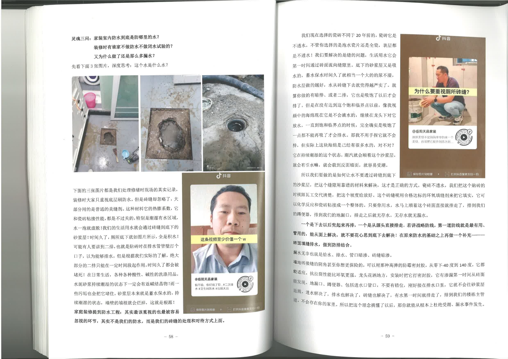

### OCR 文字

灵魂三间：家装室内防水到底是防哪里的水？  
装修时有谁家不做防水不做闭水试验的？  
又为什么做了还是那么多漏水？  
先看下面3张图片，深度思考：这个水是什么水？  
小抖音  
下面的三张图片都是我们处理修缮时现场的真实记录，  
装修时大家只重视底层刷防水，但是砖缝却忽略了，大  
部分用的是普通的美缝剂。这种材料它的热膨系数，它  
和瓷砖粘接性能，都是不过关的，特别是潮湿有水区域，  
水一泡就虚脱！我们的生活用水就会通过砖缝到底下的  
砂浆层！时间久了，厕所底下就如图片所示，全是积水！  
这条视频至少价值一个 w  
可能有人要讲到二排，也就是贴砖时在排水管管壁打个  
口子，以为能够排水，但是根据我们实际的了解，绝大  
部分的二排只能在一定时间段起作用，时间久了都会被  
堵死！在日常生活，各种各种酸性、碱性的洗涤用品，  
@岳阳天品家装  
水泥砂浆持续潮湿的状态下一定会有返碱结晶物！而一  
情不值。你们说了算。扩二次排  
水t卫生间防水引岳阳天品  
些污垢也会把它堵住，砂浆层本来就是蓄水保水的，持  
续潮湿的状态，墙壁的墙根就会烂掉，这就是根源！  
家庭装修提到防水工程：其实最该重视的也最被容易  
E 像存樹片到糊甜  
忽视的环节，其实不是我们的防水，而是我们的砖缝的处理和对待方式上面。  
58 -  
我们现在选择的瓷砖不同于20年前的，瓷砖它是  
山抖音  
不透水，不管你选择的是泡水瓷片还是全瓷，表层都  
是不透水！我们要解决的是缝的问题，生活用水它会  
第一时间通过砖面流向缝隙里。底下的砂浆层又是吸  
水的，蓄水保水时间久了就相当一个大的的尿不湿，  
防水层做的越好，水从砖缝下去就兜得越严实了。就  
为什么要重视厕所砖缝？  
算你做的有暗排、或者二排，它也是吸饱了以后才会  
排了。但是在没有达到这个饱和临界点以前，像我视  
频中的海绵现在它是不会滴水的，继续在龙头下对它  
放水，一直到饱和临界点的时候，完全确实是吸饱了  
@岳阳天品家装  
一点都不能再吸了才会排水。那我不用手捏它就不会  
浏所美缝不是简简单耶的来--个  
美缝，应该把官提升到防渗漏  
排，但实际上这块海绵是己经有很多水的，对不对？  
它在持续潮湿的这个状态，潮汽就会顺着这个沙浆层，  
就会有引水嘛，就会载到反面墙面，就容易受潮。  
所以我们要做的是如何让水不要透过砖缝到底下  
四 保存團片到怕問、任号 打开抖音搜索页扫一扫  
的沙浆层，把这个缝隙用靠谱的材料来解决，这才是正确的方式。瓷砖不透水，我们把这个贴砖的  
时候跟瓦工交代清楚，把这个坡度给放好。这个砖缝呢用合格达标的环氧填缝剂来把它填实，它可  
以化学反应和瓷砖粘接成一个整体的。只要你用水，水马上顺着这个砖面直接就排走了，排到我们  
的蹲便器，排到我们的地漏口，排走之后就无存水。无存水就无漏水。  
一个是下去以后兜起来再排，一个是从源头直接排走，若讲战略防线，第一道防线就是最有用、  
管用的，能从面上解决，就不要花心思到底下去解决！在原来防水的基础之上再做一个补充———  
砖面填缝排水，做到防排结合。  
潟水无非也就是给水、排水、管口暗滲、砖缝暗渗。  
端地砖接缝的阴角甚至你想更保险的，可以用那种高弹的防霉密封胶，从零下：40度到140度，它都  
能适应。抗拉裂性能比环氧更强。龙头花洒地方，安装时把它打密封胶，它有渗漏第一时间从砖面  
能發现。地漏口、蹲便器、包括进水口管口，不要有错位，刚好接在排水口里，它就不会往砂浆层  
返澱。进水解决了，非水也解决了，砖维也解决了，有水第一时间就排走了，排到我们的楼株主管  
道，不会存在你的家里。所以把这个理念搞催了以后，那你就能从根本上杜绝受潮、漏水事件发生。  
\-59 -  

---

## 扫描页 35

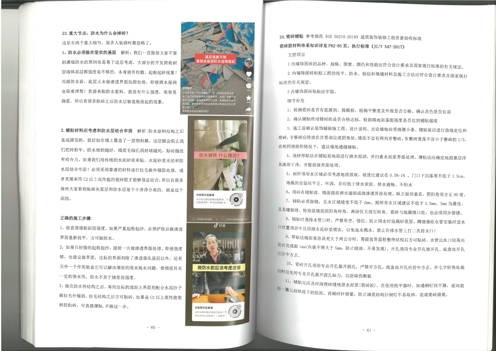

### OCR 文字

23\. 重大节点：防水为什么会掉砖？  
这里有两个重大细节，很多人装修时都忽略了：  
1，防水必须做在坚实的基面 解析：我们一直提倡大家不要  
基层强度不够  
刷满墙防水的原因也是基于这层考虑，大部分的开发商粉刷  
直接连底层防水连根拔起  
层墙体基层都强度是不够的，本身就有松散、起粉起砂现象！  
而做防水前，底层又未做渗透界面加固处理，即便洒水湿润  
@文同学  
也很难理想！直接来刷防水浆料，就没有什么强度，很容易  
待紧家不到一个月就烈车了，泥工师傅说跟他没关  
系 卖防水的老版也说不是他的了。然砖厂老恨说漆  
烧浆，所以有很多贴砖之后防水层被连根拔起的现象。  
传也没问遊 实为胶的史无打包票，着来是业生自己  
的问款，那些則防水四問还要脚很高的就问你们心里  
2.铺贴材料应考虑和防水层结合牢固 解析：防水涂料结构之后  
是成膜型的，就好似在墙上覆盖了一层塑料膜，这层膜会阻止我  
们把砖贴牢。防水做的越好，墻面毛细孔洞封堵越死，贴砖越没  
防水掉砖 什么情况？  
有咬合力。如果我们用传统的水泥砂浆来贴，水泥砂浆无法和防  
水层结合牢固！必须采用靠谱的材料进行拉毛做外锚固处理，或  
者直接来用C2以上高性能的瓷砖胶才能够保证结合，所以有很多  
掉砖大家看到贴砖灰浆层和防水层是干干净净分离的，就是这个  
@岳阳天品家装  
原因。  
小白业去都灣欢的没指防水  
正确的施工步骤：  
1，检查原墙粉刷层强度，如果严重起粉起沙，必须铲除后做渗透  
界面重新找平，方可做防水。  
2，如果只轻微的起粉起沙，提前一天做渗透界面处理。即便强度  
够，也建议做界面，达标的界面剂除了渗透强化基层以外，还有  
另外一个作用就是它可以解决墙面的吸水抢水问题，使墙面具有  
做防水前应该考虑这些  
一定的保水性，防水不至于烧浆没强度。  
3，做完防水待结构之后，再用达标的混泥土界面剂配合水泥沙子  
做拉毛外锚固，拉毛结构之后方可贴砖。如果是C2 以上高性能瓷  
砖胶贴砖，可直接薄贴，不做这一步。  
@岳阳天品家装  
\- 60 -  
24.瓷砖铺贴 参考规范《GB 50210-2018》建筑装饰装修工程质量验收标准  
瓷砖胶材料体系知识详见P82-85 页，执行标准《JC/T 547-2017》  
主控项目  
1 内墻饰面砖的品种、规格、图案、颜色和性能应符合设计要求及国家现行标准的有关规定。  
2 内墙饰面砖粘贴工程的找平、防水、粘结和填缝材料及施工方法应符合设计要求及国家现行  
标准的有关规定。  
3 内墻饰面砖粘贴应牢固。  
细节补充  
1，检测瓷砖是否有脱膜剂、脱膜粉，检测平整度及外观是否合格。确认花色是否有误  
2，确认铺贴所用辅材的是否合格达标，检测墙地面基面强度是否达到铺贴强度  
3，施工前确认装饰铺贴施工图、设计说明。无论墙地砖须规避小条。铺贴前应进行放线定位和  
排砖，非整砖应排放在次要部位或阴角处。墙面不宜有两列非整砖，非整砖宽度不宜小于整砖的1/3。  
在相同规格的情况下，建议墻地通缝铺贴。  
4，地砖厚贴法在铺贴前地面进行洒水湿润，并扫素水泥浆界面处理。薄贴法应确定地面基层浮  
灰清理干净，并提前做界面处理。  
5，厕所等用水区域必须考虑地面放坡，坡度比建议在0.5%-1%。门口下沉落差不低于 1.5cm。  
地漏的安装应平正、牢固，并应低于排水表面、排水通畅、不积水  
6，墙砖在铺贴前，墙面提前洒水湿润或做渗透界面处理。纵立面须垂直，阴阳角须方正90度。  
7，铺贴必须留缝，无水区域缝宽不低于 2mm。厕所有水区域建议不低于 2.5mm,3mm 为最佳。  
且见缝留缝，特别是墙面阴阳角转角、淋浴区大理石转角、瓷砖与地漏接口处，也必须同步留缝。  
8，铺贴时遇排水管口时，严禁吊空、错位。防止用水时返溅砂浆层。蹲便器给水管安装时进水  
口位置须居中且用湿水泥砂浆偎实，以免返水溅水。禁止在排水管上打二次排水口！  
9，厚贴法墙面垂直误差大于两公分时，需提前界面粉整待结构后方可贴砖。水管出水口应高出  
瓷砖完成面 1mm（内嵌不得大于 5mm，防止暗滲，不易发现），开孔须用专业开孔器开孔。底盒处开孔  
应居中方正。  
10，瓷砖开孔须用专业开孔器开圆孔，严禁开方孔。底盒处开孔应居中方正。在七字转角处裁  
坝时应先用专业开孔器开圆孔卸力，以防暗伤断板  
L，铺贴完应及时清理砖缝残留水泥浆（瓷砖胶），在使用找平器时，如遇钢钉找平器，逆向旋  
转一圈儿刮掉底下的胶泥。再顺时针锁紧，防小满浆结构后钢钉不易取掉，造成瓷砖崩瓷。  
\- 61 -  

---

## 扫描页 36

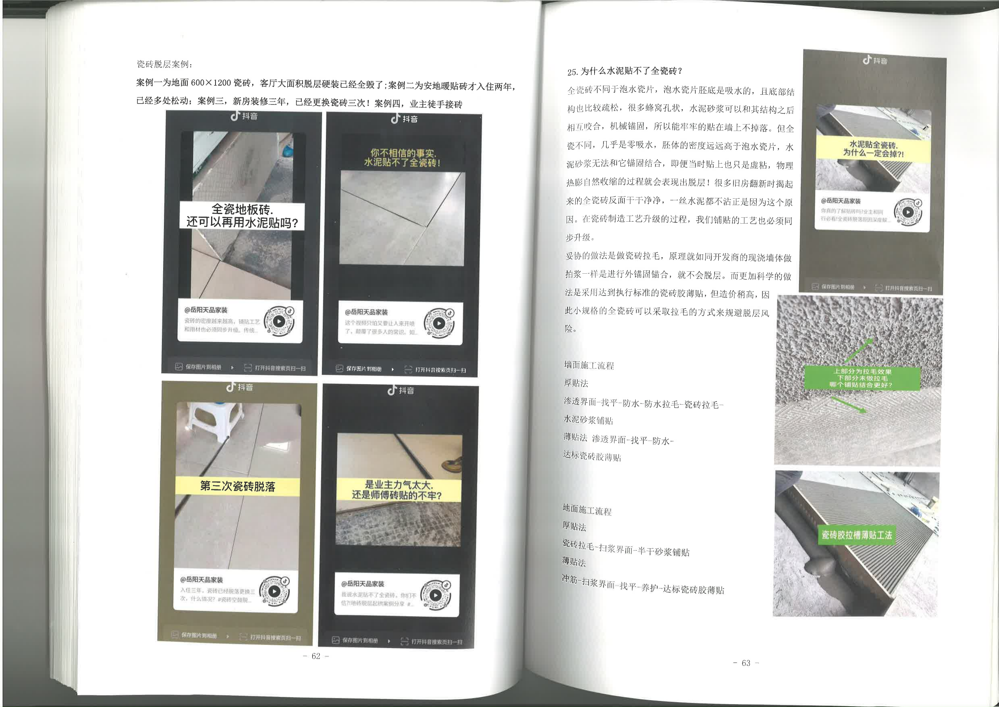

### OCR 文字

瓷砖脱层案例：  
案例一为地面600X1200瓷砖，客厅大面积脱层硬装已经全毁了；案例二为安地暖贴砖才入住两年，  
已经多处松动；案例三，新房装修三年，已经更换瓷砖三次！案例四，业主徒手接砖  
d抖音  
d抖音  
你不相信的事实  
水泥贴不了全瓷砖！  
全瓷地板砖.  
还可以再用水泥贴吗？  
@岳阳天品家装  
@岳阳天品家装  
交砖的碗度越来越高，稠贴工艺  
这个视频只伯叉婴让人来打噸  
和用标也必须简步升众传统  
了；理宁提多人的伤识。班  
因. 保存園片到程册  
保存图片到相份，  
打开料商搜索页扫一扫  
丁 音  
J 音  
第三次瓷砖脱落  
是业主力气太大.  
还是师傅砖贴的不牢？  
@岳阳天品家装  
@岳阳天品家装  
入佳三年，瓷祷已坯般荡更换三  
次，什么博况？#器時论续肥  
我说水泥站不了全这砖。你们不  
？1地传股层起拱案保分享#  
侯存额片理相册  
62 -  
d掛者  
25.为什么水泥贴不了全瓷砖？  
全瓷被不同于泡水瓷片，泡水瓷片胚底是吸水的，且底部结  
构也比较疏松，很多蜂窝孔状，水泥砂浆可以和其结构之后  
相互咬合，机械锚固，所以能牢牢的贴在墙上不掉落。但全  
瓷不同，几乎是零吸水，胚体的密度远远高于泡水瓷片，水  
水泥贴全瓷砖.  
为什么一定会掉？！  
泥砂浆无法和它错固结合，即便当时贴上也只是虚粘，物理  
热膨自然收缩的过程就会表现出脱层！很多旧房翻新时揭起  
来的全瓷砖反面干干净净，一丝水泥都不沾正是因为这个原  
@岳阳天品家裝  
你真的了解赔到吗？业生我附  
因。在瓷砖制造工艺升级的过程，我们铺贴的工艺也必须同  
步升级。  
妥协的做法是做瓷砖拉毛，原理就如同开发商的现浇墙体做  
拍浆一样是进行外锚固锚合，就不会脱层。而更加科学的做  
法是采川达到执行标准的瓷砖胶薄贴，但造价稍高，因  
此小规格的全瓷砖可以采取拉毛的方式来规避脱层风  
险。  
墻面施工流程  
上部分为拉毛效果  
下部分莱仙（1电  
厚贴法  
哪个错贴結合好？  
渗透界面-找平-防水-防水拉毛-瓷砖拉毛-  
水泥砂浆铺贴  
薄贴法 渗透界面-找平-防水-  
达标瓷砖胶薄贴  
地面施工流程  
厚贴法  
簥砖胶拉槽薄贴工法  
瓷砖拉毛-扫浆界面-半干砂浆铺贴  
薄贴法  
冲筋-扫浆界面-找平-养护-达标瓷砖胶薄贴  
\- 63 -  

---

## 扫描页 37

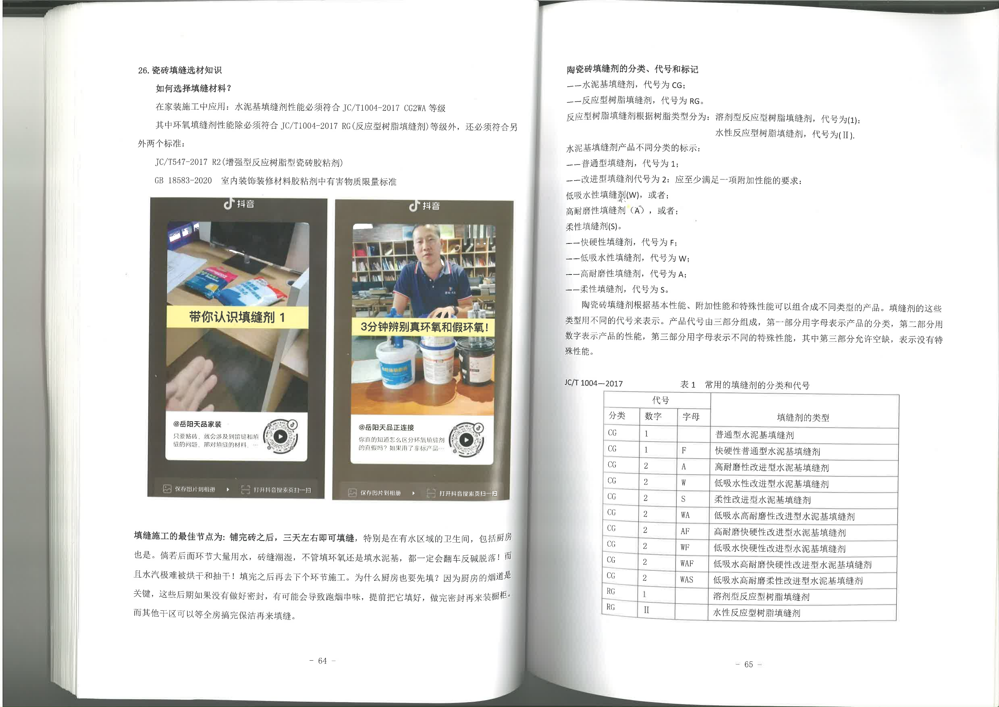

### OCR 文字

26\. 瓷砖填缝选材知识  
如何选择填缝材料？  
在家装施工中应用：水泥基填缝剂性能必须符合 JC/T1004-2017 CG2WA 等级  
其中环氧填缝剂性能除必须符合 JC/T1004-2017 RG（反应型树脂填缝剂）等级外，还必须符合另  
外两个标准：  
JC/T547-2017 R2（增强型反应树脂型瓷砖胶粘剂）  
GB 18583-2020 室内装饰装修材料胶粘剂中有害物质限量标准  
d抖音  
d 抖音  
带你认识填缝剂1  
3分钟辨别真环氧和假环氧！  
@岳阳天品家装  
@岳阳天品正连接  
只要贴传，就会沙及到留缝和娘  
缝的问题。那对垃道的材料，  
你真的知通怎么区分环饥慎缝剂  
的页假吗？如果用了非标产品  
图 保存图片到相班 >一 打开料音搜系页扫一扫  
图 保存图片到相册  
3打开科音搜紫页扫一扫  
填缝施工的最佳节点为：铺完砖之后，三天左右即可填缝，特别是在有水区域的卫生间，包括厨房  
也是。倘若后面环节大量用水，砖缝潮湿，不管填环氧还是填水泥基，都一定会翻车反碱脱落！而  
且水汽极难被烘干和抽干！填完之后再去下个环节施工。为什么厨房也要先填？因为厨房的烟道是  
关键，这些后期如果没有做好密封，有可能会导致跑烟串味，提前把它填好，做完密封再来装橱柜。  
而其他干区可以等全房搞完保洁再来填缝。  
\- 64 -  
陶瓷砖填缝剂的分类、代号和标记  
_-水泥基填缝剂，代号为 CG；  
一一反应型树脂填缝剂，代号为 RG。  
反应型树脂填缝剂根据树脂类型分为：溶剂型反应型树脂填缝剂，代号为（1）：  
水性反应型树脂填缝剂，代号为（II）.  
水泥基填缝剂产品不同分类的标示：  
一一普通型填缝剂，代号为1；  
一一改进型填缝剂代号为2：应至少满足一项附加性能的要求：  
低吸水性填缝剂（W），或者；  
高耐磨性填缝剂（A），或者；  
柔性填缝剂（S）。  
—一快硬性填缝剂，代号为 F；  
\-—低吸水性填缝剂，代号为 W；  
一一高耐磨性填缝剂，代号为 A；  
\-—柔性填缝剂，代号为S。  
陶瓷砖填缝剂根据基本性能、附加性能和特殊性能可以组合成不同类型的产品。填缝剂的这些  
类型用不同的代号来表示。产品代号由三部分组成，第一部分用字母表示产品的分类，第二部分用  
数字表示产品的性能，第三部分用字母表示不同的特性能，其中第三部分允许空缺，表示没有特  
殊性能。  
JC/T 1004-2017  
表1 常用的填缝剂的分类和代号  
代号  
分类  
数字  
字母  
填缝剂的类型  
CG  
普通型水泥基填缝剂  
CG  
快硬性普通型水泥基填缝剂  
CG  
高耐磨性改进型水泥基填缝剂  
CG  
低吸水性改进型水泥基填缝剂  
CG  
2  
S  
柔性改进型水泥基填缝剂  
CG  
WA  
低吸水高耐磨性改进型水泥基填缝剂  
CG  
AF  
高耐磨快硬性改进型水泥基填缝剂  
CG  
WF  
低吸水快硬性改进型水泥基填缝剂  
CG  
WAF  
低吸水高耐磨快硬性改进型水泥基填缝剂  
CG  
WAS  
低吸水高耐磨柔性改进型水泥基填缝剂  
RG  
溶剂型反应型树脂填缝剂  
RG  
水性反应型树脂填缝剂  
\- 65 =  

---

## 扫描页 38

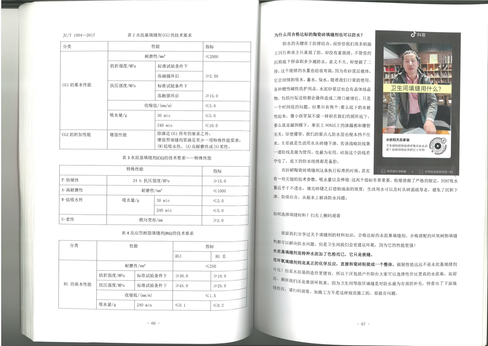

### OCR 文字

JC/T 1004—2017  
表2水泥基填缝剂（CG）的技术要求  
分类  
性能  
指标  
耐磨性/mm2  
≤2000  
抗折强度/MPa  
标准试验条件下  
冻融循环后  
≥2.50  
CG1 的基本性能  
抗压强度/MPa.  
标准试验条件下  
冻融循环后  
≥15.0  
收缩值/（mm/m）  
≤3.0  
吸水量/g  
30 min  
≤5.0  
240 min  
≤10.0  
•CG2 的附加性能  
增强性能  
除满足 CG1 所有的要求之外，  
增强型填缝剂要满足至少—项特殊性能要求：  
（w）低吸水性、（A）高耐磨性或（S）柔性。  
表3水泥基填缝剂（CG）的技术要求—一特殊性能  
特殊性能  
指标  
F-快硬性  
24 h抗压强度/MPa  
≥15.0  
A-高耐磨性  
耐磨性/mm3  
≤1000  
W-低吸水性  
吸水量/8  
30 min  
≤2.0  
240 min  
≤5.0  
S-柔性  
横向变形/mm  
≥2.0  
表4 反应型树脂填缝剂（RG）的技术要求  
分类  
性能  
指标  
RGI  
RG II  
耐磨性/mm3  
《250  
抗折强度/MPa  
标准试验条件下  
≥30.0  
≥10.0  
RG 的基本性能  
抗压强度/MPa  
标准试验条件下  
≥45.0  
≥25.0  
收缩值/（mm/m）  
≤1.5  
吸水量/g  
240 min  
八0.1  
从0.2  
\- 66 -  
为什么用合格达标的陶瓷砖填缝剂也可以防水？  
d 抖音  
防水的关键在于防排结合。而恰恰我们很多的施  
工同行和业主只重视了防，却没有重视排。不管你的  
沉箱底下拼命刷多少遍防水，意义不大。即便做了二  
排，这个能排的水量也给很有限，因为有砂浆层载体，  
它会持续的吸水，蓄水，保水。随着我们日常的使用，  
各种酸性碱性洗护用品，水泥砂浆层也会有晶体结晶  
卫生间填缝用什么？  
物，包括污垢这些都会最终造成二排口被堵住。只是  
一个时间段的问题。结果只有两个：要么底下的水被  
兜起米，像小孩穿尿不湿一样积在我们的厕所底下，  
要么就是漏到楼下。事实上90%以上的渗漏都和爆管  
无关，即便爆管，我们的那点儿防水层也根本挡不住  
@岳阳天品家装  
水。主要就是生活用水从砖缝下渗，若讲战略防线第  
卫生间填缝到底用环氧还是水泥  
基？瓷砖墳缝必须把它上升到  
一道防线是最为管用，也最为有用。砖面这个防线若  
守住了，底下的防水统统都是备胎。  
而拆解陶瓷砖填缝剂这条执行标准的时候，其实  
图 條夺国片创街脚*打开料資楼際政出一扫  
有一些关键的技术参数，吸水量以及伸缩：这两个指标非常重要，收缩值做了严格的限定，同时吸水  
量近乎于不透水，填完砖缝之后借助地面的坡度，生活用水可以及时从砖面疏导走，避免了沉积下  
滲。防排结合，从根本上解决防水问题。  
如何选择填缝材料？扫右上侧码观看  
前面我们分享过关于填缝剂的材料知识，合格达标的水泥基填缝剂、合格搭配的环氧树脂填缝  
剂都可以解决防水问题。但是卫生间我们会更建议环氧，因为它的性能更强！  
水泥基填缝剂是特种水泥加了色粉而已，它只是嵌缝。  
而环氧填缝剂则是真正的化学反应，直接和瓷砖粘接成一个整体。极限性能远远不是水泥基填缝剂  
可比！但是水泥基的造价更便宜，所以干区包括户外阳台大家可以选择性价比更高的水泥基，而厨  
防、厕所我们还是推崇环氧来。因为卫生间等湿区填维是对防水撮为有效的补充，特意出了下面境  
缝数程，请扫码观看。如施工方不是这样规范施工的、那就有问题。  
\- 67 -  

---

## 扫描页 39

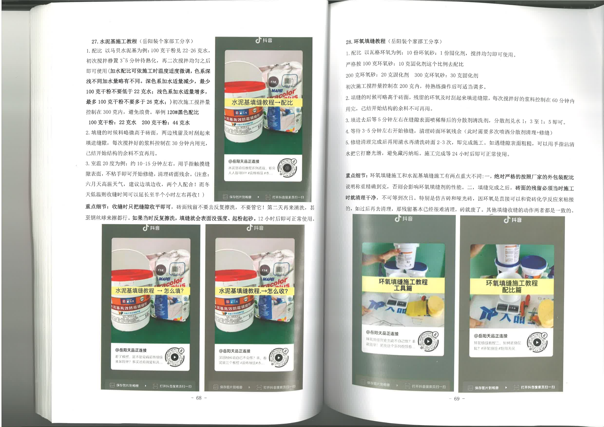

### OCR 文字

27.水泥基施工教程（岳阳装个家邵工分享）  
d抖音  
1.配比 以马贝水泥基为例：100克干粉兑 22-26克水，  
初次搅拌静置3~5分钟待熟化，再二次搅拌均匀之后  
即可使用（加水配比可依施工时温度适度微调，色系深  
浅不同加水量略有不同。深色系加水适量减少，最少  
100克干粉不要低于22克水；浅色系加水适量增多，  
MANE  
最多100克干粉不要多于26克水；）初次施工搅拌量  
水泥基填缝教程一配比  
控制在300克内，避免浪费。举例120#黑色配比  
基高效防甜煩蓮  
100克干粉：22克水 200克干粉：44克水  
2\. 填缝的时候料咯微高于砖面，两边残留及时刮起来  
填进缝隙，每次搅拌好的浆料控制在30分钟内用完，  
己结开始结构的余料不宜再用。  
3\. 室温 20度为例：约10-15 分钟左右，用手指触摸缝  
@岳阳天品正连接  
水混别峭猫欲猎系列连载 看宗  
隙表面，不粘手即可开始修缝，清理砖面残余。（注意：  
人人皆可DIY＃瓷砖迎缩 的水  
六月天高温天气，建议边填边收，两个人配合！而冬  
天低温则收缝时间可以延长至半个小时左右再收！）  
日 保存图片到相册，是子 打开料音搜索页扫一扫  
重点细节：收缝时只把缝隙收平即可，砖面残留不要去反复擦洗，不要管它！第二天再来清洗，甚  
至钢丝球来擦都行。如果当时反复擦洗，填缝就会表面没强度、起粉起砂。12小时后即可正常使用。  
J 抖音  
MAPE  
MAPE  
macpfor  
水泥基填缝教程一怎么填？  
水泥基填缝教程.一怎么收？  
泥基高效防指獲5  
@岳阳天品正连接  
@岳阳天品正连接  
长了数强，是不是觉街瓷没崩锁  
买回材料们自己不会做？来  
非常简甲？那实还前较是切儿  
完技三个致留法汇砖婉维炒水  
园 保存图片到相册  
打开抖音搜索页扫一扫  
园 保存圓片到相期：心三打开排音搜察函扫一扫  
\- 68-  
28\. 环氧填缝教程（岳阳装个家邵工分享）  
1.配比 以瓦格环氧为例：10份环氧砂：1份固化剂，搅拌均匀即可使用。  
严格按100克环氧砂：10克固化剂这个比例去配比  
200克环氧砂：20克固化剂  
300 克环氧砂：30克固化剂  
初次施工搅拌量控制在200克内，待熟练操作后可适当调多。  
2\. 填缝的时候可略高于砖面，残留的环氧及时刮起来填进缝隙，每次搅拌好的浆料控制在60分钟内  
用完，己结开始结构的余料不可再用。  
3\. 填进去后等5分钟左右在缝隙表面喷稀释后的分散剂清洗剂，分散剂兑水1：3至1：5即可。  
4\. 等待3-5分钟左右开始修缝，清理砖面环氧残余（此时需要多次喷洒分散剂清理＋修缝）  
5.修缝清理完成后再用清水再清洗砖面2-3次，即完成施工。如遇缝隙表面粗糙，可以用手指沾清  
水把它打磨光滑，避免藏污纳垢。施工完成等24小时后即可正常使用。  
重点细节：环氧填缝施工和水泥基填缝施工有两点重大不同：一，绝对严格的按照厂家的外包装配比  
说明称重精确到克，否则会影响环氧填缝剂的性能。二，填缝完成之后，砖面的残留必须当时施工  
时就清理干净，不可等到次日。特别是仿古砖和哑光砖，因环氧是直接可以和瓷砖化学反应来粘接  
的，如过后再去清理，那残留基本已经很难清理，砖就废了。其他填缝收缝的动作两者都是一致的。  
d 抖音  
d抖音  
环氧填缝施工教程  
环氧填缝施工教程  
工具篇  
配比篇  
入  
@岳阳天品正连接  
@岳阳天品正连接  
环亂坊可烈北手能不自己做，非  
觉能州！泗残讴个筝列潮烦吞  
环氘t缝擞隍二。姚轲正桷就  
忙’#环尔填獎8岳阻天品  
保存图片到相册  
打开科音搜索页扫一扫  
69  

---

## 扫描页 40

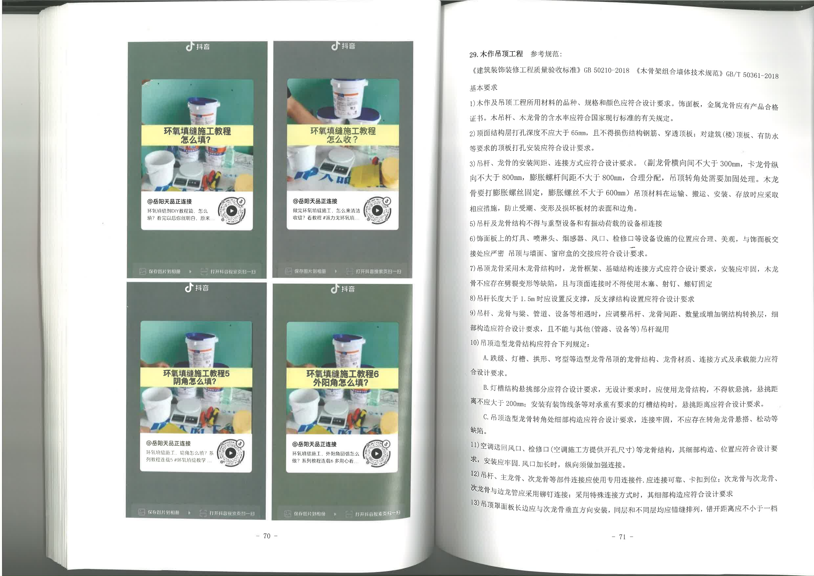

### OCR 文字

d抖音  
环氧填缝施工教程  
环氧填缝施工教程  
怎么填？  
怎么收？  
@岳阳天品正连接  
@岳阳天品正连接  
环氧填缝剂DIY教程箱，怎么  
做完环氧填缝施工，怎么来清洁  
填？看完以后你就明白，原来  
收缝？看教程 #派力戈环氧境  
因 保你图片到橱期打开料音授象页扫一扫  
J抖音  
d抖音  
环氧填缝施工教程5  
环氧填缝施工教程6  
阴角怎么填？  
外阳角怎么填？  
@岳阳天品正连接  
@岳阳天品正连接  
环氧填缝施工，墙角怎么坡？系  
环氧填缝施工，外阳角圆弧怎么  
列教程连哉5#环氧填缝教学  
做？系列教程连载6多用心看  
甲 保存固片到相別  
保存图片到相别 打开拌骨搜泰页扫一扫  
\- 70 -  
29\. 木作吊顶工程 参考规范：  
《建筑装饰装修工程质量验收标准》GB 50210-2018  
《木骨架组合墙体技术规范》GB/T 50361-2018  
基本要求  
1） 本作及吊顶工程所用材料的品种、规格和颜色应符合设计要求。饰面板，金属龙骨应有产品合格  
证书。木吊杆、木龙骨的含水率应符合国家现行标准的有关规定。  
2） 顶面结构层打孔深度不应大于65mm，且不得损伤结构钢筋、穿透顶板；对建筑（楼）顶板、有防水  
等要求的顶板打孔安装应符合设计要求。  
3） 吊杆、龙骨的安装间距、连接方式应符合设计要求。（副龙骨横向间不大于300mm，卡龙骨纵  
向不大于800mm，膨胀螺杆间距不大于800mm，合理分配，吊顶转角处需要加固处理。木龙  
骨要打膨胀螺丝固定，膨胀螺丝不大于 600m）吊顶材料在运输、搬运、安装、存放时应采取  
相应措施，防止受潮、变形及损坏板材的表面和边角。  
5） 吊杆及龙骨结构不得与重型设备和有振动荷载的设备相连接  
6）饰面板上的灯具、喷淋头、烟感器、风口、检修口等设备设施的位置应合理、美观，与饰面板交  
接处应严密 吊顶与墙面、窗帘盒的交接应符合设计要求。  
7） 吊顶龙骨采用木龙骨结构时，龙骨框架、基础结构连接方式应符合设计要求，安装应牢固，木龙  
骨不应存在劈裂变形等缺陷，且与顶面连接时不得使用术塞、射钉、螺钉固定  
8） 吊杆长度大于 1.5m 时应设置反支撑，反支撑结构设置应符合设计要求  
9） 吊杆、龙骨与梁、管道、设备等相遇时，应调整吊杆、龙骨间距、数量或增加钢结构转换层，细  
部构造应符合设计要求，且不能与其他（管路、设备等）吊杆混用  
10） 吊顶造型龙骨结构应符合下列规定：  
A.跌级、灯槽、拱形、穹型等造型龙骨吊顶的龙骨结构、龙骨材质、连接方式及承载能力应符  
合设计要求。  
B.灯槽结构悬挑部分应符合设计要求，无设计要求时，应使用龙骨结构，不得软悬挑，悬挑距  
离不应大于 200mm：安装有装饰线条等对承重有要求的灯槽结构时，悬挑距离应符合设计要求。  
C. 吊顶造型龙骨转角处细部构造应符合设计要求，连接牢固，不应存在转角龙骨悬搭、松动等  
缺陷。  
11）空调送回风口、检修口（空调施工方提供开孔尺寸）等龙骨结构，其细部构造、位置应符合设计要  
求，安装应牢固.风口加长时，纵向须做加强连接。  
12） 品杆、主龙骨、次龙骨等部件连接应使用专用连接件，应连接可靠、卡扣到位；次龙骨与次龙骨、  
改龙骨与边龙管应采用铆钉连接：采用特珠连接方式时，其细部构造应符合设计要求  
18）吊顶單面板长边应与次龙骨垂直方向安装，同层和不同层均应错缝排列，错开距离应不小于一档  
\- 71 -  

---

## 扫描页 41

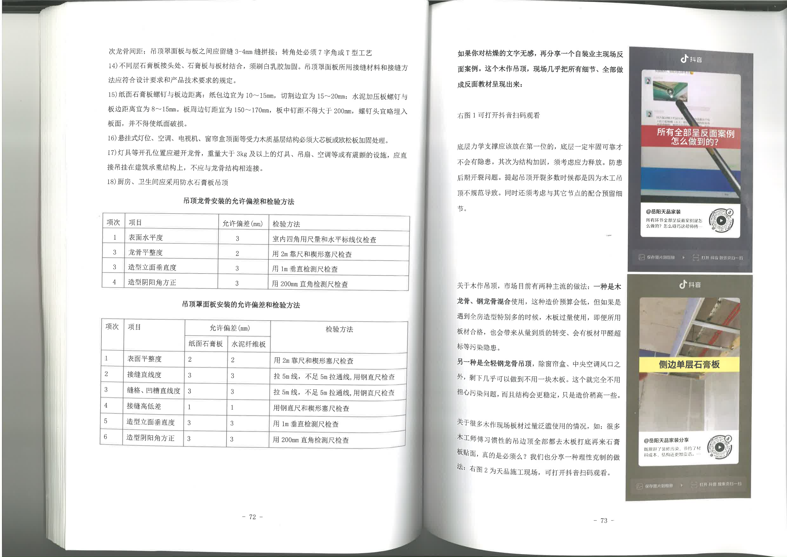

### OCR 文字

次龙骨间距；吊顶罩面板与板之间应留缝3-4mm 缝拼接；转角处必须7字角或T型工艺  
14） 不同层石膏板接头处、石膏板与板材结合，须刷白乳胶加固。吊顶罩面板所用接缝材料和接缝方  
法应符合设计要求和产品技术要求的规定。  
15）纸面石膏板螺钉与板边距离：纸包边宜为10~15mm，切割边宜为15～20mm：水泥加压板螺钉与  
板边距离宜为8~15mm。板周边钉距宜为150～170mm，板中钉距不得大于 200mm，螺钉头宜略埋入  
板面，并不得使纸面破损。  
16） 悬挂式灯位、空调、电视机、窗帘盒顶面等受力木质基层结构必须大芯板或欧松板加固处理。  
17）灯具等开孔位置应避开龙骨，重量大于 3kg及以上的灯具、吊扇、空调等或有震颤的设施，应直  
接吊挂在建筑承重结构上，不应与龙骨结构相连接。  
18）厨房、卫生间应采用防水石膏板吊顶  
吊顶龙骨安装的允许偏差和检验方法  
项次 项目  
允许偏差（mm）  
检验方法  
1  
表面水平度  
室内四角用尺量和水平标线仪检查  
3  
龙骨平整度  
用2m 靠尺和楔形塞尺检查  
造型立面垂直度  
3  
用1m 垂直检测尺检查  
造型阴阳角方正  
用200mm直角检测尺检查  
吊顶罩面板安装的允许偏差和检验方法  
项次  
项目  
允许偏差（mm）  
检验方法  
纸面石膏板  
水泥纤维板  
表面平鏊度  
2  
2  
用2m 靠尺和楔形塞尺检查  
接缝直线度  
3  
3  
拉5m线，不足 5m 拉通线，用钢直尺检查  
缝格、凹槽直线度  
3  
拉 5m 线，不足 5m拉通线，用钢直尺检查  
接缝高低差  
用钢直尺和楔形塞尺检查  
5  
造型立面垂直度  
3  
3  
用1m 垂直检測尺检  
造型阴阳角方正  
3  
用200mm 直角检测尺检查  
\- 72-  
如果你对枯燥的文字无感，再分享一个自装业主现场反  
J 抖音  
面案例。这个木作吊顶，现场几乎把所有细节、全部做  
成反面教材呈现出来：  
右图1可打开抖音扫码观看  
所有全部星反面案例  
底层力学支撑应该放在第一位的，底层一定牢固可靠才  
怎么做到的？  
不会有隐患。其次为结构加固，须考虑应力释放。防患  
后期开裂问题。提起吊顶开裂多数时候都是因为木工吊  
顶不规范导致。同时还须考虑与其它节点的配合预留细  
节。  
@岳阳天品家装  
所有环节全部呈反而案例是怎  
么做的？怎么碰巧这帮师停…  
关于木作吊顶，市场目前有两种主流的做法：一种是木  
d料音  
龙骨、钢龙骨混合使用，这种造价预算会低，但如果是  
遇到全房造型特别多的时候，木板过量使用，即便所用  
板材合格，也会带来从量到质的转变、会有板材甲醛超  
标等污染隐患。  
另一种是全轻钢龙骨吊顶，除窗帘盒、中央空调风口之  
侧边单层石膏板  
外，剩下几乎可以做到不用一块木板。这个就完全不用  
担心污染问题，而且结构会更稳定，只是造价稍高一些。  
关于很多木作现场板材过量泛滥使用的情况，如：很多  
木工师傅习惯性的吊边顶全部都去木板打底再来石膏  
@岳阳天品家装分享  
既规避了装惨污染，节约了材  
板贴面，真的是必须么？我们也分享一种理性克制的做  
料成本，结构还更加设说。  
法：右图2为天品施工现场，可打开抖音扫码观看。  
\-73-  

---

## 扫描页 42

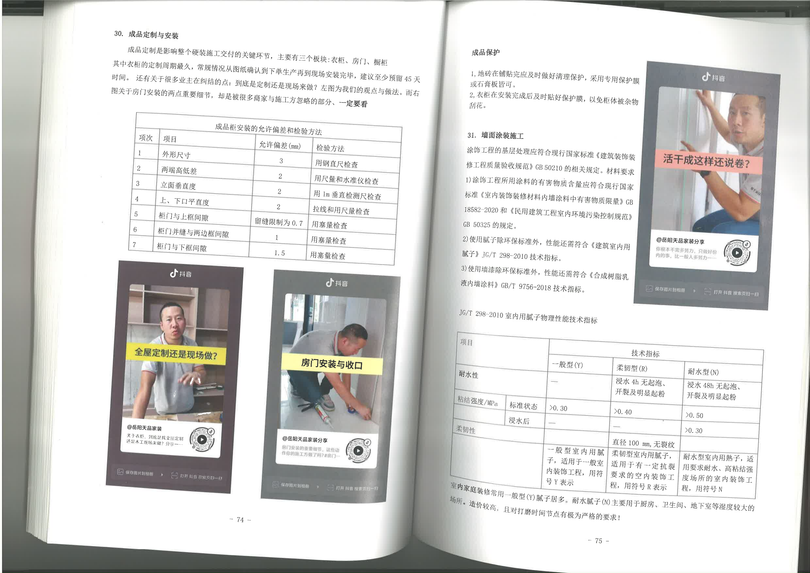

### OCR 文字

30．成品定制与安装  
成品定制是影响整个硬装施工交付的关键环节，主要有三个板块：衣柜、房门、橱柜  
其中衣柜的定制周期最久，常规情况从图纸确认到下单生产再到现场安装完毕，建议至少预留45天  
时间。还有关于很多业主在纠结的点：到底是定制还是现场来做？左图为我们的观点与做法。而右  
图关于房门安装的两点重要细节，却是被很多商家与施工方忽略的部分、一定要看  
成品柜安装的允许偏差和检验方法  
项次  
项目  
允许偏差（mm）  
检验方法  
外形尺寸  
3  
用钢直尺检查  
2  
两端高低差  
2  
用尺量和水准仪检查  
立面垂直度  
2  
用 1m 垂直检测尺检查  
上、下口平直度  
2  
拉线和用尺量检查  
柜门与上框间隙  
留缝限制为 0.7  
用塞量检查  
柜门并缝与两边框间隙  
1  
用塞量检查  
7  
柜门与下框间隙  
1.5  
用塞量检查  
小抖音  
全屋定制还是现场做？  
房门安装与收口  
@岳阳天品家装  
关于衣痘，到跑是我金M定制  
还是本工现场来做？分一2  
@岳阳天品家装分享  
旁门安表的霍要绷节，这些动  
作你的施工方做了哔7#隆门-  
：打井科客腾数/#一扫  
\- 74 -  
成品保护  
1，地砖在铺贴完应及时做好清理保护，采用专用保护膜  
◎抖音  
或石膏板皆可。  
2，衣柜在安装完成后及时贴好保护膜，以免柜体被杂物  
刮花。  
31\. 嫱面涂装施工  
涂饰工程的基层处理应符合现行国家标准《建筑装饰装  
活干成这样还说卷？  
修工程质量验收规范》GB 50210的相关规定。材料要求  
1） 涂饰工程所用涂料的有害物质含量应符合现行国家  
标准《室内装饰装修材料内墙涂料中有害物质限量》GB  
18582-2020 和《民用建筑工程室内环境污染控制规范》  
CB 50325 的规定。  
2） 使用腻子除环保标准外，性能还需符合《建筑室内用  
@岳阳天品家装分享  
你根本不需姜货力；只微好份  
腻子》JG/T 298-2010技术指标。  
肉游事。比一股人多码为一！  
3） 使用墻漆除环保标准外，性能还需符合《合成树脂乳  
液内墙涂料》GB/T 9756-2018 技术指标。  
②：黑深四片到稅碎  
JG/T 298-2010室内用腻子物理性能技术指标  
项目  
技术指标  
一般型（Y）  
柔韧型（R）  
耐水性  
耐水型（N）  
浸水 4h无起泡、  
浸水 48h 无起泡、  
开裂及明显起粉  
粘结强度/MPa  
开裂及明显起粉  
标准状态  
\>0.30  
\>0.40  
\>0.50  
浸水后  
柔韧性  
\>0.30  
直径100mm，无裂纹  
一-般型室內用腻  
柔韧型室内用腻子，  
子，适用于一般室  
耐水型室内用熟子，适  
适用于有一定抗裂  
内装饰工程，用符  
|用要求耐水、高粘结强  
号Y表示  
要求的空内装饰工度场所的室内装饰工  
程，用符号R表示  
程，用符号 N  
室内家庭装修常用一般型（D腻子居乡。耐水腻子6N主要用于厨房、卫生间、地下室等湿度较大的  
场所。造价较高，且对打磨时间节点有极为严格的要求！  
\-75-  

---

## 扫描页 43

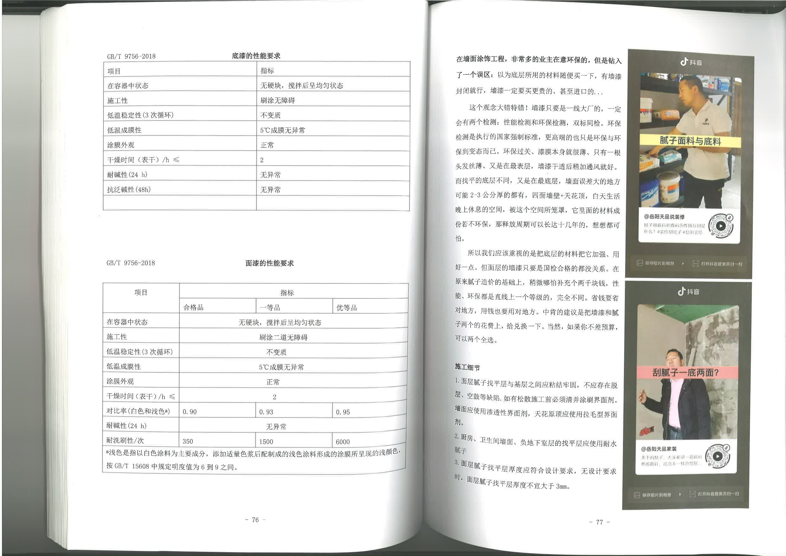

### OCR 文字

GB/T 9756-2018  
底漆的性能要求  
项目  
指标  
在容器中状态  
无硬块，搅拌后呈均匀状态  
施工性  
刷涂无障碍  
低温稳定性（3次循环）  
不变质  
低温成膜性  
5°C成膜无异常  
涂膜外观  
正常  
干燥时间（表干）/h ≤  
2  
耐碱性（24 h）  
无异常  
抗泛碱性（48h）  
无异常  
GB/T 9756-2018  
面漆的性能要求  
项目  
指标  
合格品  
一等品  
优等品  
在容器中状态  
无硬块，搅拌后呈均匀状态  
施工性  
刷涂二道无障碍  
低温稳定性（3次循环）  
不变质  
低温成膜性  
5°C成膜无异常  
涂膜外观  
正常  
干燥时间（表干）/h≤  
对比率（白色和浅色a）  
0.90  
0.93  
0.95  
耐碱性（24 h）  
无异常  
耐洗刷性/次  
350  
1500  
6000  
a浅色是指以白色涂料为主要成分，添加适量色浆后配制成的浅色涂料形成的涂膜所呈现的浅颜色，  
按 GB/T 15608 中规定明度值为6到9之间。  
\- 76-  
在墙面涂饰工程，非常多的业主在意环保的，但是钻入  
小抖音  
了一个误区：以为底层所用的材料随便买一下，有墙漆  
封闭就行，墻漆一定要买更贵的、甚至进口的.  
这个观念大错特错！墙漆只要是一线大厂的，一定  
会有两个检测：性能检测和环保检测，双标同检。环保  
检测是执行的国家强制标准，更高端的也只是环保与环  
腻子面料与底料  
保到变态而己。环保过关、漆膜本身就很薄、只有一根  
头发丝薄、又是在最表层，墙漆干透后稍加通风就好。  
而找平的底层不同，又是在最底层，墙面误差大的地方  
可能2-3公分厚的都有，四面墙壁＋天花顶，白天生活  
晚上休息的空间，被这个空间所笼罩，它里面的材料成  
◎岳阳天品说装修  
份若不环保，那释放周期可以长达十几年的，想想都可  
熙子游瓜剃别而社的作们分别是  
什么？以没隆別服子#思阳戏的  
怕。  
所以我们应该重视的是把底层的材料把它加强、用  
好一点。但面层的墻漆只要是国检合格的都没关系。在  
原来腻子造价的基础上，稍微哪怕补充个两千块钱，性  
小抖音  
能、环保都是直线上一个等级的，完全不同。省钱要省  
对地方，用钱也要用对地方。中肯的建议是把墻漆和腻  
子两个的花费上，给兑换一下。当然，如果你不差预算，  
可以两个全选。  
施工细节  
刮腻子一底两面？  
1.面层腻子找平层与基层之间应粘结牢固，不应存在脱  
层、空鼓等缺陷.如有松散施工前必须清并涂刷界面剂。  
墙面应使用洛透性界面剂，天花原顶应使用拉毛型界面  
剂。  
2.厨房、卫生间墙面、负地下室层的找平层应使用耐水  
城子  
@岳阳天品家装  
美于副照子。大家都讲一道炬利  
队遥面社，醉点不一怪润电解  
3 面层腻子找平层厚度应符合设计要求，无设计要求  
时，面层腻子找平层厚度不宜大于 3mm。  
安 保荐图片劉愊粥  
开料效票效白一日  
\- 77-  

---

## 扫描页 44

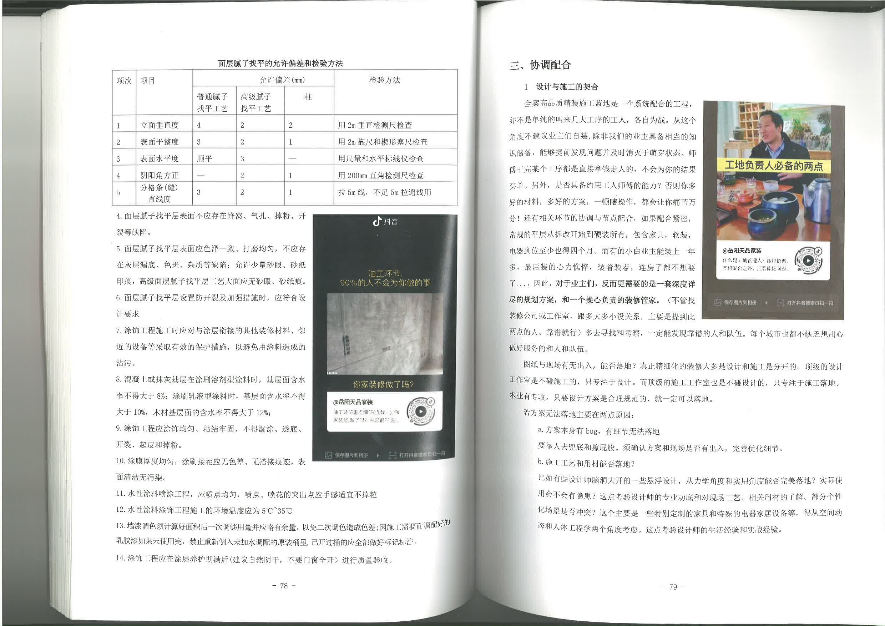

### OCR 文字

面层腻子找平的允许偏差和检验方法  
项次项日  
允许偏差（mm）  
检验方法  
普通腻子  
高级腻子  
柱  
找平工艺  
找平工艺  
立面垂直度  
2  
2  
用2m 垂直检测尺检查  
表面平整度  
用2m 靠尺和楔形塞尺检查  
表面水平度  
顺平  
用尺量和水平标线仪检查  
阴阳角方正  
1  
用200mm 直角检测尺检查  
分格条（缝）  
5  
1  
拉5m线，不足5m 拉通线用  
直线度  
4\. 面层腻子找平层表面不应存在峰窝、气孔、掉粉、开  
小抖音  
裂等缺陷。  
5\. 面层腻子找平层表面应色泽一致、打磨均匀，不应存  
在灰层漏底、色斑、杂质等缺陷：允许少量砂眼、砂纸  
油工环节  
印痕，高级面层腻子找平层工艺大面应无砂眼、砂纸痕。  
90%的人不会为你做的事  
6\. 面层腻子找平层设置防开裂及加强措施时，应符合设  
计要求  
7.涂饰工程施工时应对与涂层衔接的其他装修材料、邻  
近的设备等采取有效的保护措施，以避免由涂料造成的  
沾污。  
8\. 混凝土或抹灰基层在涂刷溶剂型涂料时，基层面含水  
你家装修做了吗？  
率不得大于8%；涂刷乳液型涂料时，基层面含水率不得  
@岳阳天品家装  
大于10%，木材基层面的含水率不得大于12%；  
非工坏节业点细节（连数二）你  
家装修縱（吗？内容很干、是  
9\. 涂饰工程应涂饰均匀、粘结牢固，不得漏涂、透底、  
开裂、起皮和掉粉。  
因 强夺世养数特粉•子子打开好商授状而扫一组  
10\. 涂膜厚度均匀，涂刷接茬应无色差、无搭接痕迹，表  
面清洁无污染。  
11.水性涂料喷涂工程，应喷点均匀，喷点、喷花的突出点应手感适宜不掉粒  
12\. 水性涂料涂饰工程施工的环境温度应为5°C~35°C  
13.墙漆调色须计算好面积后一次调够用量并应略有余量，以免二次调色造成色差：因施工需要而调配好的  
乳胶漆如果未使用完，禁止重新倒入未加水调配的原装桶里，己开过桶的应全部做好标记标注。  
14.涂饰工程应在涂层养护期满后（建议自然阴干，不要门窗全开）进行质量验收。  
\-78-  
三、协调配合  
1 设计与施工的契合  
全案高品质精装施工蓝地是一个系统配合的工程，  
并不是单纯的叫来几大工序的工人，各自为战。从这个  
角度不建议业主们自装，除非我们的业主具备相当的知  
识储备，能够提前发现问题并及时消灭于萌芽状态。师  
傅干完某个工序都是直接拿钱走人的，不会为你的结果  
工地负责人必备的两点  
买单。另外，是否具备约束工人师傅的能力？否则你多  
好的材料，多好的方案，一顿瞎操作，都会让你痛苦万  
分！还有相关环节的协调与节点配合，如果配合紧密，  
常规的平层从拆改开始到硬装所有，包含家具，软装，  
电器到位至少也得四个月。而有的小白业主能装上一年  
@岳阳天品家装  
什么是工地谁理人？组织协调，  
多，最后装的心力憔悴，装着装着，连房子都不想要  
互相邮合之外，还要能把问影  
了.，因此，对于业主们，反而更需要的是一套深度详  
尽的规划方案，和一个操心负责的装修管家。（不管找  
四 保辖累片到密粉光毛可贝打我料音搜象西的一进  
装修公司或工作室，跟多大多小没关系，主要是提到此  
两点的人、靠谱就行）多去寻找和考察，一定能发现靠谱的人和队伍。每个城市也都不缺乏想用心  
做好服务的和人和队伍。  
图纸与现场有无出入，能否落地？真正精细化的装修大多是设计和施工是分开的。顶级的设计  
工作室是不碰施工的，只专注于设计。而项级的施工工作室也是不碰设计的，只专注于施工落地。  
术业有专攻。只要设计方案是合理规范的，就一定可以落地。  
若方案无法落地主要在两点原因：  
a.方案本身有bug，有细节无法落地  
要靠人去兜底和擦屁股。须确认方案和现场是否有出入，完善优化细节。  
b.施工工艺和用材能否落地？  
比如有些设计师脑洞大开的一些悬浮设计，从力学角度和实用角度能香完美落地？实际使  
用会不会有隐患？这点考验设计师的专业功底和对现场工艺、相关用材的了解。部分个性  
化场景是否冲突？这个主要是一些特别定制的家具和特殊的电器家居设备等，得从空间动  
态和人体工程学两个角度考虑。这点考验设计师的生活经验利实战经验。  
\-79-  

---

## 扫描页 45

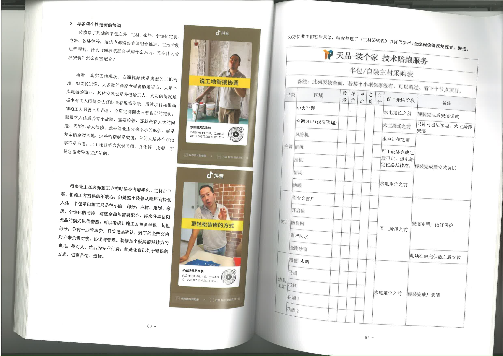

### OCR 文字

2 与各项个性定制的协调  
装修除了基础的半包之外，主材、家居、个性化定制、  
c抖音  
电器、软装等等，这些也都需要协调配合推进，工地才能  
进程顺利。什么时间段该配合采购什么东西、又在什么阶  
段安装？怎么衔接配合？  
再看一真实工地现场：右面视频就是典型的工地衔  
说工地衔接协调  
接，如果说空调，大多数的商家老板说的难听点，只是个  
卖电器的而已，具体安装也是外包给工人、真实的情况是  
极少有工人师傅会去仔细查看现场图纸，后续项目如果基  
础施工方只管木作吊顶、全屋定制商家只管自己的定制，  
那最终入住后若有小故障，需要检修，那就是有大大的问  
题、需要拆除来检修、就会给业主带来不小的麻烦。越是  
@岳阳天品家装  
正在装修的业主们，工心现场  
复杂的全案落地、这些衔接越是关键，单纯只是某个点做  
最应该注意的点是感些？带…  
事不足为道。上工地能努力发现问题，并化解于无形，才  
是急需考验施工沉淀的。  
小抖音  
很多业主在选择施工方的时候会考虑半包、主材自己  
买，怕施工方提供的不放心，但是整个装修从毛坯到拎包  
入住，半包基础施工只是很小的一部分，主材、定制、家  
居、个性化的衔接，这些全部都需要配合，再来分享岳阳  
天品的模式以供借鉴：可以考虑让施工方负责半包、其他  
更轻松装修的方式  
部分，你付一些管理费，只管选品确认，剩下的全部交由  
对方来负责对接、协调与管理。装修是个极其消耗精力的  
事儿，找对人、然后为专业付费，就是让自己处于轻軟的  
方式，远离苦恼、烦恼。  
@岳阳天品家装  
找装修公司半包太累。余包不放  
心。怎么办？关修业主们可以。  
\-80 -  
为方便业主们理清思绪，特意整理了《主树采购表》以提供参考：全流程值得反复观看、跟进。  
天品-装个家 技术陪跑服务  
半包/自装主材采购表  
备注：此列表较全面，若某个小项你家没有，可以略过，看下个节点项目。  
品类  
区域  
数单单总合  
量位价价  
计  
配合采购阶段  
备注  
中央空调  
水电定位之前  
硬装完成后安装调试  
空调风口（极窄预埕）  
木工撤场之前  
只针对极窄预埋，木工阶段  
安装  
风管机  
水电定位之前  
空週 柜机  
可于硬装完成之  
挂机  
后再定，但电路  
定位必须精准。硬装完成后安装调试  
新风  
地暖  
水电定位之前  
铝合金窗户  
开启位  
窗户 防盗网  
安装完面后做好保护  
瓦工阶段之前  
窗户防水  
金刚砂窗  
此项在做完保洁之后安装  
便+水箱  
马桶  
猪真  
卫浴浴缸  
水电定位之前 硬装完成后安装  
花洒］  
花酒2  
\- 81 -  

---

## 扫描页 46

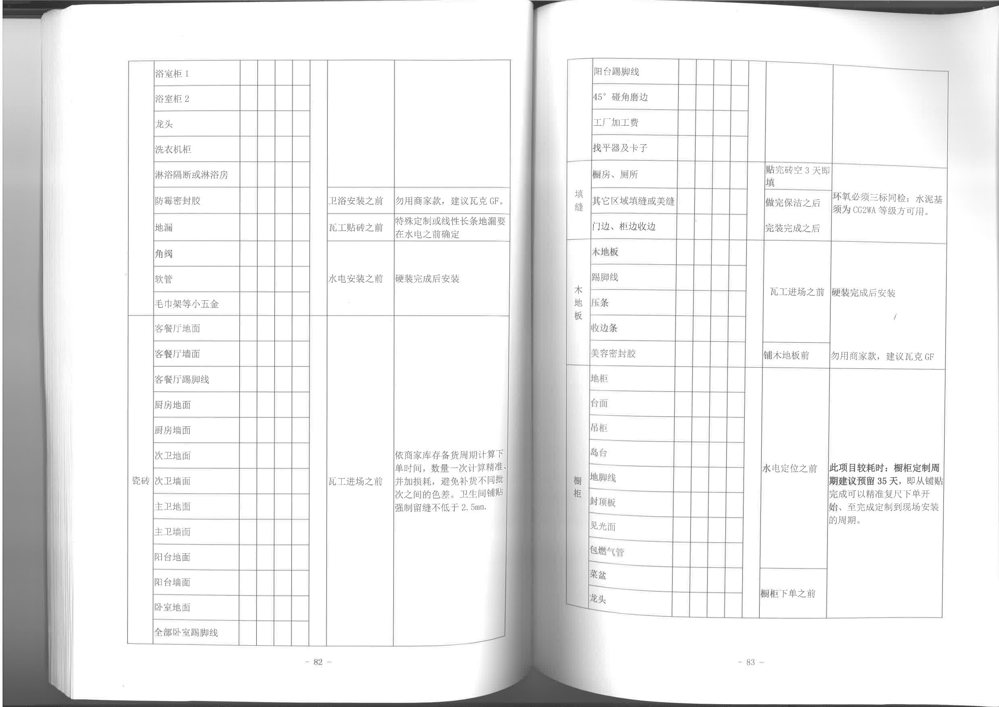

### OCR 文字

浴室柜 1  
浴室柜 2  
龙头  
洗衣机柜  
淋浴隔断或淋浴房  
防霎密封胶  
卫浴安装之前 勿用商家款，建议瓦克 GF。  
特殊定制或线性长条地漏要  
地漏  
瓦工贴砖之前  
在水电之前确定  
角阀  
软管  
水电安装之前 硬装完成后安装  
毛巾架等小五金  
客餐厅地面  
客餐厅墙面  
客餐厅踢脚线  
厨房地面  
厨房墙面  
次卫地面  
依商家库存备货周期计算下  
单时间，数量一次计算精准、  
瓷砖 次卫墙面  
瓦工进场之前  
并加损耗，避免补货不同批  
次之间的色差。卫生间铺贴  
主卫地面  
强制留缝不低于 2.5mm.  
主卫墙面  
阳台地面  
阳台墙面  
卧室地面  
全部卧室踢脚线  
\-821  
阳台踢脚线  
45°碰角磨边  
工厂加工费  
找平器及卡子  
橱房、厕所  
贴完砖空3天即  
填  
摸 萁它区域填缝或美缒  
做完保洁之后  
环氧必须三标同检：水泥基  
须为CG2WA 等级方可用。  
门边、柜边收边  
完装完成之后  
木地板  
踢脚线  
木  
瓦工进场之前 硬装完成后安装  
地压条  
板  
收边条  
美容密封胶  
铺木地板前  
勿用商家款，建议瓦克 GF  
地柜  
台面  
吊柜  
岛台  
水电定位之前  
此项目较耗时：橱柜定制周  
橱 地脚线  
期建议预留35天，即从铺贴  
柜封顶板  
完成可以精准复尺下单开  
始、至完成定制到现场安装  
的周期。  
见光面  
包燃气管  
菜盆  
橱柜下单之前  
龙头  
\-83-  

---

## 扫描页 47

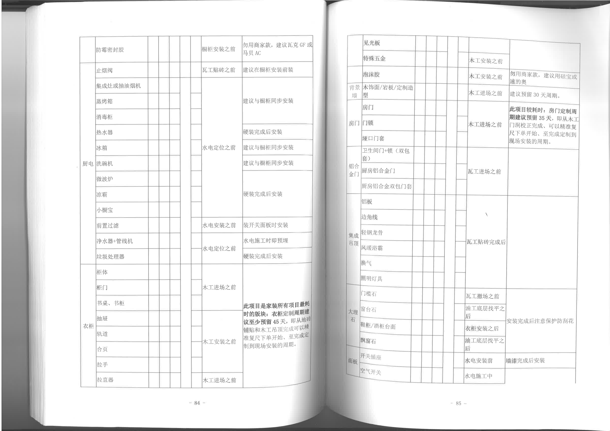

### OCR 文字

勿用商家款，建议瓦克 GF或  
防霉密封胶  
橱柜安装之前  
马贝AC  
止烟阀  
瓦工贴砖之前 建议在橱柜安装前装  
集成灶或抽油烟机  
蒸烤箱  
建议与橱柜同步安装  
消毒柜  
热水器  
硬装完成后安装  
冰箱  
水电定位之前  
建议与橱柜同步安装  
厨电 洗碗机  
建议与橱柜同步安装  
微波炉  
凉霸  
硬装完成后安装  
小橱宝  
前置过滤  
水电安装之前  
装开关面板时安装  
净水器+管线机  
水电施工时即预埋  
\-水电定位之前  
垃圾处理器  
硬装完成后安装  
柜体  
柜门  
木工进场之前  
书桌、书柜  
此项目是家装所有项目最耗  
时的版块：衣柜定制周期建  
抽屉  
议至少预留45天，即从地砖  
衣柜  
铺贴和术工吊顶完成可以精  
轨道  
准复尺下单开始、至完成定  
木工安装之前  
制到现场安装的周期。  
合页  
拉手  
拉直器  
木工进场之前  
\-84 -  
见光板  
特殊五金  
木工安装之前  
泡沫胶  
木工安装之前  
勿用商家款，建议用硅宝或  
速的奥  
背景 木饰面/岩板/定制造  
墙型  
木工进场之前  
建议预留30天周期。  
房门  
此项目较耗时：房门定制周  
期建议预留35天，即从木工  
房门 门锁  
木工进场之前  
门洞校正完成、可以精准复  
尺下单开始、至完成定制到  
垭口门套  
现场安装的周期。  
卫生间门+锁（双包  
套）  
盟舍 哪烤锦合金门  
瓦工进场之前  
厨房铝合金双包门套  
铝板  
边角线  
集成 豁钢龙骨  
瓦工贴砖完成后  
吊顶 风暖浴霸  
换气  
照明灯具  
门槛石  
瓦工撤场之前  
大理 窗台石  
油工底层找平之  
后  
石  
安装完成后注意保护防刮花  
鞋柜/酒柜台面  
衣柜安装之后  
飘窗石  
油工底层找平之  
后  
开关插座  
断板-  
水电安装前  
埫漆完成后安装  
空气开关  
水电施工中  
\- 85 -  

---

## 扫描页 48

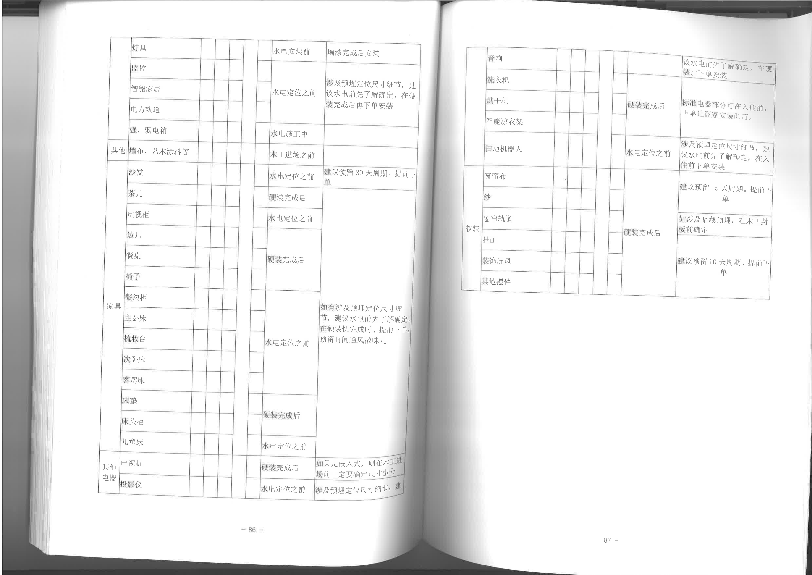

### OCR 文字

灯具  
水电安装前  
墙漆完成后安装  
监控  
涉及预埋定位尺寸细节，建  
智能家居  
水电定位之前  
议水电前先了解确定，在硬  
电力轨道  
裝完成后再下单安装  
强、弱电箱  
水电施工中  
其他 墻布、艺术涂料等  
木工进场之前  
沙发  
水电定位之前  
建议预留30天周期。提前下  
单  
茶几  
硬装完成后  
电视柜  
水电定位之前  
边几  
餐桌  
硬装完成后  
椅子  
餐边柜  
家具  
如有涉及预埋定位尺寸细  
主卧床  
节，建议水电前先了解确定，  
在硬装快完成时、提前下单，  
梳妆台  
水电定位之前  
预留时间通风散味儿  
淡卧床  
客房床  
床垫  
硬装完成后  
床头柜  
儿童床  
水电定位之前  
其他电视机  
如果是嵌入式，则在木工进  
硬装完成后  
场前一定要确定尺寸型号  
电器 投影仪  
水电定位之前  
涉及预埋定位尺寸细节，建  
\-86=  
音响  
议水电前先了解确定，在硬  
装后下单安装  
洗衣机  
烘干机  
硬装完成后  
标准电器部分可在入住前，  
下单让商家安装即可。  
智能凉衣架  
扫地机器人  
涉及预埋定位尺寸细节，建  
水电定位之前  
议水电前先了解确定，在入  
住前下单安装  
窗帘布  
建议预留15天周期。提前下  
纱  
单  
窗帘轨道  
如涉及暗藏预埋，在木工封  
软装  
硬装完成后  
板前确定  
挂画  
裝饰屏风  
建议预留10天周期。提前下  
单  
其他摆件  
\- 87 -  

---

## 扫描页 49

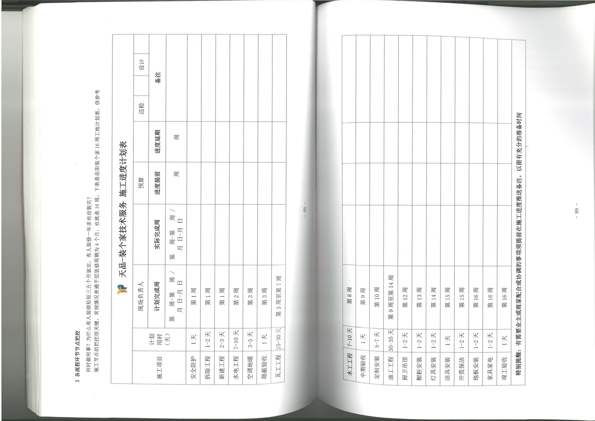

### OCR 文字

设计  
备注  
巡检  
进度延期  
预算  
进度提前  
天品-装个家技术服务 施工进度计划表  
施工节点的把控很关键。常规情况普通平层装修周期为4个月，也就是16周。下表是岳阳装个家16周工地计划表，供参考  
实际完成周  
第 周-第周/  
月日-月日  
何时做何事？为什么有人装修短短三五个月装完，有人装修一年多也没装完？  
现场负责人  
计划完成周  
第周-第周/  
月日-月日  
第1周  
第1周  
第1周  
第2周  
第3周  
第3周  
第3周至第7周  
计划  
用时  
（天）  
1天  
1-2天  
2-3 天  
7-10天  
3-5天  
1天  
25-30天  
3 各流程环节节点把控  
施工项目  
安全防护  
拆除工程  
新建工程  
水电工程  
空调地暧  
隐蔽验收  
瓦工工程  
\- 89 -|  
特别提醒：有需要业主或商家配合或协调的事项须提前在施工进度推送备注，以留有充分的准备时间  
第8周  
第9周  
第10周  
第9周至第14周  
第12周  
第13周  
第14周  
第15周  
第15周  
第16周  
第16周  
第16周  
7-10天  
1天  
5-7天  
30-35天  
1-2天  
1-2 天  
1-2天  
1天  
1-2天  
1-2天  
1-2天  
1天  
木工工程  
中期验收  
定制安装  
油工工程  
厨卫吊顶  
橱柜安装  
灯具安装  
洁具安装  
开荒保洁  
地板安装  
家具家电  
竣工验收  

---

## 扫描页 50

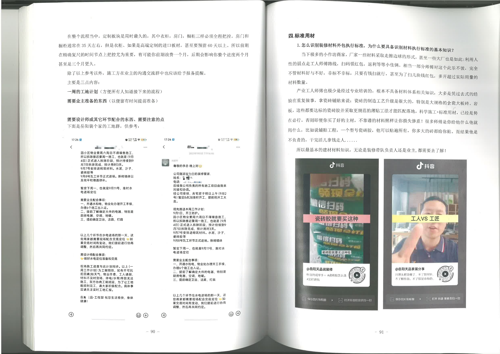

### OCR 文字

在整个流程当中，定制板块是用时最久的，其中衣柜，房门，橱柜三样必须全程把控。房门和  
橱柜通常在35天左右，但是衣柜、如果是高端定制的进口板材，甚至要预留60天以上。所以前期  
在精确复尺的时间节点上把控尤为重要，有可能你前期浪费一个月，后期会影响你整个进度两个月  
甚至是三个月更久。  
除了以上参考以外，施工方在业主的沟通交流群中也应该给予报备提醒。  
主要是三点内容：  
一周的工地计划（方便所有人知道接下来的流程）  
需要业主准备的东西（以便留有时间提前准备）  
需要设计师或其它环节配合的东西、需要注意的点  
下面是岳阳装个家的工地群，供参考：  
17:26 回  
028858多  
17:26 2  
<  
因小区物业要周六周日不得噪音施工，  
所以拆除推迟要周一施工，  
4日）正式进入拆除阶段，  
预计持续到9  
月7日拆除完成，预计用时3天。  
尊敬的李总 晚上好  
9月7号安排进砌筑材料。水泥，沙子，  
瓷砖胶等  
9月8号瓦工环节正式进场。新砌墙体以  
公司指派理为您的装修管家.  
及找平和墻面修补。  
姓名：曾理  
电话：  
暂定下周一，也就是9月11号，准时水  
后续我公司负责的所有施工项目由我来  
对接和协调。  
经公司安排，吉宅定于明日上午（9月2  
需要业主配合事项：  
号） 暂定8点28准时开工，提前祝开工大  
一，开通水和电，物业处办理开工手续，  
吉。  
办理6个施工出入证。  
现先推送本周工作计划：  
一，提前了解确定大件的电器，特别是  
厨房电器，空调，地暖。  
9月1日，开工防护。  
三，提前确定卫浴，洁具，灯具  
因小区物业要周六周日不得嗓音施工，  
所以拆除推迟要周一施工，  
也就是（9月  
4日）正式进入拆除阶段，预计持续到9  
月7日拆除完成，预计用时3天。  
以上几个环节在水电进场的那一天，这  
9月7号安排进砌筑材料。水泥，沙子，  
些商家都需要现场配合交底定位…如  
瓷砖胶等  
果交底时间有变动，我们提前进行协商  
9月8号瓦工环节正式进场。新砌墙体  
调整，然后再共同约定。  
暂定下周一，也就是9月11号，准时水  
需设计师配合事项：  
电进场定位  
做好水电定位准备和交底  
需要业主配合事项：  
现场施工进度与此计划同步。以上（一  
一，开通水和电，物业处办理开工手续，  
周工作计划）为工期预排，如有不可抗  
办理6个施工出入证。  
拒因素（如天气、物业作息、  
工人请假、  
二，提前了解确定大件的电器，特别是  
材料不及时到场、停电/水等）导致无法  
厨房电器，  
罕识。  
地暖。  
施工，双方协商工期顾延，  
为了让工地  
三，提前确定卫浴，洁具，灯具  
能顺利完工，请大家积极配合。具体事  
宜请关注实时工地汇报。  
岳阿 ：品-工程部 祝您生活愉快，身体  
以上几个环节在水电进场的那一天，这  
健康！  
些商家都然要现场配合交底定位如  
果交底时间有变动，我们提前进行协商  
调整，然后再共同约定。  
©④③  
\-90=  
四.标准用材  
1.怎么识别装修材料外包执行标准，为什么要具备识别材料执行标准的基本知识？  
当下极多的小作坊商家，厂家一些材料采取走擦边球的形式，甚至一些大厂也是如此：利用人  
性的弱点走工人师傅路线，扫码领红包，返利等等小伎俩。相当一部分师傅对这个此乐不彼，完全  
不管材料好与不好，非标不非标，只要有钱扫就行，甚至为了扫儿块钱红包，多开超过实际用量的  
材料数量。  
产业工人师傅也极少是经过专业培训的，根本不具备材料体系相关知识，大多是凭过去式的经  
验在重复做事，拿瓷砖铺贴来说：瓷砖的制造工艺升级是很大的，特别是大规格的全瓷大板砖、岩  
板，这些都要达标的瓷砖胶并采取更规范的薄贴工法才能匹配落地，科学施工+标准用材，已经是势  
在必行。否则即便你买了好的主材，不靠谱的材料照样让你损失惨重！很多师傅是你给他什么他就  
用什么，比如说铺贴工程，一个型号瓷砖胶，他可以贴遍所有，你多大的砖都给你贴。而结果他是  
不负责的，干完活儿拿钱走人⋯…  
所以最基本的建材材料知识，无论是装修带队负责人还是业主，都需要去了解！  
J抖音  
J 抖音  
徵信扫码  
瓷砖胶就要买这种  
工人VS 工匠  
漁信扫码  
@岳阳天品说装修  
@岳阳天品家装分享  
听谁的请举手。#瓷砖胶怎么选  
只埋头把出做了，不了解情料  
\#装修避坑  
不了解性能。  
不了解是市场的  
园 保存图片到相册  
打开 抖音 搜索页扫一扫  
19—  

---

## 扫描页 51

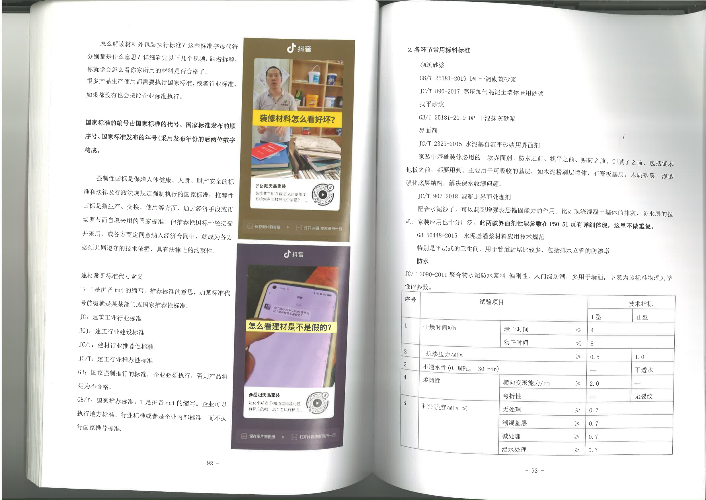

### OCR 文字

怎么解读材料外包装执行标准？这些标准字母代符  
d抖音  
分别都是什么意思？详细看完以下几个视频，跟着拆解，  
你就学会怎么看你家所用的材料是否合格了。  
很多产品生产使用都需要执行国家标准，或者行业标准，  
如果都没有也会按照企业标准执行。  
装修材料怎么看好坏？  
国家标准的编号由国家标准的代号、国家标准发布的顺  
序号、国家标准发布的年号（采用发布年份的后两位数字  
构成。  
强制性国标是保障人体健康、人身、财产安全的标  
@岳阳天品家装  
准和法律及行政法规规定强制执行的国家标准：推荐性  
光修业主们必看 怎么辦别猴了  
方给你家削材科是香背话？—  
国标是指生产、交换、使用等方面，通过经济手段或市  
场调节而自愿采用的国家标准。但推荐性国标一经接受  
E 深存山片到糖無  
行时并料音推期两付一日  
并采用，或各方商定同意纳入经济合同中，就成为各方  
必须共同遵守的技术依据，具有法律上的约束性。  
小科音  
建材常见标准代号含义  
T:T是拼音tui 的缩写，推荐标准的意思，加某标准代  
号前缀就是某某部门或国家推荐性标准。  
JG：建筑工业行业标准  
怎么看建材是不是假的？  
JGJ：建工行业建设标准  
JC/T：建材行业推荐性标准  
JG/T：建工行业推荐性标准  
GB：国家强制推行的标准，企业必须执行，否则产品将  
是为不合格。  
@岳阳天品家装  
GB/T：国家推荐标准，T是拼音tui 的缩写。企业可以  
建材小如识；你烟道装你雞村还  
有标准的吗，怎么看团行标沮  
执行地方标准、行业标准或者是企业内部标准，而不执  
行国家推荐标准.  
图 保存图片卦相橱*合 打环料童地参商扫一月  
\- 92 -  
2\. 各环节常用标料标准  
砌筑砂浆  
GB/T 25181-2019 DM 干混砌筑砂浆  
JC/T 890-2017蒸压加气混泥土墙体专用砂浆  
找平砂浆  
GB/T 25181-2019 DP 干混抹灰砂浆  
界面剂  
JC/T 2329-2015 水泥基自流平砂浆用界面剂  
家装中基础装修必用的一款界面剂。防水之前、找平之前、贴砖之前、刮腻子之前、包括铺木  
地板之前，都要用到。主要用于可吸收的基层，如水泥粉刷层墙体，石膏板基层，木质基层。渗透  
强化底层结构，解决保水收缩问题。  
JC/T 907-2018 混凝士界面处理剂  
配合水泥沙子，可以起到增强表层锚固能力的作用。比如现浇混凝土墙体的抹灰，防水层的拉  
毛。家装应用也十分广泛。此两款界面剂性能参数在P50-51页有详细体现，这里不做重复。  
GB 50448-2015 水泥基灌浆材料应用技术规范  
特别是平层式的卫生间，用于管道封堵比较多，包括排水立管的防滲墩  
防水  
JC/T 2090-2011 聚合物水泥防水浆料 偏刚性，入门级防潮，多用于墙面，下表为该标准物理力学  
性能参数。  
序号  
试验项目  
技术指标  
1型  
II型  
干燥时间a/h  
表干时间  
爪  
4  
实干时间  
^  
抗渗压力/MPa  
≥  
0.5  
1.0  
不透水性 （0.3MPa, 30 min）  
不透水  
柔韧性  
横向变形能力/mm  
2.0  
弯折性  
无裂纹  
粘结强度/MPa≤  
无处理  
0.7  
潮湿基层  
≥  
0.7  
碱处理  
≥  
0.7  
浸水处理  
0.7  
\- 93-  

---

## 扫描页 52

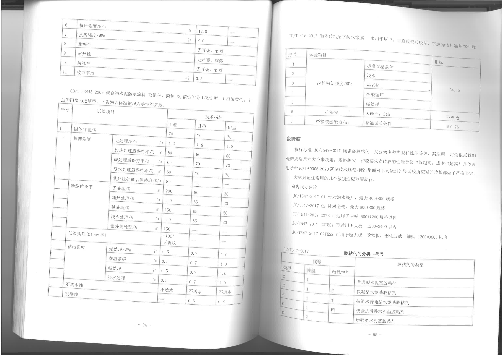

### OCR 文字

抗压强度/MPa  
≥  
12.0  
抗折强度/MPa  
≥  
4.0  
耐碱性  
无开裂、剥落  
耐热性  
10  
抗冻性  
无开裂、剥落  
11  
收缩率/%  
无开裂、剥落  
^  
0.3  
GB/T 23445-2009 聚合物水泥防水涂料 双组份，简称JS，按性能分 1/2/3型，1型偏柔性，11  
型和豆型为通用型。下表为该标准物理力学性能参数。  
序号  
试验项目  
技术指标  
1型  
II型  
固体含量/%  
II型  
70  
70  
拉伸强度  
70  
无处理/MPa  
≥  
1.2  
1.8  
1.8  
加热处理后保持率/% ≥  
80  
80  
80  
碱处理后保持率/%  
≥  
60  
70  
70  
浸水处理后保持率/%≥  
60  
70  
70  
紫外线处理后保持率/%≥  
80  
断裂伸长率  
无处理/%  
≥  
200  
80  
30  
加热处理/%  
≥  
150  
65  
20  
碱处理/%  
≥  
150  
65  
20  
浸水处理/%  
≥  
150  
65  
20  
紫外线处理/%  
≥  
150  
低温柔性（010mm棒）  
\-10C°  
无裂纹  
粘结强度  
无处理/MPa  
≥  
0.5  
0.7  
1.0  
潮湿基层  
≥  
0.5  
0.7  
1.0  
碱处理  
≥  
0.5  
0.7  
1.0  
浸水处理  
≥  
0.5  
0.7  
不透水性  
1.0  
不透水  
搞渗性  
不透水  
不透水  
0.6  
0.8  
\- 94 -  
JC/T2415-2017 陶瓷砖粘层下防水涂膜 多用于厨卫，可直接瓷砖胶贴，下表为该标准基本性能  
序号  
试验项目  
指标  
标准试验条件  
2  
浸水  
拉伸粘结强度/MPa  
热老化  
≥0.5  
冻融循环  
碱处理  
抗渗性  
0.6MPa, 24h  
不滲透  
桥接裂缝能力/mm  
标准试验条件  
≥0.75  
瓷砖胶  
执行标准 JC/T547-2017 陶瓷砖胶粘剂 又分为多种类型和性能等级，其逃用一定是根据我们  
瓷砖规格尺寸大小来决定，规格越大，相应要求瓷砖胶的性能等级也就越高，成本也越高！具体选  
用参考IC/T 60006-2020 薄贴技术规范，标准里面对不同级别的瓷砖胶所应对的边长都做了严格限定。  
大家只记住常用的几个级别适应范围就行。  
室内尺寸建议  
JC/1547-2017 C1 针对泡水瓷片，最大 400*800 规格  
JC/T547-2017 C2 针对全瓷，最大800*800规格  
JC/T547-2017 C2TE 可适用于中板 600*1200 规格以肉  
JC/T547-2017 C2TES1 可适用于大板 1200*2400以内  
JC/T547-2017 C2TES2 可用于超大板，欧松板，钢化玻璃上铺贴 1200*3600 以内  
JC/T547-2017  
胶粘剂的分类与代号  
代号  
胶粘剂的类型  
类型  
性能  
特殊性能  
C  
c  
普通型水泥基胶粘剂  
F  
快凝型水泥基胶粘剂  
T  
抗滑移普通型水泥基胶粘剂  
FT  
快凝抗滑移水泥基胶粘剂  
增强型水泥基胶粘剂  
\-95-  

---

## 扫描页 53

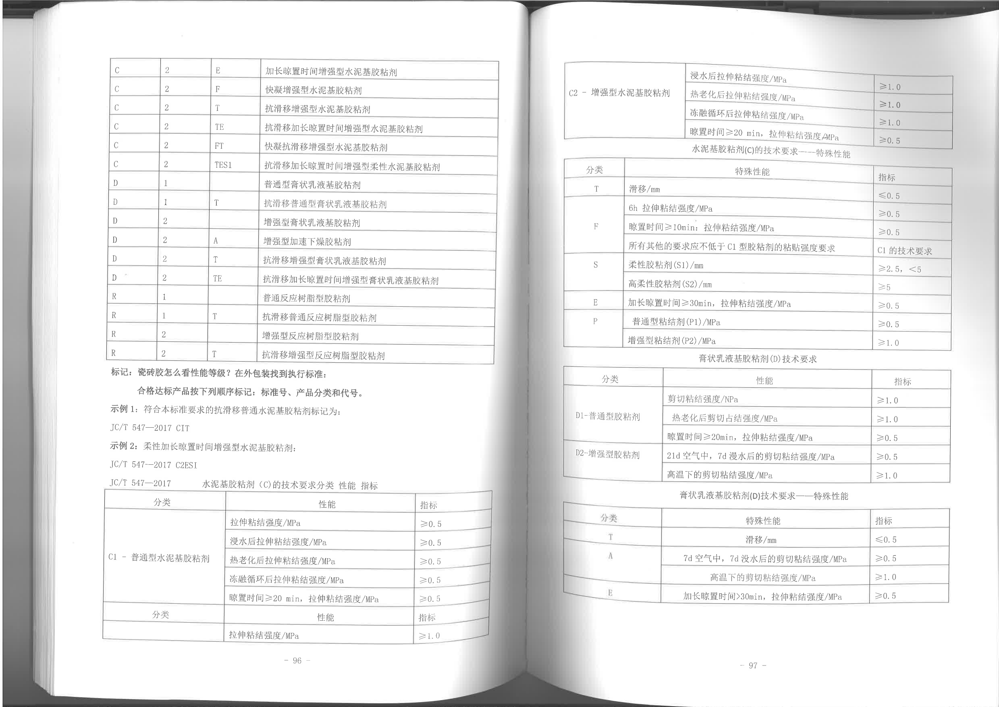

### OCR 文字

加长晾置时间增强型水泥基胶粘剂  
快凝增强型水泥基胶粘剂  
抗滑移增强型水泥基胶粘剂  
C  
TE  
抗滑移加长晾置时间增强型水泥基胶粘剂  
C  
FT  
快凝抗滑移增强型水泥基胶粘剂  
TES1  
抗滑移加长晾置时间增强型柔性水泥基胶粘剂  
普通型膏状乳液基胶粘剂  
抗滑移普通型膏状乳液基胶粘剂  
增强型膏状乳液基胶粘剂  
增强型加速下燥胶粘剂  
抗滑移增强型膏状乳液基胶粘剂  
TE  
抗滑移加长晾置时间增强型膏状乳液基胶粘剂  
普通反应树脂型胶粘剂  
R  
抗滑移普通反应树脂型胶粘剂  
增强型反应树脂型胶粘剂  
R  
T  
抗滑移增强型反应树脂型胶粘剂  
标记：瓷砖胶怎么看性能等级？在外包装找到执行标准：  
合格达标产品按下列顺序标记：标准号、产品分类和代号。  
示例1：符合本标准要求的抗滑移普通水泥基胶粘剂标记为：  
JC/T 547—2017 CIT  
示例 2：柔性加长晾置时间增强型水泥基胶粘剂：  
JC/T 547--2017 C2ESI  
JC/T 547—2017  
水泥基胶粘剂（C）的技术要求分类 性能 指标  
分类  
性能  
指标  
拉伸粘结强度/MPa  
≥0.5  
浸水后拉伸粘结强度/MPa  
≥0.5  
C1- 普通型水泥基胶粘剂  
热老化后拉伸粘结强度/MPa  
≥0.5  
冻融循环后拉伸粘结强度/MPa  
≥0.5  
晾置时间≥20 min，拉伸粘结强度/MPa  
≥0.5  
分类  
性能  
指标  
拉伸粘结强度/MPa  
≥1.0  
\- 96-  
浸水后拉伸粘结强度/MPa  
C2 - 增强型水泥基胶粘剂  
≥1.0  
热老化后拉伸粘结强度/MPa  
≥1.0  
冻融循环后拉伸粘结强度/MPa.  
≥1.0  
晾置时间≥20 min，拉伸粘结强度AMPa  
≥0.5  
水泥基胶粘剂（C）的技术要求——特殊性能  
分类  
特殊性能  
指标  
滑移/mm  
≤0.5  
6h 拉伸粘结强度/MPa  
≥0.5  
晾置时间≥10min： 拉伸粘结强度/MPa  
≥0.5  
所有其他的要求应不低于CI 型胶粘剂的粘贴强度要求  
C1 的技术要求  
柔性胶粘剂（S1）/mm  
≥2.5， ＜5  
高柔性胶粘剂（S2）/mm  
≥5  
加长晾置时间≥30min，拉伸粘结强度/MPa  
≥0.5  
P  
普通型粘结剂（P1）/MPa.  
≥0.5  
增强型粘结剂（P2）/MPa  
≥1.0  
膏状乳液基胶粘剂（D）技术要求  
分类  
性能  
指标  
剪切粘结强度/NPa  
≥1.0  
DI-普通型胶粘剂  
热老化后剪切占结强度/MPa  
≥1.0  
晾置时间≥20min，拉伸粘结强度/MPa  
≥0.5  
D2-增强型胶粘剂  
21d 空气中，7d漫水后的剪粘结强度/MPa  
≥0.5  
高温下的剪切粘结强度/MPa  
≥1.0  
膏状乳液基胶粘剂（D）技术要求——特殊性能  
分类  
特殊性能  
指标  
滑移/mm  
≤0.5  
A  
7d 空气中，7d没水后的剪切粘结强度/MPa  
≥0.5  
高温下的剪切粘结强度/MPa  
≥1.0  
加长晾置时间>30min，拉伸粘结强度/MPa  
≥0.5  
\- 97-  

---

## 扫描页 54

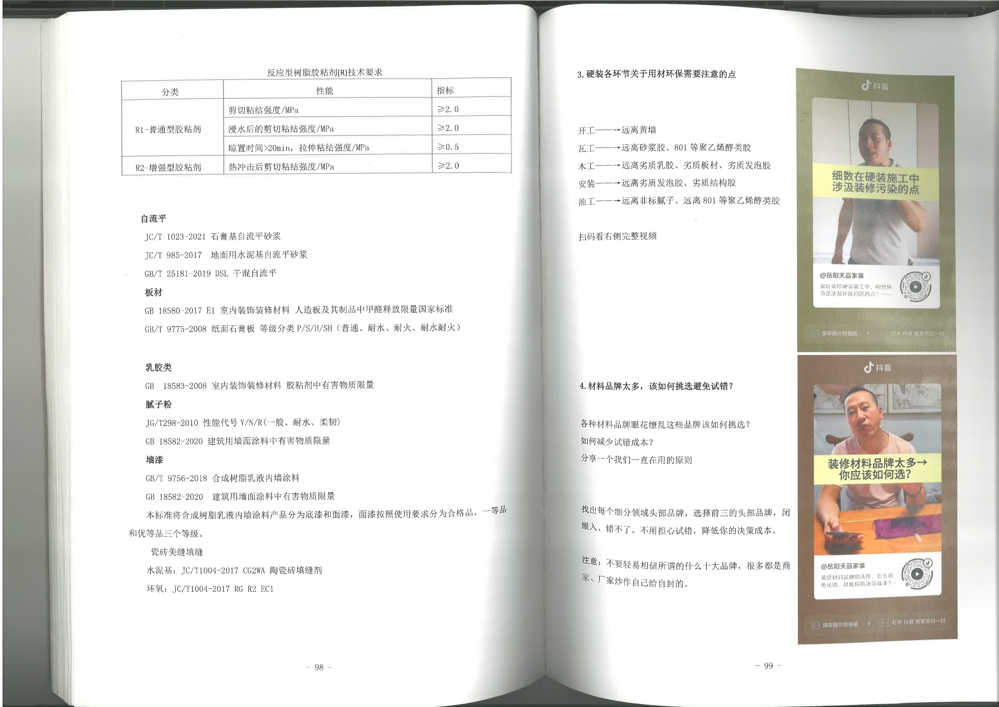

### OCR 文字

反应型树脂胶粘剂（R）技术要求  
分类  
性能  
指标  
剪切粘结强度/MPa  
≥2.0  
R1-普通型胶粘剂  
浸水后的剪切粘结强度/MPa  
≥2.0  
晾置时间>20min，拉伸粘结强度/MPa  
≥0.5  
R2-增强型胶粘剂  
热冲击后剪切粘结强度/MPa  
≥2.0  
自流平  
JC/T 1023-2021 石膏基自流平砂浆  
JC/T 985-2017 地面用水泥基自流平砂浆  
GB/T 25181-2019 DSL 干混白流平  
板材  
GB 18580-2017 E1 室内装饰装修材料 人造板及其制品中甲醛释放限量国家标准  
GB/T 9775-2008 纸面石膏板 等级分类P/S/H/SH（普通、耐水、耐火、耐水耐火）  
乳胶类  
GB 18583-2008 室内装饰装修材料 胶粘剂中有害物质限量  
腻子粉  
JG/T298-2010 性能代号 Y/N/R（一般、耐水、柔韧）  
GB 18582-2020 建筑用墙面涂料中有害物质限量  
墻漆  
GB/T 9756-2018 合成树脂乳液内墙涂料  
GB 18582-2020 建筑用墙面涂料中有害物质限量  
本标准将合成树脂乳液内墙涂料产品分为底漆和面漆，面漆按照使用要求分为合格品，一等品  
和优等品三个等级。  
瓷砖美缝填缝  
水泥基：JC/T1004-2017 CG2WA 陶瓷砖填缝剂  
坏氧：JC/T1004-2017 RG R2 EC1  
\-98-  
3.硬装各环节关于用材环保需要注意的点  
o拼音  
开工——一远离黄墻  
瓦工一—一远离砂浆胶、801 等聚乙烯醇类胶  
木工——一远离劣质乳胶、劣质板材、劣质发泡胶  
细数在硬装施工中  
安装——-远离劣质发泡胶、劣质结构胶  
涉汲装修污染的点  
油工一— 远离非标腻子、远离801 等聚乙烯醇类胶  
扫码看右侧完整视频  
@岳阳天品家装  
或原装修侧老舰工中，關照环  
节兒涉及环依问题的点？--！  
心抖音  
4.材料品牌太多，该如何挑选避免试错？  
各种材料品牌眼花综乱这些品牌该如何挑选？  
如何减少试错成本？  
分享一个我们一直在用的原则  
装修材料品牌太多一  
你应该如何选？  
找出每个细分领域头部品牌，选择前三的头部品牌，闭  
眼入、错不了。不用担心试错，降低你的决策成本。  
注意：不要轻易相信所谓的什么十大品牌，很多都是商  
@岳阳天品家装  
象、厂家炒作自己给自封的。  
装修材料品愕的选拼，怎么避  
免试借、降低你的决维成本？  
\- 99-  

---

## 扫描页 55

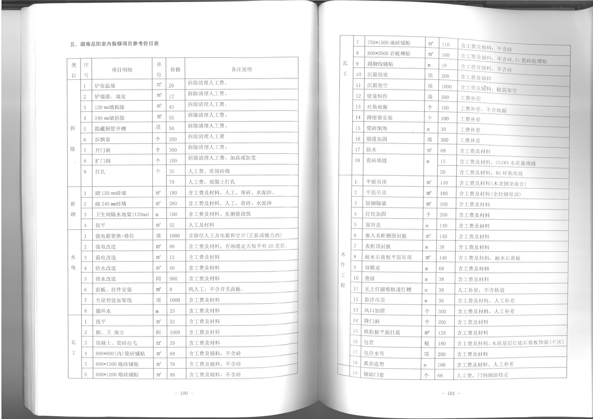

### OCR 文字

五，湖南岳阳室内装修项目参考价目表  
类  
序  
单  
项目明细  
价格  
备注说明  
目  
号  
位  
铲保温墻  
m？  
20  
拆除清理人工费。  
铲墻漆、墙皮  
m？  
拆除清理人工费。  
12  
3  
120 mm墙拆除  
m？  
45  
拆除清理人工费。  
240 mm墻拆除  
m？  
55  
拆除清理人工费。  
拆  
隐藏铜管开槽  
项  
50  
拆除清理人工费。  
拆飘窗  
个  
200  
拆除清埋人工费  
除  
7  
开门洞  
个  
300  
拆除清理人工费。  
8  
扩门洞  
个  
拆除清理人工费。加高或加宽  
100  
9  
打孔  
个  
35  
人工费。常规砖墻  
70  
人工费，混凝土打孔  
砌120m砖墙  
m？  
180  
含工费及材料。人工、青砖、水泥沙。  
新  
2  
砌240mm砖墻  
m'  
280  
含工费及材料。人工、青砖、水泥沙  
砌  
卫生间隔水地梁（120mm）  
100  
含工费及材料。扎钢筋浇筑  
找平  
m2  
52  
人工及材料  
强电箱更换+移位  
项  
1000  
含移位人工及电箱和空开（正泰或德力西）  
2  
强电改造  
m'  
80  
含工费及材料，有地暖走天每平补20差价，  
水  
3  
弱电改造  
m"  
12  
含工费及材料  
电  
给水改造  
m？  
50  
含工费及材料  
排水改造  
间  
980  
含工费及材料  
面板、挂件安装  
m  
8  
纯人工，不含开关面板。  
全屋智能加零线  
项  
1000  
含工费及材料  
循环水  
m  
25  
含工费及材料  
1  
找平  
m？  
52  
含工费及材料  
2  
橱、卫规方  
间  
1000  
含工费及材料  
瓦  
33  
混凝土、瓷砖拉毛  
m2  
20  
含工费及材料  
工  
4  
800*800（内）瓷砖铺贴  
m？  
68  
含工费及辅料，不含砖  
5  
600*1200 地砖铺贴  
m’  
78  
含工费及辅料，不含砖  
600*1200 墙砖铺贴  
m'  
88  
含工费及辅料，不含砖  
\- 100 -  
750*1500 地砖铺贴  
m2  
110  
含工费及辅料，不含砖  
800*2600岩板傅贴  
m  
160  
含工费及辅料，不含枝，S1 瓷破胶薄贴  
瓦  
踢脚线铺贴  
18  
含工费及辅料，不含砖  
工  
10  
沉箱找坡  
项  
200  
含工费及辅料  
11  
沉箱架空  
项  
1000  
含工贵及输料，植筋架空  
12  
壁龛制作  
项  
500  
T费补茏  
13  
对角地漏  
个  
100  
工费补差，不含地漏  
14 蹲便器安装  
个  
100  
工费补差  
15 瓷砖倒角  
30  
工费补差  
16 烟道加固  
项  
300  
工费补差  
17 防水  
m2  
68  
含工费及材料  
18 瓷砖填缝  
15  
含工费及材料，CG2WA水泥基填缝  
20  
含工贵及材料，RG环氧填缝  
平面吊顶  
m？  
140  
含工费及材料（木龙钢龙混合）  
2  
平面帛顶  
m  
180  
含工费及材料（全轻钢吊顶）  
3  
轻钢隔墙  
m”  
160  
含工费及材料  
灯位加固  
个  
200  
含工费及材料  
窗帘盒  
140  
含工费及材料.  
嵌入衣柜侧面封板  
m2  
140  
含工费及材料  
衣柜顶封板  
38  
含工费及材料  
耐水石膏板平面吊顶  
148  
含工费及材料，耐水石膏板  
68  
水作工程  
双眼皮  
68  
含工费及材料  
10  
叠级  
38  
含工费及材料  
11  
无主灯磁吸轨道灯槽  
38  
人工补差，不含轨道  
12  
悬浮吊顶  
38  
含工费及材料，人工补差  
13  
风口加固  
个  
300  
含工费及材料，人工补差  
14  
降门洞  
个  
200  
含工费及材料  
15  
欧松板平面打底  
m  
128  
含工费及材料，  
16  
包管  
根  
180  
含工费及材料，木质基层打底石膏板饰面（干区）  
17  
包存水弯  
项  
200  
含工费及材料  
18  
狐形造型  
100  
含工费及材料，人工补差  
19  
辅助门套  
个  
68  
人工费，门洞辅助校正  
\- 101-  

---

## 扫描页 56

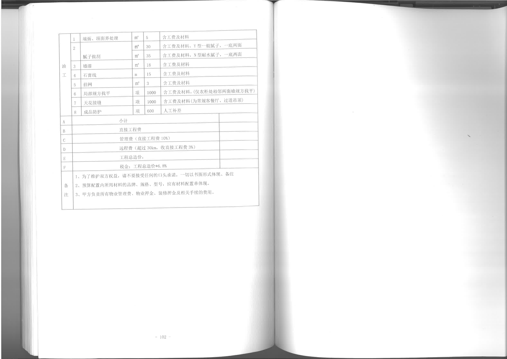

### OCR 文字

墻面、顶面界处理  
m"  
含工费及材料  
m  
30  
含工费及材料，Y型一般腻子，一底两面  
腻子批刮  
m  
35  
含工费及材料，N型耐水腻子，一底两面  
油  
墻漆  
m"  
18  
含工费及材料  
石膏线  
15  
含工费及材料  
挂网  
m？  
含工费及材料  
局部规方找平  
项  
1000  
含工费及材料，（仅衣柜处相邻两面墻规方找平）  
天花按缝  
项  
1000  
含工费及材料（为常规客餐厅、过道吊顶）  
成品防护  
项  
600  
人工补差  
小计  
直接工程费  
管理费（直接工程费 10%）  
远程费（超过30km，收直接工程费 3%）  
E  
工程总造价：  
F  
税金：工程总造价*6.8%  
1、为了维护双方权益，请不要接受任何的口头承诺，一切以书面形式体现、备注  
备  
2、预算配置内所用材料的品牌、规格、型号，应有材料配置单体现。  
注  
3、甲方负责所有物业管理费、物业押金、装修押金及相关手续的费用。  
\- 102-  

---
