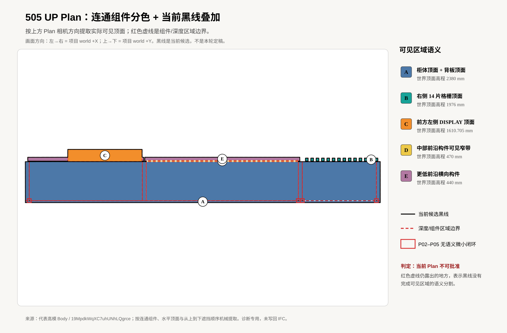
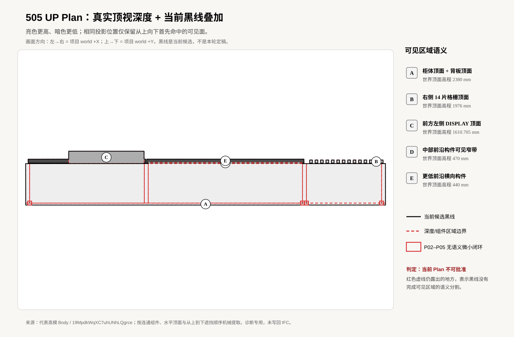
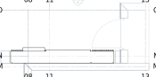
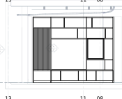
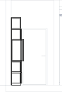

# 505 UP 场景 SVG

Front 已单独通过并冻结；Side 字节未改变。当前 Plan 再次不通过，因此下方 Plan 只保留为被拒绝的历史候选，没有写入本轮诊断结果，也没有刷新派生 IFC 或 Bonsai Drawing。新的诊断按真实 Plan 相机从上到下提取深度可见面：世界高程 2380 mm 柜体顶面、1976 mm 右侧 14 片格栅、1610.705 mm 前方左侧 DISPLAY，以及 470/440 mm 的更低前沿构件。当前黑线未完整分割这些区域，并含 4 个无产品语义的微小闭环。

## Plan 深度/组件诊断（非定稿）

## Plan

## Front

## Side

