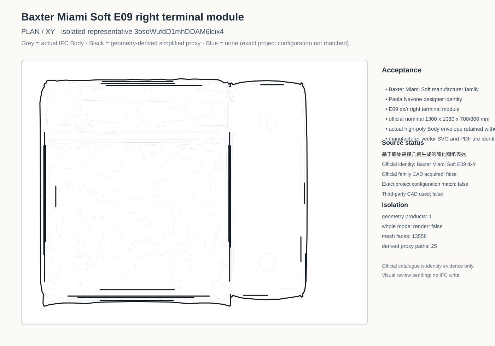
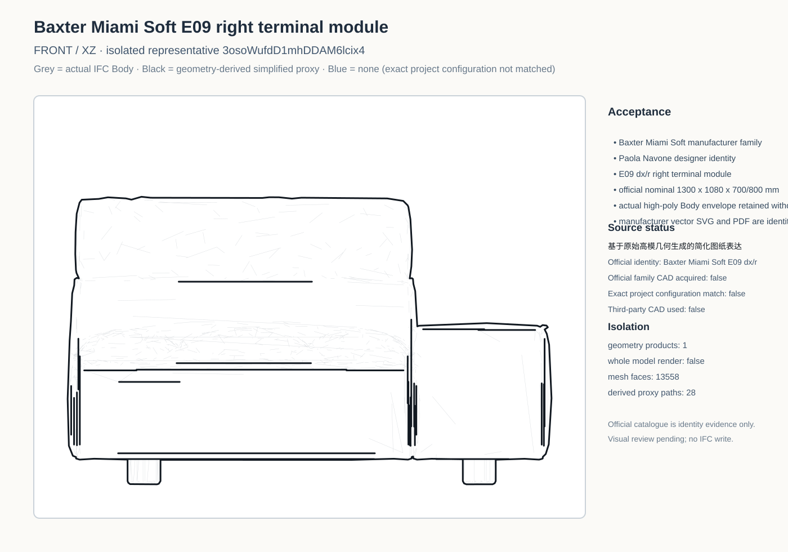
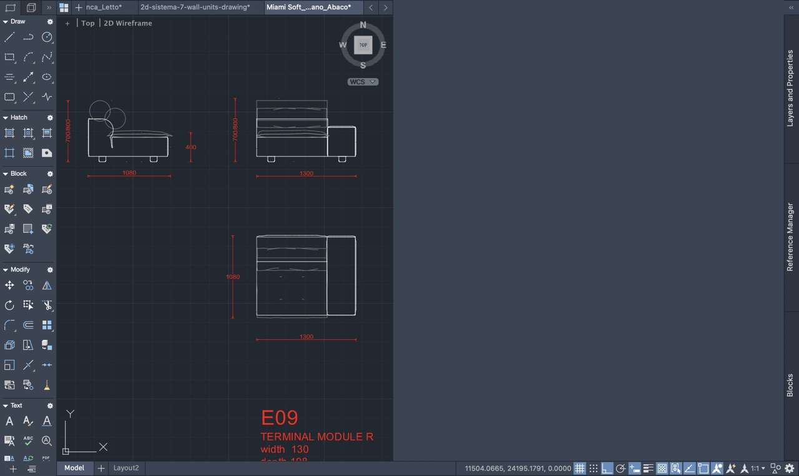
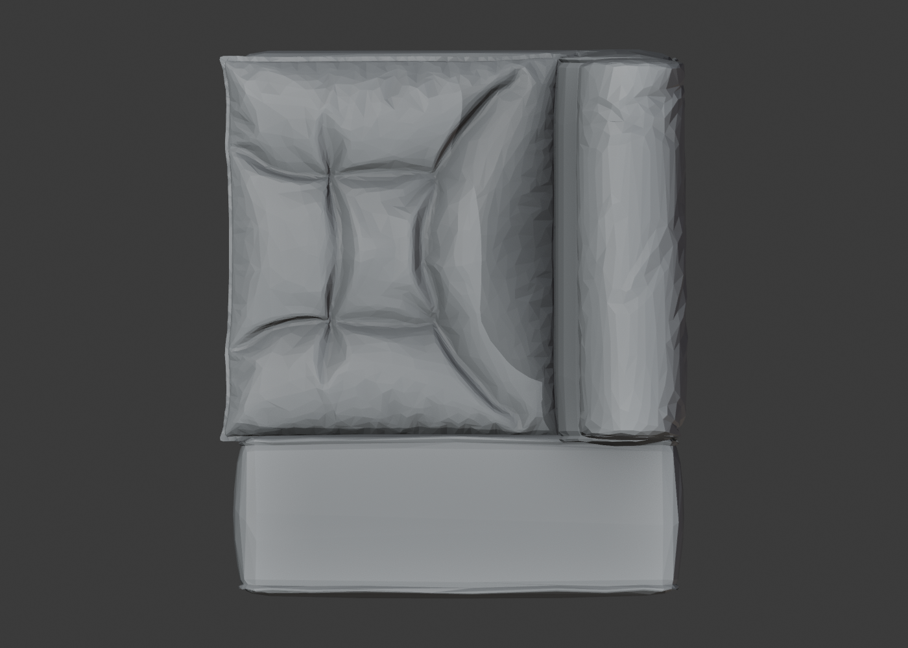
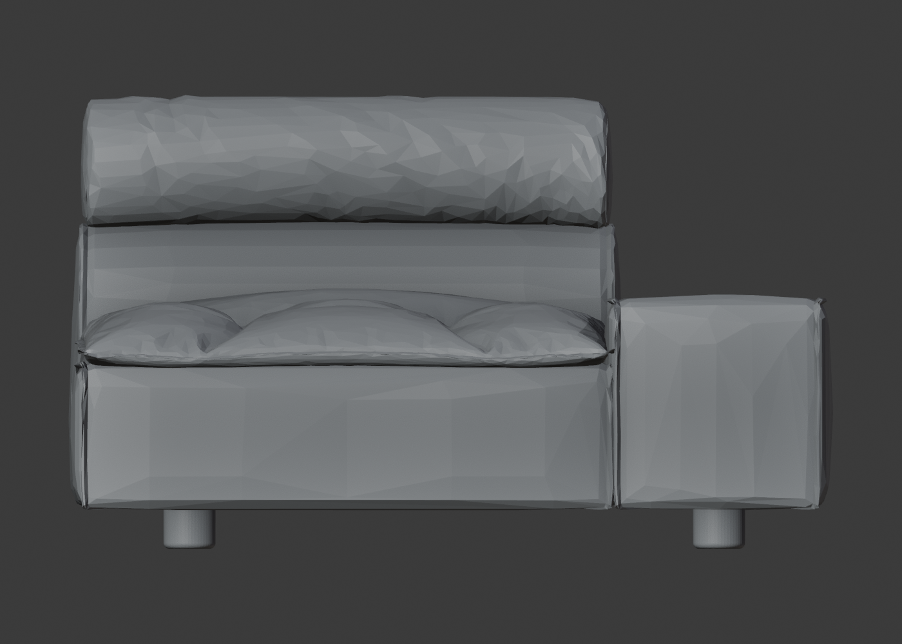
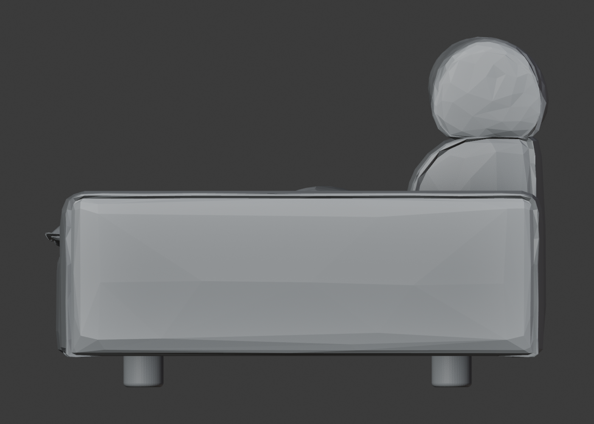
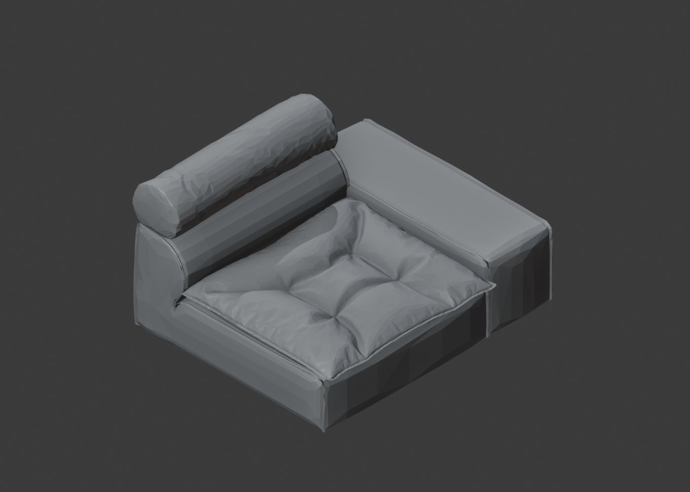

# Baxter Miami Soft E09 — 官方蓝线单品 SVG 审核

- 型号：E09 dx/r 右端模块
- 官方规格：130 × 108 cm，h70/80 cm
- 蓝线：官方原生 DWG 2D
- 对齐：Plan / Front 仅平移；Side 仅视向镜像后平移；比例 1:1
- 状态：待审核，尚未写入派生 IFC

## Plan 单品 SVG

## Front 单品 SVG

## Side 单品 SVG

## 官方 DWG 中的 E09 三视图

## Bonsai 保存相机 — Plan

## Bonsai 保存相机 — Front

## Bonsai 保存相机 — Side

## Bonsai 保存相机 — Iso

## 项目家具平面上下文

## 项目 R20 侧立面上下文

